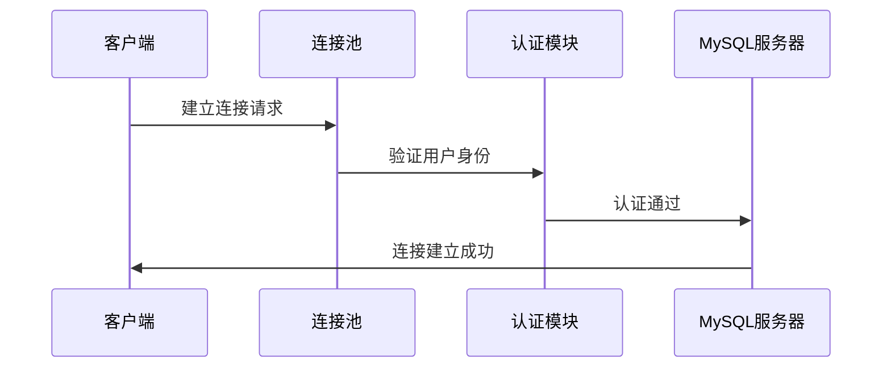
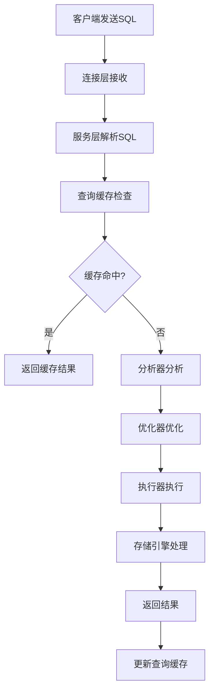

# MySQL 整体架构详解

## 概述

MySQL的整体架构采用分层设计，从上到下分为四层：**连接层**、**服务层**、**引擎层**和**存储层**。这种分层架构使得MySQL具有良好的可扩展性和可维护性。

## 架构图

```
┌─────────────────────────────────────────────────────────────┐
│                    客户端应用程序                            │
└─────────────────────┬───────────────────────────────────────┘
                      │
┌─────────────────────▼───────────────────────────────────────┐
│                        连接层                               │
│  ┌─────────────┐ ┌─────────────┐ ┌─────────────┐          │
│  │   连接池    │ │   认证授权   │ │   安全连接   │          │
│  └─────────────┘ └─────────────┘ └─────────────┘          │
└─────────────────────┬───────────────────────────────────────┘
                      │
┌─────────────────────▼───────────────────────────────────────┐
│                        服务层                               │
│  ┌─────────────┐ ┌─────────────┐ ┌─────────────┐          │
│  │   查询缓存   │ │   分析器     │ │   优化器     │          │
│  └─────────────┘ └─────────────┘ └─────────────┘          │
│  ┌─────────────┐ ┌─────────────┐ ┌─────────────┐          │
│  │   执行器     │ │   存储过程   │ │   触发器     │          │
│  └─────────────┘ └─────────────┘ └─────────────┘          │
└─────────────────────┬───────────────────────────────────────┘
                      │
┌─────────────────────▼───────────────────────────────────────┐
│                        引擎层                               │
│  ┌─────────────┐ ┌─────────────┐ ┌─────────────┐          │
│  │   InnoDB    │ │   MyISAM    │ │   Memory    │          │
│  └─────────────┘ └─────────────┘ └─────────────┘          │
│  ┌─────────────┐ ┌─────────────┐ ┌─────────────┐          │
│  │   Archive   │ │     CSV     │ │   其他引擎   │          │
│  └─────────────┘ └─────────────┘ └─────────────┘          │
└─────────────────────┬───────────────────────────────────────┘
                      │
┌─────────────────────▼───────────────────────────────────────┐
│                        存储层                               │
│  ┌─────────────┐ ┌─────────────┐ ┌─────────────┐          │
│  │   数据文件   │ │   日志文件   │ │   索引文件   │          │
│  └─────────────┘ └─────────────┘ └─────────────┘          │
└─────────────────────────────────────────────────────────────┘
```

## 各层详细说明

### 1. 连接层（Connection Layer）

连接层负责处理客户端与MySQL服务器之间的连接和通信。

#### 主要功能：

- **连接管理**：维护客户端与服务器的连接
- **身份认证**：验证用户身份和权限
- **安全连接**：支持SSL/TLS加密连接
- **连接池**：复用连接，提高性能

#### 连接过程：



#### 配置参数：

```sql
-- 查看连接相关配置
SHOW VARIABLES LIKE 'max_connections';
SHOW VARIABLES LIKE 'thread_cache_size';
SHOW VARIABLES LIKE 'wait_timeout';
```

### 2. 服务层（Service Layer）

服务层是MySQL的核心层，负责SQL语句的解析、优化和执行。

#### 核心组件：

##### 2.1 查询缓存（Query Cache）

- **作用**：缓存SELECT查询的结果
- **特点**：基于SQL语句的哈希值进行缓存
- **限制**：MySQL 8.0已移除查询缓存

```sql
-- 查看查询缓存状态（MySQL 5.7及以下版本）
SHOW VARIABLES LIKE 'query_cache%';
```

##### 2.2 分析器（Parser）

- **词法分析**：将SQL语句分解为词法单元
- **语法分析**：检查SQL语句的语法正确性
- **语义分析**：检查表、字段是否存在

**示例**：
```sql
-- 词法分析示例
SELECT id, name FROM users WHERE age > 18;
-- 分解为：SELECT, id, ,, name, FROM, users, WHERE, age, >, 18
```

##### 2.3 优化器（Optimizer）

- **执行计划生成**：选择最优的执行路径
- **索引选择**：选择合适的索引
- **连接优化**：优化多表连接顺序

```sql
-- 查看执行计划
EXPLAIN SELECT * FROM users WHERE age > 18;
```

##### 2.4 执行器（Executor）

- **调用存储引擎**：通过存储引擎接口执行操作
- **结果返回**：将执行结果返回给客户端

### 3. 引擎层（Engine Layer）

引擎层是可插拔的存储引擎层，不同的存储引擎有不同的特点和适用场景。

#### 主要存储引擎对比：

| 特性 | InnoDB | MyISAM | Memory | Archive |
|------|--------|--------|--------|---------|
| 事务支持 | ✅ | ❌ | ❌ | ❌ |
| 外键支持 | ✅ | ❌ | ❌ | ❌ |
| 行级锁 | ✅ | ❌ | ❌ | ❌ |
| 崩溃恢复 | ✅ | ❌ | ❌ | ❌ |
| 全文索引 | ✅ | ✅ | ❌ | ❌ |
| 压缩 | ✅ | ✅ | ❌ | ✅ |

#### 3.1 InnoDB引擎

**特点**：
- 支持ACID事务
- 支持行级锁
- 支持外键约束
- 支持崩溃恢复

**适用场景**：
- 需要事务支持的应用
- 高并发读写场景
- 需要数据一致性的场景

```sql
-- 创建InnoDB表
CREATE TABLE users (
    id INT PRIMARY KEY,
    name VARCHAR(50)
) ENGINE=InnoDB;
```

#### 3.2 MyISAM引擎

**特点**：
- 表级锁
- 不支持事务
- 支持全文索引
- 查询性能较好

**适用场景**：
- 只读或读多写少的场景
- 需要全文索引的场景
- 数据仓库

```sql
-- 创建MyISAM表
CREATE TABLE logs (
    id INT PRIMARY KEY,
    message TEXT,
    FULLTEXT(message)
) ENGINE=MyISAM;
```

### 4. 存储层（Storage Layer）

存储层负责数据的物理存储，包括数据文件、日志文件等。

#### 文件类型：

##### 4.1 数据文件

- **.frm文件**：表结构定义文件
- **.ibd文件**：InnoDB数据文件
- **.myd文件**：MyISAM数据文件
- **.myi文件**：MyISAM索引文件

##### 4.2 日志文件

- **错误日志**：记录MySQL运行错误
- **二进制日志**：记录数据变更
- **重做日志**：InnoDB事务日志
- **撤销日志**：事务回滚日志

#### 文件结构示例：

```
mysql_data/
├── ibdata1          # InnoDB系统表空间
├── ib_logfile0      # InnoDB重做日志
├── ib_logfile1      # InnoDB重做日志
├── mysql-bin.000001 # 二进制日志
├── mysql-bin.index  # 二进制日志索引
├── error.log        # 错误日志
└── database_name/
    ├── table1.frm   # 表结构
    ├── table1.ibd   # InnoDB数据
    └── table2.myd   # MyISAM数据
```

## 查询执行流程



## 性能优化建议

### 1. 连接层优化

```sql
-- 调整连接池大小
SET GLOBAL max_connections = 200;
SET GLOBAL thread_cache_size = 10;
```

### 2. 服务层优化

```sql
-- 启用查询缓存（MySQL 5.7及以下）
SET GLOBAL query_cache_type = 1;
SET GLOBAL query_cache_size = 67108864; -- 64MB
```

### 3. 引擎层优化

```sql
-- InnoDB缓冲池配置
SET GLOBAL innodb_buffer_pool_size = 1073741824; -- 1GB
```

## 监控和诊断

### 查看系统状态

```sql
-- 查看连接数
SHOW STATUS LIKE 'Threads_connected';

-- 查看查询缓存命中率
SHOW STATUS LIKE 'Qcache_hits';
SHOW STATUS LIKE 'Qcache_inserts';

-- 查看InnoDB状态
SHOW ENGINE INNODB STATUS;
```

### 性能监控

```sql
-- 查看慢查询
SHOW VARIABLES LIKE 'slow_query_log';
SHOW VARIABLES LIKE 'long_query_time';

-- 查看当前连接
SHOW PROCESSLIST;
```

## 总结

MySQL的整体架构设计体现了以下几个重要特点：

1. **分层设计**：各层职责明确，便于维护和扩展
2. **可插拔引擎**：支持多种存储引擎，适应不同场景
3. **缓存机制**：多级缓存提高查询性能
4. **优化器**：智能选择最优执行计划
5. **事务支持**：保证数据一致性和完整性

理解MySQL的整体架构对于性能优化、问题诊断和系统设计都具有重要意义。 

**[返回目录 README.md](./README.md)** 