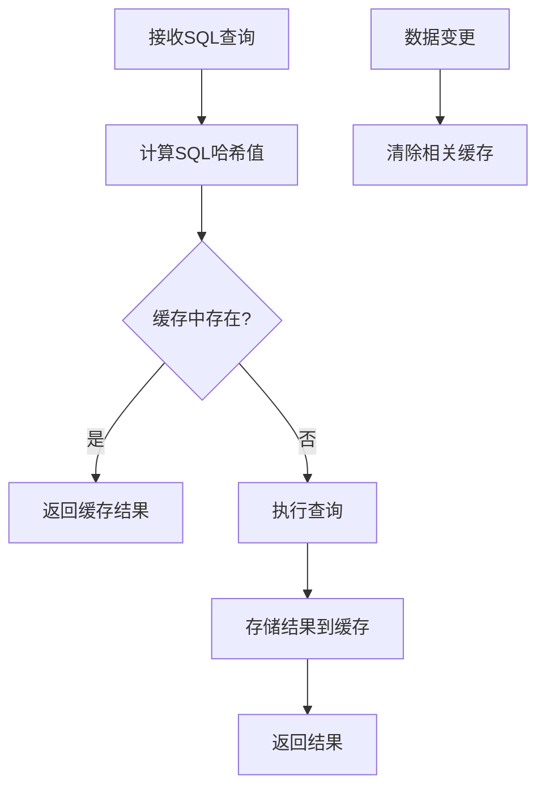
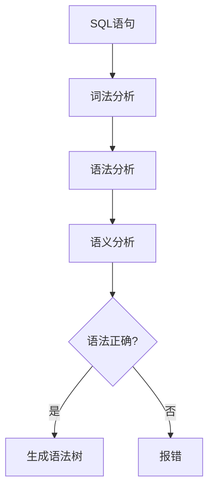
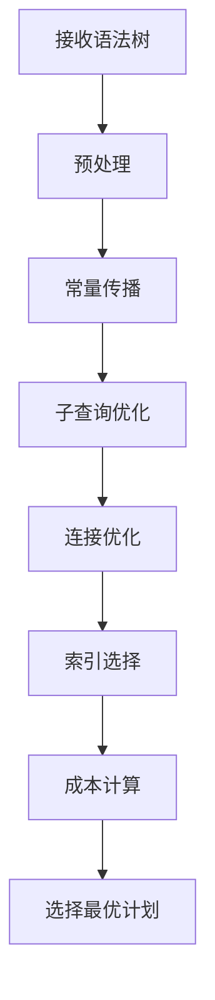
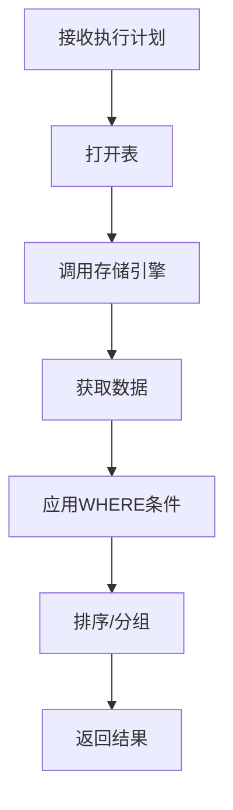

# MySQL 核心组件详解

## 概述

MySQL的核心组件是服务层的重要组成部分，包括查询缓存、分析器、优化器和执行器。这些组件协同工作，确保SQL查询的高效执行。

## 核心组件架构图

```
┌─────────────────────────────────────────────────────────────┐
│                        服务层                               │
├─────────────────────────────────────────────────────────────┤
│  ┌─────────────┐ ┌─────────────┐ ┌─────────────┐          │
│  │   查询缓存   │ │   分析器     │ │   优化器     │          │
│  │ Query Cache │ │   Parser    │ │ Optimizer   │          │
│  └─────────────┘ └─────────────┘ └─────────────┘          │
│  ┌─────────────┐ ┌─────────────┐ ┌─────────────┐          │
│  │   执行器     │ │   存储过程   │ │   触发器     │          │
│  │ Executor    │ │  Procedure  │ │  Trigger    │          │
│  └─────────────┘ └─────────────┘ └─────────────┘          │
└─────────────────────────────────────────────────────────────┘
```

## 1. 查询缓存（Query Cache）

### 概述

查询缓存是MySQL的一个重要性能优化组件，它缓存SELECT查询的结果，避免重复执行相同的查询。

### 工作原理



### 缓存结构

```
查询缓存内存结构：
┌─────────────────────────────────────────────────────────────┐
│                    查询缓存哈希表                           │
├─────────────────────────────────────────────────────────────┤
│ SQL哈希值 │ 查询结果 │ 表列表 │ 创建时间 │ 访问次数 │ 大小  │
├─────────────────────────────────────────────────────────────┤
│ 0x123456 │ [结果集] │ [表1,表2] │ 2024-01-01 │ 100 │ 1KB │
│ 0x789abc │ [结果集] │ [表3] │ 2024-01-02 │ 50  │ 2KB │
└─────────────────────────────────────────────────────────────┘
```

### 配置参数

```sql
-- 查看查询缓存配置
SHOW VARIABLES LIKE 'query_cache%';

-- 查询缓存相关参数
query_cache_type = 1        -- 0=OFF, 1=ON, 2=DEMAND
query_cache_size = 67108864 -- 缓存大小（字节）
query_cache_limit = 1048576 -- 单个查询结果最大大小
```

### 使用示例

```sql
-- 启用查询缓存
SET GLOBAL query_cache_type = 1;
SET GLOBAL query_cache_size = 67108864; -- 64MB

-- 查看缓存状态
SHOW STATUS LIKE 'Qcache%';

-- 清除查询缓存
RESET QUERY CACHE;
```

### 注意事项

- **MySQL 8.0已移除**：查询缓存在MySQL 8.0中被完全移除
- **内存开销**：缓存会占用大量内存
- **缓存失效**：任何相关表的修改都会导致缓存失效
- **适用场景**：读多写少的应用场景

## 2. 分析器（Parser）

### 概述

分析器负责对SQL语句进行词法分析和语法分析，确保SQL语句的正确性。

### 分析过程



### 词法分析示例

```sql
-- 原始SQL
SELECT id, name FROM users WHERE age > 18;

-- 词法分析结果
SELECT -> 关键字
id -> 标识符
, -> 分隔符
name -> 标识符
FROM -> 关键字
users -> 标识符
WHERE -> 关键字
age -> 标识符
> -> 操作符
18 -> 数字
; -> 结束符
```

### 语法分析

分析器会检查SQL语句的语法结构，确保符合SQL语法规范。

```sql
-- 正确的语法
SELECT column1, column2 FROM table_name WHERE condition;

-- 错误的语法（会报错）
SELECT column1, column2 FROM table_name WHERE; -- 缺少条件
```

### 语义分析

检查表名、字段名是否存在，以及权限是否正确。

```sql
-- 检查表是否存在
SELECT * FROM non_existent_table; -- 会报错：表不存在

-- 检查字段是否存在
SELECT non_existent_column FROM users; -- 会报错：字段不存在
```

## 3. 优化器（Optimizer）

### 概述

优化器是MySQL的核心组件之一，负责生成最优的执行计划。它会分析查询的各个可能执行路径，选择成本最低的执行方案。

### 优化过程



### 优化策略

#### 3.1 常量传播

```sql
-- 优化前
SELECT * FROM users WHERE id = 1 + 2;

-- 优化后
SELECT * FROM users WHERE id = 3;
```

#### 3.2 子查询优化

```sql
-- 优化前（相关子查询）
SELECT * FROM users u WHERE EXISTS (
    SELECT 1 FROM orders o WHERE o.user_id = u.id
);

-- 优化后（转换为JOIN）
SELECT DISTINCT u.* FROM users u 
INNER JOIN orders o ON o.user_id = u.id;
```

#### 3.3 连接优化

```sql
-- 多表连接优化
SELECT * FROM users u 
JOIN orders o ON u.id = o.user_id
JOIN products p ON o.product_id = p.id
WHERE u.status = 'active';

-- 优化器会选择最优的连接顺序
```

### 执行计划分析

```sql
-- 查看执行计划
EXPLAIN SELECT * FROM users WHERE age > 18;

-- 执行计划输出示例
+----+-------------+-------+------------+------+---------------+------+---------+------+------+----------+-------------+
| id | select_type | table | partitions | type | possible_keys | key  | key_len | ref  | rows | filtered | Extra       |
+----+-------------+-------+------------+------+---------------+------+---------+------+------+----------+-------------+
|  1 | SIMPLE      | users | NULL       | ALL  | NULL          | NULL | NULL    | NULL | 1000 |    33.33 | Using where |
+----+-------------+-------+------------+------+---------------+------+---------+------+------+----------+-------------+
```

### 优化器提示

```sql
-- 强制使用索引
SELECT * FROM users FORCE INDEX (idx_age) WHERE age > 18;

-- 忽略索引
SELECT * FROM users IGNORE INDEX (idx_age) WHERE age > 18;

-- 使用特定连接顺序
SELECT * FROM users u 
STRAIGHT_JOIN orders o ON u.id = o.user_id;
```

## 4. 执行器（Executor）

### 概述

执行器负责调用存储引擎接口，执行优化器生成的执行计划，并返回查询结果。

### 执行流程



### 执行器接口

```c
// 存储引擎接口示例
int ha_open(const char *name, int mode);
int ha_index_init(uint idx);
int ha_index_next(uchar *buf);
int ha_index_prev(uchar *buf);
int ha_rnd_next(uchar *buf);
int ha_rnd_pos(uchar *buf, uchar *pos);
```

### 执行模式

#### 4.1 全表扫描

```sql
-- 没有索引的查询
SELECT * FROM users WHERE name LIKE '%john%';
```

#### 4.2 索引扫描

```sql
-- 使用索引的查询
SELECT * FROM users WHERE id = 100;
```

#### 4.3 范围扫描

```sql
-- 范围查询
SELECT * FROM users WHERE age BETWEEN 18 AND 30;
```

### 结果处理

```sql
-- 排序
SELECT * FROM users ORDER BY age DESC;

-- 分组
SELECT age, COUNT(*) FROM users GROUP BY age;

-- 限制结果
SELECT * FROM users LIMIT 10 OFFSET 20;
```

## 性能监控

### 查看组件状态

```sql
-- 查看查询缓存状态
SHOW STATUS LIKE 'Qcache%';

-- 查看优化器状态
SHOW STATUS LIKE 'Select%';

-- 查看执行器状态
SHOW STATUS LIKE 'Handler%';
```

### 性能指标

```sql
-- 查询缓存命中率
SELECT 
    Qcache_hits / (Qcache_hits + Qcache_inserts) * 100 AS hit_ratio
FROM (
    SELECT 
        @@global.Qcache_hits AS Qcache_hits,
        @@global.Qcache_inserts AS Qcache_inserts
) AS cache_stats;

-- 慢查询统计
SHOW STATUS LIKE 'Slow_queries';
```

## 优化建议

### 1. 查询缓存优化

```sql
-- 合理设置缓存大小
SET GLOBAL query_cache_size = 134217728; -- 128MB

-- 监控缓存效率
SHOW STATUS LIKE 'Qcache_hits';
SHOW STATUS LIKE 'Qcache_inserts';
```

### 2. 优化器优化

```sql
-- 更新统计信息
ANALYZE TABLE users;

-- 优化器提示
SELECT /*+ INDEX(users idx_age) */ * FROM users WHERE age > 18;
```

### 3. 执行器优化

```sql
-- 使用合适的索引
CREATE INDEX idx_age ON users(age);

-- 避免全表扫描
SELECT * FROM users WHERE age > 18; -- 有索引
```

## 总结

MySQL的核心组件协同工作，确保查询的高效执行：

1. **查询缓存**：减少重复查询的执行
2. **分析器**：确保SQL语句的正确性
3. **优化器**：选择最优的执行计划
4. **执行器**：高效执行查询并返回结果

理解这些组件的工作原理对于MySQL性能优化和问题诊断至关重要。 