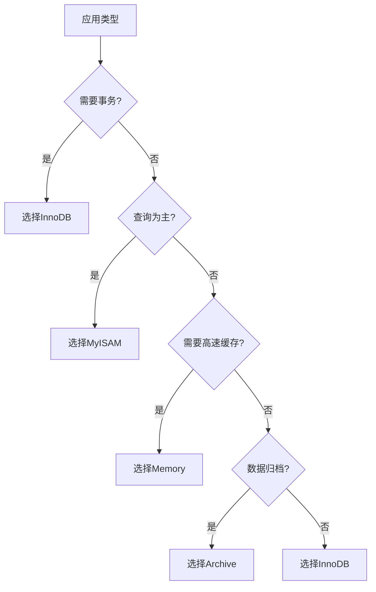

# MySQL 存储引擎详解

## 概述

MySQL的存储引擎是数据库的核心组件，负责数据的存储、检索和管理。MySQL采用插件式架构，支持多种存储引擎，每种引擎都有其特定的特点和适用场景。

## 存储引擎架构图

```
┌─────────────────────────────────────────────────────────────┐
│                        MySQL Server                        │
├─────────────────────────────────────────────────────────────┤
│                    存储引擎接口层                            │
├─────────────────────────────────────────────────────────────┤
│  ┌─────────────┐ ┌─────────────┐ ┌─────────────┐          │
│  │   InnoDB    │ │   MyISAM    │ │   Memory    │          │
│  │   Engine    │ │   Engine    │ │   Engine    │          │
│  └─────────────┘ └─────────────┘ └─────────────┘          │
│  ┌─────────────┐ ┌─────────────┐ ┌─────────────┐          │
│  │   Archive   │ │     CSV     │ │   其他引擎   │          │
│  │   Engine    │ │   Engine    │ │             │          │
│  └─────────────┘ └─────────────┘ └─────────────┘          │
└─────────────────────────────────────────────────────────────┘
```

## 存储引擎对比表

| 特性 | InnoDB | MyISAM | Memory | Archive | CSV |
|------|--------|--------|--------|---------|-----|
| **事务支持** | ✅ ACID | ❌ | ❌ | ❌ | ❌ |
| **外键支持** | ✅ | ❌ | ❌ | ❌ | ❌ |
| **锁机制** | 行级锁 | 表级锁 | 表级锁 | 行级锁 | 表级锁 |
| **崩溃恢复** | ✅ | ❌ | ❌ | ❌ | ❌ |
| **全文索引** | ✅ (5.6+) | ✅ | ❌ | ❌ | ❌ |
| **数据压缩** | ✅ | ✅ | ❌ | ✅ | ❌ |
| **存储限制** | 64TB | 256TB | 内存大小 | 无限制 | 无限制 |
| **适用场景** | OLTP | OLAP | 缓存 | 归档 | 数据交换 |

## 1. InnoDB 存储引擎

### 概述

InnoDB是MySQL的默认存储引擎，支持ACID事务、行级锁和外键约束，是OLTP（在线事务处理）应用的首选引擎。

### 核心特性

#### 1.1 ACID事务支持

```sql
-- 事务示例
START TRANSACTION;
INSERT INTO users (name, email) VALUES ('John', 'john@example.com');
UPDATE accounts SET balance = balance - 100 WHERE user_id = 1;
COMMIT;
```

#### 1.2 行级锁

```sql
-- 行级锁示例
-- 会话1
START TRANSACTION;
SELECT * FROM users WHERE id = 1 FOR UPDATE;
-- 锁定id=1的行

-- 会话2
START TRANSACTION;
SELECT * FROM users WHERE id = 2 FOR UPDATE;
-- 可以锁定id=2的行，不会阻塞
```

#### 1.3 外键约束

```sql
-- 创建带外键的表
CREATE TABLE orders (
    id INT PRIMARY KEY,
    user_id INT,
    amount DECIMAL(10,2),
    FOREIGN KEY (user_id) REFERENCES users(id)
) ENGINE=InnoDB;
```

### InnoDB架构

```
┌─────────────────────────────────────────────────────────────┐
│                        InnoDB                              │
├─────────────────────────────────────────────────────────────┤
│  ┌─────────────┐ ┌─────────────┐ ┌─────────────┐          │
│  │   缓冲池     │ │   重做日志   │ │   撤销日志   │          │
│  │ Buffer Pool │ │  Redo Log   │ │  Undo Log   │          │
│  └─────────────┘ └─────────────┘ └─────────────┘          │
│  ┌─────────────┐ ┌─────────────┐ ┌─────────────┐          │
│  │   插入缓冲   │ │   自适应哈希  │ │   锁管理器   │          │
│  │Insert Buffer│ │Adaptive Hash│ │Lock Manager │          │
│  └─────────────┘ └─────────────┘ └─────────────┘          │
└─────────────────────────────────────────────────────────────┘
```

### 配置参数

```sql
-- 查看InnoDB配置
SHOW VARIABLES LIKE 'innodb%';

-- 重要配置参数
innodb_buffer_pool_size = 1073741824    -- 缓冲池大小（1GB）
innodb_log_file_size = 268435456        -- 重做日志文件大小（256MB）
innodb_log_files_in_group = 2           -- 重做日志文件数量
innodb_flush_log_at_trx_commit = 1      -- 事务提交时刷新日志
innodb_file_per_table = 1               -- 每个表独立表空间
```

### 文件结构

```
mysql_data/
├── ibdata1              # 系统表空间
├── ib_logfile0          # 重做日志文件0
├── ib_logfile1          # 重做日志文件1
└── database_name/
    ├── table1.frm       # 表结构文件
    └── table1.ibd       # 独立表空间文件
```

## 2. MyISAM 存储引擎

### 概述

MyISAM是MySQL的经典存储引擎，不支持事务，但具有较高的查询性能，适用于读多写少的场景。

### 核心特性

#### 2.1 表级锁

```sql
-- MyISAM表级锁示例
-- 会话1
LOCK TABLES users WRITE;
INSERT INTO users (name) VALUES ('John');
UNLOCK TABLES;

-- 会话2（会被阻塞）
SELECT * FROM users; -- 等待会话1释放锁
```

#### 2.2 全文索引

```sql
-- 创建全文索引
CREATE TABLE articles (
    id INT PRIMARY KEY,
    title VARCHAR(200),
    content TEXT,
    FULLTEXT(title, content)
) ENGINE=MyISAM;

-- 全文搜索
SELECT * FROM articles 
WHERE MATCH(title, content) AGAINST('MySQL database');
```

### 文件结构

```
mysql_data/
└── database_name/
    ├── table1.frm       # 表结构文件
    ├── table1.MYD       # 数据文件
    └── table1.MYI       # 索引文件
```

### 配置参数

```sql
-- MyISAM相关配置
key_buffer_size = 134217728    -- 索引缓冲区大小（128MB）
myisam_sort_buffer_size = 8388608  -- 排序缓冲区大小
```

## 3. Memory 存储引擎

### 概述

Memory存储引擎将数据存储在内存中，提供最快的访问速度，但数据在服务器重启后会丢失。

### 核心特性

#### 3.1 内存存储

```sql
-- 创建内存表
CREATE TABLE cache_table (
    id INT PRIMARY KEY,
    data VARCHAR(100)
) ENGINE=MEMORY;

-- 插入数据
INSERT INTO cache_table VALUES (1, 'cached data');
```

#### 3.2 哈希索引

```sql
-- Memory引擎默认使用哈希索引
CREATE TABLE hash_table (
    id INT PRIMARY KEY,
    name VARCHAR(50)
) ENGINE=MEMORY;
```

### 适用场景

- 会话数据存储
- 临时数据缓存
- 高速查询缓存

## 4. Archive 存储引擎

### 概述

Archive存储引擎专为数据归档设计，具有高压缩比和插入性能，但不支持更新和删除操作。

### 核心特性

#### 4.1 高压缩比

```sql
-- 创建归档表
CREATE TABLE archive_logs (
    id INT AUTO_INCREMENT PRIMARY KEY,
    log_time DATETIME,
    message TEXT
) ENGINE=ARCHIVE;

-- 插入数据（自动压缩）
INSERT INTO archive_logs (log_time, message) 
VALUES (NOW(), 'System log message');
```

#### 4.2 只支持插入

```sql
-- 不支持UPDATE和DELETE
-- 以下操作会报错
UPDATE archive_logs SET message = 'new message' WHERE id = 1;
DELETE FROM archive_logs WHERE id = 1;
```

## 5. CSV 存储引擎

### 概述

CSV存储引擎将数据以CSV格式存储，便于数据导入导出和与其他系统集成。

### 核心特性

#### 5.1 CSV格式存储

```sql
-- 创建CSV表
CREATE TABLE csv_data (
    id INT,
    name VARCHAR(50),
    email VARCHAR(100)
) ENGINE=CSV;

-- 插入数据
INSERT INTO csv_data VALUES (1, 'John', 'john@example.com');
```

#### 5.2 文件直接访问

```bash
# CSV文件可以直接用文本编辑器查看
cat /var/lib/mysql/database_name/csv_data.CSV
```

## 存储引擎选择指南

### 选择标准



### 性能对比

| 操作类型 | InnoDB | MyISAM | Memory | Archive |
|----------|--------|--------|--------|---------|
| **INSERT** | 中等 | 快 | 最快 | 快 |
| **UPDATE** | 中等 | 慢 | 快 | 不支持 |
| **DELETE** | 中等 | 慢 | 快 | 不支持 |
| **SELECT** | 快 | 最快 | 最快 | 慢 |
| **事务** | 支持 | 不支持 | 不支持 | 不支持 |

## 存储引擎管理

### 查看存储引擎

```sql
-- 查看所有存储引擎
SHOW ENGINES;

-- 查看表的存储引擎
SHOW TABLE STATUS LIKE 'table_name';

-- 查看当前默认引擎
SHOW VARIABLES LIKE 'default_storage_engine';
```

### 修改存储引擎

```sql
-- 修改表的存储引擎
ALTER TABLE table_name ENGINE = InnoDB;

-- 创建表时指定引擎
CREATE TABLE new_table (
    id INT PRIMARY KEY
) ENGINE = InnoDB;
```

### 性能监控

```sql
-- 查看InnoDB状态
SHOW ENGINE INNODB STATUS;

-- 查看表大小
SELECT 
    table_name,
    table_rows,
    data_length,
    index_length,
    (data_length + index_length) AS total_size
FROM information_schema.tables 
WHERE table_schema = 'database_name';
```

## 最佳实践

### 1. InnoDB最佳实践

```sql
-- 配置合适的缓冲池大小
SET GLOBAL innodb_buffer_pool_size = 1073741824; -- 1GB

-- 启用独立表空间
SET GLOBAL innodb_file_per_table = 1;

-- 配置合适的日志文件大小
SET GLOBAL innodb_log_file_size = 268435456; -- 256MB
```

### 2. MyISAM最佳实践

```sql
-- 配置合适的索引缓冲区
SET GLOBAL key_buffer_size = 134217728; -- 128MB

-- 定期优化表
OPTIMIZE TABLE table_name;
```

### 3. Memory引擎最佳实践

```sql
-- 设置最大内存表大小
SET GLOBAL max_heap_table_size = 134217728; -- 128MB

-- 监控内存使用
SHOW STATUS LIKE 'Created_tmp_tables';
```

## 总结

选择合适的存储引擎对MySQL性能至关重要：

1. **InnoDB**：事务性应用的首选，支持ACID和行级锁
2. **MyISAM**：读多写少场景，支持全文索引
3. **Memory**：高速缓存和临时数据存储
4. **Archive**：数据归档，高压缩比
5. **CSV**：数据导入导出和系统集成

理解各种存储引擎的特点和适用场景，有助于设计高性能的数据库系统。 