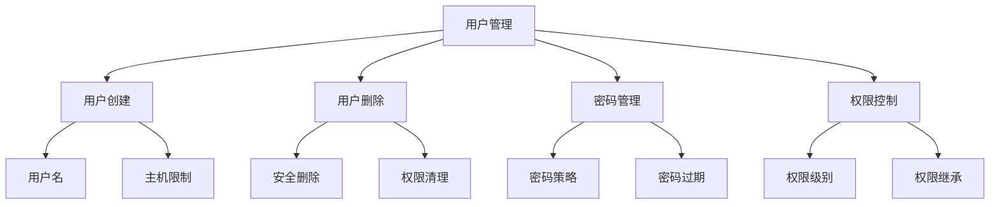

# 9.1 MySQL 用户管理

## 目录
- [1. 概述](#1-概述)
- [2. 用户创建](#2-用户创建)
- [3. 用户删除](#3-用户删除)
- [4. 密码管理](#4-密码管理)
- [5. 用户信息查询](#5-用户信息查询)
- [6. 用户权限管理](#6-用户权限管理)
- [7. 用户安全配置](#7-用户安全配置)
- [8. 实际应用示例](#8-实际应用示例)

## 1. 概述

MySQL用户管理是数据库安全的重要组成部分，包括用户的创建、删除、密码管理、权限分配等操作。

### 1.1 用户管理特点



### 1.2 用户管理优势

| 优势 | 描述 | 示例 |
|------|------|------|
| 安全性 | 细粒度的用户权限控制 | 不同用户访问不同数据 |
| 可追溯性 | 用户操作审计和日志 | 记录用户登录和操作 |
| 灵活性 | 支持多种认证方式 | 密码、SSL证书、插件 |
| 可维护性 | 集中化的用户管理 | 批量用户操作 |
| 合规性 | 满足安全合规要求 | 密码策略、访问控制 |

## 2. 用户创建

### 2.1 基本用户创建

```sql
-- 1. 创建基本用户
CREATE USER 'username'@'localhost' IDENTIFIED BY 'password';

-- 2. 创建远程访问用户
CREATE USER 'username'@'%' IDENTIFIED BY 'password';

-- 3. 创建指定主机用户
CREATE USER 'username'@'192.168.1.%' IDENTIFIED BY 'password';

-- 4. 创建用户并指定认证插件
CREATE USER 'username'@'localhost' IDENTIFIED WITH mysql_native_password BY 'password';

-- 5. 创建用户并设置密码过期
CREATE USER 'username'@'localhost' 
IDENTIFIED BY 'password' 
PASSWORD EXPIRE INTERVAL 90 DAY;
```

### 2.2 高级用户创建

```sql
-- 1. 创建用户并设置资源限制
CREATE USER 'limited_user'@'localhost'
IDENTIFIED BY 'password'
WITH MAX_QUERIES_PER_HOUR 1000
     MAX_UPDATES_PER_HOUR 100
     MAX_CONNECTIONS_PER_HOUR 10
     MAX_USER_CONNECTIONS 5;

-- 2. 创建用户并设置SSL要求
CREATE USER 'secure_user'@'localhost'
IDENTIFIED BY 'password'
REQUIRE SSL;

-- 3. 创建用户并设置X509证书要求
CREATE USER 'cert_user'@'localhost'
IDENTIFIED BY 'password'
REQUIRE X509;

-- 4. 创建用户并设置特定证书要求
CREATE USER 'specific_cert_user'@'localhost'
IDENTIFIED BY 'password'
REQUIRE SUBJECT '/C=US/ST=CA/L=San Francisco/O=MySQL/CN=client'
        ISSUER '/C=US/ST=CA/L=San Francisco/O=MySQL/CN=ca';

-- 5. 创建用户并设置密码验证策略
CREATE USER 'policy_user'@'localhost'
IDENTIFIED BY 'StrongPassword123!'
PASSWORD EXPIRE INTERVAL 90 DAY
PASSWORD HISTORY 5
PASSWORD REUSE INTERVAL 365 DAY;
```

### 2.3 批量用户创建

```sql
-- 1. 批量创建用户（使用存储过程）
DELIMITER //
CREATE PROCEDURE CreateMultipleUsers()
BEGIN
    DECLARE i INT DEFAULT 1;
    DECLARE username VARCHAR(50);
    
    WHILE i <= 10 DO
        SET username = CONCAT('user', i);
        
        SET @sql = CONCAT('CREATE USER ''', username, '''@''localhost'' IDENTIFIED BY ''password', i, '''');
        PREPARE stmt FROM @sql;
        EXECUTE stmt;
        DEALLOCATE PREPARE stmt;
        
        SET i = i + 1;
    END WHILE;
END //
DELIMITER ;

-- 执行批量创建
CALL CreateMultipleUsers();

-- 2. 从文件批量创建用户
-- 创建用户列表文件 users.txt
-- user1:password1
-- user2:password2
-- user3:password3

-- 批量创建脚本
DELIMITER //
CREATE PROCEDURE CreateUsersFromFile()
BEGIN
    DECLARE done INT DEFAULT FALSE;
    DECLARE user_line VARCHAR(100);
    DECLARE username VARCHAR(50);
    DECLARE password VARCHAR(50);
    
    -- 这里需要外部文件读取逻辑
    -- 实际应用中可以使用应用层处理
    
    -- 示例：创建特定用户
    CREATE USER 'app_user'@'localhost' IDENTIFIED BY 'app_password';
    CREATE USER 'report_user'@'localhost' IDENTIFIED BY 'report_password';
    CREATE USER 'admin_user'@'localhost' IDENTIFIED BY 'admin_password';
END //
DELIMITER ;
```

## 3. 用户删除

### 3.1 基本用户删除

```sql
-- 1. 删除用户
DROP USER 'username'@'localhost';

-- 2. 删除多个用户
DROP USER 'user1'@'localhost', 'user2'@'localhost', 'user3'@'localhost';

-- 3. 删除用户（如果存在）
DROP USER IF EXISTS 'username'@'localhost';

-- 4. 删除所有用户（谨慎使用）
-- 获取所有用户并删除
SELECT CONCAT('DROP USER IF EXISTS ''', user, '''@''', host, ''';') as drop_statement
FROM mysql.user
WHERE user NOT IN ('root', 'mysql.sys', 'mysql.session', 'mysql.infoschema');
```

### 3.2 安全用户删除

```sql
-- 1. 删除用户前检查依赖
DELIMITER //
CREATE PROCEDURE SafeDropUser(IN username VARCHAR(50), IN hostname VARCHAR(50))
BEGIN
    DECLARE user_exists INT DEFAULT 0;
    DECLARE has_privileges INT DEFAULT 0;
    
    -- 检查用户是否存在
    SELECT COUNT(*) INTO user_exists
    FROM mysql.user
    WHERE user = username AND host = hostname;
    
    IF user_exists = 0 THEN
        SIGNAL SQLSTATE '45000' 
        SET MESSAGE_TEXT = 'User does not exist';
    END IF;
    
    -- 检查用户是否有权限
    SELECT COUNT(*) INTO has_privileges
    FROM mysql.user
    WHERE user = username AND host = hostname
      AND (Select_priv = 'Y' OR Insert_priv = 'Y' OR Update_priv = 'Y' 
           OR Delete_priv = 'Y' OR Create_priv = 'Y' OR Drop_priv = 'Y');
    
    -- 记录删除操作
    INSERT INTO user_audit_log (
        action_type,
        username,
        hostname,
        action_time,
        has_privileges
    ) VALUES (
        'DROP_USER',
        username,
        hostname,
        NOW(),
        has_privileges
    );
    
    -- 删除用户
    SET @sql = CONCAT('DROP USER ''', username, '''@''', hostname, '''');
    PREPARE stmt FROM @sql;
    EXECUTE stmt;
    DEALLOCATE PREPARE stmt;
    
    SELECT CONCAT('User ', username, '@', hostname, ' dropped successfully') as result;
END //
DELIMITER ;
```

### 3.3 批量用户删除

```sql
-- 1. 删除指定模式的用户
DELIMITER //
CREATE PROCEDURE DropUsersByPattern(IN pattern VARCHAR(50))
BEGIN
    DECLARE done INT DEFAULT FALSE;
    DECLARE username VARCHAR(50);
    DECLARE hostname VARCHAR(50);
    
    DECLARE user_cursor CURSOR FOR
        SELECT user, host
        FROM mysql.user
        WHERE user LIKE pattern;
    
    DECLARE CONTINUE HANDLER FOR NOT FOUND SET done = TRUE;
    
    OPEN user_cursor;
    
    read_loop: LOOP
        FETCH user_cursor INTO username, hostname;
        IF done THEN
            LEAVE read_loop;
        END IF;
        
        SET @sql = CONCAT('DROP USER ''', username, '''@''', hostname, '''');
        PREPARE stmt FROM @sql;
        EXECUTE stmt;
        DEALLOCATE PREPARE stmt;
        
        -- 记录删除操作
        INSERT INTO user_audit_log (
            action_type,
            username,
            hostname,
            action_time
        ) VALUES (
            'DROP_USER',
            username,
            hostname,
            NOW()
        );
    END LOOP;
    
    CLOSE user_cursor;
END //
DELIMITER ;

-- 使用示例
CALL DropUsersByPattern('temp_%');
```

## 4. 密码管理

### 4.1 密码设置

```sql
-- 1. 设置用户密码
ALTER USER 'username'@'localhost' IDENTIFIED BY 'new_password';

-- 2. 设置密码并指定认证插件
ALTER USER 'username'@'localhost' 
IDENTIFIED WITH mysql_native_password BY 'new_password';

-- 3. 设置密码并配置过期策略
ALTER USER 'username'@'localhost' 
IDENTIFIED BY 'new_password'
PASSWORD EXPIRE INTERVAL 90 DAY;

-- 4. 设置密码并配置历史策略
ALTER USER 'username'@'localhost' 
IDENTIFIED BY 'new_password'
PASSWORD HISTORY 5
PASSWORD REUSE INTERVAL 365 DAY;

-- 5. 设置密码并配置验证策略
ALTER USER 'username'@'localhost' 
IDENTIFIED BY 'StrongPassword123!'
PASSWORD REQUIRE CURRENT;
```

### 4.2 密码策略

```sql
-- 1. 查看密码验证策略
SHOW VARIABLES LIKE 'validate_password%';

-- 2. 设置密码验证策略
SET GLOBAL validate_password.policy = MEDIUM;
SET GLOBAL validate_password.length = 8;
SET GLOBAL validate_password.mixed_case_count = 1;
SET GLOBAL validate_password.number_count = 1;
SET GLOBAL validate_password.special_char_count = 1;

-- 3. 创建符合策略的用户
CREATE USER 'policy_user'@'localhost' 
IDENTIFIED BY 'StrongPassword123!';

-- 4. 批量更新用户密码
DELIMITER //
CREATE PROCEDURE UpdateUserPasswords()
BEGIN
    DECLARE done INT DEFAULT FALSE;
    DECLARE username VARCHAR(50);
    DECLARE hostname VARCHAR(50);
    
    DECLARE user_cursor CURSOR FOR
        SELECT user, host
        FROM mysql.user
        WHERE user NOT IN ('root', 'mysql.sys', 'mysql.session', 'mysql.infoschema');
    
    DECLARE CONTINUE HANDLER FOR NOT FOUND SET done = TRUE;
    
    OPEN user_cursor;
    
    read_loop: LOOP
        FETCH user_cursor INTO username, hostname;
        IF done THEN
            LEAVE read_loop;
        END IF;
        
        -- 生成随机密码
        SET @new_password = CONCAT(
            'Pass', 
            FLOOR(RAND() * 1000), 
            '!', 
            CHAR(65 + FLOOR(RAND() * 26))
        );
        
        SET @sql = CONCAT('ALTER USER ''', username, '''@''', hostname, 
                          ''' IDENTIFIED BY ''', @new_password, '''');
        PREPARE stmt FROM @sql;
        EXECUTE stmt;
        DEALLOCATE PREPARE stmt;
        
        -- 记录密码更新
        INSERT INTO password_change_log (
            username,
            hostname,
            changed_at
        ) VALUES (
            username,
            hostname,
            NOW()
        );
    END LOOP;
    
    CLOSE user_cursor;
END //
DELIMITER ;
```

### 4.3 密码过期管理

```sql
-- 1. 设置密码过期
ALTER USER 'username'@'localhost' PASSWORD EXPIRE;

-- 2. 设置密码过期时间
ALTER USER 'username'@'localhost' PASSWORD EXPIRE INTERVAL 90 DAY;

-- 3. 设置密码永不过期
ALTER USER 'username'@'localhost' PASSWORD EXPIRE NEVER;

-- 4. 检查密码过期用户
SELECT 
    user,
    host,
    password_expired,
    password_lifetime,
    password_last_changed
FROM mysql.user
WHERE password_expired = 'Y'
   OR (password_lifetime IS NOT NULL 
       AND password_last_changed < DATE_SUB(NOW(), INTERVAL password_lifetime DAY));

-- 5. 批量设置密码过期
UPDATE mysql.user 
SET password_expired = 'Y'
WHERE user NOT IN ('root', 'mysql.sys', 'mysql.session', 'mysql.infoschema')
  AND password_expired = 'N';
```

## 5. 用户信息查询

### 5.1 基本用户信息

```sql
-- 1. 查看所有用户
SELECT user, host FROM mysql.user;

-- 2. 查看用户详细信息
SELECT 
    user,
    host,
    authentication_string,
    password_expired,
    password_lifetime,
    password_last_changed,
    account_locked,
    max_questions,
    max_updates,
    max_connections,
    max_user_connections
FROM mysql.user;

-- 3. 查看用户权限
SHOW GRANTS FOR 'username'@'localhost';

-- 4. 查看当前用户
SELECT USER(), CURRENT_USER();

-- 5. 查看用户连接信息
SELECT 
    user,
    host,
    db,
    command,
    time,
    state,
    info
FROM information_schema.processlist
WHERE user IS NOT NULL;
```

### 5.2 高级用户查询

```sql
-- 1. 查询用户统计信息
SELECT 
    user,
    COUNT(*) as connection_count,
    MAX(time) as max_connection_time,
    AVG(time) as avg_connection_time
FROM information_schema.processlist
WHERE user IS NOT NULL
GROUP BY user;

-- 2. 查询用户权限统计
SELECT 
    user,
    host,
    CASE WHEN Select_priv = 'Y' THEN 1 ELSE 0 END as select_priv,
    CASE WHEN Insert_priv = 'Y' THEN 1 ELSE 0 END as insert_priv,
    CASE WHEN Update_priv = 'Y' THEN 1 ELSE 0 END as update_priv,
    CASE WHEN Delete_priv = 'Y' THEN 1 ELSE 0 END as delete_priv,
    CASE WHEN Create_priv = 'Y' THEN 1 ELSE 0 END as create_priv,
    CASE WHEN Drop_priv = 'Y' THEN 1 ELSE 0 END as drop_priv,
    CASE WHEN Reload_priv = 'Y' THEN 1 ELSE 0 END as reload_priv,
    CASE WHEN Shutdown_priv = 'Y' THEN 1 ELSE 0 END as shutdown_priv,
    CASE WHEN Process_priv = 'Y' THEN 1 ELSE 0 END as process_priv,
    CASE WHEN File_priv = 'Y' THEN 1 ELSE 0 END as file_priv,
    CASE WHEN Grant_priv = 'Y' THEN 1 ELSE 0 END as grant_priv,
    CASE WHEN References_priv = 'Y' THEN 1 ELSE 0 END as references_priv,
    CASE WHEN Index_priv = 'Y' THEN 1 ELSE 0 END as index_priv,
    CASE WHEN Alter_priv = 'Y' THEN 1 ELSE 0 END as alter_priv,
    CASE WHEN Show_db_priv = 'Y' THEN 1 ELSE 0 END as show_db_priv,
    CASE WHEN Super_priv = 'Y' THEN 1 ELSE 0 END as super_priv,
    CASE WHEN Create_tmp_table_priv = 'Y' THEN 1 ELSE 0 END as create_tmp_table_priv,
    CASE WHEN Lock_tables_priv = 'Y' THEN 1 ELSE 0 END as lock_tables_priv,
    CASE WHEN Execute_priv = 'Y' THEN 1 ELSE 0 END as execute_priv,
    CASE WHEN Repl_slave_priv = 'Y' THEN 1 ELSE 0 END as repl_slave_priv,
    CASE WHEN Repl_client_priv = 'Y' THEN 1 ELSE 0 END as repl_client_priv,
    CASE WHEN Create_view_priv = 'Y' THEN 1 ELSE 0 END as create_view_priv,
    CASE WHEN Show_view_priv = 'Y' THEN 1 ELSE 0 END as show_view_priv,
    CASE WHEN Create_routine_priv = 'Y' THEN 1 ELSE 0 END as create_routine_priv,
    CASE WHEN Alter_routine_priv = 'Y' THEN 1 ELSE 0 END as alter_routine_priv,
    CASE WHEN Create_user_priv = 'Y' THEN 1 ELSE 0 END as create_user_priv,
    CASE WHEN Event_priv = 'Y' THEN 1 ELSE 0 END as event_priv,
    CASE WHEN Trigger_priv = 'Y' THEN 1 ELSE 0 END as trigger_priv,
    CASE WHEN Create_tablespace_priv = 'Y' THEN 1 ELSE 0 END as create_tablespace_priv,
    CASE WHEN ssl_type = 'ANY' THEN 1 ELSE 0 END as ssl_required,
    CASE WHEN ssl_type = 'X509' THEN 1 ELSE 0 END as x509_required,
    CASE WHEN max_questions > 0 THEN 1 ELSE 0 END as resource_limited
FROM mysql.user;

-- 3. 查询用户资源使用情况
SELECT 
    user,
    host,
    max_questions,
    max_updates,
    max_connections,
    max_user_connections,
    CASE 
        WHEN max_questions = 0 THEN 'Unlimited'
        ELSE CONCAT(max_questions, ' queries/hour')
    END as query_limit,
    CASE 
        WHEN max_updates = 0 THEN 'Unlimited'
        ELSE CONCAT(max_updates, ' updates/hour')
    END as update_limit,
    CASE 
        WHEN max_connections = 0 THEN 'Unlimited'
        ELSE CONCAT(max_connections, ' connections/hour')
    END as connection_limit,
    CASE 
        WHEN max_user_connections = 0 THEN 'Unlimited'
        ELSE CONCAT(max_user_connections, ' concurrent connections')
    END as concurrent_limit
FROM mysql.user;
```

### 5.3 用户审计查询

```sql
-- 1. 查询用户登录历史
SELECT 
    user,
    host,
    login_time,
    logout_time,
    duration_seconds
FROM user_login_history
WHERE login_time >= DATE_SUB(NOW(), INTERVAL 30 DAY)
ORDER BY login_time DESC;

-- 2. 查询用户操作统计
SELECT 
    user,
    action_type,
    COUNT(*) as action_count,
    MIN(action_time) as first_action,
    MAX(action_time) as last_action
FROM user_audit_log
WHERE action_time >= DATE_SUB(NOW(), INTERVAL 30 DAY)
GROUP BY user, action_type
ORDER BY action_count DESC;

-- 3. 查询异常用户活动
SELECT 
    user,
    host,
    COUNT(*) as failed_attempts,
    MAX(attempt_time) as last_attempt
FROM user_login_attempts
WHERE success = 'N'
  AND attempt_time >= DATE_SUB(NOW(), INTERVAL 24 HOUR)
GROUP BY user, host
HAVING failed_attempts > 5
ORDER BY failed_attempts DESC;
```

## 6. 用户权限管理

### 6.1 权限授予

```sql
-- 1. 授予基本权限
GRANT SELECT, INSERT, UPDATE, DELETE ON database_name.* TO 'username'@'localhost';

-- 2. 授予所有权限
GRANT ALL PRIVILEGES ON database_name.* TO 'username'@'localhost';

-- 3. 授予特定表权限
GRANT SELECT, INSERT ON database_name.table_name TO 'username'@'localhost';

-- 4. 授予全局权限
GRANT SELECT, INSERT, UPDATE, DELETE ON *.* TO 'username'@'localhost';

-- 5. 授予管理权限
GRANT CREATE, DROP, ALTER ON database_name.* TO 'username'@'localhost';

-- 6. 授予存储过程权限
GRANT EXECUTE ON PROCEDURE database_name.procedure_name TO 'username'@'localhost';

-- 7. 授予事件权限
GRANT EVENT ON database_name.* TO 'username'@'localhost';

-- 8. 授予触发器权限
GRANT TRIGGER ON database_name.* TO 'username'@'localhost';
```

### 6.2 权限撤销

```sql
-- 1. 撤销特定权限
REVOKE SELECT, INSERT ON database_name.* FROM 'username'@'localhost';

-- 2. 撤销所有权限
REVOKE ALL PRIVILEGES ON database_name.* FROM 'username'@'localhost';

-- 3. 撤销全局权限
REVOKE ALL PRIVILEGES ON *.* FROM 'username'@'localhost';

-- 4. 撤销管理权限
REVOKE CREATE, DROP, ALTER ON database_name.* FROM 'username'@'localhost';

-- 5. 撤销存储过程权限
REVOKE EXECUTE ON PROCEDURE database_name.procedure_name FROM 'username'@'localhost';

-- 6. 撤销事件权限
REVOKE EVENT ON database_name.* FROM 'username'@'localhost';

-- 7. 撤销触发器权限
REVOKE TRIGGER ON database_name.* FROM 'username'@'localhost';
```

### 6.3 权限查询

```sql
-- 1. 查看用户权限
SHOW GRANTS FOR 'username'@'localhost';

-- 2. 查看当前用户权限
SHOW GRANTS;

-- 3. 查询用户权限详情
SELECT 
    user,
    host,
    db,
    table_name,
    column_name,
    privilege_type,
    is_grantable
FROM information_schema.table_privileges
WHERE grantee = 'username@localhost';

-- 4. 查询用户列权限
SELECT 
    user,
    host,
    db,
    table_name,
    column_name,
    privilege_type,
    is_grantable
FROM information_schema.column_privileges
WHERE grantee = 'username@localhost';

-- 5. 查询用户存储过程权限
SELECT 
    user,
    host,
    db,
    routine_name,
    privilege_type,
    is_grantable
FROM information_schema.routine_privileges
WHERE grantee = 'username@localhost';
```

## 7. 用户安全配置

### 7.1 用户锁定

```sql
-- 1. 锁定用户
ALTER USER 'username'@'localhost' ACCOUNT LOCK;

-- 2. 解锁用户
ALTER USER 'username'@'localhost' ACCOUNT UNLOCK;

-- 3. 查询锁定用户
SELECT user, host, account_locked 
FROM mysql.user 
WHERE account_locked = 'Y';

-- 4. 批量锁定用户
UPDATE mysql.user 
SET account_locked = 'Y'
WHERE user IN ('temp_user1', 'temp_user2', 'temp_user3');

-- 5. 批量解锁用户
UPDATE mysql.user 
SET account_locked = 'N'
WHERE user LIKE 'app_%';
```

### 7.2 资源限制

```sql
-- 1. 设置用户资源限制
ALTER USER 'username'@'localhost'
WITH MAX_QUERIES_PER_HOUR 1000
     MAX_UPDATES_PER_HOUR 100
     MAX_CONNECTIONS_PER_HOUR 10
     MAX_USER_CONNECTIONS 5;

-- 2. 查询用户资源限制
SELECT 
    user,
    host,
    max_questions,
    max_updates,
    max_connections,
    max_user_connections
FROM mysql.user
WHERE user = 'username';

-- 3. 批量设置资源限制
UPDATE mysql.user 
SET max_questions = 1000,
    max_updates = 100,
    max_connections = 10,
    max_user_connections = 5
WHERE user LIKE 'app_%';
```

### 7.3 SSL配置

```sql
-- 1. 设置用户SSL要求
ALTER USER 'username'@'localhost' REQUIRE SSL;

-- 2. 设置用户X509证书要求
ALTER USER 'username'@'localhost' REQUIRE X509;

-- 3. 设置用户特定证书要求
ALTER USER 'username'@'localhost'
REQUIRE SUBJECT '/C=US/ST=CA/L=San Francisco/O=MySQL/CN=client'
        ISSUER '/C=US/ST=CA/L=San Francisco/O=MySQL/CN=ca';

-- 4. 查询用户SSL配置
SELECT 
    user,
    host,
    ssl_type,
    ssl_cipher,
    x509_issuer,
    x509_subject
FROM mysql.user
WHERE ssl_type IS NOT NULL;
```

## 8. 实际应用示例

### 8.1 应用程序用户管理

```sql
-- 示例1: 创建应用程序用户
DELIMITER //
CREATE PROCEDURE CreateAppUser(
    IN app_name VARCHAR(50),
    IN db_name VARCHAR(50)
)
BEGIN
    DECLARE username VARCHAR(100);
    DECLARE password VARCHAR(100);
    
    SET username = CONCAT(app_name, '_user');
    SET password = CONCAT(app_name, '_', FLOOR(RAND() * 10000), '!');
    
    -- 创建用户
    SET @sql = CONCAT('CREATE USER ''', username, '''@''localhost'' IDENTIFIED BY ''', password, '''');
    PREPARE stmt FROM @sql;
    EXECUTE stmt;
    DEALLOCATE PREPARE stmt;
    
    -- 授予权限
    SET @sql = CONCAT('GRANT SELECT, INSERT, UPDATE, DELETE ON ', db_name, '.* TO ''', username, '''@''localhost''');
    PREPARE stmt FROM @sql;
    EXECUTE stmt;
    DEALLOCATE PREPARE stmt;
    
    -- 设置资源限制
    SET @sql = CONCAT('ALTER USER ''', username, '''@''localhost'' WITH MAX_QUERIES_PER_HOUR 10000 MAX_CONNECTIONS_PER_HOUR 100');
    PREPARE stmt FROM @sql;
    EXECUTE stmt;
    DEALLOCATE PREPARE stmt;
    
    -- 记录用户创建
    INSERT INTO user_creation_log (
        username,
        app_name,
        database_name,
        created_at,
        password_hash
    ) VALUES (
        username,
        app_name,
        db_name,
        NOW(),
        SHA2(password, 256)
    );
    
    SELECT CONCAT('User ', username, ' created with password: ', password) as result;
END //
DELIMITER ;

-- 示例2: 创建只读用户
DELIMITER //
CREATE PROCEDURE CreateReadOnlyUser(
    IN username VARCHAR(50),
    IN db_name VARCHAR(50)
)
BEGIN
    DECLARE password VARCHAR(100);
    
    SET password = CONCAT('ro_', FLOOR(RAND() * 10000), '!');
    
    -- 创建用户
    SET @sql = CONCAT('CREATE USER ''', username, '''@''localhost'' IDENTIFIED BY ''', password, '''');
    PREPARE stmt FROM @sql;
    EXECUTE stmt;
    DEALLOCATE PREPARE stmt;
    
    -- 授予只读权限
    SET @sql = CONCAT('GRANT SELECT ON ', db_name, '.* TO ''', username, '''@''localhost''');
    PREPARE stmt FROM @sql;
    EXECUTE stmt;
    DEALLOCATE PREPARE stmt;
    
    -- 设置资源限制
    SET @sql = CONCAT('ALTER USER ''', username, '''@''localhost'' WITH MAX_QUERIES_PER_HOUR 5000 MAX_CONNECTIONS_PER_HOUR 50');
    PREPARE stmt FROM @sql;
    EXECUTE stmt;
    DEALLOCATE PREPARE stmt;
    
    SELECT CONCAT('Read-only user ', username, ' created with password: ', password) as result;
END //
DELIMITER ;
```

### 8.2 数据库管理员用户管理

```sql
-- 示例1: 创建数据库管理员用户
DELIMITER //
CREATE PROCEDURE CreateDBAdmin(
    IN username VARCHAR(50),
    IN db_name VARCHAR(50)
)
BEGIN
    DECLARE password VARCHAR(100);
    
    SET password = CONCAT('admin_', FLOOR(RAND() * 10000), '!');
    
    -- 创建用户
    SET @sql = CONCAT('CREATE USER ''', username, '''@''localhost'' IDENTIFIED BY ''', password, '''');
    PREPARE stmt FROM @sql;
    EXECUTE stmt;
    DEALLOCATE PREPARE stmt;
    
    -- 授予管理权限
    SET @sql = CONCAT('GRANT ALL PRIVILEGES ON ', db_name, '.* TO ''', username, '''@''localhost''');
    PREPARE stmt FROM @sql;
    EXECUTE stmt;
    DEALLOCATE PREPARE stmt;
    
    -- 授予存储过程权限
    SET @sql = CONCAT('GRANT EXECUTE ON ', db_name, '.* TO ''', username, '''@''localhost''');
    PREPARE stmt FROM @sql;
    EXECUTE stmt;
    DEALLOCATE PREPARE stmt;
    
    -- 授予事件权限
    SET @sql = CONCAT('GRANT EVENT ON ', db_name, '.* TO ''', username, '''@''localhost''');
    PREPARE stmt FROM @sql;
    EXECUTE stmt;
    DEALLOCATE PREPARE stmt;
    
    -- 授予触发器权限
    SET @sql = CONCAT('GRANT TRIGGER ON ', db_name, '.* TO ''', username, '''@''localhost''');
    PREPARE stmt FROM @sql;
    EXECUTE stmt;
    DEALLOCATE PREPARE stmt;
    
    -- 设置密码策略
    SET @sql = CONCAT('ALTER USER ''', username, '''@''localhost'' PASSWORD EXPIRE INTERVAL 90 DAY');
    PREPARE stmt FROM @sql;
    EXECUTE stmt;
    DEALLOCATE PREPARE stmt;
    
    SELECT CONCAT('DB Admin user ', username, ' created with password: ', password) as result;
END //
DELIMITER ;

-- 示例2: 创建备份用户
DELIMITER //
CREATE PROCEDURE CreateBackupUser(
    IN username VARCHAR(50)
)
BEGIN
    DECLARE password VARCHAR(100);
    
    SET password = CONCAT('backup_', FLOOR(RAND() * 10000), '!');
    
    -- 创建用户
    SET @sql = CONCAT('CREATE USER ''', username, '''@''localhost'' IDENTIFIED BY ''', password, '''');
    PREPARE stmt FROM @sql;
    EXECUTE stmt;
    DEALLOCATE PREPARE stmt;
    
    -- 授予备份权限
    GRANT SELECT, LOCK TABLES, SHOW VIEW, EVENT, TRIGGER ON *.* TO username@localhost;
    
    -- 授予RELOAD权限（用于备份）
    GRANT RELOAD ON *.* TO username@localhost;
    
    -- 授予PROCESS权限（用于监控）
    GRANT PROCESS ON *.* TO username@localhost;
    
    -- 设置资源限制
    SET @sql = CONCAT('ALTER USER ''', username, '''@''localhost'' WITH MAX_QUERIES_PER_HOUR 1000 MAX_CONNECTIONS_PER_HOUR 10');
    PREPARE stmt FROM @sql;
    EXECUTE stmt;
    DEALLOCATE PREPARE stmt;
    
    SELECT CONCAT('Backup user ', username, ' created with password: ', password) as result;
END //
DELIMITER ;
```

### 8.3 安全审计用户管理

```sql
-- 示例1: 创建审计用户
DELIMITER //
CREATE PROCEDURE CreateAuditUser(
    IN username VARCHAR(50)
)
BEGIN
    DECLARE password VARCHAR(100);
    
    SET password = CONCAT('audit_', FLOOR(RAND() * 10000), '!');
    
    -- 创建用户
    SET @sql = CONCAT('CREATE USER ''', username, '''@''localhost'' IDENTIFIED BY ''', password, '''');
    PREPARE stmt FROM @sql;
    EXECUTE stmt;
    DEALLOCATE PREPARE stmt;
    
    -- 授予审计权限
    GRANT SELECT ON mysql.user TO username@localhost;
    GRANT SELECT ON mysql.db TO username@localhost;
    GRANT SELECT ON mysql.tables_priv TO username@localhost;
    GRANT SELECT ON mysql.columns_priv TO username@localhost;
    GRANT SELECT ON mysql.procs_priv TO username@localhost;
    GRANT SELECT ON mysql.proxies_priv TO username@localhost;
    
    -- 授予监控权限
    GRANT PROCESS ON *.* TO username@localhost;
    GRANT SELECT ON information_schema.* TO username@localhost;
    GRANT SELECT ON performance_schema.* TO username@localhost;
    
    -- 设置SSL要求
    SET @sql = CONCAT('ALTER USER ''', username, '''@''localhost'' REQUIRE SSL');
    PREPARE stmt FROM @sql;
    EXECUTE stmt;
    DEALLOCATE PREPARE stmt;
    
    -- 设置资源限制
    SET @sql = CONCAT('ALTER USER ''', username, '''@''localhost'' WITH MAX_QUERIES_PER_HOUR 100 MAX_CONNECTIONS_PER_HOUR 5');
    PREPARE stmt FROM @sql;
    EXECUTE stmt;
    DEALLOCATE PREPARE stmt;
    
    SELECT CONCAT('Audit user ', username, ' created with password: ', password) as result;
END //
DELIMITER ;

-- 示例2: 用户权限审计
DELIMITER //
CREATE PROCEDURE AuditUserPrivileges()
BEGIN
    -- 创建审计报告
    CREATE TEMPORARY TABLE audit_report AS
    SELECT 
        user,
        host,
        COUNT(CASE WHEN privilege_type = 'SELECT' THEN 1 END) as select_count,
        COUNT(CASE WHEN privilege_type = 'INSERT' THEN 1 END) as insert_count,
        COUNT(CASE WHEN privilege_type = 'UPDATE' THEN 1 END) as update_count,
        COUNT(CASE WHEN privilege_type = 'DELETE' THEN 1 END) as delete_count,
        COUNT(CASE WHEN privilege_type = 'CREATE' THEN 1 END) as create_count,
        COUNT(CASE WHEN privilege_type = 'DROP' THEN 1 END) as drop_count,
        COUNT(CASE WHEN privilege_type = 'GRANT' THEN 1 END) as grant_count,
        COUNT(CASE WHEN privilege_type = 'SUPER' THEN 1 END) as super_count
    FROM information_schema.table_privileges
    GROUP BY user, host;
    
    -- 输出审计报告
    SELECT 
        user,
        host,
        CASE WHEN select_count > 0 THEN 'SELECT' ELSE '' END as select_priv,
        CASE WHEN insert_count > 0 THEN 'INSERT' ELSE '' END as insert_priv,
        CASE WHEN update_count > 0 THEN 'UPDATE' ELSE '' END as update_priv,
        CASE WHEN delete_count > 0 THEN 'DELETE' ELSE '' END as delete_priv,
        CASE WHEN create_count > 0 THEN 'CREATE' ELSE '' END as create_priv,
        CASE WHEN drop_count > 0 THEN 'DROP' ELSE '' END as drop_priv,
        CASE WHEN grant_count > 0 THEN 'GRANT' ELSE '' END as grant_priv,
        CASE WHEN super_count > 0 THEN 'SUPER' ELSE '' END as super_priv
    FROM audit_report
    ORDER BY user, host;
    
    -- 清理临时表
    DROP TEMPORARY TABLE IF EXISTS audit_report;
END //
DELIMITER ;
```

## 总结

MySQL用户管理是数据库安全的核心，需要：

1. **安全创建**：使用强密码和适当的权限
2. **定期维护**：定期检查和更新用户权限
3. **审计监控**：记录和监控用户活动
4. **权限最小化**：只授予必要的权限
5. **安全策略**：实施密码策略和访问控制

通过合理管理用户，可以确保数据库的安全性和合规性。 

**[返回目录 README.md](./README?id=_10-mysql-安全与权限)** 