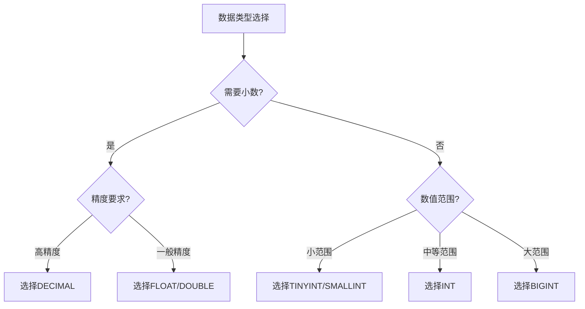

# MySQL 数值类型详解

## 概述

MySQL的数值类型是数据库中最基本的数据类型之一，包括整数类型、浮点类型和定点类型。选择合适的数值类型对数据库性能和存储空间都有重要影响。

## 数值类型分类

```
┌─────────────────────────────────────────────────────────────┐
│                        MySQL数值类型                        │
├─────────────────────────────────────────────────────────────┤
│  ┌─────────────┐ ┌─────────────┐ ┌─────────────┐          │
│  │   整数类型   │ │   浮点类型   │ │   定点类型   │          │
│  │  Integer    │ │   Float     │ │  Decimal    │          │
│  └─────────────┘ └─────────────┘ └─────────────┘          │
│  ┌─────────────┐ ┌─────────────┐ ┌─────────────┐          │
│  │   TINYINT   │ │   FLOAT     │ │  DECIMAL    │          │
│  │   SMALLINT  │ │   DOUBLE    │ │  NUMERIC    │          │
│  │   MEDIUMINT │ │             │ │             │          │
│  │     INT     │ │             │ │             │          │
│  │   BIGINT    │ │             │ │             │          │
│  └─────────────┘ └─────────────┘ └─────────────┘          │
└─────────────────────────────────────────────────────────────┘
```

## 1. 整数类型

### 1.1 整数类型对比

| 类型 | 字节 | 有符号范围 | 无符号范围 | 用途 |
|------|------|------------|------------|------|
| **TINYINT** | 1 | -128 ~ 127 | 0 ~ 255 | 小整数、状态值 |
| **SMALLINT** | 2 | -32,768 ~ 32,767 | 0 ~ 65,535 | 中等整数 |
| **MEDIUMINT** | 3 | -8,388,608 ~ 8,388,607 | 0 ~ 16,777,215 | 中等整数 |
| **INT** | 4 | -2,147,483,648 ~ 2,147,483,647 | 0 ~ 4,294,967,295 | 标准整数 |
| **BIGINT** | 8 | -2^63 ~ 2^63-1 | 0 ~ 2^64-1 | 大整数、ID |

### 1.2 整数类型使用示例

#### 1.2.1 TINYINT

```sql
-- 创建用户状态表
CREATE TABLE user_status (
    id INT PRIMARY KEY,
    status TINYINT COMMENT '0:禁用, 1:正常, 2:锁定'
);

-- 插入数据
INSERT INTO user_status VALUES (1, 1), (2, 0), (3, 2);

-- 查询正常用户
SELECT * FROM user_status WHERE status = 1;
```

#### 1.2.2 SMALLINT

```sql
-- 创建年龄表
CREATE TABLE user_age (
    id INT PRIMARY KEY,
    age SMALLINT UNSIGNED COMMENT '年龄范围0-65535'
);

-- 插入数据
INSERT INTO user_age VALUES (1, 25), (2, 30), (3, 18);
```

#### 1.2.3 INT

```sql
-- 创建用户ID表
CREATE TABLE users (
    id INT AUTO_INCREMENT PRIMARY KEY,
    name VARCHAR(50)
);

-- 插入数据
INSERT INTO users (name) VALUES ('John'), ('Jane'), ('Bob');
```

#### 1.2.4 BIGINT

```sql
-- 创建大ID表
CREATE TABLE big_table (
    id BIGINT AUTO_INCREMENT PRIMARY KEY,
    data TEXT
);

-- 插入数据
INSERT INTO big_table (data) VALUES ('Large data content');
```

### 1.3 整数类型属性

#### 1.3.1 UNSIGNED（无符号）

```sql
-- 无符号整数
CREATE TABLE unsigned_example (
    id INT UNSIGNED PRIMARY KEY,
    count TINYINT UNSIGNED DEFAULT 0
);

-- 插入数据（只能插入非负数）
INSERT INTO unsigned_example VALUES (1, 255);
-- INSERT INTO unsigned_example VALUES (2, -1); -- 错误
```

#### 1.3.2 ZEROFILL（零填充）

```sql
-- 零填充整数
CREATE TABLE zerofill_example (
    id INT(5) ZEROFILL,
    code TINYINT(3) ZEROFILL
);

-- 插入数据
INSERT INTO zerofill_example VALUES (1, 5), (123, 99);

-- 查询结果
SELECT * FROM zerofill_example;
-- 结果：00001, 005
-- 结果：00123, 099
```

#### 1.3.3 AUTO_INCREMENT（自增）

```sql
-- 自增主键
CREATE TABLE auto_increment_example (
    id INT AUTO_INCREMENT PRIMARY KEY,
    name VARCHAR(50)
);

-- 插入数据
INSERT INTO auto_increment_example (name) VALUES ('Alice');
INSERT INTO auto_increment_example (name) VALUES ('Bob');

-- 查询结果
SELECT * FROM auto_increment_example;
-- 结果：id=1, name='Alice'
-- 结果：id=2, name='Bob'
```

## 2. 浮点类型

### 2.1 浮点类型对比

| 类型 | 字节 | 精度 | 范围 | 用途 |
|------|------|------|------|------|
| **FLOAT** | 4 | 单精度 | ±3.402823466E+38 | 一般浮点数 |
| **DOUBLE** | 8 | 双精度 | ±1.7976931348623157E+308 | 高精度浮点数 |

### 2.2 浮点类型使用示例

#### 2.2.1 FLOAT

```sql
-- 创建价格表
CREATE TABLE products (
    id INT PRIMARY KEY,
    name VARCHAR(100),
    price FLOAT(10,2) COMMENT '价格，保留2位小数'
);

-- 插入数据
INSERT INTO products VALUES (1, 'iPhone', 999.99);
INSERT INTO products VALUES (2, 'MacBook', 1299.50);

-- 查询价格大于1000的产品
SELECT * FROM products WHERE price > 1000.00;
```

#### 2.2.2 DOUBLE

```sql
-- 创建科学计算表
CREATE TABLE scientific_data (
    id INT PRIMARY KEY,
    value DOUBLE COMMENT '科学计算值'
);

-- 插入数据
INSERT INTO scientific_data VALUES (1, 3.14159265359);
INSERT INTO scientific_data VALUES (2, 2.71828182846);

-- 查询特定范围的值
SELECT * FROM scientific_data WHERE value BETWEEN 3.0 AND 4.0;
```

### 2.3 浮点类型精度问题

```sql
-- 浮点数精度问题示例
CREATE TABLE precision_test (
    id INT PRIMARY KEY,
    float_val FLOAT,
    double_val DOUBLE
);

-- 插入数据
INSERT INTO precision_test VALUES (1, 0.1, 0.1);

-- 查询结果（注意精度差异）
SELECT 
    float_val,
    double_val,
    float_val + float_val + float_val,
    double_val + double_val + double_val
FROM precision_test;
```

## 3. 定点类型

### 3.1 DECIMAL/NUMERIC

#### 3.1.1 基本语法

```sql
DECIMAL(M,D) 或 NUMERIC(M,D)
-- M: 总位数（精度）
-- D: 小数位数（标度）
```

#### 3.1.2 使用示例

```sql
-- 创建金融数据表
CREATE TABLE financial_data (
    id INT PRIMARY KEY,
    amount DECIMAL(10,2) COMMENT '金额，总10位，小数2位',
    rate DECIMAL(5,4) COMMENT '利率，总5位，小数4位'
);

-- 插入数据
INSERT INTO financial_data VALUES (1, 1234567.89, 0.0525);
INSERT INTO financial_data VALUES (2, 9876543.21, 0.0375);

-- 查询特定金额范围
SELECT * FROM financial_data WHERE amount BETWEEN 1000000 AND 2000000;
```

#### 3.1.3 精度控制

```sql
-- 不同精度的DECIMAL
CREATE TABLE precision_examples (
    id INT PRIMARY KEY,
    price DECIMAL(8,2),    -- 总8位，小数2位
    quantity DECIMAL(10,0), -- 总10位，无小数
    ratio DECIMAL(6,4)      -- 总6位，小数4位
);

-- 插入数据
INSERT INTO precision_examples VALUES (1, 1234.56, 100, 0.1234);
INSERT INTO precision_examples VALUES (2, 9999.99, 9999999999, 0.9999);
```

## 4. 数值类型选择指南

### 4.1 选择原则



### 4.2 性能考虑

| 类型 | 存储空间 | 计算性能 | 精度 | 推荐用途 |
|------|----------|----------|------|----------|
| **TINYINT** | 最小 | 最快 | 低 | 状态值、小计数 |
| **INT** | 中等 | 快 | 中等 | 主键、一般计数 |
| **BIGINT** | 大 | 中等 | 高 | 大ID、时间戳 |
| **FLOAT** | 小 | 快 | 中等 | 一般计算 |
| **DOUBLE** | 中等 | 中等 | 高 | 科学计算 |
| **DECIMAL** | 大 | 慢 | 最高 | 金融计算 |

### 4.3 实际应用场景

#### 4.3.1 用户ID

```sql
-- 推荐使用BIGINT
CREATE TABLE users (
    id BIGINT AUTO_INCREMENT PRIMARY KEY,
    username VARCHAR(50)
);
```

#### 4.3.2 状态值

```sql
-- 推荐使用TINYINT
CREATE TABLE orders (
    id INT PRIMARY KEY,
    status TINYINT COMMENT '0:待支付, 1:已支付, 2:已发货, 3:已完成'
);
```

#### 4.3.3 金额计算

```sql
-- 推荐使用DECIMAL
CREATE TABLE transactions (
    id INT PRIMARY KEY,
    amount DECIMAL(10,2) NOT NULL,
    tax DECIMAL(5,2) DEFAULT 0.00
);
```

#### 4.3.4 科学计算

```sql
-- 推荐使用DOUBLE
CREATE TABLE scientific_calculations (
    id INT PRIMARY KEY,
    pi_value DOUBLE DEFAULT 3.14159265359,
    e_value DOUBLE DEFAULT 2.71828182846
);
```

## 5. 数值类型优化

### 5.1 存储优化

```sql
-- 使用合适的数据类型
-- 不好的做法
CREATE TABLE bad_example (
    id INT,           -- 应该用TINYINT
    status INT,       -- 应该用TINYINT
    price FLOAT       -- 应该用DECIMAL
);

-- 好的做法
CREATE TABLE good_example (
    id TINYINT UNSIGNED,
    status TINYINT,
    price DECIMAL(8,2)
);
```

### 5.2 索引优化

```sql
-- 为数值字段创建索引
CREATE INDEX idx_user_id ON users(id);
CREATE INDEX idx_order_status ON orders(status);
CREATE INDEX idx_product_price ON products(price);
```

### 5.3 查询优化

```sql
-- 使用数值比较而不是字符串比较
-- 不好的做法
SELECT * FROM users WHERE id = '123';

-- 好的做法
SELECT * FROM users WHERE id = 123;
```

## 6. 常见问题和解决方案

### 6.1 精度丢失

```sql
-- 问题：浮点数精度丢失
CREATE TABLE precision_issue (
    id INT PRIMARY KEY,
    value FLOAT
);

INSERT INTO precision_issue VALUES (1, 0.1);

-- 查询结果可能不准确
SELECT SUM(value) FROM precision_issue WHERE id = 1;

-- 解决方案：使用DECIMAL
CREATE TABLE precision_solution (
    id INT PRIMARY KEY,
    value DECIMAL(10,2)
);
```

### 6.2 溢出问题

```sql
-- 问题：数值溢出
CREATE TABLE overflow_test (
    id TINYINT PRIMARY KEY
);

-- 插入超出范围的值会报错
-- INSERT INTO overflow_test VALUES (300); -- 错误

-- 解决方案：使用合适的数据类型
CREATE TABLE overflow_solution (
    id SMALLINT PRIMARY KEY
);
```

### 6.3 性能问题

```sql
-- 问题：DECIMAL计算慢
SELECT SUM(amount) FROM large_transactions;

-- 解决方案：使用聚合函数优化
SELECT 
    SUM(CAST(amount AS DECIMAL(10,2))) as total_amount
FROM large_transactions;
```

## 7. 最佳实践

### 7.1 数据类型选择

1. **主键**：优先使用BIGINT AUTO_INCREMENT
2. **状态值**：使用TINYINT UNSIGNED
3. **金额**：使用DECIMAL，避免FLOAT/DOUBLE
4. **计数**：根据范围选择INT或BIGINT
5. **科学计算**：使用DOUBLE

### 7.2 性能优化

1. **选择最小够用的类型**：节省存储空间
2. **避免隐式转换**：保持数据类型一致
3. **合理使用索引**：提高查询性能
4. **批量操作**：减少网络开销

### 7.3 数据完整性

1. **使用约束**：NOT NULL、CHECK约束
2. **范围验证**：确保数据在合理范围内
3. **精度控制**：使用DECIMAL保证精度
4. **类型检查**：避免类型转换错误

## 总结

MySQL数值类型的选择对数据库性能和数据完整性至关重要：

1. **整数类型**：根据数值范围选择合适的类型
2. **浮点类型**：适用于科学计算，注意精度问题
3. **定点类型**：适用于金融计算，保证精度
4. **优化策略**：选择合适的类型，优化存储和查询性能

通过合理选择数值类型，可以显著提高数据库的性能和可靠性。 

**[返回目录 README.md](./README?id=_2-mysql-数据类型)**