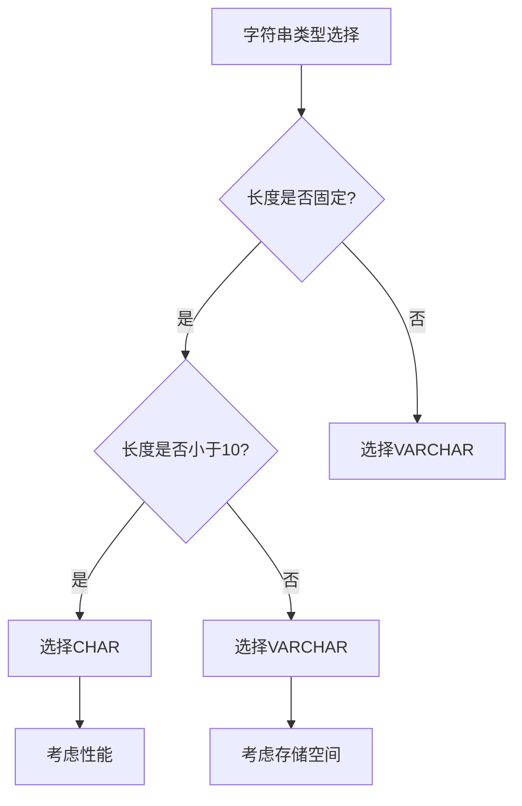

# MySQL 字符串类型详解

## 概述

MySQL的字符串类型是数据库中最常用的数据类型之一，包括固定长度字符串、可变长度字符串、文本类型和二进制类型。选择合适的字符串类型对存储空间和查询性能都有重要影响。

## 字符串类型分类

```
┌─────────────────────────────────────────────────────────────┐
│                       MySQL字符串类型                       │
├─────────────────────────────────────────────────────────────┤
│  ┌─────────────┐ ┌─────────────┐ ┌─────────────┐          │
│  │  固定长度    │ │  可变长度    │ │   文本类型   │          │
│  │   CHAR      │ │  VARCHAR    │ │    TEXT     │          │
│  └─────────────┘ └─────────────┘ └─────────────┘          │
│  ┌─────────────┐ ┌─────────────┐ ┌─────────────┐          │
│  │  二进制类型   │ │  特殊类型    │ │   其他类型   │          │
│  │   BLOB      │ │   ENUM      │ │    SET      │          │
│  └─────────────┘ └─────────────┘ └─────────────┘          │
└─────────────────────────────────────────────────────────────┘
```

## 1. 固定长度字符串（CHAR）

### 1.1 CHAR类型特点

- **固定长度**：存储时总是占用指定的字节数
- **最大长度**：255个字符
- **存储方式**：不足长度用空格填充
- **适用场景**：长度固定的字符串，如国家代码、性别等

### 1.2 CHAR类型使用示例

```sql
-- 创建用户表，使用CHAR存储固定长度字段
CREATE TABLE users (
    id INT PRIMARY KEY,
    gender CHAR(1) COMMENT '性别：M-男，F-女',
    country_code CHAR(2) COMMENT '国家代码',
    status CHAR(10) COMMENT '状态：ACTIVE, INACTIVE'
);

-- 插入数据
INSERT INTO users VALUES (1, 'M', 'CN', 'ACTIVE');
INSERT INTO users VALUES (2, 'F', 'US', 'INACTIVE');

-- 查询男性用户
SELECT * FROM users WHERE gender = 'M';
```

### 1.3 CHAR类型存储特点

```sql
-- 演示CHAR的存储特点
CREATE TABLE char_demo (
    id INT PRIMARY KEY,
    code CHAR(10)
);

-- 插入不同长度的数据
INSERT INTO char_demo VALUES (1, 'ABC');      -- 存储为 'ABC       '
INSERT INTO char_demo VALUES (2, 'ABCDEFGHIJ'); -- 存储为 'ABCDEFGHIJ'

-- 查询时注意空格处理
SELECT CONCAT('|', code, '|') FROM char_demo;
-- 结果：|ABC       |, |ABCDEFGHIJ|
```

## 2. 可变长度字符串（VARCHAR）

### 2.1 VARCHAR类型特点

- **可变长度**：只占用实际存储的字节数
- **最大长度**：65,535个字符
- **存储方式**：实际长度 + 长度前缀
- **适用场景**：长度不固定的字符串，如姓名、地址等

### 2.2 VARCHAR类型使用示例

```sql
-- 创建产品表，使用VARCHAR存储可变长度字段
CREATE TABLE products (
    id INT PRIMARY KEY,
    name VARCHAR(100) COMMENT '产品名称',
    description VARCHAR(500) COMMENT '产品描述',
    category VARCHAR(50) COMMENT '产品分类'
);

-- 插入数据
INSERT INTO products VALUES (1, 'iPhone 15', '最新款智能手机', '手机');
INSERT INTO products VALUES (2, 'MacBook Pro', '专业级笔记本电脑', '电脑');

-- 查询包含特定关键词的产品
SELECT * FROM products WHERE name LIKE '%iPhone%';
```

### 2.3 VARCHAR类型存储特点

```sql
-- 演示VARCHAR的存储特点
CREATE TABLE varchar_demo (
    id INT PRIMARY KEY,
    name VARCHAR(50)
);

-- 插入不同长度的数据
INSERT INTO varchar_demo VALUES (1, 'John');           -- 存储4个字符
INSERT INTO varchar_demo VALUES (2, 'Jane Doe');       -- 存储8个字符
INSERT INTO varchar_demo VALUES (3, 'Very Long Name'); -- 存储14个字符

-- 查询实际长度
SELECT name, LENGTH(name) as char_length FROM varchar_demo;
```

## 3. CHAR vs VARCHAR 对比

### 3.1 存储对比

| 特性 | CHAR | VARCHAR |
|------|------|---------|
| **存储方式** | 固定长度 | 可变长度 |
| **存储空间** | 固定占用 | 实际长度+1-2字节 |
| **性能** | 查询快 | 查询稍慢 |
| **适用场景** | 固定长度字符串 | 可变长度字符串 |

### 3.2 性能对比

```sql
-- 性能测试表
CREATE TABLE performance_test (
    id INT PRIMARY KEY,
    char_field CHAR(10),
    varchar_field VARCHAR(10)
);

-- 插入测试数据
INSERT INTO performance_test VALUES (1, 'TEST', 'TEST');
INSERT INTO performance_test VALUES (2, 'HELLO', 'HELLO');

-- 查询性能对比
EXPLAIN SELECT * FROM performance_test WHERE char_field = 'TEST';
EXPLAIN SELECT * FROM performance_test WHERE varchar_field = 'TEST';
```

### 3.3 选择指南



## 4. 文本类型（TEXT）

### 4.1 TEXT类型分类

| 类型 | 最大长度 | 存储空间 | 用途 |
|------|----------|----------|------|
| **TINYTEXT** | 255字符 | 1字节 | 短文本 |
| **TEXT** | 65,535字符 | 2字节 | 长文本 |
| **MEDIUMTEXT** | 16,777,215字符 | 3字节 | 中等长文本 |
| **LONGTEXT** | 4,294,967,295字符 | 4字节 | 超长文本 |

### 4.2 TEXT类型使用示例

```sql
-- 创建文章表
CREATE TABLE articles (
    id INT PRIMARY KEY,
    title VARCHAR(200),
    content TEXT COMMENT '文章内容',
    summary TINYTEXT COMMENT '文章摘要'
);

-- 插入数据
INSERT INTO articles VALUES (
    1, 
    'MySQL性能优化指南',
    '这是一篇关于MySQL性能优化的详细指南，包含了索引优化、查询优化、配置优化等多个方面的内容...',
    'MySQL性能优化的核心要点'
);

-- 查询包含特定关键词的文章
SELECT title FROM articles WHERE content LIKE '%性能优化%';
```

### 4.3 TEXT类型注意事项

```sql
-- TEXT类型不能有默认值
-- 错误的做法
CREATE TABLE wrong_example (
    id INT PRIMARY KEY,
    content TEXT DEFAULT 'default content' -- 错误
);

-- 正确的做法
CREATE TABLE correct_example (
    id INT PRIMARY KEY,
    content TEXT
);
```

## 5. 二进制类型（BLOB）

### 5.1 BLOB类型分类

| 类型 | 最大长度 | 存储空间 | 用途 |
|------|----------|----------|------|
| **TINYBLOB** | 255字节 | 1字节 | 小二进制数据 |
| **BLOB** | 65,535字节 | 2字节 | 二进制数据 |
| **MEDIUMBLOB** | 16,777,215字节 | 3字节 | 中等二进制数据 |
| **LONGBLOB** | 4,294,967,295字节 | 4字节 | 大二进制数据 |

### 5.2 BLOB类型使用示例

```sql
-- 创建文件存储表
CREATE TABLE file_storage (
    id INT PRIMARY KEY,
    filename VARCHAR(255),
    file_data MEDIUMBLOB COMMENT '文件二进制数据',
    file_size INT COMMENT '文件大小（字节）'
);

-- 插入二进制数据（实际应用中通常通过程序插入）
-- INSERT INTO file_storage VALUES (1, 'document.pdf', LOAD_FILE('/path/to/file'), 1024);
```

### 5.3 BLOB vs TEXT 对比

```sql
-- 创建对比表
CREATE TABLE comparison_table (
    id INT PRIMARY KEY,
    text_content TEXT,
    blob_content BLOB
);

-- TEXT用于文本数据，BLOB用于二进制数据
-- TEXT支持字符集，BLOB不支持
-- TEXT可以排序，BLOB排序无意义
```

## 6. 特殊字符串类型

### 6.1 ENUM类型

#### 6.1.1 ENUM基本用法

```sql
-- 创建订单状态表
CREATE TABLE orders (
    id INT PRIMARY KEY,
    status ENUM('pending', 'paid', 'shipped', 'delivered', 'cancelled') DEFAULT 'pending',
    priority ENUM('low', 'medium', 'high') DEFAULT 'medium'
);

-- 插入数据
INSERT INTO orders VALUES (1, 'paid', 'high');
INSERT INTO orders VALUES (2, 'pending', 'low');

-- 查询特定状态的订单
SELECT * FROM orders WHERE status = 'paid';
```

#### 6.1.2 ENUM类型特点

```sql
-- ENUM类型的特点
CREATE TABLE enum_demo (
    id INT PRIMARY KEY,
    color ENUM('red', 'green', 'blue')
);

-- 插入有效值
INSERT INTO enum_demo VALUES (1, 'red');

-- 插入无效值会报错或插入空值
-- INSERT INTO enum_demo VALUES (2, 'yellow'); -- 错误

-- 查询所有可能的值
SHOW COLUMNS FROM enum_demo LIKE 'color';
```

### 6.2 SET类型

#### 6.2.1 SET基本用法

```sql
-- 创建用户权限表
CREATE TABLE user_permissions (
    id INT PRIMARY KEY,
    username VARCHAR(50),
    permissions SET('read', 'write', 'delete', 'admin') DEFAULT 'read'
);

-- 插入数据
INSERT INTO user_permissions VALUES (1, 'john', 'read,write');
INSERT INTO user_permissions VALUES (2, 'admin', 'read,write,delete,admin');

-- 查询有写权限的用户
SELECT * FROM user_permissions WHERE FIND_IN_SET('write', permissions);
```

#### 6.2.2 SET类型特点

```sql
-- SET类型的特点
CREATE TABLE set_demo (
    id INT PRIMARY KEY,
    tags SET('tag1', 'tag2', 'tag3', 'tag4')
);

-- 插入多个值
INSERT INTO set_demo VALUES (1, 'tag1,tag2');
INSERT INTO set_demo VALUES (2, 'tag1,tag3,tag4');

-- 查询包含特定标签的记录
SELECT * FROM set_demo WHERE FIND_IN_SET('tag1', tags);
```

## 7. 字符串类型优化

### 7.1 存储优化

```sql
-- 选择合适的字符串类型
-- 不好的做法
CREATE TABLE bad_example (
    id INT PRIMARY KEY,
    status VARCHAR(10),    -- 应该用CHAR(1)或ENUM
    name CHAR(255),        -- 应该用VARCHAR
    description TEXT        -- 应该用VARCHAR如果长度小于65535
);

-- 好的做法
CREATE TABLE good_example (
    id INT PRIMARY KEY,
    status ENUM('active', 'inactive'),
    name VARCHAR(100),
    description VARCHAR(1000)
);
```

### 7.2 索引优化

```sql
-- 为字符串字段创建索引
CREATE INDEX idx_user_name ON users(name);
CREATE INDEX idx_product_category ON products(category);

-- 前缀索引（适用于长字符串）
CREATE INDEX idx_description ON products(description(50));

-- 复合索引
CREATE INDEX idx_name_category ON products(name, category);
```

### 7.3 查询优化

```sql
-- 使用LIKE优化
-- 不好的做法（全表扫描）
SELECT * FROM products WHERE description LIKE '%keyword%';

-- 好的做法（使用前缀匹配）
SELECT * FROM products WHERE name LIKE 'iPhone%';

-- 使用全文索引
CREATE FULLTEXT INDEX idx_content ON articles(content);
SELECT * FROM articles WHERE MATCH(content) AGAINST('MySQL');
```

## 8. 字符集和排序规则

### 8.1 字符集设置

```sql
-- 查看支持的字符集
SHOW CHARACTER SET;

-- 设置表的字符集
CREATE TABLE charset_example (
    id INT PRIMARY KEY,
    name VARCHAR(50) CHARACTER SET utf8mb4 COLLATE utf8mb4_unicode_ci
);

-- 设置数据库字符集
CREATE DATABASE mydb CHARACTER SET utf8mb4 COLLATE utf8mb4_unicode_ci;
```

### 8.2 排序规则

```sql
-- 查看排序规则
SHOW COLLATION;

-- 使用不同的排序规则
CREATE TABLE collation_example (
    id INT PRIMARY KEY,
    name VARCHAR(50) COLLATE utf8mb4_unicode_ci,  -- 不区分大小写
    code VARCHAR(50) COLLATE utf8mb4_bin          -- 区分大小写
);
```

## 9. 常见问题和解决方案

### 9.1 字符串截断

```sql
-- 问题：字符串超出长度限制
CREATE TABLE truncate_test (
    id INT PRIMARY KEY,
    name VARCHAR(5)
);

-- 插入超长字符串会截断
INSERT INTO truncate_test VALUES (1, 'Very Long Name');
-- 结果：'Very '

-- 解决方案：使用合适的长度
CREATE TABLE truncate_solution (
    id INT PRIMARY KEY,
    name VARCHAR(100)
);
```

### 9.2 性能问题

```sql
-- 问题：长字符串查询慢
SELECT * FROM large_text_table WHERE content LIKE '%keyword%';

-- 解决方案：使用全文索引
CREATE FULLTEXT INDEX idx_content ON large_text_table(content);
SELECT * FROM large_text_table WHERE MATCH(content) AGAINST('keyword');
```

### 9.3 存储空间问题

```sql
-- 问题：CHAR类型浪费空间
CREATE TABLE space_waste (
    id INT PRIMARY KEY,
    status CHAR(50)  -- 浪费空间
);

-- 解决方案：使用VARCHAR或ENUM
CREATE TABLE space_solution (
    id INT PRIMARY KEY,
    status ENUM('active', 'inactive')  -- 节省空间
);
```

## 10. 最佳实践

### 10.1 类型选择

1. **固定长度字符串**：使用CHAR（如性别、状态码）
2. **可变长度字符串**：使用VARCHAR（如姓名、地址）
3. **长文本**：使用TEXT（如文章内容）
4. **枚举值**：使用ENUM（如订单状态）
5. **多选值**：使用SET（如用户权限）

### 10.2 性能优化

1. **合理设置长度**：避免过长的字段定义
2. **使用索引**：为经常查询的字段创建索引
3. **避免LIKE '%keyword%'**：使用前缀匹配或全文索引
4. **选择合适的字符集**：使用utf8mb4支持完整Unicode

### 10.3 数据完整性

1. **使用约束**：NOT NULL、CHECK约束
2. **字符集统一**：确保所有表使用相同的字符集
3. **长度验证**：在应用层验证字符串长度
4. **特殊字符处理**：注意SQL注入和XSS攻击

## 总结

MySQL字符串类型的选择对数据库性能和存储效率至关重要：

1. **CHAR**：适用于固定长度的字符串
2. **VARCHAR**：适用于可变长度的字符串
3. **TEXT**：适用于长文本数据
4. **BLOB**：适用于二进制数据
5. **ENUM/SET**：适用于枚举和多选值

通过合理选择字符串类型，可以显著提高数据库的性能和存储效率。 