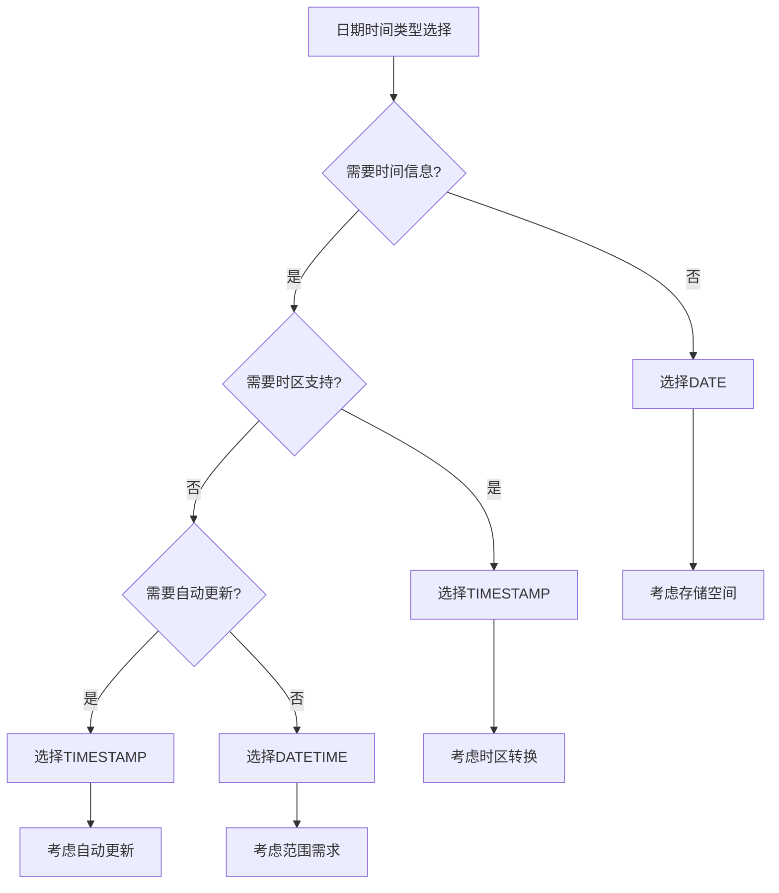

# MySQL 日期时间类型详解

## 概述

MySQL的日期时间类型用于存储日期、时间、时间戳等时间相关的数据。选择合适的日期时间类型对数据存储和查询性能都有重要影响。

## 日期时间类型分类

```
┌─────────────────────────────────────────────────────────────┐
│                     MySQL日期时间类型                       │
├─────────────────────────────────────────────────────────────┤
│  ┌─────────────┐ ┌─────────────┐ ┌─────────────┐          │
│  │   日期类型   │ │   时间类型   │ │  时间戳类型  │          │
│  │    DATE     │ │    TIME     │ │ TIMESTAMP   │          │
│  └─────────────┘ └─────────────┘ └─────────────┘          │
│  ┌─────────────┐ ┌─────────────┐ ┌─────────────┐          │
│  │ 日期时间类型 │ │   年份类型   │ │   其他类型   │          │
│  │  DATETIME   │ │    YEAR     │ │             │          │
│  └─────────────┘ └─────────────┘ └─────────────┘          │
└─────────────────────────────────────────────────────────────┘
```

## 1. 日期类型（DATE）

### 1.1 DATE类型特点

- **格式**：'YYYY-MM-DD'
- **范围**：'1000-01-01' 到 '9999-12-31'
- **存储空间**：3字节
- **用途**：存储日期，不包含时间信息

### 1.2 DATE类型使用示例

```sql
-- 创建用户生日表
CREATE TABLE user_birthdays (
    id INT PRIMARY KEY,
    name VARCHAR(50),
    birth_date DATE COMMENT '出生日期'
);

-- 插入数据
INSERT INTO user_birthdays VALUES (1, 'John', '1990-05-15');
INSERT INTO user_birthdays VALUES (2, 'Jane', '1985-12-03');
INSERT INTO user_birthdays VALUES (3, 'Bob', '1995-08-22');

-- 查询特定日期范围的用户
SELECT * FROM user_birthdays 
WHERE birth_date BETWEEN '1990-01-01' AND '1999-12-31';

-- 查询年龄大于30的用户
SELECT name, birth_date, 
       TIMESTAMPDIFF(YEAR, birth_date, CURDATE()) as age
FROM user_birthdays 
WHERE birth_date < DATE_SUB(CURDATE(), INTERVAL 30 YEAR);
```

### 1.3 DATE类型函数

```sql
-- 获取当前日期
SELECT CURDATE();
SELECT CURRENT_DATE();

-- 日期计算
SELECT DATE_ADD('2024-01-15', INTERVAL 1 DAY);  -- 加1天
SELECT DATE_SUB('2024-01-15', INTERVAL 1 MONTH); -- 减1月

-- 日期格式化
SELECT DATE_FORMAT('2024-01-15', '%Y年%m月%d日');
SELECT DATE_FORMAT('2024-01-15', '%W, %M %d, %Y');
```

## 2. 时间类型（TIME）

### 2.1 TIME类型特点

- **格式**：'HH:MM:SS' 或 'HHH:MM:SS'
- **范围**：'-838:59:59' 到 '838:59:59'
- **存储空间**：3字节
- **用途**：存储时间，不包含日期信息

### 2.2 TIME类型使用示例

```sql
-- 创建工作时间表
CREATE TABLE work_schedule (
    id INT PRIMARY KEY,
    employee_name VARCHAR(50),
    start_time TIME COMMENT '上班时间',
    end_time TIME COMMENT '下班时间'
);

-- 插入数据
INSERT INTO work_schedule VALUES (1, 'John', '09:00:00', '17:00:00');
INSERT INTO work_schedule VALUES (2, 'Jane', '08:30:00', '16:30:00');
INSERT INTO work_schedule VALUES (3, 'Bob', '10:00:00', '18:00:00');

-- 查询工作时间超过8小时的员工
SELECT employee_name, 
       TIMEDIFF(end_time, start_time) as work_hours
FROM work_schedule 
WHERE TIMEDIFF(end_time, start_time) > '08:00:00';
```

### 2.3 TIME类型函数

```sql
-- 获取当前时间
SELECT CURTIME();
SELECT CURRENT_TIME();

-- 时间计算
SELECT ADDTIME('14:30:00', '02:00:00');  -- 加2小时
SELECT SUBTIME('14:30:00', '01:30:00');  -- 减1.5小时

-- 时间格式化
SELECT TIME_FORMAT('14:30:25', '%H:%i:%s');
SELECT TIME_FORMAT('14:30:25', '%h:%i %p');  -- 12小时制
```

## 3. 日期时间类型（DATETIME）

### 3.1 DATETIME类型特点

- **格式**：'YYYY-MM-DD HH:MM:SS'
- **范围**：'1000-01-01 00:00:00' 到 '9999-12-31 23:59:59'
- **存储空间**：8字节
- **用途**：存储日期和时间

### 3.2 DATETIME类型使用示例

```sql
-- 创建订单表
CREATE TABLE orders (
    id INT PRIMARY KEY,
    customer_name VARCHAR(50),
    order_datetime DATETIME COMMENT '下单时间',
    delivery_datetime DATETIME COMMENT '预计送达时间'
);

-- 插入数据
INSERT INTO orders VALUES (1, 'John', '2024-01-15 10:30:00', '2024-01-16 14:00:00');
INSERT INTO orders VALUES (2, 'Jane', '2024-01-15 15:45:00', '2024-01-17 09:00:00');
INSERT INTO orders VALUES (3, 'Bob', '2024-01-16 08:20:00', '2024-01-18 16:00:00');

-- 查询今天的订单
SELECT * FROM orders 
WHERE DATE(order_datetime) = CURDATE();

-- 查询预计送达时间超过24小时的订单
SELECT * FROM orders 
WHERE TIMESTAMPDIFF(HOUR, order_datetime, delivery_datetime) > 24;
```

### 3.3 DATETIME类型函数

```sql
-- 获取当前日期时间
SELECT NOW();
SELECT CURRENT_TIMESTAMP();

-- 日期时间计算
SELECT DATE_ADD('2024-01-15 10:30:00', INTERVAL 1 HOUR);
SELECT DATE_SUB('2024-01-15 10:30:00', INTERVAL 30 MINUTE);

-- 提取日期或时间部分
SELECT DATE('2024-01-15 10:30:00');  -- 提取日期
SELECT TIME('2024-01-15 10:30:00');  -- 提取时间
```

## 4. 时间戳类型（TIMESTAMP）

### 4.1 TIMESTAMP类型特点

- **格式**：'YYYY-MM-DD HH:MM:SS'
- **范围**：'1970-01-01 00:00:01' 到 '2038-01-19 03:14:07'
- **存储空间**：4字节
- **特点**：自动更新，时区敏感

### 4.2 TIMESTAMP类型使用示例

```sql
-- 创建日志表
CREATE TABLE system_logs (
    id INT PRIMARY KEY,
    message VARCHAR(255),
    created_at TIMESTAMP DEFAULT CURRENT_TIMESTAMP COMMENT '创建时间',
    updated_at TIMESTAMP DEFAULT CURRENT_TIMESTAMP ON UPDATE CURRENT_TIMESTAMP COMMENT '更新时间'
);

-- 插入数据
INSERT INTO system_logs (message) VALUES ('系统启动');
INSERT INTO system_logs (message) VALUES ('用户登录');
INSERT INTO system_logs (message) VALUES ('数据备份完成');

-- 查询最近1小时的日志
SELECT * FROM system_logs 
WHERE created_at > DATE_SUB(NOW(), INTERVAL 1 HOUR);

-- 查询今天的日志
SELECT * FROM system_logs 
WHERE DATE(created_at) = CURDATE();
```

### 4.3 TIMESTAMP自动更新

```sql
-- 演示TIMESTAMP的自动更新特性
CREATE TABLE auto_update_demo (
    id INT PRIMARY KEY,
    data VARCHAR(100),
    created_at TIMESTAMP DEFAULT CURRENT_TIMESTAMP,
    updated_at TIMESTAMP DEFAULT CURRENT_TIMESTAMP ON UPDATE CURRENT_TIMESTAMP
);

-- 插入数据
INSERT INTO auto_update_demo (data) VALUES ('初始数据');

-- 更新数据（updated_at会自动更新）
UPDATE auto_update_demo SET data = '更新后的数据' WHERE id = 1;

-- 查看结果
SELECT * FROM auto_update_demo;
```

## 5. 年份类型（YEAR）

### 5.1 YEAR类型特点

- **格式**：YYYY 或 YY
- **范围**：1901 到 2155
- **存储空间**：1字节
- **用途**：存储年份信息

### 5.2 YEAR类型使用示例

```sql
-- 创建产品年份表
CREATE TABLE product_years (
    id INT PRIMARY KEY,
    product_name VARCHAR(100),
    release_year YEAR COMMENT '发布年份'
);

-- 插入数据
INSERT INTO product_years VALUES (1, 'iPhone 15', 2023);
INSERT INTO product_years VALUES (2, 'MacBook Pro', 2022);
INSERT INTO product_years VALUES (3, 'iPad Air', 2024);

-- 查询2023年发布的产品
SELECT * FROM product_years WHERE release_year = 2023;

-- 查询最近3年发布的产品
SELECT * FROM product_years 
WHERE release_year >= YEAR(CURDATE()) - 3;
```

## 6. 日期时间类型对比

### 6.1 类型对比表

| 类型 | 格式 | 范围 | 存储空间 | 时区敏感 | 自动更新 |
|------|------|------|----------|----------|----------|
| **DATE** | YYYY-MM-DD | 1000-01-01 ~ 9999-12-31 | 3字节 | 否 | 否 |
| **TIME** | HH:MM:SS | -838:59:59 ~ 838:59:59 | 3字节 | 否 | 否 |
| **DATETIME** | YYYY-MM-DD HH:MM:SS | 1000-01-01 00:00:00 ~ 9999-12-31 23:59:59 | 8字节 | 否 | 否 |
| **TIMESTAMP** | YYYY-MM-DD HH:MM:SS | 1970-01-01 00:00:01 ~ 2038-01-19 03:14:07 | 4字节 | 是 | 是 |
| **YEAR** | YYYY | 1901 ~ 2155 | 1字节 | 否 | 否 |

### 6.2 选择指南



## 7. 日期时间函数

### 7.1 获取当前时间

```sql
-- 获取当前日期时间
SELECT NOW();                    -- 当前日期时间
SELECT CURRENT_TIMESTAMP();      -- 当前时间戳
SELECT CURDATE();               -- 当前日期
SELECT CURTIME();               -- 当前时间
SELECT UNIX_TIMESTAMP();        -- 当前Unix时间戳
```

### 7.2 日期时间计算

```sql
-- 日期加减
SELECT DATE_ADD('2024-01-15', INTERVAL 1 DAY);     -- 加1天
SELECT DATE_SUB('2024-01-15', INTERVAL 1 MONTH);   -- 减1月
SELECT DATE_ADD('2024-01-15 10:30:00', INTERVAL 2 HOUR); -- 加2小时

-- 时间差计算
SELECT DATEDIFF('2024-01-20', '2024-01-15');      -- 日期差
SELECT TIMEDIFF('18:00:00', '09:00:00');          -- 时间差
SELECT TIMESTAMPDIFF(HOUR, '2024-01-15 09:00:00', '2024-01-15 18:00:00'); -- 小时差
```

### 7.3 日期时间格式化

```sql
-- 格式化函数
SELECT DATE_FORMAT('2024-01-15 10:30:00', '%Y年%m月%d日 %H时%i分');
SELECT TIME_FORMAT('10:30:00', '%H:%i %p');

-- 常用格式说明符
-- %Y: 4位年份
-- %y: 2位年份
-- %m: 月份(01-12)
-- %d: 日期(01-31)
-- %H: 24小时制(00-23)
-- %h: 12小时制(01-12)
-- %i: 分钟(00-59)
-- %s: 秒(00-59)
-- %p: AM/PM
```

## 8. 日期时间优化

### 8.1 索引优化

```sql
-- 为日期时间字段创建索引
CREATE INDEX idx_order_datetime ON orders(order_datetime);
CREATE INDEX idx_created_at ON system_logs(created_at);

-- 复合索引
CREATE INDEX idx_date_status ON orders(DATE(order_datetime), status);
```

### 8.2 查询优化

```sql
-- 优化日期范围查询
-- 不好的做法
SELECT * FROM orders WHERE YEAR(order_datetime) = 2024;

-- 好的做法
SELECT * FROM orders 
WHERE order_datetime >= '2024-01-01 00:00:00' 
AND order_datetime < '2025-01-01 00:00:00';

-- 使用函数索引（MySQL 8.0+）
CREATE INDEX idx_date_only ON orders((DATE(order_datetime)));
```

### 8.3 存储优化

```sql
-- 选择合适的日期时间类型
-- 只需要日期：使用DATE
-- 只需要时间：使用TIME
-- 需要日期时间但不需时区：使用DATETIME
-- 需要时区支持或自动更新：使用TIMESTAMP
-- 只需要年份：使用YEAR
```

## 9. 常见问题和解决方案

### 9.1 时区问题

```sql
-- 查看时区设置
SELECT @@global.time_zone, @@session.time_zone;

-- 设置时区
SET time_zone = '+08:00';
SET time_zone = 'Asia/Shanghai';

-- 时区转换
SELECT CONVERT_TZ('2024-01-15 10:30:00', '+00:00', '+08:00');
```

### 9.2 日期格式问题

```sql
-- 字符串转日期
SELECT STR_TO_DATE('15/01/2024', '%d/%m/%Y');
SELECT STR_TO_DATE('2024-01-15 10:30:00', '%Y-%m-%d %H:%i:%s');

-- 日期转字符串
SELECT DATE_FORMAT('2024-01-15', '%Y年%m月%d日');
```

### 9.3 性能问题

```sql
-- 问题：使用函数查询导致索引失效
SELECT * FROM orders WHERE DATE(order_datetime) = CURDATE();

-- 解决方案：使用范围查询
SELECT * FROM orders 
WHERE order_datetime >= CURDATE() 
AND order_datetime < DATE_ADD(CURDATE(), INTERVAL 1 DAY);
```

## 10. 最佳实践

### 10.1 类型选择

1. **DATE**：只存储日期，如生日、创建日期
2. **TIME**：只存储时间，如工作时间、会议时间
3. **DATETIME**：存储日期时间，如订单时间、日志时间
4. **TIMESTAMP**：需要时区支持或自动更新的场景
5. **YEAR**：只存储年份，如产品发布年份

### 10.2 性能优化

1. **避免在WHERE子句中使用函数**：会导致索引失效
2. **使用范围查询**：比使用函数查询更高效
3. **合理使用索引**：为经常查询的日期时间字段创建索引
4. **选择合适的数据类型**：根据实际需求选择最小够用的类型

### 10.3 数据完整性

1. **使用约束**：NOT NULL、CHECK约束
2. **时区统一**：确保所有服务器使用相同的时区设置
3. **格式验证**：在应用层验证日期时间格式
4. **范围检查**：确保日期时间在合理范围内

## 总结

MySQL日期时间类型的选择对数据存储和查询性能至关重要：

1. **DATE**：适用于只存储日期的场景
2. **TIME**：适用于只存储时间的场景
3. **DATETIME**：适用于存储日期时间的场景
4. **TIMESTAMP**：适用于需要时区支持或自动更新的场景
5. **YEAR**：适用于只存储年份的场景

通过合理选择日期时间类型，可以显著提高数据库的性能和数据完整性。 

**[返回目录 README.md](./README?id=_2-mysql-数据类型)**