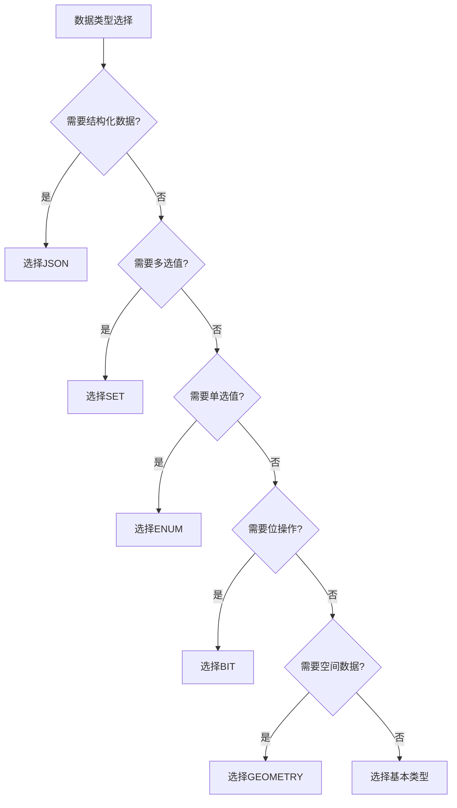

# MySQL 其他数据类型详解

## 概述

MySQL除了基本的数值、字符串、日期时间类型外，还提供了其他特殊的数据类型，包括ENUM、SET、JSON等。这些类型在特定场景下可以提供更好的性能和功能。

## 其他类型分类

```
┌─────────────────────────────────────────────────────────────┐
│                      MySQL其他类型                          │
├─────────────────────────────────────────────────────────────┤
│  ┌─────────────┐ ┌─────────────┐ ┌─────────────┐          │
│  │   枚举类型   │ │   集合类型   │ │   JSON类型   │          │
│  │    ENUM     │ │     SET     │ │    JSON     │          │
│  └─────────────┘ └─────────────┘ └─────────────┘          │
│  ┌─────────────┐ ┌─────────────┐ ┌─────────────┐          │
│  │   位类型     │ │   空间类型   │ │   其他类型   │          │
│  │    BIT      │ │  GEOMETRY   │ │   Others    │          │
│  └─────────────┘ └─────────────┘ └─────────────┘          │
└─────────────────────────────────────────────────────────────┘
```

## 1. 枚举类型（ENUM）

### 1.1 ENUM类型特点

- **存储空间**：1-2字节（取决于枚举值数量）
- **最大数量**：65,535个不同的枚举值
- **特点**：只能存储预定义的值
- **用途**：状态值、分类等固定选项

### 1.2 ENUM类型使用示例

```sql
-- 创建订单状态表
CREATE TABLE orders (
    id INT PRIMARY KEY,
    customer_name VARCHAR(50),
    status ENUM('pending', 'paid', 'shipped', 'delivered', 'cancelled') DEFAULT 'pending',
    priority ENUM('low', 'medium', 'high') DEFAULT 'medium'
);

-- 插入数据
INSERT INTO orders VALUES (1, 'John', 'paid', 'high');
INSERT INTO orders VALUES (2, 'Jane', 'pending', 'low');
INSERT INTO orders VALUES (3, 'Bob', 'shipped', 'medium');

-- 查询特定状态的订单
SELECT * FROM orders WHERE status = 'paid';

-- 查询高优先级订单
SELECT * FROM orders WHERE priority = 'high';
```

### 1.3 ENUM类型操作

```sql
-- 查看ENUM的所有可能值
SHOW COLUMNS FROM orders LIKE 'status';

-- 查询ENUM的索引值
SELECT status, status + 0 FROM orders;

-- 使用ENUM进行排序
SELECT * FROM orders ORDER BY status;

-- 统计各状态订单数量
SELECT status, COUNT(*) as count 
FROM orders 
GROUP BY status;
```

## 2. 集合类型（SET）

### 2.1 SET类型特点

- **存储空间**：1-8字节（取决于集合成员数量）
- **最大成员**：64个不同的成员
- **特点**：可以存储多个预定义值的组合
- **用途**：多选值、标签、权限等

### 2.2 SET类型使用示例

```sql
-- 创建用户权限表
CREATE TABLE user_permissions (
    id INT PRIMARY KEY,
    username VARCHAR(50),
    permissions SET('read', 'write', 'delete', 'admin') DEFAULT 'read'
);

-- 插入数据
INSERT INTO user_permissions VALUES (1, 'john', 'read,write');
INSERT INTO user_permissions VALUES (2, 'admin', 'read,write,delete,admin');
INSERT INTO user_permissions VALUES (3, 'guest', 'read');

-- 查询有写权限的用户
SELECT * FROM user_permissions WHERE FIND_IN_SET('write', permissions);

-- 查询有管理员权限的用户
SELECT * FROM user_permissions WHERE FIND_IN_SET('admin', permissions);
```

### 2.3 SET类型操作

```sql
-- 查看SET的所有可能值
SHOW COLUMNS FROM user_permissions LIKE 'permissions';

-- 查询SET的数值表示
SELECT permissions, permissions + 0 FROM user_permissions;

-- 使用位操作查询
SELECT * FROM user_permissions WHERE permissions & 2; -- 检查是否有write权限

-- 添加权限
UPDATE user_permissions 
SET permissions = CONCAT(permissions, ',admin') 
WHERE username = 'john';

-- 移除权限
UPDATE user_permissions 
SET permissions = REPLACE(permissions, 'admin,', '') 
WHERE username = 'john';
```

## 3. JSON类型

### 3.1 JSON类型特点

- **存储空间**：可变长度
- **特点**：存储结构化数据，支持JSON操作
- **用途**：配置数据、复杂数据结构、API数据

### 3.2 JSON类型使用示例

```sql
-- 创建用户配置表
CREATE TABLE user_configs (
    id INT PRIMARY KEY,
    username VARCHAR(50),
    settings JSON COMMENT '用户设置'
);

-- 插入JSON数据
INSERT INTO user_configs VALUES (1, 'john', '{
    "theme": "dark",
    "language": "en",
    "notifications": {
        "email": true,
        "sms": false,
        "push": true
    },
    "preferences": {
        "timezone": "UTC+8",
        "currency": "USD"
    }
}');

INSERT INTO user_configs VALUES (2, 'jane', '{
    "theme": "light",
    "language": "zh",
    "notifications": {
        "email": false,
        "sms": true,
        "push": true
    }
}');
```

### 3.3 JSON类型操作

```sql
-- 查询JSON字段
SELECT username, settings FROM user_configs;

-- 提取JSON中的值
SELECT username, 
       JSON_EXTRACT(settings, '$.theme') as theme,
       JSON_EXTRACT(settings, '$.language') as language
FROM user_configs;

-- 使用->操作符（MySQL 5.7+）
SELECT username, 
       settings->'$.theme' as theme,
       settings->'$.notifications.email' as email_notifications
FROM user_configs;

-- 查询特定主题的用户
SELECT username FROM user_configs 
WHERE JSON_EXTRACT(settings, '$.theme') = 'dark';

-- 更新JSON数据
UPDATE user_configs 
SET settings = JSON_SET(settings, '$.theme', 'blue') 
WHERE username = 'john';
```

## 4. 位类型（BIT）

### 4.1 BIT类型特点

- **存储空间**：1-8字节
- **范围**：1-64位
- **特点**：存储位值，节省存储空间
- **用途**：标志位、权限位、状态位

### 4.2 BIT类型使用示例

```sql
-- 创建用户标志表
CREATE TABLE user_flags (
    id INT PRIMARY KEY,
    username VARCHAR(50),
    flags BIT(8) COMMENT '用户标志位：1=激活, 2=VIP, 4=管理员, 8=禁用'
);

-- 插入数据
INSERT INTO user_flags VALUES (1, 'john', b'00000011'); -- 激活+VIP
INSERT INTO user_flags VALUES (2, 'admin', b'00000101'); -- 激活+管理员
INSERT INTO user_flags VALUES (3, 'guest', b'00001000'); -- 禁用

-- 查询激活用户
SELECT * FROM user_flags WHERE flags & 1;

-- 查询VIP用户
SELECT * FROM user_flags WHERE flags & 2;

-- 查询管理员
SELECT * FROM user_flags WHERE flags & 4;
```

## 5. 空间类型（GEOMETRY）

### 5.1 空间类型分类

| 类型 | 说明 | 用途 |
|------|------|------|
| **GEOMETRY** | 几何类型基类 | 通用几何对象 |
| **POINT** | 点 | 位置坐标 |
| **LINESTRING** | 线 | 路径、边界 |
| **POLYGON** | 面 | 区域、多边形 |
| **MULTIPOINT** | 多点 | 多个位置 |
| **MULTILINESTRING** | 多线 | 多条路径 |
| **MULTIPOLYGON** | 多面 | 多个区域 |

### 5.2 空间类型使用示例

```sql
-- 创建位置表
CREATE TABLE locations (
    id INT PRIMARY KEY,
    name VARCHAR(100),
    position POINT NOT NULL,
    SPATIAL INDEX(position)
);

-- 插入位置数据
INSERT INTO locations VALUES (1, 'Office', POINT(116.3974, 39.9093));
INSERT INTO locations VALUES (2, 'Home', POINT(116.4000, 39.9100));
INSERT INTO locations VALUES (3, 'Park', POINT(116.3950, 39.9080));

-- 查询距离特定点1000米内的位置
SELECT name, 
       ST_Distance(position, POINT(116.3974, 39.9093)) as distance
FROM locations
WHERE ST_Distance(position, POINT(116.3974, 39.9093)) < 1000;
```

## 6. 类型选择指南

### 6.1 选择原则



### 6.2 性能考虑

| 类型 | 存储效率 | 查询性能 | 索引支持 | 推荐用途 |
|------|----------|----------|----------|----------|
| **ENUM** | 高 | 高 | 好 | 状态值、分类 |
| **SET** | 高 | 中等 | 中等 | 多选值、标签 |
| **JSON** | 中等 | 中等 | 部分 | 复杂数据、配置 |
| **BIT** | 最高 | 高 | 好 | 标志位、权限 |
| **GEOMETRY** | 中等 | 中等 | 特殊 | 空间数据 |

## 7. 最佳实践

### 7.1 ENUM最佳实践

```sql
-- 好的做法：使用ENUM存储状态
CREATE TABLE orders (
    id INT PRIMARY KEY,
    status ENUM('pending', 'paid', 'shipped', 'delivered')
);

-- 避免的做法：使用VARCHAR存储状态
CREATE TABLE orders_bad (
    id INT PRIMARY KEY,
    status VARCHAR(20) -- 浪费空间，容易出错
);
```

### 7.2 SET最佳实践

```sql
-- 好的做法：使用SET存储权限
CREATE TABLE user_permissions (
    id INT PRIMARY KEY,
    permissions SET('read', 'write', 'delete', 'admin')
);

-- 避免的做法：使用多个BOOLEAN字段
CREATE TABLE user_permissions_bad (
    id INT PRIMARY KEY,
    can_read BOOLEAN,
    can_write BOOLEAN,
    can_delete BOOLEAN,
    is_admin BOOLEAN
);
```

### 7.3 JSON最佳实践

```sql
-- 好的做法：使用JSON存储配置
CREATE TABLE user_configs (
    id INT PRIMARY KEY,
    settings JSON
);

-- 避免的做法：使用多个字段存储配置
CREATE TABLE user_configs_bad (
    id INT PRIMARY KEY,
    theme VARCHAR(20),
    language VARCHAR(10),
    timezone VARCHAR(20),
    currency VARCHAR(10)
);
```

## 总结

MySQL的其他数据类型为特定场景提供了高效的解决方案：

1. **ENUM**：适用于固定选项的单选值
2. **SET**：适用于多选值场景
3. **JSON**：适用于复杂结构化数据
4. **BIT**：适用于标志位和位操作
5. **GEOMETRY**：适用于空间数据

通过合理选择这些特殊类型，可以显著提高数据库的性能和存储效率。 

**[返回目录 README.md](./README.md)**