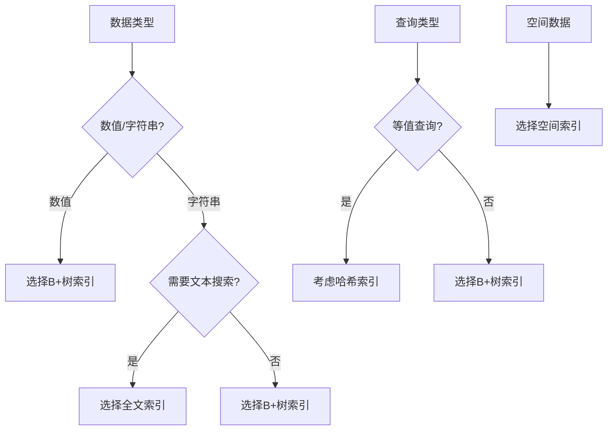

# MySQL 索引类型详解

## 概述

索引是MySQL中提高查询性能的重要机制，它通过建立数据结构来加速数据的检索。MySQL支持多种索引类型，每种类型都有其特定的用途和适用场景。

## 索引类型总览

```
┌─────────────────────────────────────────────────────────────┐
│                        MySQL索引类型                        │
├─────────────────────────────────────────────────────────────┤
│  ┌─────────────┐ ┌─────────────┐ ┌─────────────┐          │
│  │   B+树索引   │ │   哈希索引   │ │   全文索引   │          │
│  │  B+Tree     │ │   Hash      │ │  Fulltext   │          │
│  └─────────────┘ └─────────────┘ └─────────────┘          │
│  ┌─────────────┐ ┌─────────────┐ ┌─────────────┐          │
│  │   空间索引   │ │   R树索引    │ │   其他索引   │          │
│  │  Spatial    │ │   R-Tree    │ │   Others    │          │
│  └─────────────┘ └─────────────┘ └─────────────┘          │
└─────────────────────────────────────────────────────────────┘
```

## 1. B+树索引（B+Tree Index）

### 概述

B+树索引是MySQL中最常用的索引类型，几乎所有存储引擎都支持。它具有良好的平衡性和查询性能。

### B+树结构

```
                    ┌─────────────┐
                    │     10      │
                    └─────┬───────┘
                          │
        ┌─────────────────┼─────────────────┐
        │                 │                 │
    ┌───▼───┐         ┌───▼───┐         ┌───▼───┐
    │ 3,5,7 │         │12,15,18│         │22,25,28│
    └───────┘         └───────┘         └───────┘
        │                 │                 │
    ┌───▼───┐         ┌───▼───┐         ┌───▼───┐
    │ 叶子节点 │         │ 叶子节点 │         │ 叶子节点 │
    │ 3,5,7 │         │12,15,18│         │22,25,28│
    └───────┘         └───────┘         └───────┘
```

### 特点

- **平衡树结构**：所有叶子节点在同一层
- **范围查询高效**：支持范围查询和排序
- **插入删除平衡**：自动维护树的平衡性
- **磁盘友好**：减少磁盘I/O次数

### 创建B+树索引

```sql
-- 创建单列索引
CREATE INDEX idx_name ON users(name);

-- 创建复合索引
CREATE INDEX idx_name_age ON users(name, age);

-- 创建唯一索引
CREATE UNIQUE INDEX idx_email ON users(email);
```

### 查询示例

```sql
-- 等值查询
SELECT * FROM users WHERE name = 'John';

-- 范围查询
SELECT * FROM users WHERE age BETWEEN 18 AND 30;

-- 前缀查询
SELECT * FROM users WHERE name LIKE 'John%';

-- 排序查询
SELECT * FROM users ORDER BY name;
```

## 2. 哈希索引（Hash Index）

### 概述

哈希索引基于哈希表实现，提供O(1)的查找复杂度，但只支持等值查询，不支持范围查询。

### 哈希表结构

```
┌─────────────────────────────────────────────────────────────┐
│                        哈希表                               │
├─────────────────────────────────────────────────────────────┤
│ 哈希值 │ 数据指针 │ 哈希值 │ 数据指针 │ 哈希值 │ 数据指针 │
├─────────────────────────────────────────────────────────────┤
│ 0x1234 │ ->数据1  │ 0x5678 │ ->数据2  │ 0x9abc │ ->数据3  │
└─────────────────────────────────────────────────────────────┘
```

### 特点

- **查找速度快**：O(1)时间复杂度
- **只支持等值查询**：不支持范围查询和排序
- **内存占用大**：需要存储哈希表
- **冲突处理**：需要处理哈希冲突

### 使用场景

```sql
-- Memory引擎默认使用哈希索引
CREATE TABLE hash_table (
    id INT PRIMARY KEY,
    name VARCHAR(50)
) ENGINE=MEMORY;

-- 查询示例
SELECT * FROM hash_table WHERE id = 100;
```

### 哈希索引限制

```sql
-- 不支持范围查询
SELECT * FROM hash_table WHERE id > 100; -- 无法使用哈希索引

-- 不支持排序
SELECT * FROM hash_table ORDER BY id; -- 无法使用哈希索引
```

## 3. 全文索引（Fulltext Index）

### 概述

全文索引用于文本搜索，支持自然语言搜索和布尔搜索模式。

### 全文索引结构

```
┌─────────────────────────────────────────────────────────────┐
│                        全文索引                             │
├─────────────────────────────────────────────────────────────┤
│ 关键词 │ 文档ID列表 │ 位置信息 │ 权重 │
├─────────────────────────────────────────────────────────────┤
│ MySQL  │ [1,3,5]   │ [pos1,pos2] │ 0.8 │
│ Database│ [2,4,6]  │ [pos3,pos4] │ 0.9 │
└─────────────────────────────────────────────────────────────┘
```

### 创建全文索引

```sql
-- 创建全文索引
CREATE TABLE articles (
    id INT PRIMARY KEY,
    title VARCHAR(200),
    content TEXT,
    FULLTEXT(title, content)
) ENGINE=InnoDB;

-- 或者为现有表添加全文索引
ALTER TABLE articles ADD FULLTEXT(title, content);
```

### 全文搜索模式

#### 3.1 自然语言搜索

```sql
-- 自然语言搜索
SELECT * FROM articles 
WHERE MATCH(title, content) AGAINST('MySQL database' IN NATURAL LANGUAGE MODE);

-- 相关性排序
SELECT *, MATCH(title, content) AGAINST('MySQL database') AS relevance
FROM articles 
WHERE MATCH(title, content) AGAINST('MySQL database')
ORDER BY relevance DESC;
```

#### 3.2 布尔搜索

```sql
-- 布尔搜索
SELECT * FROM articles 
WHERE MATCH(title, content) AGAINST('+MySQL -Oracle' IN BOOLEAN MODE);

-- 布尔搜索操作符
-- +word: 必须包含
-- -word: 不能包含
-- word*: 通配符
-- "phrase": 短语搜索
```

### 全文索引配置

```sql
-- 查看全文索引配置
SHOW VARIABLES LIKE 'ft_%';

-- 重要配置参数
ft_min_word_len = 3        -- 最小词长度
ft_max_word_len = 84       -- 最大词长度
ft_stopword_file = ''      -- 停用词文件
```

## 4. 空间索引（Spatial Index）

### 概述

空间索引用于地理数据查询，支持点、线、面等几何对象的空间查询。

### 空间数据类型

```sql
-- 创建空间表
CREATE TABLE locations (
    id INT PRIMARY KEY,
    name VARCHAR(100),
    location POINT NOT NULL,
    SPATIAL INDEX(location)
);

-- 插入空间数据
INSERT INTO locations (name, location) 
VALUES ('Office', POINT(116.3974, 39.9093));
```

### 空间查询

```sql
-- 距离查询
SELECT name, ST_Distance(location, POINT(116.4, 39.9)) AS distance
FROM locations
WHERE ST_Distance(location, POINT(116.4, 39.9)) < 1000;

-- 包含查询
SELECT * FROM locations 
WHERE ST_Contains(POLYGON(...), location);

-- 相交查询
SELECT * FROM locations 
WHERE ST_Intersects(location, LINESTRING(...));
```

### 空间索引类型

```sql
-- R树索引（默认）
CREATE SPATIAL INDEX idx_location ON locations(location);

-- 查看空间索引
SHOW INDEX FROM locations;
```

## 5. R树索引（R-Tree Index）

### 概述

R树索引是空间索引的底层实现，用于多维数据的索引。

### R树结构

```
                    ┌─────────────┐
                    │   根节点     │
                    │ [MBR1,MBR2] │
                    └─────┬───────┘
                          │
        ┌─────────────────┼─────────────────┐
        │                 │                 │
    ┌───▼───┐         ┌───▼───┐         ┌───▼───┐
    │ 子节点1 │         │ 子节点2 │         │ 子节点3 │
    │ [MBR]  │         │ [MBR]  │         │ [MBR]  │
    └───────┘         └───────┘         └───────┘
```

### 使用场景

- 地理信息系统（GIS）
- 图像数据库
- 多维数据查询

## 索引类型对比

| 特性 | B+树索引 | 哈希索引 | 全文索引 | 空间索引 |
|------|----------|----------|----------|----------|
| **查询类型** | 等值、范围、排序 | 仅等值 | 文本搜索 | 空间查询 |
| **时间复杂度** | O(log n) | O(1) | O(log n) | O(log n) |
| **存储引擎支持** | 所有引擎 | Memory | InnoDB, MyISAM | InnoDB, MyISAM |
| **内存占用** | 中等 | 高 | 中等 | 中等 |
| **维护成本** | 中等 | 低 | 高 | 高 |

## 索引选择指南

### 选择标准



### 性能考虑

```sql
-- 索引选择性
SELECT COUNT(DISTINCT column_name) / COUNT(*) AS selectivity
FROM table_name;

-- 索引使用情况
EXPLAIN SELECT * FROM table_name WHERE indexed_column = 'value';

-- 索引大小
SELECT 
    table_name,
    index_name,
    ROUND(stat_value * @@innodb_page_size / 1024 / 1024, 2) AS size_mb
FROM mysql.innodb_index_stats 
WHERE stat_name = 'size';
```

## 最佳实践

### 1. B+树索引最佳实践

```sql
-- 选择高选择性的列
CREATE INDEX idx_email ON users(email);

-- 复合索引最左前缀
CREATE INDEX idx_name_age_city ON users(name, age, city);

-- 避免在低选择性列上建索引
-- 避免在性别列上建索引，因为选择性太低
```

### 2. 全文索引最佳实践

```sql
-- 设置合适的最小词长度
SET GLOBAL ft_min_word_len = 3;

-- 使用停用词
-- 创建停用词文件，提高搜索效率

-- 定期优化全文索引
OPTIMIZE TABLE articles;
```

### 3. 空间索引最佳实践

```sql
-- 使用合适的空间数据类型
-- POINT: 点
-- LINESTRING: 线
-- POLYGON: 面

-- 设置合适的空间参考系统
-- SRID: 空间参考系统ID
```

## 监控和维护

### 索引使用监控

```sql
-- 查看索引使用情况
SHOW INDEX FROM table_name;

-- 查看索引统计信息
SELECT * FROM information_schema.statistics 
WHERE table_schema = 'database_name' 
AND table_name = 'table_name';
```

### 索引维护

```sql
-- 重建索引
ALTER TABLE table_name DROP INDEX index_name;
ALTER TABLE table_name ADD INDEX index_name(column_name);

-- 分析表统计信息
ANALYZE TABLE table_name;

-- 优化表
OPTIMIZE TABLE table_name;
```

## 总结

选择合适的索引类型对MySQL性能至关重要：

1. **B+树索引**：最通用的索引类型，支持多种查询
2. **哈希索引**：等值查询性能最佳，但功能有限
3. **全文索引**：文本搜索的专用索引
4. **空间索引**：地理数据查询的专用索引

理解各种索引类型的特点和适用场景，有助于设计高效的数据库索引策略。 