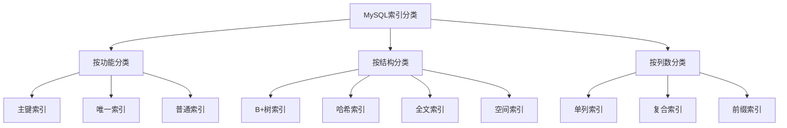
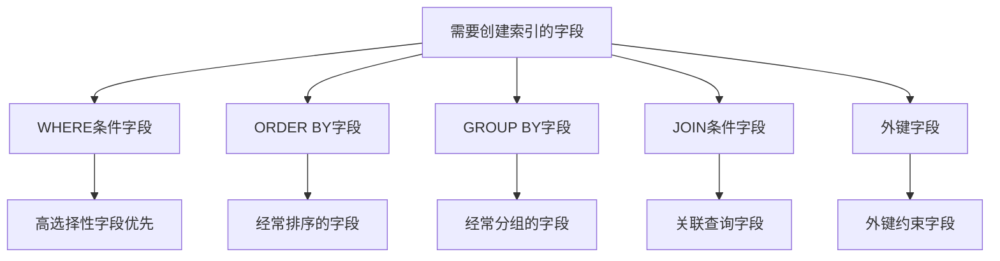

# MySQL 索引分类详解

## 概述

MySQL中的索引按照不同的分类标准可以分为多种类型。本章节将详细介绍各种索引分类的特点、使用场景和最佳实践。

## 索引分类体系



## 1. 主键索引（Primary Key Index）

### 1.1 特点

- **唯一性**：每个表只能有一个主键索引
- **非空性**：主键列不能包含NULL值
- **自动创建**：创建主键时自动创建索引
- **聚簇索引**：InnoDB中主键索引通常是聚簇索引

### 1.2 创建方式

```sql
-- 方式1：创建表时指定主键
CREATE TABLE users (
    id INT PRIMARY KEY,
    name VARCHAR(50),
    email VARCHAR(100)
);

-- 方式2：创建表后添加主键
CREATE TABLE users (
    id INT,
    name VARCHAR(50),
    email VARCHAR(100)
);
ALTER TABLE users ADD PRIMARY KEY (id);

-- 方式3：复合主键
CREATE TABLE order_items (
    order_id INT,
    product_id INT,
    quantity INT,
    PRIMARY KEY (order_id, product_id)
);
```

### 1.3 使用场景

- **用户表**：用户ID作为主键
- **订单表**：订单号作为主键
- **商品表**：商品ID作为主键

### 1.4 最佳实践

```sql
-- 推荐：使用自增ID作为主键
CREATE TABLE users (
    id INT AUTO_INCREMENT PRIMARY KEY,
    username VARCHAR(50) UNIQUE,
    email VARCHAR(100)
);

-- 避免：使用业务字段作为主键（除非有特殊需求）
CREATE TABLE users (
    email VARCHAR(100) PRIMARY KEY,  -- 不推荐
    username VARCHAR(50)
);
```

## 2. 唯一索引（Unique Index）

### 2.1 特点

- **唯一性**：索引列的值必须唯一
- **允许NULL**：唯一索引可以包含NULL值（多个NULL值被视为不同）
- **性能优化**：提供快速查找和约束检查

### 2.2 创建方式

```sql
-- 方式1：创建表时指定唯一索引
CREATE TABLE users (
    id INT PRIMARY KEY,
    email VARCHAR(100) UNIQUE,
    username VARCHAR(50) UNIQUE
);

-- 方式2：创建表后添加唯一索引
CREATE TABLE users (
    id INT PRIMARY KEY,
    email VARCHAR(100),
    username VARCHAR(50)
);
ALTER TABLE users ADD UNIQUE INDEX idx_email (email);
ALTER TABLE users ADD UNIQUE INDEX idx_username (username);

-- 方式3：复合唯一索引
CREATE TABLE user_roles (
    user_id INT,
    role_id INT,
    UNIQUE KEY uk_user_role (user_id, role_id)
);
```

### 2.3 使用场景

- **邮箱地址**：确保邮箱唯一性
- **用户名**：确保用户名唯一性
- **手机号**：确保手机号唯一性
- **身份证号**：确保身份证号唯一性

### 2.4 最佳实践

```sql
-- 推荐：为唯一字段创建唯一索引
CREATE TABLE users (
    id INT AUTO_INCREMENT PRIMARY KEY,
    email VARCHAR(100) UNIQUE,
    phone VARCHAR(20) UNIQUE,
    username VARCHAR(50) UNIQUE
);

-- 注意：唯一索引对性能的影响
-- 插入和更新时需要检查唯一性约束
INSERT INTO users (email, username) VALUES ('test@example.com', 'testuser');
-- 如果email已存在，会抛出唯一性约束错误
```

## 3. 普通索引（Normal Index）

### 3.1 特点

- **允许重复**：索引列可以包含重复值
- **提高查询性能**：加速WHERE、ORDER BY、GROUP BY操作
- **占用空间**：索引会占用额外的存储空间

### 3.2 创建方式

```sql
-- 方式1：创建表时指定索引
CREATE TABLE orders (
    id INT PRIMARY KEY,
    user_id INT,
    order_date DATE,
    INDEX idx_user_id (user_id),
    INDEX idx_order_date (order_date)
);

-- 方式2：创建表后添加索引
CREATE TABLE orders (
    id INT PRIMARY KEY,
    user_id INT,
    order_date DATE
);
ALTER TABLE orders ADD INDEX idx_user_id (user_id);
ALTER TABLE orders ADD INDEX idx_order_date (order_date);

-- 方式3：使用CREATE INDEX语句
CREATE INDEX idx_user_id ON orders (user_id);
CREATE INDEX idx_order_date ON orders (order_date);
```

### 3.3 使用场景

- **外键字段**：关联查询优化
- **查询条件字段**：WHERE子句中经常使用的字段
- **排序字段**：ORDER BY子句中使用的字段
- **分组字段**：GROUP BY子句中使用的字段

### 3.4 最佳实践

```sql
-- 推荐：为查询条件创建索引
CREATE TABLE products (
    id INT PRIMARY KEY,
    category_id INT,
    price DECIMAL(10,2),
    created_at TIMESTAMP,
    INDEX idx_category_price (category_id, price),
    INDEX idx_created_at (created_at)
);

-- 查询优化示例
SELECT * FROM products 
WHERE category_id = 1 AND price > 100 
ORDER BY created_at DESC;
-- 使用idx_category_price索引进行过滤
-- 使用idx_created_at索引进行排序
```

## 4. 复合索引（Composite Index）

### 4.1 特点

- **多列组合**：包含多个列的索引
- **最左前缀**：遵循最左前缀匹配原则
- **选择性优化**：高选择性列放在前面

### 4.2 创建方式

```sql
-- 方式1：创建表时指定复合索引
CREATE TABLE orders (
    id INT PRIMARY KEY,
    user_id INT,
    status VARCHAR(20),
    created_at TIMESTAMP,
    INDEX idx_user_status (user_id, status),
    INDEX idx_status_created (status, created_at)
);

-- 方式2：创建表后添加复合索引
CREATE TABLE orders (
    id INT PRIMARY KEY,
    user_id INT,
    status VARCHAR(20),
    created_at TIMESTAMP
);
ALTER TABLE orders ADD INDEX idx_user_status (user_id, status);
```

### 4.3 最左前缀原则

```sql
-- 创建复合索引
CREATE INDEX idx_user_status_created ON orders (user_id, status, created_at);

-- 可以使用索引的查询
SELECT * FROM orders WHERE user_id = 1;                    -- ✓ 使用索引
SELECT * FROM orders WHERE user_id = 1 AND status = 'paid'; -- ✓ 使用索引
SELECT * FROM orders WHERE user_id = 1 AND status = 'paid' AND created_at > '2023-01-01'; -- ✓ 使用索引

-- 不能使用索引的查询
SELECT * FROM orders WHERE status = 'paid';                -- ✗ 不使用索引
SELECT * FROM orders WHERE created_at > '2023-01-01';     -- ✗ 不使用索引
SELECT * FROM orders WHERE status = 'paid' AND created_at > '2023-01-01'; -- ✗ 不使用索引
```

### 4.4 列顺序优化

```sql
-- 推荐：高选择性列在前
CREATE INDEX idx_status_user ON orders (status, user_id);
-- status的选择性通常比user_id低，但查询模式决定顺序

-- 分析查询模式
SELECT COUNT(DISTINCT status) FROM orders;      -- 假设有5个状态
SELECT COUNT(DISTINCT user_id) FROM orders;    -- 假设有1000个用户

-- 根据实际查询需求调整顺序
-- 如果经常按status查询，则status在前
-- 如果经常按user_id查询，则user_id在前
```

### 4.5 使用场景

- **多条件查询**：WHERE子句包含多个条件
- **排序优化**：ORDER BY包含多个字段
- **分组优化**：GROUP BY包含多个字段

## 5. 前缀索引（Prefix Index）

### 5.1 特点

- **部分索引**：只索引字符串的前几个字符
- **节省空间**：减少索引存储空间
- **降低选择性**：可能影响查询性能

### 5.2 创建方式

```sql
-- 方式1：创建表时指定前缀索引
CREATE TABLE users (
    id INT PRIMARY KEY,
    email VARCHAR(100),
    INDEX idx_email_prefix (email(10))  -- 只索引前10个字符
);

-- 方式2：创建表后添加前缀索引
CREATE TABLE users (
    id INT PRIMARY KEY,
    email VARCHAR(100)
);
ALTER TABLE users ADD INDEX idx_email_prefix (email(10));
```

### 5.3 前缀长度选择

```sql
-- 分析前缀选择性
SELECT 
    COUNT(DISTINCT LEFT(email, 5)) as prefix_5,
    COUNT(DISTINCT LEFT(email, 10)) as prefix_10,
    COUNT(DISTINCT LEFT(email, 15)) as prefix_15,
    COUNT(DISTINCT email) as total
FROM users;

-- 计算选择性
-- prefix_5 / total = 5字符前缀的选择性
-- prefix_10 / total = 10字符前缀的选择性
-- prefix_15 / total = 15字符前缀的选择性

-- 选择选择性接近1的前缀长度
```

### 5.4 使用场景

- **长字符串字段**：邮箱、URL、文件路径等
- **空间受限**：索引空间有限的情况
- **查询模式**：主要按前缀查询的场景

### 5.5 最佳实践

```sql
-- 推荐：为长字符串创建前缀索引
CREATE TABLE articles (
    id INT PRIMARY KEY,
    title VARCHAR(200),
    content TEXT,
    INDEX idx_title_prefix (title(20))  -- 标题前20个字符
);

-- 查询示例
SELECT * FROM articles WHERE title LIKE 'MySQL%';  -- 使用前缀索引
SELECT * FROM articles WHERE title LIKE '%MySQL%'; -- 不使用前缀索引
```

## 6. 索引选择策略

### 6.1 索引选择原则



### 6.2 索引选择性分析

```sql
-- 分析字段的选择性
SELECT 
    column_name,
    COUNT(DISTINCT column_value) as distinct_count,
    COUNT(*) as total_count,
    COUNT(DISTINCT column_value) / COUNT(*) as selectivity
FROM (
    SELECT 'user_id' as column_name, user_id as column_value FROM orders
    UNION ALL
    SELECT 'status' as column_name, status as column_value FROM orders
    UNION ALL
    SELECT 'created_at' as column_name, DATE(created_at) as column_value FROM orders
) t
GROUP BY column_name;

-- 选择性越高，索引效果越好
-- 选择性 = 不同值的数量 / 总记录数
```

### 6.3 索引维护

```sql
-- 查看表的索引信息
SHOW INDEX FROM orders;

-- 分析索引使用情况
SELECT 
    table_name,
    index_name,
    column_name,
    cardinality
FROM information_schema.statistics 
WHERE table_schema = 'your_database' 
AND table_name = 'orders';

-- 重建索引
ALTER TABLE orders DROP INDEX idx_user_status;
ALTER TABLE orders ADD INDEX idx_user_status (user_id, status);
```

## 7. 索引优化建议

### 7.1 避免过度索引

```sql
-- 不推荐：为每个字段都创建索引
CREATE TABLE users (
    id INT PRIMARY KEY,
    name VARCHAR(50),
    email VARCHAR(100),
    phone VARCHAR(20),
    INDEX idx_name (name),      -- 可能不需要
    INDEX idx_email (email),    -- 需要
    INDEX idx_phone (phone)     -- 可能不需要
);

-- 推荐：根据查询需求创建索引
CREATE TABLE users (
    id INT PRIMARY KEY,
    name VARCHAR(50),
    email VARCHAR(100) UNIQUE,  -- 唯一索引
    phone VARCHAR(20)
    -- 只为真正需要的字段创建索引
);
```

### 7.2 复合索引优化

```sql
-- 推荐：创建覆盖索引
CREATE INDEX idx_user_status_amount ON orders (user_id, status, amount);

-- 查询可以使用索引覆盖
SELECT user_id, status, amount FROM orders 
WHERE user_id = 1 AND status = 'paid';
-- 不需要回表查询，直接从索引获取数据
```

### 7.3 索引监控

```sql
-- 查看索引使用统计
SELECT 
    object_schema,
    object_name,
    index_name,
    count_read,
    count_write
FROM performance_schema.table_io_waits_summary_by_index_usage
WHERE object_schema = 'your_database';

-- 查找未使用的索引
SELECT 
    table_schema,
    table_name,
    index_name
FROM information_schema.statistics 
WHERE table_schema = 'your_database'
AND index_name NOT IN (
    SELECT DISTINCT index_name 
    FROM performance_schema.table_io_waits_summary_by_index_usage 
    WHERE count_read > 0 OR count_write > 0
);
```

## 总结

MySQL索引分类是数据库优化的重要基础。合理选择和使用不同类型的索引可以显著提升查询性能。关键要点：

1. **主键索引**：唯一且非空，通常是聚簇索引
2. **唯一索引**：保证数据唯一性，支持NULL值
3. **普通索引**：提高查询性能，允许重复值
4. **复合索引**：遵循最左前缀原则，优化多条件查询
5. **前缀索引**：节省空间，适用于长字符串字段

在实际应用中，需要根据具体的查询模式、数据分布和性能需求来选择合适的索引类型和组合。 

**[返回目录 README.md](./README?id=_3-mysql-索引结构)**