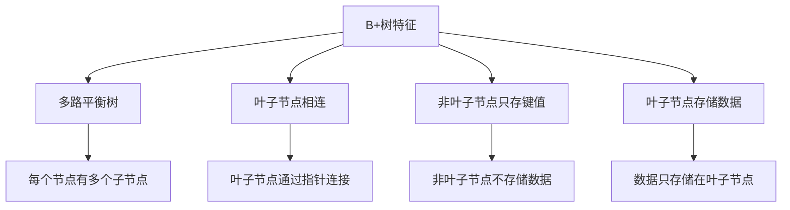
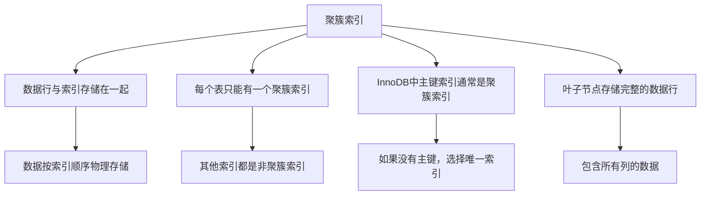
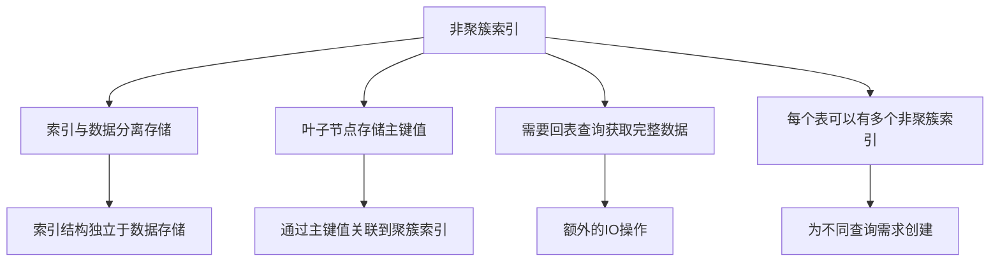
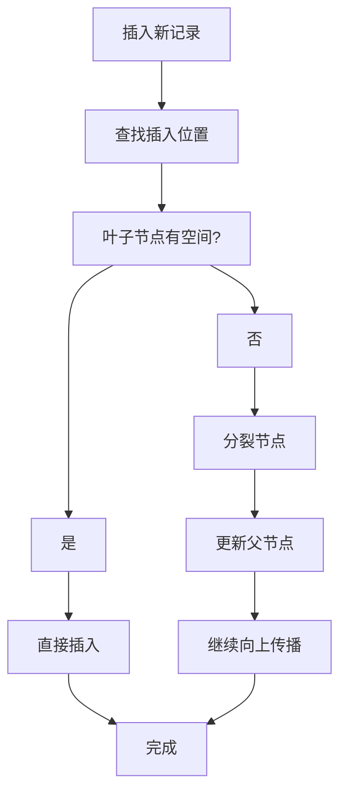

# MySQL B+树索引原理详解

## 概述

B+树是MySQL中最常用的索引结构，它能够高效地支持范围查询、排序和等值查询。本章节将深入解析B+树索引的工作原理、聚簇索引与非聚簇索引的区别，以及回表查询机制。

## B+树结构原理

### 1.1 B+树基本特征



### 1.2 B+树结构示例

```
                    [10, 20]
                   /    |    \
              [5,8]  [15,18]  [25,30]
              / | \   / | \     / | \
        [1,3] [6,7] [12,14] [16,17] [22,24] [28,29]
```

### 1.3 B+树优势

- **范围查询高效**：叶子节点相连，范围查询只需遍历叶子节点
- **排序友好**：数据按顺序存储在叶子节点
- **IO次数少**：树的高度较低，减少磁盘IO
- **插入删除高效**：通过分裂和合并保持平衡

## 2. 聚簇索引（Clustered Index）

### 2.1 聚簇索引特点



### 2.2 聚簇索引结构

```sql
-- 示例表结构
CREATE TABLE users (
    id INT PRIMARY KEY,  -- 聚簇索引
    name VARCHAR(50),
    email VARCHAR(100),
    created_at TIMESTAMP
);

-- 聚簇索引的物理存储结构
/*
叶子节点存储：
[1, "张三", "zhangsan@example.com", "2023-01-01 10:00:00"]
[2, "李四", "lisi@example.com", "2023-01-02 11:00:00"]
[3, "王五", "wangwu@example.com", "2023-01-03 12:00:00"]
...
*/
```

### 2.3 聚簇索引的优势

```sql
-- 1. 主键查询非常快
SELECT * FROM users WHERE id = 1;  -- 直接定位到数据行

-- 2. 范围查询高效
SELECT * FROM users WHERE id BETWEEN 1 AND 100;  -- 顺序扫描

-- 3. 排序查询高效
SELECT * FROM users ORDER BY id;  -- 已经按顺序存储
```

### 2.4 聚簇索引的注意事项

```sql
-- 1. 插入性能影响
-- 插入数据时，需要维护聚簇索引的顺序
INSERT INTO users (id, name, email) VALUES (5, "赵六", "zhaoliu@example.com");
-- 如果id=5的位置在中间，需要移动其他数据

-- 2. 更新主键的影响
UPDATE users SET id = 999 WHERE id = 1;  -- 可能导致数据移动

-- 3. 随机插入的性能问题
-- 如果主键不是自增的，可能导致频繁的数据移动
```

## 3. 非聚簇索引（Secondary Index）

### 3.1 非聚簇索引特点



### 3.2 非聚簇索引结构

```sql
-- 在users表上创建email索引
CREATE INDEX idx_email ON users (email);

-- 非聚簇索引的存储结构
/*
索引叶子节点存储：
["zhangsan@example.com", 1]  -- [索引值, 主键值]
["lisi@example.com", 2]
["wangwu@example.com", 3]
...
*/
```

### 3.3 非聚簇索引查询过程

```sql
-- 查询过程示例
SELECT * FROM users WHERE email = 'zhangsan@example.com';

-- 查询步骤：
-- 1. 在email索引中查找 'zhangsan@example.com'
-- 2. 找到对应的主键值 1
-- 3. 通过主键值 1 在聚簇索引中查找完整数据
-- 4. 返回完整的数据行
```

### 3.4 非聚簇索引的优势

```sql
-- 1. 支持多种查询模式
CREATE INDEX idx_name ON users (name);
CREATE INDEX idx_created_at ON users (created_at);

-- 2. 索引覆盖查询（避免回表）
SELECT id, email FROM users WHERE email = 'zhangsan@example.com';
-- 如果查询的列都在索引中，不需要回表

-- 3. 复合索引优化
CREATE INDEX idx_name_email ON users (name, email);
SELECT * FROM users WHERE name = '张三' AND email = 'zhangsan@example.com';
```

## 4. 回表查询（Index Lookup）

### 4.1 回表查询机制


### 4.2 回表查询示例

```sql
-- 创建测试表
CREATE TABLE products (
    id INT PRIMARY KEY,
    name VARCHAR(100),
    category VARCHAR(50),
    price DECIMAL(10,2),
    created_at TIMESTAMP
);

-- 创建非聚簇索引
CREATE INDEX idx_category ON products (category);

-- 查询示例（需要回表）
SELECT * FROM products WHERE category = 'Electronics';
-- 执行过程：
-- 1. 在idx_category索引中查找'Electronics'
-- 2. 获取所有匹配的主键值
-- 3. 通过主键值在聚簇索引中查找完整数据
-- 4. 返回完整的数据行
```

### 4.3 避免回表查询

```sql
-- 1. 索引覆盖查询
SELECT id, category FROM products WHERE category = 'Electronics';
-- 查询的列都在索引中，不需要回表

-- 2. 创建包含更多列的索引
CREATE INDEX idx_category_name ON products (category, name);
SELECT id, category, name FROM products WHERE category = 'Electronics';
-- 使用复合索引，避免回表

-- 3. 使用聚簇索引查询
SELECT * FROM products WHERE id = 1;
-- 直接使用聚簇索引，无需回表
```

### 4.4 回表查询的性能影响

```sql
-- 性能对比示例
EXPLAIN SELECT * FROM products WHERE category = 'Electronics';
-- 可能显示：Using index condition; Using where

-- 优化后的查询
EXPLAIN SELECT id, category FROM products WHERE category = 'Electronics';
-- 可能显示：Using index

-- 性能差异：
-- 回表查询：需要额外的IO操作
-- 索引覆盖：直接从索引获取数据
```

## 5. B+树索引的插入和删除

### 5.1 插入操作



### 5.2 删除操作

```sql
-- 删除操作示例
DELETE FROM users WHERE id = 1;

-- 删除过程：
-- 1. 在聚簇索引中查找id=1的记录
-- 2. 标记记录为删除状态（InnoDB）
-- 3. 更新所有相关的非聚簇索引
-- 4. 在后台清理删除的记录
```

### 5.3 更新操作

```sql
-- 更新操作示例
UPDATE users SET email = 'newemail@example.com' WHERE id = 1;

-- 更新过程：
-- 1. 在聚簇索引中查找记录
-- 2. 更新聚簇索引中的数据
-- 3. 更新email索引（如果存在）
-- 4. 如果email索引值改变，需要删除旧索引项，插入新索引项
```

## 6. 索引选择性和基数

### 6.1 索引选择性

```sql
-- 计算索引选择性
SELECT 
    COUNT(DISTINCT category) as distinct_categories,
    COUNT(*) as total_records,
    COUNT(DISTINCT category) / COUNT(*) as selectivity
FROM products;

-- 选择性越高，索引效果越好
-- 选择性 = 不同值的数量 / 总记录数
```

### 6.2 索引基数

```sql
-- 查看索引基数
SHOW INDEX FROM products;

-- 分析索引统计信息
SELECT 
    table_name,
    index_name,
    column_name,
    cardinality
FROM information_schema.statistics 
WHERE table_schema = 'your_database' 
AND table_name = 'products';
```

### 6.3 索引优化建议

```sql
-- 1. 为高选择性字段创建索引
CREATE INDEX idx_category ON products (category);  -- 假设category选择性高

-- 2. 避免为低选择性字段创建索引
-- CREATE INDEX idx_gender ON users (gender);  -- 性别只有2个值，选择性低

-- 3. 使用复合索引提高选择性
CREATE INDEX idx_category_price ON products (category, price);
-- 复合索引的选择性通常比单列索引高
```

## 7. 索引维护和优化

### 7.1 索引维护

```sql
-- 1. 重建索引
ALTER TABLE products DROP INDEX idx_category;
ALTER TABLE products ADD INDEX idx_category (category);

-- 2. 分析表统计信息
ANALYZE TABLE products;

-- 3. 优化表结构
OPTIMIZE TABLE products;
```

### 7.2 索引监控

```sql
-- 查看索引使用情况
SELECT 
    object_schema,
    object_name,
    index_name,
    count_read,
    count_write
FROM performance_schema.table_io_waits_summary_by_index_usage
WHERE object_schema = 'your_database';

-- 查找未使用的索引
SELECT 
    table_schema,
    table_name,
    index_name
FROM information_schema.statistics 
WHERE table_schema = 'your_database'
AND index_name NOT IN (
    SELECT DISTINCT index_name 
    FROM performance_schema.table_io_waits_summary_by_index_usage 
    WHERE count_read > 0 OR count_write > 0
);
```

### 7.3 索引优化策略

```sql
-- 1. 创建覆盖索引
CREATE INDEX idx_category_name_price ON products (category, name, price);
SELECT category, name, price FROM products WHERE category = 'Electronics';
-- 查询的列都在索引中，避免回表

-- 2. 使用最左前缀
CREATE INDEX idx_category_name ON products (category, name);
SELECT * FROM products WHERE category = 'Electronics' AND name LIKE 'iPhone%';
-- 可以使用索引的前缀部分

-- 3. 避免索引失效
-- 避免在索引列上使用函数
SELECT * FROM products WHERE YEAR(created_at) = 2023;  -- 索引失效
SELECT * FROM products WHERE created_at >= '2023-01-01' AND created_at < '2024-01-01';  -- 使用索引
```

## 8. 实际应用示例

### 8.1 电商系统索引设计

```sql
-- 用户表
CREATE TABLE users (
    id INT AUTO_INCREMENT PRIMARY KEY,
    username VARCHAR(50) UNIQUE,
    email VARCHAR(100) UNIQUE,
    phone VARCHAR(20),
    created_at TIMESTAMP DEFAULT CURRENT_TIMESTAMP,
    INDEX idx_created_at (created_at)
);

-- 商品表
CREATE TABLE products (
    id INT AUTO_INCREMENT PRIMARY KEY,
    name VARCHAR(200),
    category_id INT,
    price DECIMAL(10,2),
    stock INT,
    created_at TIMESTAMP DEFAULT CURRENT_TIMESTAMP,
    INDEX idx_category_price (category_id, price),
    INDEX idx_created_at (created_at)
);

-- 订单表
CREATE TABLE orders (
    id INT AUTO_INCREMENT PRIMARY KEY,
    user_id INT,
    status ENUM('pending', 'paid', 'shipped', 'delivered', 'cancelled'),
    total_amount DECIMAL(10,2),
    created_at TIMESTAMP DEFAULT CURRENT_TIMESTAMP,
    INDEX idx_user_status (user_id, status),
    INDEX idx_status_created (status, created_at)
);
```

### 8.2 查询优化示例

```sql
-- 1. 用户登录查询
SELECT * FROM users WHERE email = 'user@example.com';
-- 使用email的唯一索引，无需回表

-- 2. 商品分类查询
SELECT * FROM products 
WHERE category_id = 1 AND price BETWEEN 100 AND 1000
ORDER BY created_at DESC;
-- 使用idx_category_price索引进行过滤，idx_created_at索引进行排序

-- 3. 用户订单查询
SELECT * FROM orders 
WHERE user_id = 1 AND status = 'paid'
ORDER BY created_at DESC;
-- 使用idx_user_status索引，避免回表
```

## 总结

B+树索引是MySQL性能优化的核心，理解其工作原理对于数据库设计和优化至关重要：

1. **聚簇索引**：数据与索引存储在一起，主键查询高效
2. **非聚簇索引**：索引与数据分离，需要回表查询
3. **回表查询**：通过主键值获取完整数据的额外IO操作
4. **索引选择性**：影响索引效果的关键因素
5. **索引维护**：定期重建和分析索引统计信息

在实际应用中，需要根据查询模式、数据分布和性能需求来合理设计索引策略，避免过度索引和索引失效。 