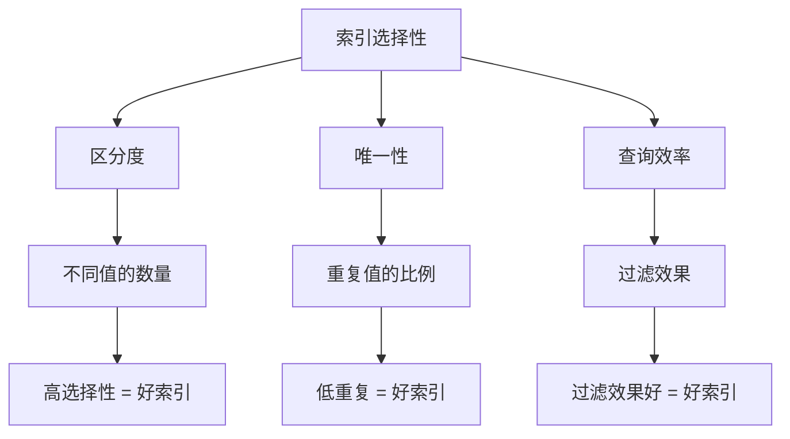
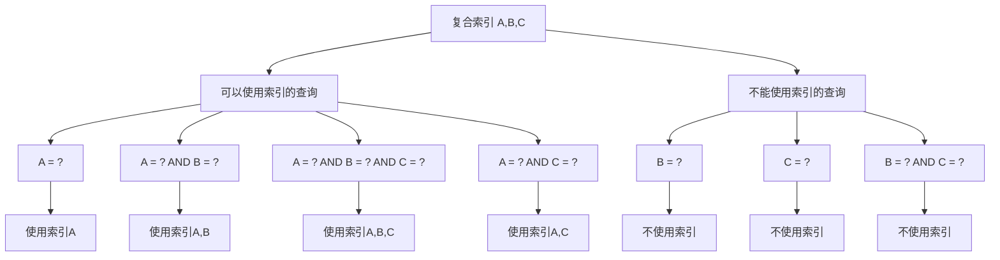
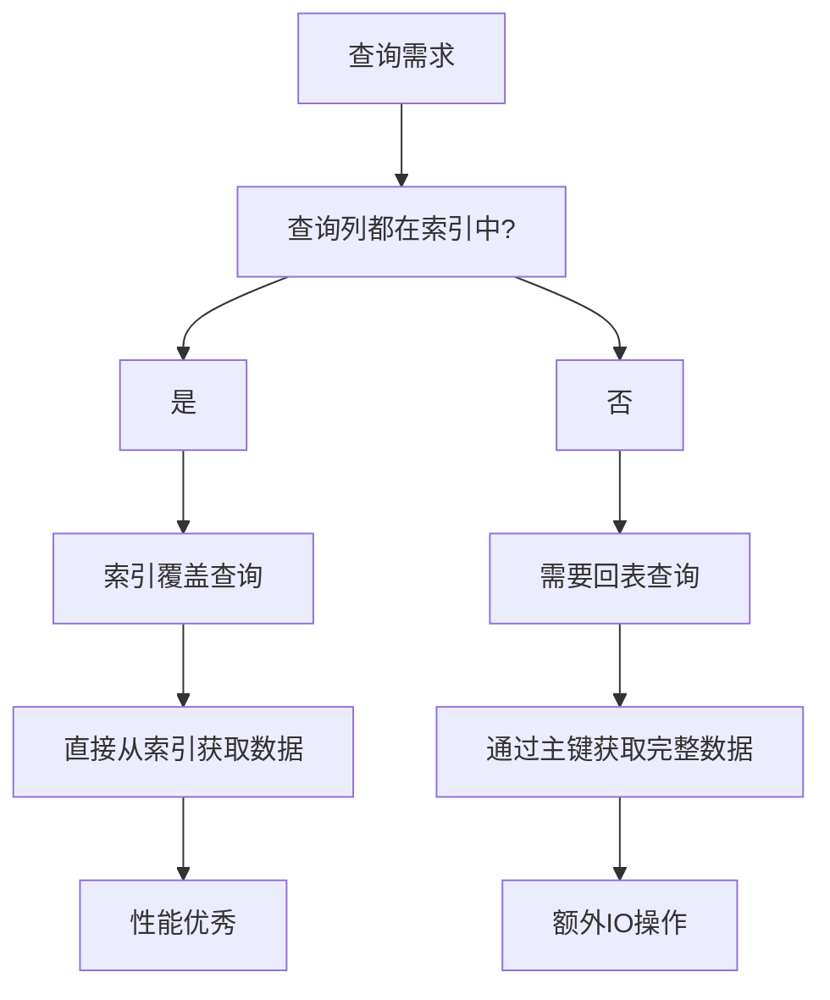
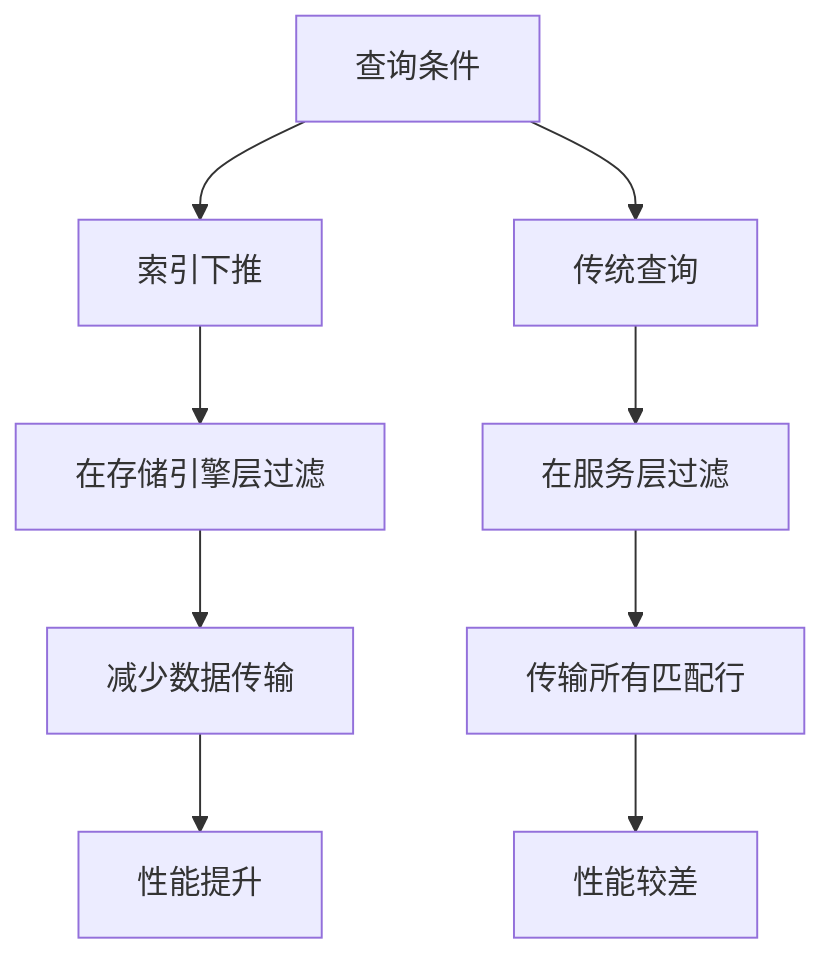

# MySQL 索引优化详解

## 概述

索引优化是MySQL性能调优的核心技术。本章节将详细介绍索引选择性、最左前缀原则、索引覆盖、索引下推等关键优化技术，帮助读者掌握高效的索引设计和使用方法。

## 1. 索引选择性（Index Selectivity）

### 1.1 选择性概念



### 1.2 选择性计算

```sql
-- 计算字段选择性
SELECT 
    column_name,
    COUNT(DISTINCT column_value) as distinct_count,
    COUNT(*) as total_count,
    ROUND(COUNT(DISTINCT column_value) / COUNT(*) * 100, 2) as selectivity_percent
FROM (
    SELECT 'user_id' as column_name, user_id as column_value FROM orders
    UNION ALL
    SELECT 'status' as column_name, status as column_value FROM orders
    UNION ALL
    SELECT 'category' as column_name, category as column_value FROM products
) t
GROUP BY column_name;

-- 选择性越高，索引效果越好
-- 选择性 = 不同值的数量 / 总记录数
```

### 1.3 选择性分析示例

```sql
-- 创建测试表
CREATE TABLE users (
    id INT AUTO_INCREMENT PRIMARY KEY,
    name VARCHAR(50),
    email VARCHAR(100),
    gender ENUM('male', 'female'),
    age INT,
    city VARCHAR(50),
    created_at TIMESTAMP
);

-- 分析各字段的选择性
SELECT 
    'gender' as field,
    COUNT(DISTINCT gender) as distinct_values,
    COUNT(*) as total_records,
    ROUND(COUNT(DISTINCT gender) / COUNT(*) * 100, 2) as selectivity_percent
FROM users
UNION ALL
SELECT 
    'city' as field,
    COUNT(DISTINCT city) as distinct_values,
    COUNT(*) as total_records,
    ROUND(COUNT(DISTINCT city) / COUNT(*) * 100, 2) as selectivity_percent
FROM users
UNION ALL
SELECT 
    'age' as field,
    COUNT(DISTINCT age) as distinct_values,
    COUNT(*) as total_records,
    ROUND(COUNT(DISTINCT age) / COUNT(*) * 100, 2) as selectivity_percent
FROM users;

-- 结果分析：
-- gender: 选择性约50%（只有2个值）
-- city: 选择性约80%（假设有多个城市）
-- age: 选择性约95%（年龄分布较广）
```

### 1.4 选择性优化建议

```sql
-- 推荐：为高选择性字段创建索引
CREATE INDEX idx_email ON users (email);        -- 邮箱唯一性高
CREATE INDEX idx_city ON users (city);          -- 城市选择性较高
CREATE INDEX idx_age ON users (age);            -- 年龄选择性高

-- 避免：为低选择性字段创建索引
-- CREATE INDEX idx_gender ON users (gender);   -- 性别选择性低

-- 复合索引：提高整体选择性
CREATE INDEX idx_city_age ON users (city, age);
-- 复合索引的选择性通常比单列索引高
```

## 2. 最左前缀原则（Leftmost Prefix Rule）

### 2.1 最左前缀概念



### 2.2 最左前缀示例

```sql
-- 创建复合索引
CREATE INDEX idx_user_status_created ON orders (user_id, status, created_at);

-- 可以使用索引的查询
SELECT * FROM orders WHERE user_id = 1;                                    -- ✓ 使用user_id
SELECT * FROM orders WHERE user_id = 1 AND status = 'paid';               -- ✓ 使用user_id, status
SELECT * FROM orders WHERE user_id = 1 AND status = 'paid' AND created_at > '2023-01-01'; -- ✓ 使用全部

-- 不能使用索引的查询
SELECT * FROM orders WHERE status = 'paid';                               -- ✗ 不使用索引
SELECT * FROM orders WHERE created_at > '2023-01-01';                    -- ✗ 不使用索引
SELECT * FROM orders WHERE status = 'paid' AND created_at > '2023-01-01'; -- ✗ 不使用索引
```

### 2.3 列顺序优化

```sql
-- 分析查询模式
SELECT 
    COUNT(*) as total_queries,
    SUM(CASE WHEN user_id IS NOT NULL THEN 1 ELSE 0 END) as user_id_queries,
    SUM(CASE WHEN status IS NOT NULL THEN 1 ELSE 0 END) as status_queries,
    SUM(CASE WHEN created_at IS NOT NULL THEN 1 ELSE 0 END) as date_queries
FROM query_log;

-- 根据查询频率调整索引顺序
-- 如果经常按user_id查询，则user_id在前
CREATE INDEX idx_user_status_created ON orders (user_id, status, created_at);

-- 如果经常按status查询，则status在前
CREATE INDEX idx_status_user_created ON orders (status, user_id, created_at);
```

### 2.4 最左前缀的扩展应用

```sql
-- 1. 范围查询后的列不能使用索引
SELECT * FROM orders 
WHERE user_id = 1 AND status = 'paid' AND created_at > '2023-01-01';
-- 可以使用user_id和status，created_at可能部分使用

-- 2. 函数和表达式会破坏最左前缀
SELECT * FROM orders 
WHERE user_id = 1 AND YEAR(created_at) = 2023;
-- 只能使用user_id，created_at因为函数而失效

-- 3. 排序和分组的最左前缀
SELECT * FROM orders 
WHERE user_id = 1 
ORDER BY status, created_at;
-- 可以使用user_id索引，排序也可以利用索引
```

## 3. 索引覆盖（Index Covering）

### 3.1 索引覆盖概念



### 3.2 索引覆盖示例

```sql
-- 创建测试表
CREATE TABLE products (
    id INT AUTO_INCREMENT PRIMARY KEY,
    name VARCHAR(200),
    category VARCHAR(50),
    price DECIMAL(10,2),
    stock INT,
    created_at TIMESTAMP
);

-- 创建包含多个列的索引
CREATE INDEX idx_category_name_price ON products (category, name, price);

-- 索引覆盖查询
SELECT category, name, price FROM products WHERE category = 'Electronics';
-- ✓ 查询的列都在索引中，无需回表

-- 需要回表的查询
SELECT * FROM products WHERE category = 'Electronics';
-- ✗ 需要获取完整数据行，需要回表
```

### 3.3 索引覆盖优化

```sql
-- 1. 为常用查询创建覆盖索引
CREATE INDEX idx_user_status_amount ON orders (user_id, status, total_amount);

-- 查询用户订单金额
SELECT user_id, status, total_amount FROM orders 
WHERE user_id = 1 AND status = 'paid';
-- 使用索引覆盖，避免回表

-- 2. 分析查询模式，设计覆盖索引
SELECT 
    COUNT(*) as total_queries,
    COUNT(DISTINCT CONCAT(columns_used)) as query_patterns
FROM query_log
GROUP BY query_type;

-- 3. 监控索引覆盖情况
EXPLAIN SELECT category, name, price FROM products WHERE category = 'Electronics';
-- 查看是否显示 "Using index"
```

### 3.4 索引覆盖的最佳实践

```sql
-- 推荐：创建包含查询列的索引
CREATE INDEX idx_category_name_price_stock ON products (category, name, price, stock);

-- 常用查询模式
SELECT category, name, price, stock FROM products 
WHERE category = 'Electronics' AND price > 100;
-- 完全索引覆盖

-- 避免：过度索引
-- 不要为每个可能的查询组合都创建索引
-- 优先考虑高频查询模式
```

## 4. 索引下推（Index Condition Pushdown）

### 4.1 索引下推概念



### 4.2 索引下推示例

```sql
-- 创建测试表
CREATE TABLE orders (
    id INT AUTO_INCREMENT PRIMARY KEY,
    user_id INT,
    status VARCHAR(20),
    amount DECIMAL(10,2),
    created_at TIMESTAMP,
    INDEX idx_user_status (user_id, status)
);

-- 索引下推查询
SELECT * FROM orders 
WHERE user_id = 1 AND status = 'paid' AND amount > 1000;
-- 在存储引擎层过滤amount > 1000，减少数据传输

-- 传统查询（没有索引下推）
SELECT * FROM orders 
WHERE user_id = 1 AND status = 'paid';
-- 传输所有匹配的记录到服务层，然后在服务层过滤
```

### 4.3 索引下推的条件

```sql
-- 1. 复合索引的前缀列
CREATE INDEX idx_user_status_amount ON orders (user_id, status, amount);

-- 可以使用索引下推的查询
SELECT * FROM orders 
WHERE user_id = 1 AND status = 'paid' AND amount > 1000;
-- amount列可以使用索引下推

-- 不能使用索引下推的查询
SELECT * FROM orders 
WHERE user_id = 1 AND amount > 1000;
-- amount列不在索引前缀中，不能下推

-- 2. 范围查询后的列不能下推
SELECT * FROM orders 
WHERE user_id = 1 AND status > 'pending' AND amount > 1000;
-- status是范围查询，amount不能下推
```

### 4.4 索引下推的监控

```sql
-- 查看查询是否使用索引下推
EXPLAIN SELECT * FROM orders 
WHERE user_id = 1 AND status = 'paid' AND amount > 1000;

-- 输出中会显示：
-- "Using index condition" - 表示使用了索引下推
-- "Using where" - 表示在服务层过滤

-- 监控索引下推的使用情况
SELECT 
    COUNT(*) as total_queries,
    SUM(CASE WHEN extra LIKE '%Using index condition%' THEN 1 ELSE 0 END) as icp_queries
FROM slow_query_log;
```

## 5. 索引失效分析

### 5.1 常见索引失效原因

```mermaid
graph TD
    A[索引失效原因] --> B[函数和表达式]
    A --> C[类型不匹配]
    A --> D[隐式转换]
    A --> E[OR条件]
    A --> F[LIKE模式]
    A --> G[NULL值]
    
    B --> B1[YEAR(date_column)]
    C --> C1[字符串vs数字]
    D --> D1[自动类型转换]
    E --> E1[OR两边的列都有索引]
    F --> F1[LIKE '%pattern%']
    G --> G1[IS NULL/IS NOT NULL]
```

### 5.2 索引失效示例

```sql
-- 1. 函数导致索引失效
SELECT * FROM orders WHERE YEAR(created_at) = 2023;  -- 索引失效
SELECT * FROM orders WHERE created_at >= '2023-01-01' AND created_at < '2024-01-01';  -- 使用索引

-- 2. 类型不匹配
SELECT * FROM users WHERE id = '1';  -- 字符串vs整数，可能索引失效
SELECT * FROM users WHERE id = 1;    -- 正确的类型

-- 3. 隐式转换
SELECT * FROM products WHERE price = '100.00';  -- 字符串转数字
SELECT * FROM products WHERE price = 100.00;    -- 正确的类型

-- 4. OR条件
SELECT * FROM orders WHERE user_id = 1 OR status = 'paid';  -- 可能索引失效
-- 优化：使用UNION
SELECT * FROM orders WHERE user_id = 1
UNION
SELECT * FROM orders WHERE status = 'paid' AND user_id != 1;

-- 5. LIKE模式
SELECT * FROM products WHERE name LIKE '%iPhone%';  -- 索引失效
SELECT * FROM products WHERE name LIKE 'iPhone%';   -- 使用索引

-- 6. NULL值处理
SELECT * FROM users WHERE email IS NULL;  -- 可能索引失效
SELECT * FROM users WHERE email IS NOT NULL;  -- 可能索引失效
```

### 5.3 索引失效的解决方案

```sql
-- 1. 避免在索引列上使用函数
-- 不推荐
SELECT * FROM orders WHERE YEAR(created_at) = 2023;

-- 推荐
SELECT * FROM orders WHERE created_at >= '2023-01-01' AND created_at < '2024-01-01';

-- 2. 使用正确的数据类型
-- 不推荐
SELECT * FROM users WHERE id = '1';

-- 推荐
SELECT * FROM users WHERE id = 1;

-- 3. 优化OR查询
-- 不推荐
SELECT * FROM orders WHERE user_id = 1 OR status = 'paid';

-- 推荐：使用UNION
SELECT * FROM orders WHERE user_id = 1
UNION
SELECT * FROM orders WHERE status = 'paid' AND user_id != 1;

-- 4. 优化LIKE查询
-- 不推荐
SELECT * FROM products WHERE name LIKE '%iPhone%';

-- 推荐：使用全文索引或搜索引擎
CREATE FULLTEXT INDEX idx_name ON products (name);
SELECT * FROM products WHERE MATCH(name) AGAINST('iPhone' IN BOOLEAN MODE);
```

## 6. 索引优化策略

### 6.1 索引设计原则

```sql
-- 1. 为查询条件创建索引
CREATE INDEX idx_user_status ON orders (user_id, status);

-- 2. 为排序字段创建索引
CREATE INDEX idx_created_at ON orders (created_at);

-- 3. 为分组字段创建索引
CREATE INDEX idx_category ON products (category);

-- 4. 为外键创建索引
CREATE INDEX idx_user_id ON orders (user_id);

-- 5. 创建覆盖索引
CREATE INDEX idx_category_name_price ON products (category, name, price);
```

### 6.2 复合索引优化

```sql
-- 1. 高选择性列在前
CREATE INDEX idx_status_user ON orders (status, user_id);
-- 如果status的选择性比user_id高

-- 2. 考虑查询模式
CREATE INDEX idx_user_status_created ON orders (user_id, status, created_at);
-- 支持多种查询模式

-- 3. 避免冗余索引
-- 不推荐：创建冗余索引
CREATE INDEX idx_user ON orders (user_id);
CREATE INDEX idx_user_status ON orders (user_id, status);
-- idx_user_status已经包含了idx_user的功能
```

### 6.3 索引维护

```sql
-- 1. 定期分析索引使用情况
SELECT 
    table_schema,
    table_name,
    index_name,
    cardinality
FROM information_schema.statistics 
WHERE table_schema = 'your_database'
ORDER BY cardinality DESC;

-- 2. 删除未使用的索引
SELECT 
    table_schema,
    table_name,
    index_name
FROM information_schema.statistics 
WHERE table_schema = 'your_database'
AND index_name NOT IN (
    SELECT DISTINCT index_name 
    FROM performance_schema.table_io_waits_summary_by_index_usage 
    WHERE count_read > 0 OR count_write > 0
);

-- 3. 重建索引
ALTER TABLE orders DROP INDEX idx_user_status;
ALTER TABLE orders ADD INDEX idx_user_status (user_id, status);
```

## 7. 实际应用示例

### 7.1 电商系统索引优化

```sql
-- 用户表索引设计
CREATE TABLE users (
    id INT AUTO_INCREMENT PRIMARY KEY,
    username VARCHAR(50) UNIQUE,
    email VARCHAR(100) UNIQUE,
    phone VARCHAR(20),
    status ENUM('active', 'inactive', 'banned'),
    created_at TIMESTAMP DEFAULT CURRENT_TIMESTAMP,
    INDEX idx_status_created (status, created_at),
    INDEX idx_phone (phone)
);

-- 商品表索引设计
CREATE TABLE products (
    id INT AUTO_INCREMENT PRIMARY KEY,
    name VARCHAR(200),
    category_id INT,
    brand_id INT,
    price DECIMAL(10,2),
    stock INT,
    status ENUM('active', 'inactive', 'deleted'),
    created_at TIMESTAMP DEFAULT CURRENT_TIMESTAMP,
    INDEX idx_category_price (category_id, price),
    INDEX idx_brand_status (brand_id, status),
    INDEX idx_status_created (status, created_at)
);

-- 订单表索引设计
CREATE TABLE orders (
    id INT AUTO_INCREMENT PRIMARY KEY,
    user_id INT,
    status ENUM('pending', 'paid', 'shipped', 'delivered', 'cancelled'),
    total_amount DECIMAL(10,2),
    created_at TIMESTAMP DEFAULT CURRENT_TIMESTAMP,
    INDEX idx_user_status (user_id, status),
    INDEX idx_status_created (status, created_at),
    INDEX idx_user_created (user_id, created_at)
);
```

### 7.2 查询优化示例

```sql
-- 1. 用户登录查询
SELECT * FROM users WHERE email = 'user@example.com';
-- 使用email的唯一索引

-- 2. 商品搜索查询
SELECT * FROM products 
WHERE category_id = 1 AND price BETWEEN 100 AND 1000
ORDER BY created_at DESC;
-- 使用idx_category_price进行过滤，idx_status_created进行排序

-- 3. 用户订单查询
SELECT * FROM orders 
WHERE user_id = 1 AND status = 'paid'
ORDER BY created_at DESC;
-- 使用idx_user_status索引

-- 4. 统计查询
SELECT category_id, COUNT(*) as product_count, AVG(price) as avg_price
FROM products 
WHERE status = 'active'
GROUP BY category_id;
-- 使用idx_status_created索引进行过滤
```

## 总结

MySQL索引优化是数据库性能调优的核心技术，关键要点包括：

1. **索引选择性**：高选择性字段优先创建索引
2. **最左前缀原则**：复合索引的列顺序很重要
3. **索引覆盖**：避免回表查询，提升性能
4. **索引下推**：在存储引擎层过滤数据
5. **避免索引失效**：注意函数、类型转换等问题
6. **定期维护**：分析索引使用情况，删除冗余索引

在实际应用中，需要根据具体的查询模式、数据分布和性能需求来设计最优的索引策略。 