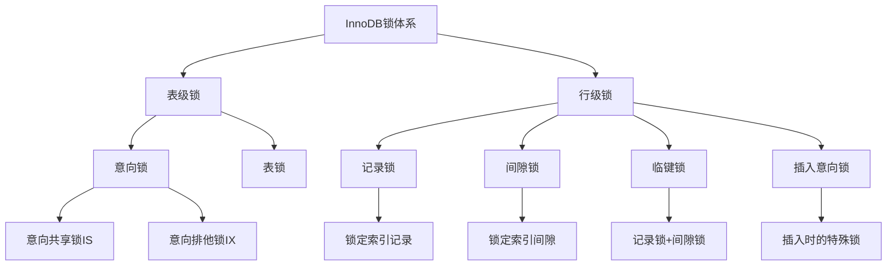
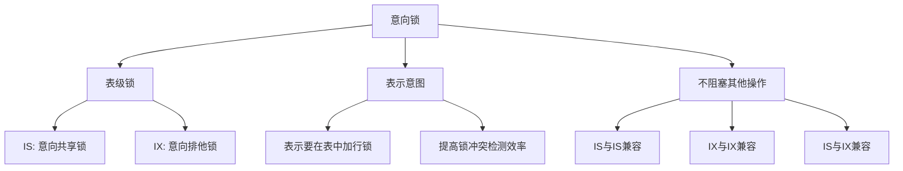
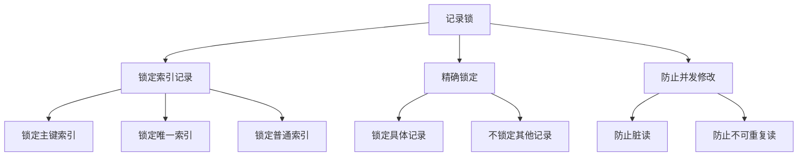
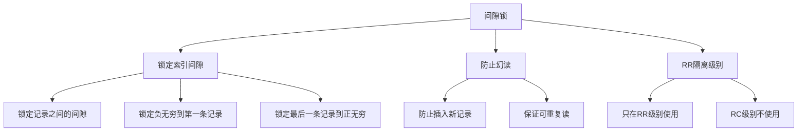
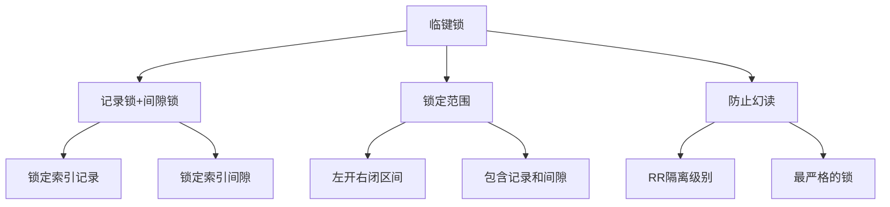
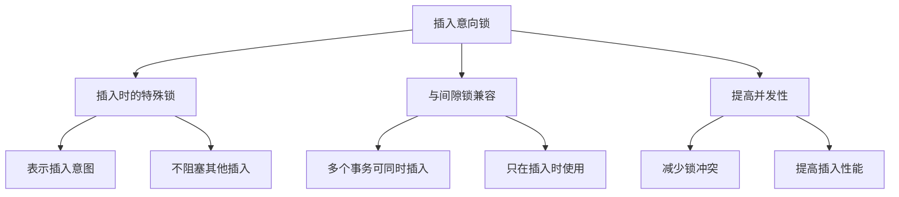

# MySQL InnoDB锁机制详解

## 概述

InnoDB是MySQL的默认存储引擎，它实现了完整的ACID事务支持。本章节将深入解析InnoDB的锁机制，包括意向锁、记录锁、间隙锁、临键锁和插入意向锁的工作原理和使用场景。

## 1. InnoDB锁体系结构

### 1.1 锁的分类体系



### 1.2 锁的兼容性矩阵

```sql
-- 锁兼容性矩阵
/*
锁类型     IS    IX    S     X
IS        兼容   兼容   兼容   不兼容
IX        兼容   兼容   不兼容 不兼容
S         兼容   不兼容 兼容   不兼容
X         不兼容 不兼容 不兼容 不兼容
*/
```

## 2. 意向锁（Intention Lock）

### 2.1 意向锁概念



### 2.2 意向锁的作用

```sql
-- 意向锁的主要作用
-- 1. 快速检测表级锁冲突
-- 2. 避免逐行检查锁冲突
-- 3. 提高并发性能

-- 示例：事务A要更新表中的某些行
BEGIN;
-- 事务A获取IX锁（意向排他锁）
UPDATE users SET status = 'inactive' WHERE id = 1;
-- 此时其他事务可以：
-- - 读取其他行（获取IS锁）
-- - 更新其他行（获取IX锁）
-- 但不能获取表级S锁或X锁
```

### 2.3 意向锁的获取时机

```sql
-- 意向共享锁（IS）获取时机
SELECT * FROM users WHERE id = 1 LOCK IN SHARE MODE;
-- 1. 获取表级IS锁
-- 2. 获取行级S锁

-- 意向排他锁（IX）获取时机
UPDATE users SET name = 'new_name' WHERE id = 1;
-- 1. 获取表级IX锁
-- 2. 获取行级X锁

-- 意向锁的自动管理
-- InnoDB会自动管理意向锁的获取和释放
-- 不需要手动指定意向锁
```

## 3. 记录锁（Record Lock）

### 3.1 记录锁概念



### 3.2 记录锁示例

```sql
-- 创建测试表
CREATE TABLE users (
    id INT PRIMARY KEY,
    name VARCHAR(50),
    email VARCHAR(100) UNIQUE,
    status ENUM('active', 'inactive')
);

-- 插入测试数据
INSERT INTO users VALUES (1, 'Alice', 'alice@example.com', 'active');
INSERT INTO users VALUES (2, 'Bob', 'bob@example.com', 'active');
INSERT INTO users VALUES (3, 'Charlie', 'charlie@example.com', 'active');

-- 事务A：更新用户状态
BEGIN;
UPDATE users SET status = 'inactive' WHERE id = 1;
-- 获取id=1的记录锁

-- 事务B：尝试更新同一记录
BEGIN;
UPDATE users SET status = 'inactive' WHERE id = 1;
-- 等待事务A释放锁

-- 事务C：更新不同记录
BEGIN;
UPDATE users SET status = 'inactive' WHERE id = 2;
-- 可以立即执行，因为锁定的是不同记录
```

### 3.3 记录锁的索引影响

```sql
-- 记录锁基于索引
-- 1. 主键索引的记录锁
UPDATE users SET name = 'new_name' WHERE id = 1;
-- 锁定主键索引中id=1的记录

-- 2. 唯一索引的记录锁
UPDATE users SET status = 'inactive' WHERE email = 'alice@example.com';
-- 锁定唯一索引中email='alice@example.com'的记录

-- 3. 普通索引的记录锁
CREATE INDEX idx_status ON users (status);
UPDATE users SET name = 'new_name' WHERE status = 'active';
-- 锁定普通索引中status='active'的所有记录
```

## 4. 间隙锁（Gap Lock）

### 4.1 间隙锁概念



### 4.2 间隙锁示例

```sql
-- 创建测试表
CREATE TABLE orders (
    id INT PRIMARY KEY,
    user_id INT,
    amount DECIMAL(10,2),
    created_at TIMESTAMP
);

-- 插入测试数据
INSERT INTO orders VALUES (1, 1, 100.00, '2023-01-01 10:00:00');
INSERT INTO orders VALUES (3, 2, 200.00, '2023-01-02 11:00:00');
INSERT INTO orders VALUES (5, 3, 300.00, '2023-01-03 12:00:00');

-- 事务A：范围查询
BEGIN;
SELECT * FROM orders WHERE id BETWEEN 2 AND 4 FOR UPDATE;
-- 锁定间隙：(1,3) 和 (3,5)

-- 事务B：尝试插入
BEGIN;
INSERT INTO orders VALUES (2, 4, 150.00, '2023-01-01 15:00:00');
-- 等待，因为id=2在间隙(1,3)中

-- 事务C：尝试插入
BEGIN;
INSERT INTO orders VALUES (4, 5, 250.00, '2023-01-02 16:00:00');
-- 等待，因为id=4在间隙(3,5)中

-- 事务D：插入不在间隙中的记录
BEGIN;
INSERT INTO orders VALUES (6, 6, 350.00, '2023-01-04 17:00:00');
-- 可以立即执行，因为id=6不在锁定间隙中
```

### 4.3 间隙锁的边界情况

```sql
-- 1. 负无穷到第一条记录的间隙
SELECT * FROM orders WHERE id < 1 FOR UPDATE;
-- 锁定间隙：(-∞, 1)

-- 2. 最后一条记录到正无穷的间隙
SELECT * FROM orders WHERE id > 5 FOR UPDATE;
-- 锁定间隙：(5, +∞)

-- 3. 不存在的记录
SELECT * FROM orders WHERE id = 2 FOR UPDATE;
-- 锁定间隙：(1, 3)

-- 4. 范围查询
SELECT * FROM orders WHERE id BETWEEN 2 AND 4 FOR UPDATE;
-- 锁定间隙：(1, 3) 和 (3, 5)
```

## 5. 临键锁（Next-Key Lock）

### 5.1 临键锁概念



### 5.2 临键锁示例

```sql
-- 创建测试表
CREATE TABLE products (
    id INT PRIMARY KEY,
    name VARCHAR(100),
    price DECIMAL(10,2),
    category VARCHAR(50)
);

-- 插入测试数据
INSERT INTO products VALUES (1, 'iPhone', 999.00, 'Electronics');
INSERT INTO products VALUES (3, 'MacBook', 1999.00, 'Electronics');
INSERT INTO products VALUES (5, 'iPad', 799.00, 'Electronics');

-- 事务A：使用临键锁
BEGIN;
SELECT * FROM products WHERE id >= 2 AND id <= 4 FOR UPDATE;
-- 锁定范围：[2, 5)，包括记录3和间隙(1,3)和(3,5)

-- 事务B：尝试插入
BEGIN;
INSERT INTO products VALUES (2, 'Android', 599.00, 'Electronics');
-- 等待，因为id=2在锁定范围内

-- 事务C：尝试更新
BEGIN;
UPDATE products SET price = 1899.00 WHERE id = 3;
-- 等待，因为id=3在锁定范围内

-- 事务D：插入范围外的记录
BEGIN;
INSERT INTO products VALUES (6, 'Watch', 399.00, 'Electronics');
-- 可以立即执行，因为id=6不在锁定范围内
```

### 5.3 临键锁的边界处理

```sql
-- 1. 等值查询
SELECT * FROM products WHERE id = 3 FOR UPDATE;
-- 锁定范围：[3, 5)，包括记录3和间隙(3,5)

-- 2. 范围查询
SELECT * FROM products WHERE id BETWEEN 2 AND 4 FOR UPDATE;
-- 锁定范围：[2, 5)，包括记录3和间隙(1,3)和(3,5)

-- 3. 大于查询
SELECT * FROM products WHERE id > 2 FOR UPDATE;
-- 锁定范围：(2, +∞)

-- 4. 小于查询
SELECT * FROM products WHERE id < 4 FOR UPDATE;
-- 锁定范围：(-∞, 4)
```

## 6. 插入意向锁（Insert Intention Lock）

### 6.1 插入意向锁概念



### 6.2 插入意向锁示例

```sql
-- 创建测试表
CREATE TABLE messages (
    id INT PRIMARY KEY,
    user_id INT,
    content TEXT,
    created_at TIMESTAMP
);

-- 插入测试数据
INSERT INTO messages VALUES (1, 1, 'Hello', '2023-01-01 10:00:00');
INSERT INTO messages VALUES (3, 2, 'World', '2023-01-02 11:00:00');

-- 事务A：插入消息
BEGIN;
INSERT INTO messages VALUES (2, 1, 'Test A', '2023-01-01 15:00:00');
-- 获取插入意向锁，锁定间隙(1,3)

-- 事务B：同时插入消息
BEGIN;
INSERT INTO messages VALUES (4, 2, 'Test B', '2023-01-01 16:00:00');
-- 可以立即执行，因为插入到不同间隙

-- 事务C：插入到同一间隙
BEGIN;
INSERT INTO messages VALUES (2, 3, 'Test C', '2023-01-01 17:00:00');
-- 等待，因为尝试插入到同一位置

-- 事务D：范围查询
BEGIN;
SELECT * FROM messages WHERE id BETWEEN 1 AND 5 FOR UPDATE;
-- 获取间隙锁，但插入意向锁可以兼容
```

### 6.3 插入意向锁的兼容性

```sql
-- 插入意向锁的兼容性
-- 1. 与间隙锁兼容
-- 2. 与其他插入意向锁兼容
-- 3. 与记录锁不兼容

-- 示例：多个事务同时插入
BEGIN;
INSERT INTO messages VALUES (2, 1, 'Message 1', NOW());
-- 事务A获取插入意向锁

BEGIN;
INSERT INTO messages VALUES (2, 2, 'Message 2', NOW());
-- 事务B等待，因为尝试插入到同一位置

BEGIN;
INSERT INTO messages VALUES (4, 3, 'Message 3', NOW());
-- 事务C可以立即执行，因为插入到不同位置
```

## 7. 锁的监控和分析

### 7.1 查看锁信息

```sql
-- 查看当前锁信息
SHOW ENGINE INNODB STATUS;

-- 查看锁等待情况
SELECT 
    r.trx_id waiting_trx_id,
    r.trx_mysql_thread_id waiting_thread,
    r.trx_query waiting_query,
    b.trx_id blocking_trx_id,
    b.trx_mysql_thread_id blocking_thread,
    b.trx_query blocking_query
FROM information_schema.innodb_lock_waits w
INNER JOIN information_schema.innodb_trx b ON b.trx_id = w.blocking_trx_id
INNER JOIN information_schema.innodb_trx r ON r.trx_id = w.requesting_trx_id;

-- 查看事务信息
SELECT 
    trx_id,
    trx_state,
    trx_started,
    trx_mysql_thread_id,
    trx_query
FROM information_schema.innodb_trx;
```

### 7.2 锁冲突分析

```sql
-- 分析锁冲突的常见原因
-- 1. 长事务
SELECT 
    trx_id,
    trx_started,
    TIMESTAMPDIFF(SECOND, trx_started, NOW()) as duration_seconds
FROM information_schema.innodb_trx
WHERE trx_state = 'RUNNING'
ORDER BY duration_seconds DESC;

-- 2. 热点数据
SELECT 
    object_schema,
    object_name,
    index_name,
    lock_type,
    lock_mode,
    lock_status,
    lock_data
FROM performance_schema.data_locks
WHERE lock_status = 'GRANTED';

-- 3. 死锁检测
SHOW ENGINE INNODB STATUS\G
-- 查看LATEST DETECTED DEADLOCK部分
```

### 7.3 锁优化建议

```sql
-- 1. 减少锁的持有时间
-- 不推荐：长事务
BEGIN;
UPDATE users SET status = 'inactive' WHERE id = 1;
-- 其他业务逻辑...
COMMIT;

-- 推荐：短事务
BEGIN;
UPDATE users SET status = 'inactive' WHERE id = 1;
COMMIT;
-- 其他业务逻辑...

-- 2. 使用合适的隔离级别
-- 根据业务需求选择合适的隔离级别
SET SESSION TRANSACTION ISOLATION LEVEL READ COMMITTED;

-- 3. 避免热点数据
-- 使用分布式ID或UUID避免自增ID的热点问题
CREATE TABLE orders (
    id VARCHAR(36) PRIMARY KEY,  -- UUID
    user_id INT,
    amount DECIMAL(10,2)
);
```

## 8. 实际应用示例

### 8.1 电商系统锁设计

```sql
-- 库存管理：使用记录锁
CREATE TABLE products (
    id INT PRIMARY KEY,
    name VARCHAR(200),
    stock INT,
    price DECIMAL(10,2)
);

-- 扣减库存
BEGIN;
SELECT stock FROM products WHERE id = 1 FOR UPDATE;
-- 获取记录锁，防止并发修改
UPDATE products SET stock = stock - 1 WHERE id = 1 AND stock > 0;
COMMIT;

-- 订单管理：使用间隙锁防止幻读
CREATE TABLE orders (
    id INT PRIMARY KEY,
    user_id INT,
    product_id INT,
    quantity INT,
    status ENUM('pending', 'paid', 'cancelled'),
    created_at TIMESTAMP
);

-- 查询用户订单
BEGIN;
SELECT * FROM orders 
WHERE user_id = 1 AND created_at BETWEEN '2023-01-01' AND '2023-01-31'
FOR UPDATE;
-- 使用间隙锁防止幻读
COMMIT;
```

### 8.2 并发控制最佳实践

```sql
-- 1. 使用乐观锁
CREATE TABLE products (
    id INT PRIMARY KEY,
    name VARCHAR(200),
    stock INT,
    version INT DEFAULT 0
);

-- 乐观锁更新
UPDATE products 
SET stock = stock - 1, version = version + 1 
WHERE id = 1 AND version = 0 AND stock > 0;

-- 2. 使用分布式锁
-- 在应用层实现分布式锁，减少数据库锁的使用

-- 3. 批量操作优化
-- 不推荐：逐个更新
FOR i IN 1..1000 LOOP
    UPDATE products SET stock = stock - 1 WHERE id = i;
END LOOP;

-- 推荐：批量更新
UPDATE products SET stock = stock - 1 WHERE id IN (1,2,3,...,1000);
```

## 总结

InnoDB锁机制是MySQL事务处理的核心，关键要点包括：

1. **意向锁**：表级锁，表示加行锁的意图
2. **记录锁**：锁定具体的索引记录
3. **间隙锁**：锁定索引记录之间的间隙，防止幻读
4. **临键锁**：记录锁+间隙锁的组合，最严格的锁
5. **插入意向锁**：插入时的特殊锁，提高并发性

在实际应用中，需要根据业务需求选择合适的锁策略，避免锁冲突和死锁，提高系统并发性能。 