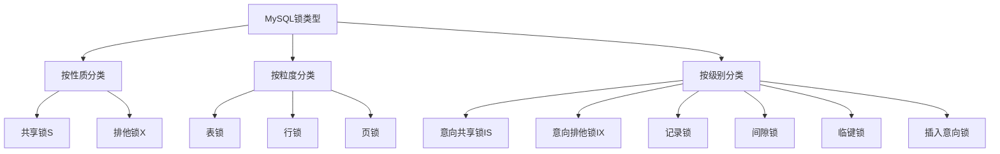
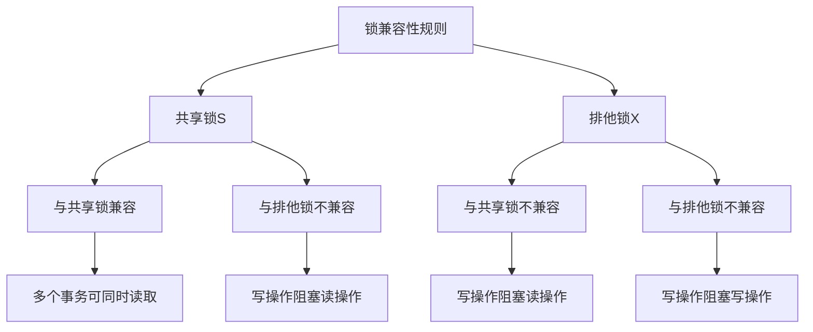
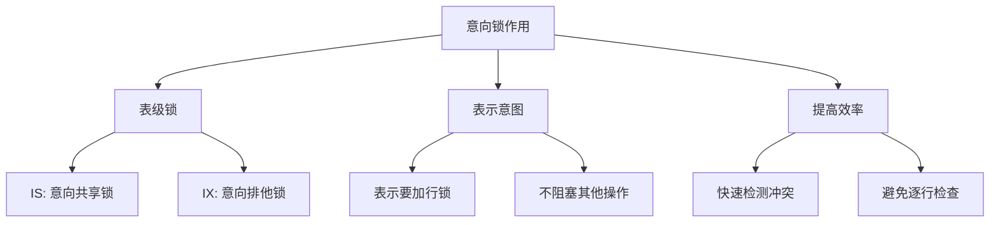
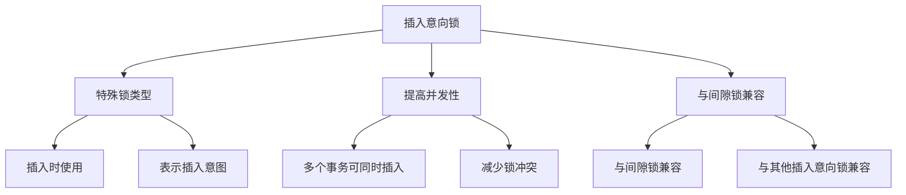

# MySQL 锁兼容性详解

## 概述

锁兼容性是MySQL并发控制的核心概念。本章节将详细介绍不同类型锁之间的兼容性关系，包括共享锁、排他锁、意向锁等，以及在实际应用中的使用场景和最佳实践。

## 1. 锁兼容性基础

### 1.1 锁类型回顾



### 1.2 锁兼容性矩阵

```sql
-- 锁兼容性矩阵
/*
锁类型     IS    IX    S     X
IS        兼容   兼容   兼容   不兼容
IX        兼容   兼容   不兼容 不兼容
S         兼容   不兼容 兼容   不兼容
X         不兼容 不兼容 不兼容 不兼容
*/
```

## 2. 共享锁与排他锁兼容性

### 2.1 基本兼容性规则



### 2.2 共享锁示例

```sql
-- 创建测试表
CREATE TABLE products (
    id INT PRIMARY KEY,
    name VARCHAR(100),
    price DECIMAL(10,2),
    stock INT
);

-- 插入测试数据
INSERT INTO products VALUES (1, 'iPhone', 999.00, 10);
INSERT INTO products VALUES (2, 'MacBook', 1999.00, 5);

-- 事务A：获取共享锁
BEGIN;
SELECT * FROM products WHERE id = 1 LOCK IN SHARE MODE;
-- 获取id=1的共享锁

-- 事务B：同时获取共享锁
BEGIN;
SELECT * FROM products WHERE id = 1 LOCK IN SHARE MODE;
-- 可以立即执行，因为共享锁与共享锁兼容

-- 事务C：尝试获取排他锁
BEGIN;
UPDATE products SET stock = stock - 1 WHERE id = 1;
-- 等待，因为排他锁与共享锁不兼容

-- 事务D：读取其他记录
BEGIN;
SELECT * FROM products WHERE id = 2;
-- 可以立即执行，因为读取的是不同记录
```

### 2.3 排他锁示例

```sql
-- 事务A：获取排他锁
BEGIN;
UPDATE products SET stock = stock - 1 WHERE id = 1;
-- 获取id=1的排他锁

-- 事务B：尝试获取共享锁
BEGIN;
SELECT * FROM products WHERE id = 1 LOCK IN SHARE MODE;
-- 等待，因为共享锁与排他锁不兼容

-- 事务C：尝试获取排他锁
BEGIN;
UPDATE products SET price = 899.00 WHERE id = 1;
-- 等待，因为排他锁与排他锁不兼容

-- 事务D：更新其他记录
BEGIN;
UPDATE products SET stock = stock - 1 WHERE id = 2;
-- 可以立即执行，因为更新的是不同记录
```

## 3. 意向锁兼容性

### 3.1 意向锁的作用



### 3.2 意向锁兼容性示例

```sql
-- 事务A：获取意向排他锁
BEGIN;
UPDATE products SET stock = stock - 1 WHERE id = 1;
-- 获取表级IX锁和行级X锁

-- 事务B：获取意向共享锁
BEGIN;
SELECT * FROM products WHERE id = 2 LOCK IN SHARE MODE;
-- 可以立即执行，因为IS与IX兼容

-- 事务C：获取意向排他锁
BEGIN;
UPDATE products SET price = 899.00 WHERE id = 3;
-- 可以立即执行，因为IX与IX兼容

-- 事务D：尝试获取表级共享锁
BEGIN;
LOCK TABLES products READ;
-- 等待，因为表级S锁与IX锁不兼容
```

### 3.3 意向锁的自动管理

```sql
-- InnoDB自动管理意向锁
-- 1. 获取行级S锁时，自动获取表级IS锁
SELECT * FROM products WHERE id = 1 LOCK IN SHARE MODE;
-- 自动获取：表级IS锁 + 行级S锁

-- 2. 获取行级X锁时，自动获取表级IX锁
UPDATE products SET stock = stock - 1 WHERE id = 1;
-- 自动获取：表级IX锁 + 行级X锁

-- 3. 释放行锁时，自动释放意向锁
COMMIT;
-- 自动释放：表级锁 + 行级锁
```

## 4. 行级锁兼容性

### 4.1 记录锁兼容性

```sql
-- 记录锁的兼容性
-- 1. 不同记录的锁不冲突
BEGIN;
UPDATE products SET stock = stock - 1 WHERE id = 1;
-- 事务A锁定记录1

BEGIN;
UPDATE products SET stock = stock - 1 WHERE id = 2;
-- 事务B可以立即执行，因为锁定不同记录

-- 2. 同一记录的锁冲突
BEGIN;
UPDATE products SET stock = stock - 1 WHERE id = 1;
-- 事务A锁定记录1

BEGIN;
UPDATE products SET price = 899.00 WHERE id = 1;
-- 事务B等待，因为尝试锁定同一记录
```

### 4.2 间隙锁兼容性

```sql
-- 间隙锁的兼容性
-- 1. 不同间隙的锁不冲突
BEGIN;
SELECT * FROM products WHERE id BETWEEN 1 AND 3 FOR UPDATE;
-- 事务A锁定间隙(0,1), (1,3), (3,4)

BEGIN;
SELECT * FROM products WHERE id BETWEEN 5 AND 7 FOR UPDATE;
-- 事务B可以立即执行，因为锁定不同间隙

-- 2. 重叠间隙的锁冲突
BEGIN;
SELECT * FROM products WHERE id BETWEEN 2 AND 4 FOR UPDATE;
-- 事务A锁定间隙(1,3), (3,5)

BEGIN;
SELECT * FROM products WHERE id BETWEEN 3 AND 5 FOR UPDATE;
-- 事务B等待，因为间隙重叠
```

### 4.3 临键锁兼容性

```sql
-- 临键锁的兼容性
-- 1. 不同范围的临键锁不冲突
BEGIN;
SELECT * FROM products WHERE id >= 1 AND id <= 3 FOR UPDATE;
-- 事务A锁定范围[1,4)

BEGIN;
SELECT * FROM products WHERE id >= 5 AND id <= 7 FOR UPDATE;
-- 事务B可以立即执行，因为锁定不同范围

-- 2. 重叠范围的临键锁冲突
BEGIN;
SELECT * FROM products WHERE id >= 2 AND id <= 4 FOR UPDATE;
-- 事务A锁定范围[2,5)

BEGIN;
SELECT * FROM products WHERE id >= 3 AND id <= 5 FOR UPDATE;
-- 事务B等待，因为范围重叠
```

## 5. 插入意向锁兼容性

### 5.1 插入意向锁特点



### 5.2 插入意向锁示例

```sql
-- 创建测试表
CREATE TABLE orders (
    id INT PRIMARY KEY,
    user_id INT,
    amount DECIMAL(10,2),
    created_at TIMESTAMP
);

-- 插入测试数据
INSERT INTO orders VALUES (1, 1, 100.00, '2023-01-01 10:00:00');
INSERT INTO orders VALUES (3, 2, 200.00, '2023-01-02 11:00:00');

-- 事务A：插入订单
BEGIN;
INSERT INTO orders VALUES (2, 1, 150.00, '2023-01-01 15:00:00');
-- 获取插入意向锁，锁定间隙(1,3)

-- 事务B：同时插入订单
BEGIN;
INSERT INTO orders VALUES (4, 2, 250.00, '2023-01-02 16:00:00');
-- 可以立即执行，因为插入到不同间隙

-- 事务C：插入到同一间隙
BEGIN;
INSERT INTO orders VALUES (2, 3, 175.00, '2023-01-01 17:00:00');
-- 等待，因为尝试插入到同一位置

-- 事务D：范围查询
BEGIN;
SELECT * FROM orders WHERE id BETWEEN 1 AND 5 FOR UPDATE;
-- 获取间隙锁，但插入意向锁可以兼容
```

## 6. 锁兼容性的实际应用

### 6.1 读多写少场景

```sql
-- 读多写少的应用场景
-- 1. 商品信息查询（读操作）
BEGIN;
SELECT * FROM products WHERE id = 1 LOCK IN SHARE MODE;
-- 获取共享锁，允许其他读操作

-- 2. 库存扣减（写操作）
BEGIN;
UPDATE products SET stock = stock - 1 WHERE id = 1;
-- 获取排他锁，阻塞其他操作

-- 3. 并发读取
-- 多个事务可以同时读取同一商品信息
-- 但写操作会阻塞所有其他操作
```

### 6.2 写多读少场景

```sql
-- 写多读少的应用场景
-- 1. 日志记录（写操作）
CREATE TABLE logs (
    id INT AUTO_INCREMENT PRIMARY KEY,
    message TEXT,
    created_at TIMESTAMP
);

-- 2. 批量插入
BEGIN;
INSERT INTO logs (message, created_at) VALUES ('Log 1', NOW());
INSERT INTO logs (message, created_at) VALUES ('Log 2', NOW());
INSERT INTO logs (message, created_at) VALUES ('Log 3', NOW());
COMMIT;

-- 3. 并发写入
-- 多个事务可以同时插入日志
-- 插入意向锁允许并发插入
```

### 6.3 混合场景

```sql
-- 混合读写场景
-- 1. 用户会话管理
CREATE TABLE user_sessions (
    id INT PRIMARY KEY,
    user_id INT,
    session_data TEXT,
    last_activity TIMESTAMP
);

-- 2. 读取会话信息
BEGIN;
SELECT * FROM user_sessions WHERE user_id = 1 LOCK IN SHARE MODE;
-- 获取共享锁，允许其他读操作

-- 3. 更新会话信息
BEGIN;
UPDATE user_sessions SET last_activity = NOW() WHERE user_id = 1;
-- 获取排他锁，阻塞其他操作

-- 4. 创建新会话
BEGIN;
INSERT INTO user_sessions (user_id, session_data, last_activity) 
VALUES (2, 'session_data', NOW());
-- 使用插入意向锁，允许并发插入
```

## 7. 锁兼容性优化

### 7.1 减少锁冲突

```sql
-- 1. 使用合适的锁粒度
-- 不推荐：表级锁
LOCK TABLES products WRITE;
UPDATE products SET stock = stock - 1 WHERE id = 1;
UNLOCK TABLES;

-- 推荐：行级锁
BEGIN;
UPDATE products SET stock = stock - 1 WHERE id = 1;
COMMIT;

-- 2. 减少锁的持有时间
-- 不推荐：长事务
BEGIN;
UPDATE products SET stock = stock - 1 WHERE id = 1;
-- 其他业务逻辑...
COMMIT;

-- 推荐：短事务
BEGIN;
UPDATE products SET stock = stock - 1 WHERE id = 1;
COMMIT;
-- 其他业务逻辑...
```

### 7.2 使用乐观锁

```sql
-- 乐观锁实现
CREATE TABLE products (
    id INT PRIMARY KEY,
    name VARCHAR(100),
    stock INT,
    version INT DEFAULT 0
);

-- 乐观锁更新
UPDATE products 
SET stock = stock - 1, version = version + 1 
WHERE id = 1 AND version = 0;

-- 检查更新结果
SELECT ROW_COUNT();
-- 如果返回0，说明数据已被其他事务修改
```

### 7.3 使用读写分离

```sql
-- 读写分离策略
-- 1. 主库处理写操作
UPDATE products SET stock = stock - 1 WHERE id = 1;

-- 2. 从库处理读操作
SELECT * FROM products WHERE id = 1;

-- 3. 应用层路由
-- 写操作路由到主库
-- 读操作路由到从库
```

## 8. 锁兼容性监控

### 8.1 监控锁等待

```sql
-- 查看锁等待情况
SELECT 
    r.trx_id waiting_trx_id,
    r.trx_mysql_thread_id waiting_thread,
    r.trx_query waiting_query,
    b.trx_id blocking_trx_id,
    b.trx_mysql_thread_id blocking_thread,
    b.trx_query blocking_query,
    TIMESTAMPDIFF(SECOND, r.trx_started, NOW()) as wait_seconds
FROM information_schema.innodb_lock_waits w
INNER JOIN information_schema.innodb_trx b ON b.trx_id = w.blocking_trx_id
INNER JOIN information_schema.innodb_trx r ON r.trx_id = w.requesting_trx_id;
```

### 8.2 分析锁冲突

```sql
-- 分析锁冲突模式
SELECT 
    object_schema,
    object_name,
    index_name,
    lock_type,
    lock_mode,
    lock_status,
    COUNT(*) as lock_count
FROM performance_schema.data_locks
GROUP BY object_schema, object_name, index_name, lock_type, lock_mode, lock_status
ORDER BY lock_count DESC;
```

### 8.3 死锁检测

```sql
-- 查看死锁信息
SHOW ENGINE INNODB STATUS\G

-- 分析死锁原因
-- 1. 查看LATEST DETECTED DEADLOCK部分
-- 2. 分析死锁的事务和锁
-- 3. 优化事务顺序和锁获取顺序
```

## 总结

MySQL锁兼容性是并发控制的基础，关键要点包括：

1. **共享锁与共享锁兼容**：允许多个事务同时读取
2. **排他锁与所有锁不兼容**：写操作会阻塞其他所有操作
3. **意向锁提高效率**：快速检测锁冲突，避免逐行检查
4. **插入意向锁提高并发性**：允许多个事务同时插入
5. **合理使用锁粒度**：根据业务需求选择合适的锁类型

在实际应用中，需要根据具体的业务场景选择合适的锁策略，平衡并发性和数据一致性。 