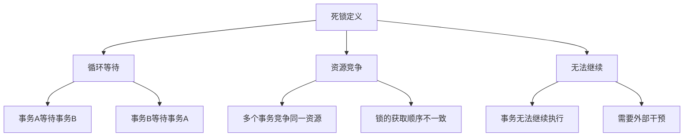
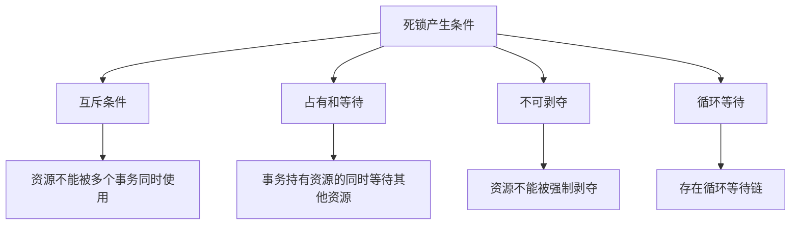
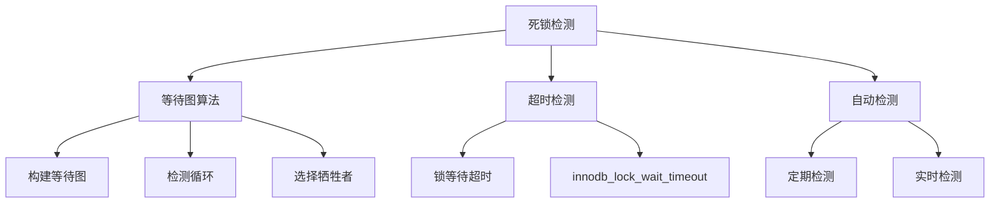
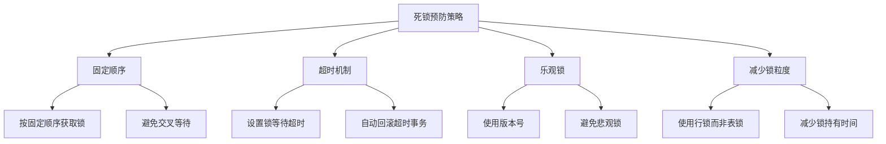
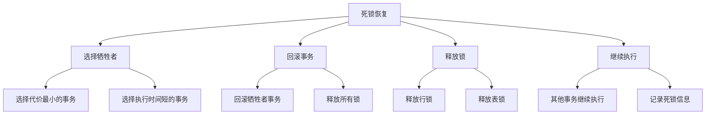

# MySQL 死锁处理详解

## 概述

死锁是MySQL并发控制中的常见问题，当两个或多个事务相互等待对方持有的锁时就会发生死锁。本章节将详细介绍死锁的检测、预防和恢复机制。

## 1. 死锁基础概念

### 1.1 死锁定义



### 1.2 死锁产生条件



### 1.3 死锁示例

```sql
-- 创建测试表
CREATE TABLE accounts (
    id INT PRIMARY KEY,
    name VARCHAR(50),
    balance DECIMAL(10,2)
);

-- 插入测试数据
INSERT INTO accounts VALUES (1, 'Alice', 1000.00);
INSERT INTO accounts VALUES (2, 'Bob', 2000.00);

-- 死锁场景示例
-- 事务A
BEGIN;
UPDATE accounts SET balance = balance - 100 WHERE id = 1;
-- 获取id=1的排他锁

-- 事务B
BEGIN;
UPDATE accounts SET balance = balance - 200 WHERE id = 2;
-- 获取id=2的排他锁

-- 事务A继续
UPDATE accounts SET balance = balance + 100 WHERE id = 2;
-- 等待事务B释放id=2的锁

-- 事务B继续
UPDATE accounts SET balance = balance + 200 WHERE id = 1;
-- 等待事务A释放id=1的锁

-- 结果：死锁！
```

## 2. 死锁检测

### 2.1 InnoDB死锁检测机制



### 2.2 死锁检测配置

```sql
-- 查看死锁检测配置
SHOW VARIABLES LIKE 'innodb_deadlock_detect';
SHOW VARIABLES LIKE 'innodb_lock_wait_timeout';

-- 配置死锁检测
SET GLOBAL innodb_deadlock_detect = 'ON';  -- 开启死锁检测
SET GLOBAL innodb_lock_wait_timeout = 50;   -- 设置锁等待超时时间（秒）

-- 查看死锁信息
SHOW ENGINE INNODB STATUS\G
-- 查看LATEST DETECTED DEADLOCK部分
```

### 2.3 死锁检测示例

```sql
-- 模拟死锁场景
-- 会话1
SET SESSION autocommit = 0;
BEGIN;
UPDATE accounts SET balance = balance - 100 WHERE id = 1;
-- 获取id=1的锁

-- 会话2
SET SESSION autocommit = 0;
BEGIN;
UPDATE accounts SET balance = balance - 200 WHERE id = 2;
-- 获取id=2的锁

-- 会话1继续
UPDATE accounts SET balance = balance + 100 WHERE id = 2;
-- 等待id=2的锁

-- 会话2继续
UPDATE accounts SET balance = balance + 200 WHERE id = 1;
-- 等待id=1的锁，形成死锁

-- 查看死锁信息
SHOW ENGINE INNODB STATUS\G
```

## 3. 死锁预防

### 3.1 锁获取顺序



### 3.2 固定顺序获取锁

```sql
-- 不推荐：可能导致死锁
-- 事务A
BEGIN;
UPDATE accounts SET balance = balance - 100 WHERE id = 1;
UPDATE accounts SET balance = balance + 100 WHERE id = 2;
COMMIT;

-- 事务B
BEGIN;
UPDATE accounts SET balance = balance - 200 WHERE id = 2;
UPDATE accounts SET balance = balance + 200 WHERE id = 1;
COMMIT;

-- 推荐：按固定顺序获取锁
-- 事务A
BEGIN;
UPDATE accounts SET balance = balance - 100 WHERE id = 1;
UPDATE accounts SET balance = balance + 100 WHERE id = 2;
COMMIT;

-- 事务B
BEGIN;
UPDATE accounts SET balance = balance - 200 WHERE id = 1;
UPDATE accounts SET balance = balance + 200 WHERE id = 2;
COMMIT;
```

### 3.3 使用乐观锁

```sql
-- 乐观锁实现
CREATE TABLE products (
    id INT PRIMARY KEY,
    name VARCHAR(100),
    stock INT,
    version INT DEFAULT 0
);

-- 乐观锁更新
UPDATE products 
SET stock = stock - 1, version = version + 1 
WHERE id = 1 AND version = 0;

-- 检查更新结果
SELECT ROW_COUNT();
-- 如果返回0，说明数据已被其他事务修改
```

### 3.4 减少锁持有时间

```sql
-- 不推荐：长事务
BEGIN;
UPDATE accounts SET balance = balance - 100 WHERE id = 1;
-- 其他业务逻辑...
UPDATE accounts SET balance = balance + 100 WHERE id = 2;
COMMIT;

-- 推荐：短事务
BEGIN;
UPDATE accounts SET balance = balance - 100 WHERE id = 1;
COMMIT;
-- 其他业务逻辑...
BEGIN;
UPDATE accounts SET balance = balance + 100 WHERE id = 2;
COMMIT;
```

## 4. 死锁恢复

### 4.1 自动死锁恢复



### 4.2 死锁恢复策略

```sql
-- InnoDB死锁恢复策略
-- 1. 选择牺牲者：选择回滚代价最小的事务
-- 2. 回滚事务：回滚牺牲者事务的所有操作
-- 3. 释放锁：释放牺牲者持有的所有锁
-- 4. 继续执行：其他事务继续执行

-- 查看死锁恢复信息
SHOW ENGINE INNODB STATUS\G

-- 死锁恢复示例
/*
LATEST DETECTED DEADLOCK
------------------------
2023-01-15 10:30:45 0x7f8b8c0b0700
*** (1) TRANSACTION:
TRANSACTION 12345, ACTIVE 2 sec, mysql thread id 123, OS thread handle 0x7f8b8c0b0700, query id 123456 localhost root updating
UPDATE accounts SET balance = balance - 100 WHERE id = 1
*** (1) WAITING FOR THIS LOCK TO BE GRANTED:
RECORD LOCKS space id 123 page no 456 n bits 72 index PRIMARY of table `test`.`accounts` trx id 12345 lock_mode X locks rec but not gap waiting
*** (2) TRANSACTION:
TRANSACTION 12346, ACTIVE 1 sec, mysql thread id 124, OS thread handle 0x7f8b8c0b0800, query id 123457 localhost root updating
UPDATE accounts SET balance = balance - 200 WHERE id = 2
*** (2) HOLDS THE LOCK(S):
RECORD LOCKS space id 123 page no 456 n bits 72 index PRIMARY of table `test`.`accounts` trx id 12346 lock_mode X locks rec but not gap
*** (2) WAITING FOR THIS LOCK TO BE GRANTED:
RECORD LOCKS space id 123 page no 456 n bits 72 index PRIMARY of table `test`.`accounts` trx id 12346 lock_mode X locks rec but not gap waiting
*** WE ROLL BACK TRANSACTION (1)
*/
```

### 4.3 手动死锁处理

```sql
-- 1. 查看当前锁等待情况
SELECT 
    r.trx_id waiting_trx_id,
    r.trx_mysql_thread_id waiting_thread,
    r.trx_query waiting_query,
    b.trx_id blocking_trx_id,
    b.trx_mysql_thread_id blocking_thread,
    b.trx_query blocking_query
FROM information_schema.innodb_lock_waits w
INNER JOIN information_schema.innodb_trx b ON b.trx_id = w.blocking_trx_id
INNER JOIN information_schema.innodb_trx r ON r.trx_id = w.requesting_trx_id;

-- 2. 查看长时间运行的事务
SELECT 
    trx_id,
    trx_state,
    trx_started,
    trx_mysql_thread_id,
    trx_query,
    TIMESTAMPDIFF(SECOND, trx_started, NOW()) as duration_seconds
FROM information_schema.innodb_trx
WHERE trx_state = 'RUNNING'
ORDER BY duration_seconds DESC;

-- 3. 手动杀死事务（谨慎使用）
KILL 123;  -- 杀死线程ID为123的事务
```

## 5. 死锁监控

### 5.1 死锁监控查询

```sql
-- 1. 监控死锁次数
SELECT 
    variable_name,
    variable_value
FROM performance_schema.global_status 
WHERE variable_name = 'Innodb_deadlocks';

-- 2. 监控锁等待
SELECT 
    COUNT(*) as lock_wait_count
FROM information_schema.innodb_lock_waits;

-- 3. 监控长时间运行的事务
SELECT 
    COUNT(*) as long_running_transactions
FROM information_schema.innodb_trx
WHERE trx_state = 'RUNNING' 
AND TIMESTAMPDIFF(SECOND, trx_started, NOW()) > 30;
```

### 5.2 死锁监控脚本

```python
#!/usr/bin/env python3
# deadlock_monitor.py

import mysql.connector
import time
import logging

# 配置日志
logging.basicConfig(level=logging.INFO)
logger = logging.getLogger(__name__)

class DeadlockMonitor:
    def __init__(self, host, user, password, database):
        self.host = host
        self.user = user
        self.password = password
        self.database = database
        self.conn = None
        
    def connect(self):
        try:
            self.conn = mysql.connector.connect(
                host=self.host,
                user=self.user,
                password=self.password,
                database=self.database
            )
            return True
        except Exception as e:
            logger.error(f"连接失败: {e}")
            return False
    
    def get_deadlock_count(self):
        try:
            cursor = self.conn.cursor()
            cursor.execute("""
                SELECT variable_value 
                FROM performance_schema.global_status 
                WHERE variable_name = 'Innodb_deadlocks'
            """)
            result = cursor.fetchone()
            return int(result[0]) if result else 0
        except Exception as e:
            logger.error(f"获取死锁次数失败: {e}")
            return 0
    
    def get_lock_wait_count(self):
        try:
            cursor = self.conn.cursor()
            cursor.execute("""
                SELECT COUNT(*) 
                FROM information_schema.innodb_lock_waits
            """)
            result = cursor.fetchone()
            return int(result[0]) if result else 0
        except Exception as e:
            logger.error(f"获取锁等待次数失败: {e}")
            return 0
    
    def monitor(self):
        if not self.connect():
            return
        
        prev_deadlock_count = self.get_deadlock_count()
        
        while True:
            try:
                current_deadlock_count = self.get_deadlock_count()
                lock_wait_count = self.get_lock_wait_count()
                
                # 检测新的死锁
                if current_deadlock_count > prev_deadlock_count:
                    logger.warning(f"检测到新的死锁！总死锁次数: {current_deadlock_count}")
                
                # 检测锁等待
                if lock_wait_count > 0:
                    logger.warning(f"检测到锁等待！等待数量: {lock_wait_count}")
                
                prev_deadlock_count = current_deadlock_count
                time.sleep(5)  # 每5秒检查一次
                
            except Exception as e:
                logger.error(f"监控过程中出错: {e}")
                time.sleep(5)

if __name__ == "__main__":
    monitor = DeadlockMonitor('localhost', 'root', 'password', 'test')
    monitor.monitor()
```

### 5.3 死锁告警

```sql
-- 创建死锁告警表
CREATE TABLE deadlock_alerts (
    id INT AUTO_INCREMENT PRIMARY KEY,
    alert_time TIMESTAMP DEFAULT CURRENT_TIMESTAMP,
    deadlock_count INT,
    lock_wait_count INT,
    alert_message TEXT
);

-- 创建死锁告警存储过程
DELIMITER //
CREATE PROCEDURE check_deadlocks()
BEGIN
    DECLARE deadlock_count INT;
    DECLARE lock_wait_count INT;
    
    -- 获取死锁次数
    SELECT variable_value INTO deadlock_count
    FROM performance_schema.global_status 
    WHERE variable_name = 'Innodb_deadlocks';
    
    -- 获取锁等待次数
    SELECT COUNT(*) INTO lock_wait_count
    FROM information_schema.innodb_lock_waits;
    
    -- 如果死锁次数增加或锁等待过多，插入告警
    IF deadlock_count > 0 OR lock_wait_count > 10 THEN
        INSERT INTO deadlock_alerts (deadlock_count, lock_wait_count, alert_message)
        VALUES (deadlock_count, lock_wait_count, 
                CONCAT('死锁次数: ', deadlock_count, ', 锁等待次数: ', lock_wait_count));
    END IF;
END //
DELIMITER ;

-- 创建事件调度器
CREATE EVENT deadlock_check
ON SCHEDULE EVERY 1 MINUTE
DO CALL check_deadlocks();
```

## 6. 死锁优化策略

### 6.1 应用层优化

```sql
-- 1. 使用事务隔离级别
SET SESSION TRANSACTION ISOLATION LEVEL READ COMMITTED;
-- 减少锁的持有时间

-- 2. 使用批量操作
-- 不推荐：逐个更新
FOR i IN 1..1000 LOOP
    UPDATE products SET stock = stock - 1 WHERE id = i;
END LOOP;

-- 推荐：批量更新
UPDATE products SET stock = stock - 1 WHERE id IN (1,2,3,...,1000);

-- 3. 使用乐观锁
UPDATE products 
SET stock = stock - 1, version = version + 1 
WHERE id = 1 AND version = 0;
```

### 6.2 数据库层优化

```sql
-- 1. 优化索引
-- 为常用查询条件创建合适的索引
CREATE INDEX idx_user_status ON orders (user_id, status);

-- 2. 使用分区表
CREATE TABLE orders (
    id INT PRIMARY KEY,
    user_id INT,
    amount DECIMAL(10,2),
    created_at TIMESTAMP
) PARTITION BY RANGE (YEAR(created_at)) (
    PARTITION p2023 VALUES LESS THAN (2024),
    PARTITION p2024 VALUES LESS THAN (2025)
);

-- 3. 使用读写分离
-- 读操作使用从库
SELECT * FROM orders WHERE user_id = 1;
-- 写操作使用主库
UPDATE orders SET status = 'paid' WHERE id = 1;
```

### 6.3 架构层优化

```sql
-- 1. 使用分布式锁
-- 在应用层实现分布式锁，减少数据库锁的使用

-- 2. 使用消息队列
-- 将写操作放入消息队列，异步处理

-- 3. 使用缓存
-- 使用Redis等缓存减少数据库访问
```

## 7. 实际应用示例

### 7.1 电商系统死锁处理

```sql
-- 1. 库存扣减优化
CREATE TABLE products (
    id INT PRIMARY KEY,
    name VARCHAR(100),
    stock INT,
    version INT DEFAULT 0
);

-- 使用乐观锁扣减库存
UPDATE products 
SET stock = stock - 1, version = version + 1 
WHERE id = 1 AND stock > 0 AND version = 0;

-- 2. 订单处理优化
CREATE TABLE orders (
    id INT PRIMARY KEY,
    user_id INT,
    product_id INT,
    quantity INT,
    status ENUM('pending', 'paid', 'cancelled'),
    created_at TIMESTAMP
);

-- 按固定顺序处理订单
BEGIN;
-- 1. 先锁定用户
SELECT * FROM users WHERE id = 1 FOR UPDATE;
-- 2. 再锁定商品
SELECT * FROM products WHERE id = 1 FOR UPDATE;
-- 3. 创建订单
INSERT INTO orders (user_id, product_id, quantity, status) 
VALUES (1, 1, 1, 'pending');
COMMIT;
```

### 7.2 银行系统死锁处理

```sql
-- 1. 账户转账优化
CREATE TABLE accounts (
    id INT PRIMARY KEY,
    account_number VARCHAR(20) UNIQUE,
    balance DECIMAL(10,2),
    version INT DEFAULT 0
);

-- 使用乐观锁进行转账
-- 扣减源账户
UPDATE accounts 
SET balance = balance - 100, version = version + 1 
WHERE account_number = 'A001' AND balance >= 100 AND version = 0;

-- 增加目标账户
UPDATE accounts 
SET balance = balance + 100, version = version + 1 
WHERE account_number = 'A002' AND version = 0;

-- 2. 按账户号排序避免死锁
-- 总是按账户号升序处理
SELECT account_number FROM accounts 
WHERE account_number IN ('A001', 'A002') 
ORDER BY account_number;
```

## 总结

MySQL死锁处理是并发控制的重要环节，关键要点包括：

1. **死锁检测**：InnoDB自动检测死锁并选择牺牲者
2. **死锁预防**：按固定顺序获取锁，使用乐观锁
3. **死锁恢复**：自动回滚牺牲者事务，释放锁
4. **死锁监控**：实时监控死锁和锁等待情况
5. **优化策略**：从应用层、数据库层、架构层多角度优化

在实际应用中，需要结合具体的业务场景，制定合适的死锁预防和处理策略。 

**[返回目录 README.md](./README?id=_4-mysql-锁机制)** 