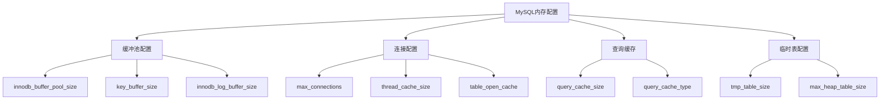

# MySQL 配置优化详解

## 概述

MySQL配置优化是性能调优的重要环节，合理的配置参数可以显著提升数据库性能。本章节将详细介绍内存配置、连接配置、缓冲池配置等核心优化参数。

## 1. 内存配置优化

### 1.1 内存配置概览



### 1.2 InnoDB缓冲池配置

```sql
-- 查看当前缓冲池配置
SHOW VARIABLES LIKE 'innodb_buffer_pool_size';
SHOW VARIABLES LIKE 'innodb_buffer_pool_instances';
SHOW VARIABLES LIKE 'innodb_buffer_pool_chunk_size';

-- 缓冲池大小配置
-- 建议设置为服务器内存的70-80%
SET GLOBAL innodb_buffer_pool_size = 8589934592;  -- 8GB

-- 缓冲池实例数
-- 建议设置为缓冲池大小/1GB
SET GLOBAL innodb_buffer_pool_instances = 8;

-- 缓冲池块大小
-- 默认128MB，通常不需要修改
SET GLOBAL innodb_buffer_pool_chunk_size = 134217728;  -- 128MB
```

### 1.3 缓冲池监控

```sql
-- 查看缓冲池使用情况
SHOW ENGINE INNODB STATUS\G

-- 缓冲池统计信息
SELECT 
    variable_name,
    variable_value
FROM performance_schema.global_status 
WHERE variable_name LIKE 'Innodb_buffer_pool_%';

-- 计算缓冲池命中率
SELECT 
    (1 - (Innodb_buffer_pool_reads / Innodb_buffer_pool_read_requests)) * 100 as hit_ratio
FROM performance_schema.global_status 
WHERE variable_name IN ('Innodb_buffer_pool_reads', 'Innodb_buffer_pool_read_requests');
```

### 1.4 缓冲池优化建议

```sql
-- 1. 根据数据量设置缓冲池大小
-- 如果数据量小于内存，可以设置更大的缓冲池
SET GLOBAL innodb_buffer_pool_size = 10737418240;  -- 10GB

-- 2. 使用多个缓冲池实例
-- 减少内部竞争，提高并发性能
SET GLOBAL innodb_buffer_pool_instances = 16;

-- 3. 预热缓冲池
-- 在MySQL启动后，将常用数据加载到缓冲池
SELECT COUNT(*) FROM large_table;
```

## 2. 连接配置优化

### 2.1 连接参数配置

```sql
-- 查看当前连接配置
SHOW VARIABLES LIKE 'max_connections';
SHOW VARIABLES LIKE 'thread_cache_size';
SHOW VARIABLES LIKE 'table_open_cache';

-- 最大连接数配置
-- 根据应用需求和服务器资源设置
SET GLOBAL max_connections = 1000;

-- 线程缓存大小
-- 减少线程创建和销毁的开销
SET GLOBAL thread_cache_size = 100;

-- 表缓存大小
-- 缓存打开的表描述符
SET GLOBAL table_open_cache = 4000;
```

### 2.2 连接监控

```sql
-- 查看当前连接数
SELECT COUNT(*) as current_connections FROM information_schema.processlist;

-- 查看连接使用情况
SELECT 
    variable_name,
    variable_value
FROM performance_schema.global_status 
WHERE variable_name IN ('Threads_connected', 'Threads_running', 'Threads_cached');

-- 查看连接历史
SELECT 
    variable_name,
    variable_value
FROM performance_schema.global_status 
WHERE variable_name IN ('Connections', 'Max_used_connections');
```

### 2.3 连接优化建议

```sql
-- 1. 合理设置最大连接数
-- 考虑服务器内存和CPU资源
SET GLOBAL max_connections = 500;

-- 2. 使用连接池
-- 在应用层使用连接池，减少连接创建开销

-- 3. 设置连接超时
SET GLOBAL wait_timeout = 600;        -- 非交互连接超时时间
SET GLOBAL interactive_timeout = 600;  -- 交互连接超时时间
```

## 3. 查询缓存配置

### 3.1 查询缓存参数

```sql
-- 查看查询缓存配置
SHOW VARIABLES LIKE 'query_cache%';

-- 查询缓存大小
-- 建议设置为32MB-128MB
SET GLOBAL query_cache_size = 67108864;  -- 64MB

-- 查询缓存类型
-- 0: 禁用, 1: 启用, 2: 按需启用
SET GLOBAL query_cache_type = 1;

-- 查询缓存块大小
SET GLOBAL query_cache_min_res_unit = 4096;  -- 4KB
```

### 3.2 查询缓存监控

```sql
-- 查看查询缓存统计
SELECT 
    variable_name,
    variable_value
FROM performance_schema.global_status 
WHERE variable_name LIKE 'Qcache_%';

-- 计算查询缓存命中率
SELECT 
    (Qcache_hits / (Qcache_hits + Qcache_inserts)) * 100 as hit_ratio
FROM performance_schema.global_status 
WHERE variable_name IN ('Qcache_hits', 'Qcache_inserts');
```

### 3.3 查询缓存优化

```sql
-- 1. 根据查询模式设置缓存大小
-- 如果查询重复度高，可以增加缓存大小
SET GLOBAL query_cache_size = 134217728;  -- 128MB

-- 2. 使用SQL_CACHE和SQL_NO_CACHE
-- 控制特定查询是否使用缓存
SELECT SQL_CACHE * FROM users WHERE id = 1;
SELECT SQL_NO_CACHE * FROM users WHERE id = 1;

-- 3. 定期清理查询缓存
FLUSH QUERY CACHE;
```

## 4. 临时表配置

### 4.1 临时表参数

```sql
-- 查看临时表配置
SHOW VARIABLES LIKE 'tmp_table_size';
SHOW VARIABLES LIKE 'max_heap_table_size';

-- 内存临时表大小
-- 超过此大小的临时表会写入磁盘
SET GLOBAL tmp_table_size = 67108864;  -- 64MB

-- 内存表最大大小
SET GLOBAL max_heap_table_size = 67108864;  -- 64MB

-- 临时文件目录
SHOW VARIABLES LIKE 'tmpdir';
```

### 4.2 临时表监控

```sql
-- 查看临时表使用情况
SELECT 
    variable_name,
    variable_value
FROM performance_schema.global_status 
WHERE variable_name LIKE 'Created_tmp%';

-- 监控临时表创建
SELECT 
    Created_tmp_disk_tables as disk_tables,
    Created_tmp_tables as memory_tables,
    Created_tmp_files as tmp_files
FROM performance_schema.global_status;
```

### 4.3 临时表优化

```sql
-- 1. 增加内存临时表大小
-- 减少磁盘临时表的使用
SET GLOBAL tmp_table_size = 134217728;  -- 128MB

-- 2. 优化查询减少临时表
-- 使用索引避免排序和分组时的临时表
CREATE INDEX idx_user_status ON orders (user_id, status);

-- 3. 使用EXPLAIN分析临时表使用
EXPLAIN SELECT user_id, COUNT(*) FROM orders GROUP BY user_id;
```

## 5. 日志配置优化

### 5.1 日志参数配置

```sql
-- 查看日志配置
SHOW VARIABLES LIKE 'innodb_log_file_size';
SHOW VARIABLES LIKE 'innodb_log_files_in_group';
SHOW VARIABLES LIKE 'innodb_log_buffer_size';

-- 重做日志文件大小
-- 建议设置为缓冲池大小的25%
SET GLOBAL innodb_log_file_size = 1073741824;  -- 1GB

-- 重做日志文件数量
SET GLOBAL innodb_log_files_in_group = 2;

-- 重做日志缓冲区大小
SET GLOBAL innodb_log_buffer_size = 16777216;  -- 16MB
```

### 5.2 日志监控

```sql
-- 查看日志写入情况
SELECT 
    variable_name,
    variable_value
FROM performance_schema.global_status 
WHERE variable_name LIKE 'Innodb_log_%';

-- 监控日志刷新
SELECT 
    Innodb_log_writes as log_writes,
    Innodb_log_write_requests as write_requests,
    Innodb_log_waits as log_waits
FROM performance_schema.global_status;
```

### 5.3 日志优化建议

```sql
-- 1. 合理设置日志文件大小
-- 避免频繁的日志切换
SET GLOBAL innodb_log_file_size = 2147483648;  -- 2GB

-- 2. 使用多个日志文件
-- 提高并发写入性能
SET GLOBAL innodb_log_files_in_group = 4;

-- 3. 调整日志缓冲区
-- 减少日志等待
SET GLOBAL innodb_log_buffer_size = 33554432;  -- 32MB
```

## 6. 网络配置优化

### 6.1 网络参数配置

```sql
-- 查看网络配置
SHOW VARIABLES LIKE 'max_allowed_packet';
SHOW VARIABLES LIKE 'net_buffer_length';
SHOW VARIABLES LIKE 'net_read_timeout';

-- 最大数据包大小
SET GLOBAL max_allowed_packet = 16777216;  -- 16MB

-- 网络缓冲区长度
SET GLOBAL net_buffer_length = 16384;  -- 16KB

-- 网络读取超时
SET GLOBAL net_read_timeout = 30;
SET GLOBAL net_write_timeout = 60;
```

### 6.2 网络监控

```sql
-- 查看网络统计
SELECT 
    variable_name,
    variable_value
FROM performance_schema.global_status 
WHERE variable_name LIKE 'Bytes_%';

-- 监控网络连接
SELECT 
    COUNT(*) as total_connections,
    COUNT(CASE WHEN command != 'Sleep' THEN 1 END) as active_connections
FROM information_schema.processlist;
```

## 7. 配置文件示例

### 7.1 生产环境配置

```ini
# my.cnf 生产环境配置示例
[mysqld]
# 基本配置
port = 3306
socket = /var/lib/mysql/mysql.sock
pid-file = /var/lib/mysql/mysql.pid

# 内存配置
innodb_buffer_pool_size = 8G
innodb_buffer_pool_instances = 8
key_buffer_size = 256M
query_cache_size = 64M
tmp_table_size = 64M
max_heap_table_size = 64M

# 连接配置
max_connections = 1000
thread_cache_size = 100
table_open_cache = 4000
wait_timeout = 600
interactive_timeout = 600

# 日志配置
innodb_log_file_size = 1G
innodb_log_files_in_group = 2
innodb_log_buffer_size = 16M

# 网络配置
max_allowed_packet = 16M
net_buffer_length = 16K
net_read_timeout = 30
net_write_timeout = 60

# 性能优化
innodb_flush_log_at_trx_commit = 1
innodb_flush_method = O_DIRECT
innodb_file_per_table = 1
innodb_read_io_threads = 4
innodb_write_io_threads = 4

# 慢查询日志
slow_query_log = 1
slow_query_log_file = /var/log/mysql/slow.log
long_query_time = 2
log_queries_not_using_indexes = 1

# 二进制日志
log_bin = mysql-bin
binlog_format = ROW
expire_logs_days = 7
max_binlog_size = 1G
```

### 7.2 开发环境配置

```ini
# my.cnf 开发环境配置示例
[mysqld]
# 基本配置
port = 3306
socket = /tmp/mysql.sock
pid-file = /tmp/mysql.pid

# 内存配置（较小）
innodb_buffer_pool_size = 1G
innodb_buffer_pool_instances = 1
key_buffer_size = 64M
query_cache_size = 32M
tmp_table_size = 32M
max_heap_table_size = 32M

# 连接配置
max_connections = 200
thread_cache_size = 50
table_open_cache = 2000
wait_timeout = 600
interactive_timeout = 600

# 日志配置
innodb_log_file_size = 256M
innodb_log_files_in_group = 2
innodb_log_buffer_size = 8M

# 开发环境优化
innodb_flush_log_at_trx_commit = 2
innodb_flush_method = fsync
innodb_file_per_table = 1

# 慢查询日志
slow_query_log = 1
slow_query_log_file = /tmp/mysql-slow.log
long_query_time = 1
log_queries_not_using_indexes = 1

# 二进制日志
log_bin = mysql-bin
binlog_format = ROW
expire_logs_days = 3
max_binlog_size = 256M
```

## 8. 配置优化监控

### 8.1 配置监控脚本

```python
#!/usr/bin/env python3
# mysql_config_monitor.py

import mysql.connector
import json
import time
import logging

class MySQLConfigMonitor:
    def __init__(self, host, user, password):
        self.host = host
        self.user = user
        self.password = password
        self.conn = None
        
    def connect(self):
        try:
            self.conn = mysql.connector.connect(
                host=self.host,
                user=self.user,
                password=self.password
            )
            return True
        except Exception as e:
            logging.error(f"连接失败: {e}")
            return False
    
    def get_config_info(self):
        try:
            cursor = self.conn.cursor()
            
            # 获取重要配置参数
            configs = [
                'innodb_buffer_pool_size',
                'max_connections',
                'query_cache_size',
                'tmp_table_size',
                'innodb_log_file_size',
                'max_allowed_packet'
            ]
            
            config_info = {}
            for config in configs:
                cursor.execute(f"SHOW VARIABLES LIKE '{config}'")
                result = cursor.fetchone()
                if result:
                    config_info[result[0]] = result[1]
            
            return config_info
        except Exception as e:
            logging.error(f"获取配置信息失败: {e}")
            return {}
    
    def get_performance_info(self):
        try:
            cursor = self.conn.cursor()
            
            # 获取性能统计
            performance_stats = [
                'Innodb_buffer_pool_read_requests',
                'Innodb_buffer_pool_reads',
                'Threads_connected',
                'Threads_running',
                'Qcache_hits',
                'Qcache_inserts'
            ]
            
            perf_info = {}
            for stat in performance_stats:
                cursor.execute(f"SELECT variable_value FROM performance_schema.global_status WHERE variable_name = '{stat}'")
                result = cursor.fetchone()
                if result:
                    perf_info[stat] = result[0]
            
            return perf_info
        except Exception as e:
            logging.error(f"获取性能信息失败: {e}")
            return {}
    
    def generate_report(self):
        config_info = self.get_config_info()
        perf_info = self.get_performance_info()
        
        report = {
            'timestamp': time.strftime('%Y-%m-%d %H:%M:%S'),
            'config': config_info,
            'performance': perf_info
        }
        
        # 计算缓冲池命中率
        if 'Innodb_buffer_pool_read_requests' in perf_info and 'Innodb_buffer_pool_reads' in perf_info:
            requests = int(perf_info['Innodb_buffer_pool_read_requests'])
            reads = int(perf_info['Innodb_buffer_pool_reads'])
            if requests > 0:
                hit_ratio = (1 - reads / requests) * 100
                report['buffer_pool_hit_ratio'] = f"{hit_ratio:.2f}%"
        
        # 计算查询缓存命中率
        if 'Qcache_hits' in perf_info and 'Qcache_inserts' in perf_info:
            hits = int(perf_info['Qcache_hits'])
            inserts = int(perf_info['Qcache_inserts'])
            if hits + inserts > 0:
                cache_hit_ratio = hits / (hits + inserts) * 100
                report['query_cache_hit_ratio'] = f"{cache_hit_ratio:.2f}%"
        
        return report
    
    def monitor(self, interval=300):
        if not self.connect():
            return
        
        while True:
            try:
                report = self.generate_report()
                print(json.dumps(report, indent=2))
                time.sleep(interval)
            except Exception as e:
                logging.error(f"监控过程中出错: {e}")
                time.sleep(interval)

if __name__ == "__main__":
    monitor = MySQLConfigMonitor('localhost', 'root', 'password')
    monitor.monitor()
```

### 8.2 配置优化建议

```sql
-- 1. 根据服务器资源调整配置
-- 内存配置：总内存的70-80%
-- 连接数：根据应用需求设置
-- 日志文件：根据数据量设置

-- 2. 定期监控配置效果
-- 缓冲池命中率 > 95%
-- 查询缓存命中率 > 80%
-- 连接使用率 < 80%

-- 3. 根据业务特点调整
-- 读多写少：增加查询缓存
-- 写多读少：减少查询缓存
-- 大事务：增加日志文件大小
```

## 总结

MySQL配置优化是性能调优的基础，关键要点包括：

1. **内存配置**：合理设置缓冲池大小和实例数
2. **连接配置**：根据应用需求设置连接参数
3. **查询缓存**：根据查询模式配置缓存大小
4. **临时表配置**：减少磁盘临时表的使用
5. **日志配置**：优化重做日志和二进制日志
6. **网络配置**：调整网络超时和缓冲区大小

在实际应用中，需要根据具体的硬件资源、业务特点和性能需求来调整配置参数。 

**[返回目录 README.md](./README?id=_6-mysql-优化)** 