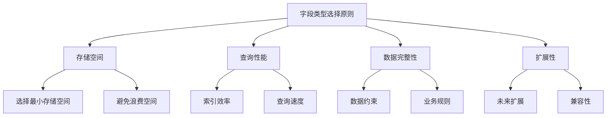
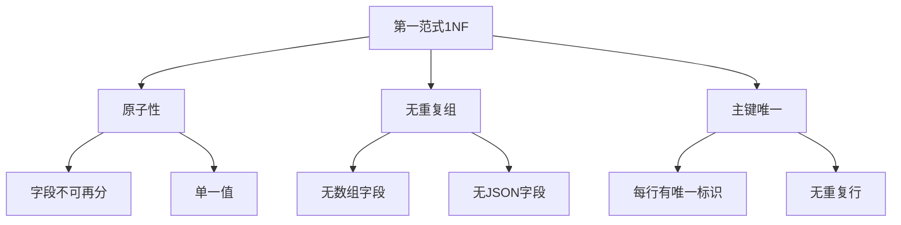
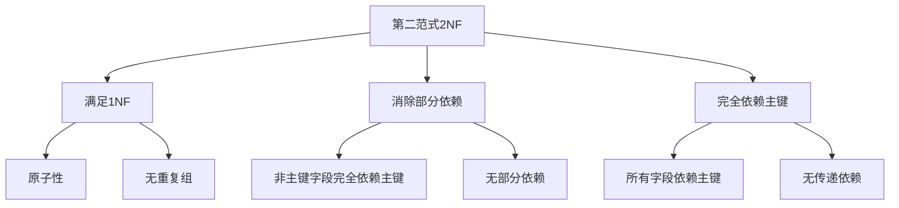
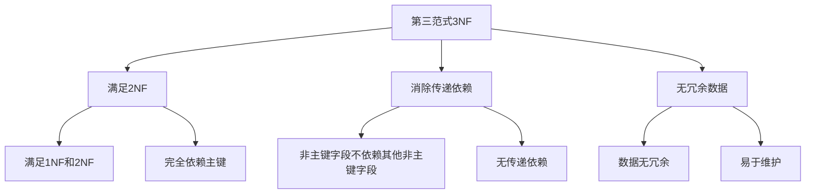
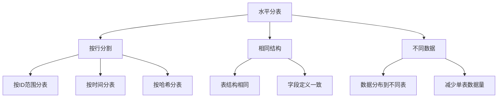
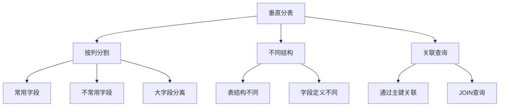
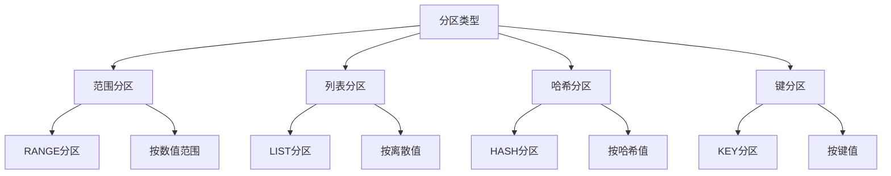

# MySQL 表结构优化详解

## 概述

表结构优化是MySQL性能调优的重要环节，合理的表设计可以显著提升查询性能和存储效率。本章节将详细介绍字段类型选择、范式设计、分表策略、分区表等优化技术。

## 1. 字段类型选择

### 1.1 数据类型选择原则



### 1.2 整数类型选择

```sql
-- 整数类型对比
/*
类型        字节数    有符号范围              无符号范围
TINYINT     1        -128 到 127            0 到 255
SMALLINT    2        -32,768 到 32,767      0 到 65,535
MEDIUMINT   3        -8,388,608 到 8,388,607 0 到 16,777,215
INT         4        -2,147,483,648 到 2,147,483,647 0 到 4,294,967,295
BIGINT      8        -9,223,372,036,854,775,808 到 9,223,372,036,854,775,807 0 到 18,446,744,073,709,551,615
*/

-- 实际应用示例
-- 1. 用户ID：使用INT足够
CREATE TABLE users (
    id INT AUTO_INCREMENT PRIMARY KEY,
    name VARCHAR(50)
);

-- 2. 年龄：使用TINYINT足够
CREATE TABLE users (
    id INT AUTO_INCREMENT PRIMARY KEY,
    name VARCHAR(50),
    age TINYINT UNSIGNED
);

-- 3. 大数值：使用BIGINT
CREATE TABLE orders (
    id BIGINT AUTO_INCREMENT PRIMARY KEY,
    amount BIGINT  -- 金额以分为单位
);
```

### 1.3 字符串类型选择

```sql
-- 字符串类型对比
/*
类型        最大长度    存储方式    特点
CHAR        255        固定长度    适合短字符串，定长
VARCHAR     65,535    可变长度    适合变长字符串
TEXT        65,535    可变长度    长文本
LONGTEXT    4,294,967,295 可变长度 超长文本
*/

-- 实际应用示例
-- 1. 固定长度字段：使用CHAR
CREATE TABLE users (
    id INT AUTO_INCREMENT PRIMARY KEY,
    name VARCHAR(50),
    gender CHAR(1),  -- 'M' 或 'F'
    country_code CHAR(2)  -- 'CN', 'US'
);

-- 2. 变长字符串：使用VARCHAR
CREATE TABLE products (
    id INT AUTO_INCREMENT PRIMARY KEY,
    name VARCHAR(200),
    description TEXT
);

-- 3. 长文本：使用TEXT
CREATE TABLE articles (
    id INT AUTO_INCREMENT PRIMARY KEY,
    title VARCHAR(200),
    content TEXT,
    summary VARCHAR(500)
);
```

### 1.4 日期时间类型选择

```sql
-- 日期时间类型对比
/*
类型        字节数    范围                    特点
DATE        3         1000-01-01 到 9999-12-31 日期
TIME        3         -838:59:59 到 838:59:59  时间
DATETIME    8         1000-01-01 00:00:00 到 9999-12-31 23:59:59 日期时间
TIMESTAMP   4         1970-01-01 00:00:01 到 2038-01-19 03:14:07 时间戳
YEAR        1         1901 到 2155            年份
*/

-- 实际应用示例
-- 1. 创建时间：使用TIMESTAMP（自动更新）
CREATE TABLE orders (
    id INT AUTO_INCREMENT PRIMARY KEY,
    user_id INT,
    amount DECIMAL(10,2),
    created_at TIMESTAMP DEFAULT CURRENT_TIMESTAMP,
    updated_at TIMESTAMP DEFAULT CURRENT_TIMESTAMP ON UPDATE CURRENT_TIMESTAMP
);

-- 2. 生日：使用DATE
CREATE TABLE users (
    id INT AUTO_INCREMENT PRIMARY KEY,
    name VARCHAR(50),
    birth_date DATE
);

-- 3. 会议时间：使用DATETIME
CREATE TABLE meetings (
    id INT AUTO_INCREMENT PRIMARY KEY,
    title VARCHAR(200),
    start_time DATETIME,
    end_time DATETIME
);
```

### 1.5 数值类型选择

```sql
-- 数值类型对比
/*
类型        字节数    精度        特点
FLOAT       4        单精度      7位有效数字
DOUBLE      8        双精度      15位有效数字
DECIMAL     变长      精确        定点数，精确计算
*/

-- 实际应用示例
-- 1. 金额：使用DECIMAL（精确计算）
CREATE TABLE orders (
    id INT AUTO_INCREMENT PRIMARY KEY,
    amount DECIMAL(10,2),  -- 总金额
    tax DECIMAL(8,2),      -- 税费
    discount DECIMAL(5,2)  -- 折扣
);

-- 2. 科学计算：使用DOUBLE
CREATE TABLE measurements (
    id INT AUTO_INCREMENT PRIMARY KEY,
    temperature DOUBLE,
    pressure DOUBLE,
    humidity DOUBLE
);

-- 3. 百分比：使用DECIMAL
CREATE TABLE products (
    id INT AUTO_INCREMENT PRIMARY KEY,
    name VARCHAR(200),
    price DECIMAL(10,2),
    discount_rate DECIMAL(5,4)  -- 0.0000 到 1.0000
);
```

## 2. 范式设计

### 2.1 第一范式（1NF）



### 2.2 第一范式示例

```sql
-- 不符合1NF的表（有重复组）
CREATE TABLE orders_bad (
    id INT PRIMARY KEY,
    user_id INT,
    product1_name VARCHAR(100),
    product1_price DECIMAL(10,2),
    product2_name VARCHAR(100),
    product2_price DECIMAL(10,2),
    product3_name VARCHAR(100),
    product3_price DECIMAL(10,2)
);

-- 符合1NF的表
CREATE TABLE orders (
    id INT PRIMARY KEY,
    user_id INT,
    created_at TIMESTAMP DEFAULT CURRENT_TIMESTAMP
);

CREATE TABLE order_items (
    id INT AUTO_INCREMENT PRIMARY KEY,
    order_id INT,
    product_name VARCHAR(100),
    price DECIMAL(10,2),
    quantity INT,
    FOREIGN KEY (order_id) REFERENCES orders(id)
);
```

### 2.3 第二范式（2NF）



### 2.4 第二范式示例

```sql
-- 不符合2NF的表（有部分依赖）
CREATE TABLE order_items_bad (
    id INT PRIMARY KEY,
    order_id INT,
    product_id INT,
    product_name VARCHAR(100),  -- 部分依赖product_id
    product_price DECIMAL(10,2), -- 部分依赖product_id
    quantity INT,
    total_price DECIMAL(10,2)
);

-- 符合2NF的表
CREATE TABLE orders (
    id INT PRIMARY KEY,
    user_id INT,
    created_at TIMESTAMP DEFAULT CURRENT_TIMESTAMP
);

CREATE TABLE products (
    id INT PRIMARY KEY,
    name VARCHAR(100),
    price DECIMAL(10,2)
);

CREATE TABLE order_items (
    id INT AUTO_INCREMENT PRIMARY KEY,
    order_id INT,
    product_id INT,
    quantity INT,
    FOREIGN KEY (order_id) REFERENCES orders(id),
    FOREIGN KEY (product_id) REFERENCES products(id)
);
```

### 2.5 第三范式（3NF）



### 2.6 第三范式示例

```sql
-- 不符合3NF的表（有传递依赖）
CREATE TABLE orders_bad (
    id INT PRIMARY KEY,
    user_id INT,
    user_name VARCHAR(50),     -- 依赖user_id
    user_email VARCHAR(100),   -- 依赖user_id
    product_id INT,
    product_name VARCHAR(100), -- 依赖product_id
    product_price DECIMAL(10,2), -- 依赖product_id
    quantity INT,
    total_price DECIMAL(10,2)
);

-- 符合3NF的表
CREATE TABLE users (
    id INT PRIMARY KEY,
    name VARCHAR(50),
    email VARCHAR(100)
);

CREATE TABLE products (
    id INT PRIMARY KEY,
    name VARCHAR(100),
    price DECIMAL(10,2)
);

CREATE TABLE orders (
    id INT PRIMARY KEY,
    user_id INT,
    created_at TIMESTAMP DEFAULT CURRENT_TIMESTAMP,
    FOREIGN KEY (user_id) REFERENCES users(id)
);

CREATE TABLE order_items (
    id INT AUTO_INCREMENT PRIMARY KEY,
    order_id INT,
    product_id INT,
    quantity INT,
    FOREIGN KEY (order_id) REFERENCES orders(id),
    FOREIGN KEY (product_id) REFERENCES products(id)
);
```

## 3. 分表策略

### 3.1 水平分表



### 3.2 水平分表示例

```sql
-- 1. 按ID范围分表
CREATE TABLE orders_0 (
    id INT PRIMARY KEY,
    user_id INT,
    amount DECIMAL(10,2),
    created_at TIMESTAMP DEFAULT CURRENT_TIMESTAMP
) CHECK (id >= 0 AND id < 1000000);

CREATE TABLE orders_1 (
    id INT PRIMARY KEY,
    user_id INT,
    amount DECIMAL(10,2),
    created_at TIMESTAMP DEFAULT CURRENT_TIMESTAMP
) CHECK (id >= 1000000 AND id < 2000000);

-- 2. 按时间分表
CREATE TABLE orders_2023 (
    id INT AUTO_INCREMENT PRIMARY KEY,
    user_id INT,
    amount DECIMAL(10,2),
    created_at TIMESTAMP DEFAULT CURRENT_TIMESTAMP
) CHECK (YEAR(created_at) = 2023);

CREATE TABLE orders_2024 (
    id INT AUTO_INCREMENT PRIMARY KEY,
    user_id INT,
    amount DECIMAL(10,2),
    created_at TIMESTAMP DEFAULT CURRENT_TIMESTAMP
) CHECK (YEAR(created_at) = 2024);

-- 3. 按哈希分表
CREATE TABLE orders_hash_0 (
    id INT PRIMARY KEY,
    user_id INT,
    amount DECIMAL(10,2),
    created_at TIMESTAMP DEFAULT CURRENT_TIMESTAMP
);

CREATE TABLE orders_hash_1 (
    id INT PRIMARY KEY,
    user_id INT,
    amount DECIMAL(10,2),
    created_at TIMESTAMP DEFAULT CURRENT_TIMESTAMP
);
```

### 3.3 垂直分表



### 3.4 垂直分表示例

```sql
-- 原始大表
CREATE TABLE users_big (
    id INT PRIMARY KEY,
    username VARCHAR(50),
    email VARCHAR(100),
    phone VARCHAR(20),
    avatar BLOB,
    profile TEXT,
    settings JSON,
    created_at TIMESTAMP DEFAULT CURRENT_TIMESTAMP
);

-- 垂直分表：基本信息
CREATE TABLE users (
    id INT PRIMARY KEY,
    username VARCHAR(50),
    email VARCHAR(100),
    phone VARCHAR(20),
    created_at TIMESTAMP DEFAULT CURRENT_TIMESTAMP
);

-- 垂直分表：详细信息
CREATE TABLE user_profiles (
    id INT PRIMARY KEY,
    user_id INT,
    avatar BLOB,
    profile TEXT,
    settings JSON,
    FOREIGN KEY (user_id) REFERENCES users(id)
);
```

### 3.5 分表查询策略

```sql
-- 1. 应用层分表查询
-- 根据分表规则选择表
SELECT * FROM orders_2023 WHERE user_id = 1;
SELECT * FROM orders_2024 WHERE user_id = 1;

-- 2. 使用UNION查询多个表
SELECT * FROM orders_0 WHERE user_id = 1
UNION ALL
SELECT * FROM orders_1 WHERE user_id = 1;

-- 3. 使用视图简化查询
CREATE VIEW orders_all AS
SELECT * FROM orders_2023
UNION ALL
SELECT * FROM orders_2024;

-- 4. 使用存储过程
DELIMITER //
CREATE PROCEDURE GetUserOrders(IN user_id INT)
BEGIN
    DECLARE current_year INT;
    SET current_year = YEAR(NOW());
    
    SET @sql = CONCAT('SELECT * FROM orders_', current_year, ' WHERE user_id = ?');
    PREPARE stmt FROM @sql;
    EXECUTE stmt USING user_id;
    DEALLOCATE PREPARE stmt;
END //
DELIMITER ;
```

## 4. 分区表

### 4.1 分区类型



### 4.2 范围分区

```sql
-- 按时间范围分区
CREATE TABLE orders_partitioned (
    id INT AUTO_INCREMENT,
    user_id INT,
    amount DECIMAL(10,2),
    created_at TIMESTAMP DEFAULT CURRENT_TIMESTAMP,
    PRIMARY KEY (id, created_at)
) PARTITION BY RANGE (YEAR(created_at)) (
    PARTITION p2022 VALUES LESS THAN (2023),
    PARTITION p2023 VALUES LESS THAN (2024),
    PARTITION p2024 VALUES LESS THAN (2025),
    PARTITION p_future VALUES LESS THAN MAXVALUE
);

-- 按ID范围分区
CREATE TABLE users_partitioned (
    id INT AUTO_INCREMENT,
    name VARCHAR(50),
    email VARCHAR(100),
    created_at TIMESTAMP DEFAULT CURRENT_TIMESTAMP,
    PRIMARY KEY (id)
) PARTITION BY RANGE (id) (
    PARTITION p0 VALUES LESS THAN (1000000),
    PARTITION p1 VALUES LESS THAN (2000000),
    PARTITION p2 VALUES LESS THAN (3000000),
    PARTITION p_max VALUES LESS THAN MAXVALUE
);
```

### 4.3 列表分区

```sql
-- 按地区分区
CREATE TABLE sales_partitioned (
    id INT AUTO_INCREMENT,
    region VARCHAR(20),
    amount DECIMAL(10,2),
    created_at TIMESTAMP DEFAULT CURRENT_TIMESTAMP,
    PRIMARY KEY (id, region)
) PARTITION BY LIST COLUMNS(region) (
    PARTITION p_north VALUES IN ('Beijing', 'Tianjin', 'Hebei'),
    PARTITION p_south VALUES IN ('Guangdong', 'Guangxi', 'Hainan'),
    PARTITION p_east VALUES IN ('Shanghai', 'Jiangsu', 'Zhejiang'),
    PARTITION p_west VALUES IN ('Sichuan', 'Chongqing', 'Yunnan')
);
```

### 4.4 哈希分区

```sql
-- 按用户ID哈希分区
CREATE TABLE orders_hash_partitioned (
    id INT AUTO_INCREMENT,
    user_id INT,
    amount DECIMAL(10,2),
    created_at TIMESTAMP DEFAULT CURRENT_TIMESTAMP,
    PRIMARY KEY (id, user_id)
) PARTITION BY HASH(user_id) PARTITIONS 4;

-- 按ID哈希分区
CREATE TABLE users_hash_partitioned (
    id INT AUTO_INCREMENT,
    name VARCHAR(50),
    email VARCHAR(100),
    created_at TIMESTAMP DEFAULT CURRENT_TIMESTAMP,
    PRIMARY KEY (id)
) PARTITION BY HASH(id) PARTITIONS 8;
```

### 4.5 分区管理

```sql
-- 1. 添加分区
ALTER TABLE orders_partitioned ADD PARTITION (
    PARTITION p2025 VALUES LESS THAN (2026)
);

-- 2. 删除分区
ALTER TABLE orders_partitioned DROP PARTITION p2022;

-- 3. 重组分区
ALTER TABLE orders_partitioned REORGANIZE PARTITION p_future INTO (
    PARTITION p2025 VALUES LESS THAN (2026),
    PARTITION p_future VALUES LESS THAN MAXVALUE
);

-- 4. 查看分区信息
SELECT 
    partition_name,
    partition_ordinal_position,
    partition_method,
    partition_expression,
    table_rows
FROM information_schema.partitions 
WHERE table_schema = 'your_database' 
AND table_name = 'orders_partitioned';
```

## 5. 索引优化

### 5.1 索引设计原则

```sql
-- 1. 为查询条件创建索引
CREATE INDEX idx_user_status ON orders (user_id, status);
CREATE INDEX idx_created_at ON orders (created_at);

-- 2. 为排序字段创建索引
CREATE INDEX idx_user_created ON orders (user_id, created_at);

-- 3. 为外键创建索引
CREATE INDEX idx_user_id ON orders (user_id);

-- 4. 创建覆盖索引
CREATE INDEX idx_user_status_amount ON orders (user_id, status, amount);

-- 5. 避免过多索引
-- 每个表建议不超过5个索引
```

### 5.2 复合索引优化

```sql
-- 1. 最左前缀原则
CREATE INDEX idx_user_status_created ON orders (user_id, status, created_at);

-- 可以使用索引的查询
SELECT * FROM orders WHERE user_id = 1;
SELECT * FROM orders WHERE user_id = 1 AND status = 'paid';
SELECT * FROM orders WHERE user_id = 1 AND status = 'paid' AND created_at > '2023-01-01';

-- 2. 高选择性列在前
CREATE INDEX idx_status_user ON orders (status, user_id);

-- 3. 考虑查询模式
-- 如果经常按user_id查询，则user_id在前
-- 如果经常按status查询，则status在前
```

## 6. 实际应用示例

### 6.1 电商系统表结构

```sql
-- 用户表（垂直分表）
CREATE TABLE users (
    id INT AUTO_INCREMENT PRIMARY KEY,
    username VARCHAR(50) UNIQUE,
    email VARCHAR(100) UNIQUE,
    phone VARCHAR(20),
    status ENUM('active', 'inactive', 'banned'),
    created_at TIMESTAMP DEFAULT CURRENT_TIMESTAMP,
    INDEX idx_status_created (status, created_at)
);

CREATE TABLE user_profiles (
    id INT PRIMARY KEY,
    user_id INT,
    avatar_url VARCHAR(200),
    bio TEXT,
    preferences JSON,
    FOREIGN KEY (user_id) REFERENCES users(id)
);

-- 商品表（分区表）
CREATE TABLE products (
    id INT AUTO_INCREMENT,
    name VARCHAR(200),
    category_id INT,
    price DECIMAL(10,2),
    stock INT,
    status ENUM('active', 'inactive', 'deleted'),
    created_at TIMESTAMP DEFAULT CURRENT_TIMESTAMP,
    PRIMARY KEY (id, created_at)
) PARTITION BY RANGE (YEAR(created_at)) (
    PARTITION p2023 VALUES LESS THAN (2024),
    PARTITION p2024 VALUES LESS THAN (2025),
    PARTITION p_future VALUES LESS THAN MAXVALUE
);

-- 订单表（水平分表）
CREATE TABLE orders_2023 (
    id INT AUTO_INCREMENT PRIMARY KEY,
    user_id INT,
    total_amount DECIMAL(10,2),
    status ENUM('pending', 'paid', 'shipped', 'delivered', 'cancelled'),
    created_at TIMESTAMP DEFAULT CURRENT_TIMESTAMP,
    INDEX idx_user_status (user_id, status),
    INDEX idx_created_at (created_at)
) CHECK (YEAR(created_at) = 2023);

CREATE TABLE orders_2024 (
    id INT AUTO_INCREMENT PRIMARY KEY,
    user_id INT,
    total_amount DECIMAL(10,2),
    status ENUM('pending', 'paid', 'shipped', 'delivered', 'cancelled'),
    created_at TIMESTAMP DEFAULT CURRENT_TIMESTAMP,
    INDEX idx_user_status (user_id, status),
    INDEX idx_created_at (created_at)
) CHECK (YEAR(created_at) = 2024);
```

### 6.2 日志系统表结构

```sql
-- 系统日志表（分区表）
CREATE TABLE system_logs (
    id BIGINT AUTO_INCREMENT,
    level ENUM('INFO', 'WARN', 'ERROR'),
    message TEXT,
    created_at TIMESTAMP DEFAULT CURRENT_TIMESTAMP,
    PRIMARY KEY (id, created_at)
) PARTITION BY RANGE (YEAR(created_at)) (
    PARTITION p2023 VALUES LESS THAN (2024),
    PARTITION p2024 VALUES LESS THAN (2025),
    PARTITION p_future VALUES LESS THAN MAXVALUE
);

-- 访问日志表（哈希分区）
CREATE TABLE access_logs (
    id BIGINT AUTO_INCREMENT,
    user_id INT,
    ip_address VARCHAR(45),
    user_agent TEXT,
    created_at TIMESTAMP DEFAULT CURRENT_TIMESTAMP,
    PRIMARY KEY (id, user_id)
) PARTITION BY HASH(user_id) PARTITIONS 8;
```

## 总结

MySQL表结构优化是性能调优的基础，关键要点包括：

1. **字段类型选择**：选择合适的数据类型，节省存储空间
2. **范式设计**：遵循数据库范式，减少数据冗余
3. **分表策略**：水平分表和垂直分表，提高查询性能
4. **分区表**：使用分区表管理大数据量
5. **索引优化**：合理设计索引，提高查询效率

在实际应用中，需要根据具体的业务需求、数据量和查询模式来选择合适的表结构优化策略。 