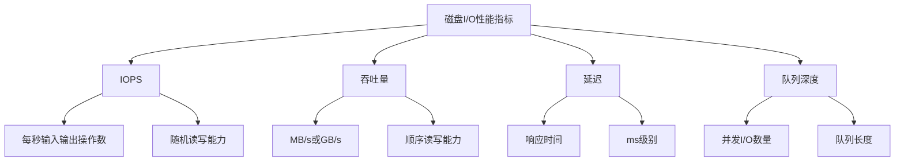

# MySQL 硬件优化详解

## 概述

硬件优化是MySQL性能调优的基础，合理的硬件配置可以显著提升数据库性能。本章节将详细介绍磁盘I/O优化、内存优化、CPU优化等硬件层面的优化策略。

## 1. 磁盘I/O优化

### 1.1 磁盘I/O性能指标



### 1.2 磁盘类型对比

```sql
-- 磁盘类型性能对比
/*
类型        IOPS      吞吐量    延迟      价格      适用场景
HDD        100-200   100-200MB/s 5-10ms   低       冷数据存储
SSD        50K-100K  500MB-2GB/s 0.1-1ms  中       热数据存储
NVMe SSD   500K-1M   3-7GB/s    0.01-0.1ms 高     高性能数据库
*/

-- 查看磁盘I/O统计
SELECT 
    variable_name,
    variable_value
FROM performance_schema.global_status 
WHERE variable_name LIKE 'Innodb_data_%';
```

### 1.3 SSD优化配置

```sql
-- 1. 调整InnoDB I/O相关参数
SET GLOBAL innodb_io_capacity = 2000;        -- SSD的IOPS能力
SET GLOBAL innodb_io_capacity_max = 4000;    -- 最大IOPS
SET GLOBAL innodb_flush_neighbors = 0;       -- SSD不需要邻居页刷新

-- 2. 优化日志文件大小
SET GLOBAL innodb_log_file_size = 2147483648;  -- 2GB
SET GLOBAL innodb_log_files_in_group = 4;      -- 4个日志文件

-- 3. 调整缓冲池刷新
SET GLOBAL innodb_flush_log_at_trx_commit = 1;  -- 每次提交刷新
SET GLOBAL innodb_flush_method = O_DIRECT;       -- 直接I/O
```

### 1.4 RAID配置优化

```sql
-- RAID配置建议
/*
RAID类型    冗余性    性能      容量利用率  适用场景
RAID 0      无        最高      100%       临时数据
RAID 1      有        高        50%        操作系统
RAID 5      有        中        67-94%     一般数据
RAID 10     有        高        50%        数据库
RAID 6      有        中        50-88%     大容量存储
*/

-- 监控I/O性能
SELECT 
    variable_name,
    variable_value
FROM performance_schema.global_status 
WHERE variable_name LIKE 'Innodb_buffer_pool_%';
```

### 1.5 文件系统优化

```bash
# 1. 使用合适的文件系统
# ext4: 通用文件系统，性能稳定
# xfs: 高性能文件系统，适合大文件
# btrfs: 现代文件系统，支持压缩

# 2. 挂载选项优化
# noatime: 不更新访问时间
# nodiratime: 不更新目录访问时间
# nobarrier: 禁用写屏障（SSD）
# data=writeback: 延迟写入

# 3. 文件系统对齐
# 确保文件系统块与磁盘扇区对齐
```

## 2. 内存优化

### 2.1 内存配置原则


### 2.2 内存配置示例

```sql
-- 查看当前内存配置
SHOW VARIABLES LIKE 'innodb_buffer_pool_size';
SHOW VARIABLES LIKE 'max_connections';
SHOW VARIABLES LIKE 'tmp_table_size';

-- 内存配置示例（16GB服务器）
SET GLOBAL innodb_buffer_pool_size = 10737418240;  -- 10GB (62.5%)
SET GLOBAL key_buffer_size = 268435456;            -- 256MB
SET GLOBAL query_cache_size = 67108864;            -- 64MB
SET GLOBAL tmp_table_size = 134217728;             -- 128MB
SET GLOBAL max_heap_table_size = 134217728;        -- 128MB
SET GLOBAL max_connections = 1000;                 -- 连接数
SET GLOBAL thread_cache_size = 100;                -- 线程缓存

-- 计算内存使用
-- 缓冲池: 10GB
-- 连接内存: 1000 × 2MB = 2GB
-- 其他缓存: ~1GB
-- 系统预留: ~3GB
-- 总计: ~16GB
```

### 2.3 内存监控

```sql
-- 1. 查看内存使用情况
SHOW ENGINE INNODB STATUS\G

-- 2. 监控缓冲池命中率
SELECT 
    (1 - (Innodb_buffer_pool_reads / Innodb_buffer_pool_read_requests)) * 100 as hit_ratio
FROM performance_schema.global_status 
WHERE variable_name IN ('Innodb_buffer_pool_reads', 'Innodb_buffer_pool_read_requests');

-- 3. 监控连接内存
SELECT 
    COUNT(*) as current_connections,
    COUNT(*) * 2 as estimated_memory_mb
FROM information_schema.processlist;

-- 4. 监控临时表使用
SELECT 
    Created_tmp_disk_tables as disk_tables,
    Created_tmp_tables as memory_tables
FROM performance_schema.global_status;
```

### 2.4 NUMA优化

```bash
# NUMA (Non-Uniform Memory Access) 优化
# 1. 查看NUMA节点
numactl --hardware

# 2. 绑定MySQL到特定NUMA节点
numactl --cpunodebind=0 --membind=0 mysqld

# 3. 配置NUMA策略
echo 1 > /proc/sys/vm/zone_reclaim_mode

# 4. 内存分配策略
# interleave: 在节点间交替分配
# local: 在本地节点分配
# preferred: 优先在指定节点分配
```

## 3. CPU优化

### 3.1 CPU配置优化


### 3.2 CPU相关参数

```sql
-- 1. 线程池配置
SET GLOBAL thread_pool_size = 16;              -- 线程池大小
SET GLOBAL thread_pool_oversubscribe = 3;      -- 过度订阅

-- 2. 并行查询配置
SET GLOBAL innodb_parallel_read_threads = 4;   -- 并行读取线程
SET GLOBAL innodb_read_io_threads = 4;         -- 读取I/O线程
SET GLOBAL innodb_write_io_threads = 4;        -- 写入I/O线程

-- 3. 查询优化器配置
SET GLOBAL optimizer_switch = 'index_merge=on,index_merge_union=on,index_merge_sort_union=on,index_merge_intersection=on';

-- 4. 统计信息配置
SET GLOBAL innodb_stats_on_metadata = 0;       -- 关闭元数据统计
```

### 3.3 CPU监控

```sql
-- 1. 查看CPU使用情况
SELECT 
    variable_name,
    variable_value
FROM performance_schema.global_status 
WHERE variable_name LIKE 'Threads_%';

-- 2. 监控查询性能
SELECT 
    COUNT(*) as active_queries,
    AVG(time) as avg_query_time
FROM information_schema.processlist 
WHERE command != 'Sleep';

-- 3. 监控线程状态
SELECT 
    state,
    COUNT(*) as thread_count
FROM performance_schema.threads 
GROUP BY state;
```

### 3.4 CPU绑定

```bash
# 1. 查看CPU拓扑
lscpu

# 2. 绑定MySQL到特定CPU核心
taskset -cp 0-7 $(pgrep mysqld)

# 3. 使用cgroups限制CPU使用
echo 100000 > /sys/fs/cgroup/cpu/mysql/cpu.cfs_quota_us

# 4. 设置CPU调度策略
chrt -p -f -r 1 $(pgrep mysqld)
```

## 4. 网络优化

### 4.1 网络配置

```sql
-- 1. 网络缓冲区配置
SET GLOBAL net_buffer_length = 16384;          -- 16KB
SET GLOBAL max_allowed_packet = 16777216;      -- 16MB
SET GLOBAL net_read_timeout = 30;              -- 读取超时
SET GLOBAL net_write_timeout = 60;             -- 写入超时

-- 2. 连接配置
SET GLOBAL max_connections = 1000;             -- 最大连接数
SET GLOBAL thread_cache_size = 100;            -- 线程缓存
SET GLOBAL table_open_cache = 4000;            -- 表缓存

-- 3. 连接池配置
-- 在应用层使用连接池
-- 减少连接创建和销毁开销
```

### 4.2 网络监控

```sql
-- 1. 查看网络统计
SELECT 
    variable_name,
    variable_value
FROM performance_schema.global_status 
WHERE variable_name LIKE 'Bytes_%';

-- 2. 监控连接状态
SELECT 
    COUNT(*) as total_connections,
    COUNT(CASE WHEN command != 'Sleep' THEN 1 END) as active_connections
FROM information_schema.processlist;

-- 3. 监控网络延迟
-- 使用ping和traceroute工具
```

## 5. 存储优化

### 5.1 存储设备选择

```sql
-- 存储设备性能对比
/*
设备类型     IOPS      延迟      容量      价格      适用场景
SATA SSD    50K-100K  0.1-1ms   1-4TB     中       一般数据库
NVMe SSD    500K-1M   0.01-0.1ms 1-8TB   高       高性能数据库
PCIe SSD    1M+       0.01ms    1-32TB   很高      企业级数据库
*/

-- 存储配置建议
-- 1. 操作系统和数据分离
-- 2. 日志文件单独存储
-- 3. 临时文件使用快速存储
-- 4. 备份文件使用大容量存储
```

### 5.2 文件布局优化

```bash
# 1. 目录结构优化
/var/lib/mysql/
├── data/           # 数据文件
├── logs/           # 日志文件
├── tmp/            # 临时文件
└── backup/         # 备份文件

# 2. 挂载点分离
# /dev/sda1 -> / (操作系统)
# /dev/sdb1 -> /var/lib/mysql/data (数据)
# /dev/sdc1 -> /var/lib/mysql/logs (日志)
# /dev/sdd1 -> /var/lib/mysql/tmp (临时)

# 3. 文件系统优化
# 数据目录: xfs (高性能)
# 日志目录: ext4 (稳定性)
# 临时目录: tmpfs (内存)
```

### 5.3 存储监控

```sql
-- 1. 查看存储使用情况
SELECT 
    table_schema,
    ROUND(SUM(data_length + index_length) / 1024 / 1024, 2) as size_mb
FROM information_schema.tables 
GROUP BY table_schema 
ORDER BY size_mb DESC;

-- 2. 监控表大小
SELECT 
    table_name,
    ROUND(((data_length + index_length) / 1024 / 1024), 2) as size_mb
FROM information_schema.tables 
WHERE table_schema = 'your_database'
ORDER BY size_mb DESC;

-- 3. 监控磁盘I/O
-- 使用iostat工具
```

## 6. 硬件监控脚本

### 6.1 系统监控脚本

```python
#!/usr/bin/env python3
# hardware_monitor.py

import psutil
import mysql.connector
import time
import json
import logging

class HardwareMonitor:
    def __init__(self, mysql_config):
        self.mysql_config = mysql_config
        self.mysql_conn = None
        
    def connect_mysql(self):
        try:
            self.mysql_conn = mysql.connector.connect(**self.mysql_config)
            return True
        except Exception as e:
            logging.error(f"MySQL连接失败: {e}")
            return False
    
    def get_system_info(self):
        """获取系统硬件信息"""
        return {
            'cpu_percent': psutil.cpu_percent(interval=1),
            'cpu_count': psutil.cpu_count(),
            'memory_percent': psutil.virtual_memory().percent,
            'memory_used': psutil.virtual_memory().used / 1024 / 1024 / 1024,  # GB
            'memory_total': psutil.virtual_memory().total / 1024 / 1024 / 1024,  # GB
            'disk_usage': psutil.disk_usage('/').percent,
            'disk_io': psutil.disk_io_counters()._asdict()
        }
    
    def get_mysql_info(self):
        """获取MySQL性能信息"""
        if not self.mysql_conn:
            return {}
        
        try:
            cursor = self.mysql_conn.cursor()
            
            # 获取MySQL状态
            status_vars = [
                'Innodb_buffer_pool_read_requests',
                'Innodb_buffer_pool_reads',
                'Threads_connected',
                'Threads_running',
                'Queries',
                'Slow_queries'
            ]
            
            mysql_info = {}
            for var in status_vars:
                cursor.execute(f"SELECT variable_value FROM performance_schema.global_status WHERE variable_name = '{var}'")
                result = cursor.fetchone()
                if result:
                    mysql_info[var] = result[0]
            
            # 计算缓冲池命中率
            if 'Innodb_buffer_pool_read_requests' in mysql_info and 'Innodb_buffer_pool_reads' in mysql_info:
                requests = int(mysql_info['Innodb_buffer_pool_read_requests'])
                reads = int(mysql_info['Innodb_buffer_pool_reads'])
                if requests > 0:
                    mysql_info['buffer_pool_hit_ratio'] = (1 - reads / requests) * 100
            
            return mysql_info
        except Exception as e:
            logging.error(f"获取MySQL信息失败: {e}")
            return {}
    
    def generate_report(self):
        """生成监控报告"""
        system_info = self.get_system_info()
        mysql_info = self.get_mysql_info()
        
        report = {
            'timestamp': time.strftime('%Y-%m-%d %H:%M:%S'),
            'system': system_info,
            'mysql': mysql_info
        }
        
        # 添加告警信息
        alerts = []
        if system_info['cpu_percent'] > 80:
            alerts.append('CPU使用率过高')
        if system_info['memory_percent'] > 80:
            alerts.append('内存使用率过高')
        if system_info['disk_usage'] > 80:
            alerts.append('磁盘使用率过高')
        if 'buffer_pool_hit_ratio' in mysql_info and mysql_info['buffer_pool_hit_ratio'] < 95:
            alerts.append('缓冲池命中率过低')
        
        report['alerts'] = alerts
        return report
    
    def monitor(self, interval=60):
        """持续监控"""
        if not self.connect_mysql():
            return
        
        while True:
            try:
                report = self.generate_report()
                print(json.dumps(report, indent=2))
                
                # 如果有告警，记录日志
                if report['alerts']:
                    logging.warning(f"检测到告警: {report['alerts']}")
                
                time.sleep(interval)
            except Exception as e:
                logging.error(f"监控过程中出错: {e}")
                time.sleep(interval)

if __name__ == "__main__":
    mysql_config = {
        'host': 'localhost',
        'user': 'root',
        'password': 'password',
        'database': 'mysql'
    }
    
    monitor = HardwareMonitor(mysql_config)
    monitor.monitor()
```

### 6.2 性能基准测试

```bash
#!/bin/bash
# mysql_benchmark.sh

# 1. 系统基准测试
echo "=== 系统基准测试 ==="
# CPU测试
sysbench cpu --cpu-max-prime=20000 run

# 内存测试
sysbench memory --memory-block-size=1K --memory-total-size=100G run

# 磁盘I/O测试
sysbench fileio --file-test-mode=seqwr run
sysbench fileio --file-test-mode=seqrd run
sysbench fileio --file-test-mode=rndwr run
sysbench fileio --file-test-mode=rndrd run

# 2. MySQL基准测试
echo "=== MySQL基准测试 ==="
# 准备测试数据
sysbench oltp_common --db-driver=mysql --mysql-db=test --mysql-user=root --mysql-password=password prepare

# 运行测试
sysbench oltp_read_write --db-driver=mysql --mysql-db=test --mysql-user=root --mysql-password=password --threads=16 --time=60 run

# 清理测试数据
sysbench oltp_common --db-driver=mysql --mysql-db=test --mysql-user=root --mysql-password=password cleanup
```

## 7. 实际应用示例

### 7.1 高性能服务器配置

```sql
-- 高性能服务器配置示例（64GB内存，32核CPU，NVMe SSD）

-- 1. 内存配置
SET GLOBAL innodb_buffer_pool_size = 53687091200;  -- 50GB (78%)
SET GLOBAL key_buffer_size = 1073741824;           -- 1GB
SET GLOBAL query_cache_size = 134217728;           -- 128MB
SET GLOBAL tmp_table_size = 536870912;             -- 512MB
SET GLOBAL max_heap_table_size = 536870912;        -- 512MB

-- 2. 连接配置
SET GLOBAL max_connections = 2000;                 -- 2000连接
SET GLOBAL thread_cache_size = 200;                -- 200线程缓存
SET GLOBAL table_open_cache = 8000;                -- 8000表缓存

-- 3. I/O配置
SET GLOBAL innodb_io_capacity = 8000;              -- 8000 IOPS
SET GLOBAL innodb_io_capacity_max = 16000;         -- 16000 IOPS
SET GLOBAL innodb_flush_neighbors = 0;             -- SSD优化
SET GLOBAL innodb_flush_log_at_trx_commit = 1;     -- 每次提交刷新
SET GLOBAL innodb_flush_method = O_DIRECT;         -- 直接I/O

-- 4. 并发配置
SET GLOBAL innodb_read_io_threads = 8;             -- 8个读线程
SET GLOBAL innodb_write_io_threads = 8;            -- 8个写线程
SET GLOBAL innodb_parallel_read_threads = 8;       -- 8个并行读线程
```

### 7.2 云服务器配置

```sql
-- 云服务器配置示例（8GB内存，4核CPU，云盘）

-- 1. 内存配置
SET GLOBAL innodb_buffer_pool_size = 6442450944;   -- 6GB (75%)
SET GLOBAL key_buffer_size = 268435456;            -- 256MB
SET GLOBAL query_cache_size = 67108864;            -- 64MB
SET GLOBAL tmp_table_size = 134217728;             -- 128MB

-- 2. 连接配置
SET GLOBAL max_connections = 500;                  -- 500连接
SET GLOBAL thread_cache_size = 50;                 -- 50线程缓存
SET GLOBAL table_open_cache = 2000;                -- 2000表缓存

-- 3. I/O配置
SET GLOBAL innodb_io_capacity = 2000;              -- 2000 IOPS
SET GLOBAL innodb_io_capacity_max = 4000;          -- 4000 IOPS
SET GLOBAL innodb_flush_neighbors = 0;             -- SSD优化

-- 4. 网络配置
SET GLOBAL max_allowed_packet = 16777216;          -- 16MB
SET GLOBAL net_buffer_length = 16384;              -- 16KB
SET GLOBAL net_read_timeout = 30;                  -- 30秒
SET GLOBAL net_write_timeout = 60;                 -- 60秒
```

## 总结

MySQL硬件优化是性能调优的基础，关键要点包括：

1. **磁盘I/O优化**：选择合适的存储设备，优化I/O参数
2. **内存优化**：合理分配内存，提高缓冲池命中率
3. **CPU优化**：利用多核并行，优化线程配置
4. **网络优化**：调整网络参数，使用连接池
5. **存储优化**：合理布局文件，选择合适文件系统
6. **监控告警**：建立硬件监控体系，及时发现问题

在实际应用中，需要根据具体的硬件配置、业务需求和预算来选择合适的优化策略。 

**[返回目录 README.md](./README.md)** 