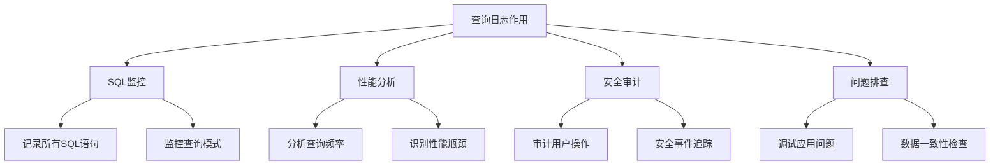

# MySQL 查询日志详解

## 概述

MySQL查询日志（General Query Log）记录所有发送到MySQL服务器的SQL语句，是数据库监控和调试的重要工具。本章节将详细介绍查询日志的配置、监控和分析方法。

## 1. 查询日志基础

### 1.1 查询日志作用



### 1.2 查询日志特点

```sql
-- 查询日志特点
/*
1. 记录所有SQL语句（SELECT、INSERT、UPDATE、DELETE等）
2. 记录连接和断开信息
3. 记录查询执行时间
4. 记录错误信息
5. 对性能有一定影响
6. 生产环境慎用
*/

-- 查看查询日志配置
SHOW VARIABLES LIKE 'general_log%';
SHOW VARIABLES LIKE 'log_output';
```

### 1.3 查询日志与慢查询日志对比

```sql
-- 查询日志 vs 慢查询日志
/*
特性          查询日志          慢查询日志
记录范围      所有SQL           超过阈值的SQL
性能影响      较大              较小
文件大小      很大              较小
用途          调试、审计        性能优化
生产环境      不推荐            推荐
*/
```

## 2. 查询日志配置

### 2.1 基本配置

```sql
-- 1. 开启查询日志
SET GLOBAL general_log = 'ON';

-- 2. 设置日志输出位置
SET GLOBAL log_output = 'FILE';  -- 输出到文件
SET GLOBAL log_output = 'TABLE'; -- 输出到表
SET GLOBAL log_output = 'FILE,TABLE'; -- 同时输出到文件和表

-- 3. 设置日志文件路径
SET GLOBAL general_log_file = '/var/log/mysql/general.log';

-- 4. 查看当前配置
SHOW VARIABLES LIKE 'general_log';
SHOW VARIABLES LIKE 'log_output';
SHOW VARIABLES LIKE 'general_log_file';
```

### 2.2 配置文件设置

```ini
# my.cnf 配置文件设置
[mysqld]
# 查询日志配置
general_log = 1
general_log_file = /var/log/mysql/general.log
log_output = FILE

# 日志轮转配置
log_rotate = 1
log_rotate_size = 100M
log_rotate_age = 7

# 性能优化
log_slow_queries = 1
long_query_time = 2
log_queries_not_using_indexes = 1
```

### 2.3 表输出配置

```sql
-- 1. 创建查询日志表
CREATE TABLE mysql.general_log (
    event_time TIMESTAMP(6) NOT NULL DEFAULT CURRENT_TIMESTAMP(6),
    user_host MEDIUMTEXT NOT NULL,
    thread_id BIGINT(21) UNSIGNED NOT NULL,
    server_id INT(10) UNSIGNED NOT NULL,
    command_type VARCHAR(64) NOT NULL,
    argument MEDIUMTEXT NOT NULL
) ENGINE=CSV DEFAULT CHARSET=utf8 COMMENT='General log';

-- 2. 设置表输出
SET GLOBAL log_output = 'TABLE';

-- 3. 查看日志表
SELECT * FROM mysql.general_log ORDER BY event_time DESC LIMIT 10;
```

## 3. 查询日志监控

### 3.1 日志文件监控

```bash
#!/bin/bash
# monitor_general_log.sh

# 1. 监控日志文件大小
log_file="/var/log/mysql/general.log"
max_size="100M"

current_size=$(du -h "$log_file" | cut -f1)
echo "当前日志文件大小: $current_size"

# 2. 监控日志增长
tail -f "$log_file" | while read line; do
    echo "$(date): $line" >> /tmp/general_log_monitor.log
done

# 3. 日志轮转
if [ $(stat -c%s "$log_file") -gt $(numfmt --from=iec "$max_size") ]; then
    mv "$log_file" "${log_file}.$(date +%Y%m%d_%H%M%S)"
    touch "$log_file"
    echo "日志文件已轮转"
fi
```

### 3.2 实时监控脚本

```python
#!/usr/bin/env python3
# general_log_monitor.py

import time
import re
import mysql.connector
from collections import defaultdict

class GeneralLogMonitor:
    def __init__(self, mysql_config):
        self.mysql_config = mysql_config
        self.conn = None
        
    def connect(self):
        try:
            self.conn = mysql.connector.connect(**self.mysql_config)
            return True
        except Exception as e:
            print(f"连接失败: {e}")
            return False
    
    def get_recent_queries(self, minutes=5):
        """获取最近的查询"""
        try:
            cursor = self.conn.cursor()
            
            query = """
            SELECT 
                event_time,
                user_host,
                command_type,
                argument
            FROM mysql.general_log 
            WHERE event_time >= DATE_SUB(NOW(), INTERVAL %s MINUTE)
            ORDER BY event_time DESC
            """
            
            cursor.execute(query, (minutes,))
            return cursor.fetchall()
            
        except Exception as e:
            print(f"获取查询失败: {e}")
            return []
    
    def analyze_query_patterns(self, queries):
        """分析查询模式"""
        patterns = defaultdict(int)
        slow_queries = []
        
        for event_time, user_host, command_type, argument in queries:
            # 统计查询类型
            patterns[command_type] += 1
            
            # 识别慢查询（简单分析）
            if command_type == 'Query' and len(argument) > 100:
                slow_queries.append({
                    'time': event_time,
                    'query': argument[:200] + '...' if len(argument) > 200 else argument
                })
        
        return patterns, slow_queries
    
    def monitor(self, interval=60):
        """持续监控"""
        if not self.connect():
            return
        
        print("开始监控查询日志...")
        
        while True:
            try:
                # 获取最近5分钟的查询
                queries = self.get_recent_queries(5)
                
                if queries:
                    patterns, slow_queries = self.analyze_query_patterns(queries)
                    
                    print(f"\n=== {time.strftime('%Y-%m-%d %H:%M:%S')} ===")
                    print(f"总查询数: {len(queries)}")
                    
                    # 显示查询类型统计
                    print("\n查询类型统计:")
                    for command_type, count in patterns.items():
                        print(f"  {command_type}: {count}")
                    
                    # 显示慢查询
                    if slow_queries:
                        print(f"\n可能的慢查询 ({len(slow_queries)}个):")
                        for query in slow_queries[:5]:  # 只显示前5个
                            print(f"  {query['time']}: {query['query']}")
                
                time.sleep(interval)
                
            except Exception as e:
                print(f"监控过程中出错: {e}")
                time.sleep(interval)

if __name__ == "__main__":
    mysql_config = {
        'host': 'localhost',
        'user': 'root',
        'password': 'password',
        'database': 'mysql'
    }
    
    monitor = GeneralLogMonitor(mysql_config)
    monitor.monitor()
```

### 3.3 查询统计

```sql
-- 1. 统计查询类型
SELECT 
    command_type,
    COUNT(*) as query_count,
    MIN(event_time) as first_query,
    MAX(event_time) as last_query
FROM mysql.general_log 
WHERE event_time >= DATE_SUB(NOW(), INTERVAL 1 HOUR)
GROUP BY command_type
ORDER BY query_count DESC;

-- 2. 统计用户查询
SELECT 
    user_host,
    COUNT(*) as query_count,
    COUNT(DISTINCT DATE(event_time)) as active_days
FROM mysql.general_log 
WHERE event_time >= DATE_SUB(NOW(), INTERVAL 1 DAY)
GROUP BY user_host
ORDER BY query_count DESC;

-- 3. 统计查询频率
SELECT 
    HOUR(event_time) as hour,
    COUNT(*) as query_count
FROM mysql.general_log 
WHERE event_time >= DATE_SUB(NOW(), INTERVAL 1 DAY)
GROUP BY HOUR(event_time)
ORDER BY hour;
```

## 4. 查询日志分析

### 4.1 日志分析脚本

```python
#!/usr/bin/env python3
# general_log_analyzer.py

import re
import json
from datetime import datetime, timedelta
from collections import defaultdict

class GeneralLogAnalyzer:
    def __init__(self, log_file):
        self.log_file = log_file
        self.queries = []
        
    def parse_log_file(self):
        """解析日志文件"""
        with open(self.log_file, 'r') as f:
            for line in f:
                # 解析日志行
                match = re.match(r'(\d{4}-\d{2}-\d{2}\s+\d{2}:\d{2}:\d{2})\s+(\d+)\s+(\w+)\s+(.+)', line)
                if match:
                    timestamp, thread_id, command_type, argument = match.groups()
                    self.queries.append({
                        'timestamp': timestamp,
                        'thread_id': thread_id,
                        'command_type': command_type,
                        'argument': argument.strip()
                    })
    
    def analyze_query_patterns(self):
        """分析查询模式"""
        patterns = defaultdict(int)
        slow_queries = []
        error_queries = []
        
        for query in self.queries:
            command_type = query['command_type']
            argument = query['argument']
            
            # 统计查询类型
            patterns[command_type] += 1
            
            # 识别慢查询（简单规则）
            if command_type == 'Query' and len(argument) > 100:
                slow_queries.append(query)
            
            # 识别错误查询
            if 'ERROR' in argument or 'error' in argument.lower():
                error_queries.append(query)
        
        return patterns, slow_queries, error_queries
    
    def analyze_sql_patterns(self):
        """分析SQL模式"""
        sql_patterns = defaultdict(int)
        
        for query in self.queries:
            if query['command_type'] == 'Query':
                sql = query['argument'].upper()
                
                # 识别SQL类型
                if sql.startswith('SELECT'):
                    sql_patterns['SELECT'] += 1
                elif sql.startswith('INSERT'):
                    sql_patterns['INSERT'] += 1
                elif sql.startswith('UPDATE'):
                    sql_patterns['UPDATE'] += 1
                elif sql.startswith('DELETE'):
                    sql_patterns['DELETE'] += 1
                elif sql.startswith('CREATE'):
                    sql_patterns['CREATE'] += 1
                elif sql.startswith('ALTER'):
                    sql_patterns['ALTER'] += 1
                elif sql.startswith('DROP'):
                    sql_patterns['DROP'] += 1
        
        return sql_patterns
    
    def generate_report(self):
        """生成分析报告"""
        patterns, slow_queries, error_queries = self.analyze_query_patterns()
        sql_patterns = self.analyze_sql_patterns()
        
        report = {
            'analysis_time': datetime.now().isoformat(),
            'total_queries': len(self.queries),
            'command_patterns': dict(patterns),
            'sql_patterns': dict(sql_patterns),
            'slow_queries_count': len(slow_queries),
            'error_queries_count': len(error_queries),
            'slow_queries': slow_queries[:10],  # 前10个慢查询
            'error_queries': error_queries[:10]  # 前10个错误查询
        }
        
        return report

def main():
    analyzer = GeneralLogAnalyzer('/var/log/mysql/general.log')
    analyzer.parse_log_file()
    report = analyzer.generate_report()
    
    print(json.dumps(report, indent=2, ensure_ascii=False))

if __name__ == "__main__":
    main()
```

### 4.2 性能分析

```sql
-- 1. 分析查询频率
SELECT 
    DATE(event_time) as date,
    HOUR(event_time) as hour,
    COUNT(*) as query_count,
    COUNT(DISTINCT user_host) as unique_users
FROM mysql.general_log 
WHERE event_time >= DATE_SUB(NOW(), INTERVAL 7 DAY)
GROUP BY DATE(event_time), HOUR(event_time)
ORDER BY date DESC, hour;

-- 2. 分析查询类型分布
SELECT 
    command_type,
    COUNT(*) as total_count,
    COUNT(*) * 100.0 / (SELECT COUNT(*) FROM mysql.general_log WHERE event_time >= DATE_SUB(NOW(), INTERVAL 1 DAY)) as percentage
FROM mysql.general_log 
WHERE event_time >= DATE_SUB(NOW(), INTERVAL 1 DAY)
GROUP BY command_type
ORDER BY total_count DESC;

-- 3. 分析用户活跃度
SELECT 
    user_host,
    COUNT(*) as query_count,
    COUNT(DISTINCT DATE(event_time)) as active_days,
    MIN(event_time) as first_query,
    MAX(event_time) as last_query
FROM mysql.general_log 
WHERE event_time >= DATE_SUB(NOW(), INTERVAL 30 DAY)
GROUP BY user_host
HAVING query_count > 100
ORDER BY query_count DESC;
```

### 4.3 安全审计

```sql
-- 1. 审计敏感操作
SELECT 
    event_time,
    user_host,
    argument
FROM mysql.general_log 
WHERE argument LIKE '%DROP%'
   OR argument LIKE '%TRUNCATE%'
   OR argument LIKE '%DELETE FROM%'
   OR argument LIKE '%ALTER TABLE%'
ORDER BY event_time DESC;

-- 2. 审计用户权限
SELECT 
    user_host,
    COUNT(*) as query_count,
    COUNT(DISTINCT DATE(event_time)) as active_days
FROM mysql.general_log 
WHERE event_time >= DATE_SUB(NOW(), INTERVAL 1 DAY)
  AND user_host NOT LIKE 'localhost%'
GROUP BY user_host
ORDER BY query_count DESC;

-- 3. 审计异常连接
SELECT 
    user_host,
    COUNT(*) as connection_count,
    MIN(event_time) as first_connection,
    MAX(event_time) as last_connection
FROM mysql.general_log 
WHERE command_type = 'Connect'
  AND event_time >= DATE_SUB(NOW(), INTERVAL 1 DAY)
GROUP BY user_host
HAVING connection_count > 10
ORDER BY connection_count DESC;
```

## 5. 查询日志优化

### 5.1 性能优化

```sql
-- 1. 限制日志大小
-- 设置日志文件大小限制
SET GLOBAL general_log_file = '/var/log/mysql/general.log';

-- 2. 定期清理日志
-- 创建清理脚本
DELIMITER //
CREATE PROCEDURE CleanGeneralLog()
BEGIN
    -- 删除7天前的日志
    DELETE FROM mysql.general_log 
    WHERE event_time < DATE_SUB(NOW(), INTERVAL 7 DAY);
    
    -- 优化表
    OPTIMIZE TABLE mysql.general_log;
END //
DELIMITER ;

-- 3. 创建事件调度器
CREATE EVENT clean_general_log_event
ON SCHEDULE EVERY 1 DAY
DO CALL CleanGeneralLog();

-- 4. 使用表输出时的优化
-- 定期清理表数据
DELETE FROM mysql.general_log 
WHERE event_time < DATE_SUB(NOW(), INTERVAL 3 DAY);
```

### 5.2 存储优化

```sql
-- 1. 使用分区表存储日志
CREATE TABLE mysql.general_log_partitioned (
    event_time TIMESTAMP(6) NOT NULL DEFAULT CURRENT_TIMESTAMP(6),
    user_host MEDIUMTEXT NOT NULL,
    thread_id BIGINT(21) UNSIGNED NOT NULL,
    server_id INT(10) UNSIGNED NOT NULL,
    command_type VARCHAR(64) NOT NULL,
    argument MEDIUMTEXT NOT NULL
) ENGINE=InnoDB DEFAULT CHARSET=utf8 
PARTITION BY RANGE (YEAR(event_time)) (
    PARTITION p2023 VALUES LESS THAN (2024),
    PARTITION p2024 VALUES LESS THAN (2025),
    PARTITION p_future VALUES LESS THAN MAXVALUE
);

-- 2. 创建索引优化查询
CREATE INDEX idx_event_time ON mysql.general_log (event_time);
CREATE INDEX idx_command_type ON mysql.general_log (command_type);
CREATE INDEX idx_user_host ON mysql.general_log (user_host(50));

-- 3. 压缩存储
-- 使用压缩表减少存储空间
ALTER TABLE mysql.general_log ROW_FORMAT=COMPRESSED;
```

### 5.3 监控告警

```python
#!/usr/bin/env python3
# general_log_alert.py

import mysql.connector
import time
import smtplib
from email.mime.text import MIMEText

class GeneralLogAlert:
    def __init__(self, mysql_config, email_config):
        self.mysql_config = mysql_config
        self.email_config = email_config
        self.conn = None
        
    def connect(self):
        try:
            self.conn = mysql.connector.connect(**self.mysql_config)
            return True
        except Exception as e:
            print(f"连接失败: {e}")
            return False
    
    def check_alerts(self):
        """检查告警条件"""
        alerts = []
        
        try:
            cursor = self.conn.cursor()
            
            # 1. 检查错误查询数量
            cursor.execute("""
                SELECT COUNT(*) 
                FROM mysql.general_log 
                WHERE event_time >= DATE_SUB(NOW(), INTERVAL 1 HOUR)
                  AND argument LIKE '%ERROR%'
            """)
            error_count = cursor.fetchone()[0]
            
            if error_count > 10:
                alerts.append(f"过去1小时内有{error_count}个错误查询")
            
            # 2. 检查异常连接
            cursor.execute("""
                SELECT COUNT(DISTINCT user_host) 
                FROM mysql.general_log 
                WHERE event_time >= DATE_SUB(NOW(), INTERVAL 1 HOUR)
                  AND command_type = 'Connect'
                  AND user_host NOT LIKE 'localhost%'
            """)
            external_connections = cursor.fetchone()[0]
            
            if external_connections > 5:
                alerts.append(f"过去1小时内有{external_connections}个外部连接")
            
            # 3. 检查敏感操作
            cursor.execute("""
                SELECT COUNT(*) 
                FROM mysql.general_log 
                WHERE event_time >= DATE_SUB(NOW(), INTERVAL 1 HOUR)
                  AND (argument LIKE '%DROP%' OR argument LIKE '%TRUNCATE%')
            """)
            sensitive_ops = cursor.fetchone()[0]
            
            if sensitive_ops > 0:
                alerts.append(f"过去1小时内有{sensitive_ops}个敏感操作")
            
        except Exception as e:
            print(f"检查告警失败: {e}")
        
        return alerts
    
    def send_alert(self, alerts):
        """发送告警邮件"""
        if not alerts:
            return
        
        try:
            msg = MIMEText('\n'.join(alerts))
            msg['Subject'] = 'MySQL查询日志告警'
            msg['From'] = self.email_config['from']
            msg['To'] = self.email_config['to']
            
            with smtplib.SMTP(self.email_config['smtp_server']) as server:
                server.login(self.email_config['username'], self.email_config['password'])
                server.send_message(msg)
            
            print(f"告警邮件已发送: {alerts}")
            
        except Exception as e:
            print(f"发送告警邮件失败: {e}")
    
    def monitor(self, interval=300):
        """持续监控"""
        if not self.connect():
            return
        
        print("开始监控查询日志告警...")
        
        while True:
            try:
                alerts = self.check_alerts()
                if alerts:
                    self.send_alert(alerts)
                
                time.sleep(interval)
                
            except Exception as e:
                print(f"监控过程中出错: {e}")
                time.sleep(interval)

if __name__ == "__main__":
    mysql_config = {
        'host': 'localhost',
        'user': 'root',
        'password': 'password',
        'database': 'mysql'
    }
    
    email_config = {
        'smtp_server': 'smtp.gmail.com',
        'username': 'your_email@gmail.com',
        'password': 'your_password',
        'from': 'your_email@gmail.com',
        'to': 'admin@company.com'
    }
    
    alert = GeneralLogAlert(mysql_config, email_config)
    alert.monitor()
```

## 6. 实际应用示例

### 6.1 开发环境配置

```sql
-- 开发环境查询日志配置
-- 1. 开启查询日志
SET GLOBAL general_log = 'ON';
SET GLOBAL log_output = 'FILE';
SET GLOBAL general_log_file = '/tmp/mysql_general.log';

-- 2. 设置日志轮转
-- 每天轮转一次，保留7天
-- 使用logrotate工具

-- 3. 监控开发人员查询
-- 分析查询模式，优化开发效率
```

### 6.2 生产环境配置

```sql
-- 生产环境查询日志配置
-- 1. 谨慎开启，仅在需要时开启
SET GLOBAL general_log = 'OFF';  -- 默认关闭

-- 2. 临时开启用于问题排查
SET GLOBAL general_log = 'ON';
SET GLOBAL log_output = 'TABLE';  -- 使用表输出，便于查询

-- 3. 问题排查完成后立即关闭
SET GLOBAL general_log = 'OFF';

-- 4. 清理日志数据
DELETE FROM mysql.general_log WHERE event_time < DATE_SUB(NOW(), INTERVAL 1 DAY);
```

### 6.3 安全审计配置

```sql
-- 安全审计配置
-- 1. 记录所有操作
SET GLOBAL general_log = 'ON';
SET GLOBAL log_output = 'FILE';
SET GLOBAL general_log_file = '/var/log/mysql/audit.log';

-- 2. 设置文件权限
-- chmod 600 /var/log/mysql/audit.log
-- chown mysql:mysql /var/log/mysql/audit.log

-- 3. 定期备份日志
-- 使用rsync或scp备份到安全位置

-- 4. 监控敏感操作
-- 使用脚本监控DROP、DELETE、ALTER等操作
```

## 总结

MySQL查询日志是数据库监控和调试的重要工具，关键要点包括：

1. **配置管理**：合理配置日志输出位置和大小
2. **性能监控**：分析查询模式和频率
3. **安全审计**：监控敏感操作和异常连接
4. **存储优化**：使用分区表和压缩减少存储空间
5. **告警机制**：建立监控告警体系
6. **生产环境**：谨慎使用，避免性能影响

在实际应用中，需要根据具体需求选择合适的配置策略，平衡监控需求和性能影响。 

**[返回目录 README.md](./README?id=_7-mysql-日志)** 