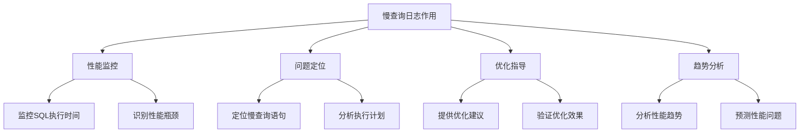

# MySQL 慢查询日志详解

## 概述

慢查询日志是MySQL性能调优的重要工具，它能够记录执行时间超过指定阈值的SQL语句。本章节将详细介绍慢查询日志的配置、分析方法和优化策略。

## 1. 慢查询日志基础

### 1.1 慢查询日志作用



### 1.2 慢查询日志特点

- **记录慢SQL**：记录执行时间超过阈值的SQL语句
- **详细信息**：包含执行时间、扫描行数、返回行数等
- **可配置性**：可以设置阈值、日志格式、输出位置等
- **性能影响**：开启慢查询日志会对性能产生轻微影响

## 2. 慢查询日志配置

### 2.1 基本配置参数

```sql
-- 查看当前慢查询日志配置
SHOW VARIABLES LIKE 'slow_query_log%';
SHOW VARIABLES LIKE 'long_query_time';
SHOW VARIABLES LIKE 'log_queries_not_using_indexes';

-- 配置示例
SET GLOBAL slow_query_log = 'ON';                    -- 开启慢查询日志
SET GLOBAL long_query_time = 2;                      -- 设置慢查询阈值为2秒
SET GLOBAL log_queries_not_using_indexes = 'ON';    -- 记录未使用索引的查询
SET GLOBAL slow_query_log_file = '/var/log/mysql/slow.log';  -- 设置日志文件路径
```

### 2.2 配置文件设置

```ini
# my.cnf 配置文件
[mysqld]
# 慢查询日志配置
slow_query_log = 1
slow_query_log_file = /var/log/mysql/slow.log
long_query_time = 2
log_queries_not_using_indexes = 1
log_slow_admin_statements = 1
log_slow_slave_statements = 1
```

### 2.3 动态配置示例

```sql
-- 动态开启慢查询日志
SET GLOBAL slow_query_log = 'ON';

-- 设置慢查询阈值（秒）
SET GLOBAL long_query_time = 1;

-- 记录未使用索引的查询
SET GLOBAL log_queries_not_using_indexes = 'ON';

-- 记录管理语句（如OPTIMIZE TABLE）
SET GLOBAL log_slow_admin_statements = 'ON';

-- 设置日志文件路径
SET GLOBAL slow_query_log_file = '/var/log/mysql/slow.log';

-- 验证配置
SHOW VARIABLES LIKE 'slow_query_log%';
SHOW VARIABLES LIKE 'long_query_time';
```

## 3. 慢查询日志格式

### 3.1 日志格式示例

```sql
# Time: 2023-01-15T10:30:45.123456Z
# User@Host: root[root] @ localhost [127.0.0.1]  Id: 12345
# Query_time: 5.234567  Lock_time: 0.000123  Rows_sent: 1000  Rows_examined: 50000
SET timestamp=1673778645;
SELECT * FROM orders o 
JOIN users u ON o.user_id = u.id 
WHERE o.created_at > '2023-01-01' 
ORDER BY o.created_at DESC;
```

### 3.2 日志字段说明

```sql
-- 日志字段含义
/*
Time: 查询执行的时间戳
User@Host: 执行查询的用户和主机信息
Query_time: SQL执行时间（秒）
Lock_time: 锁等待时间（秒）
Rows_sent: 返回给客户端的行数
Rows_examined: 扫描的行数
*/
```

### 3.3 日志文件管理

```bash
# 查看慢查询日志文件
tail -f /var/log/mysql/slow.log

# 统计慢查询数量
grep "Query_time:" /var/log/mysql/slow.log | wc -l

# 查找最慢的查询
grep "Query_time:" /var/log/mysql/slow.log | sort -k3 -nr | head -10

# 按时间范围过滤
grep "2023-01-15" /var/log/mysql/slow.log

# 日志轮转
mv /var/log/mysql/slow.log /var/log/mysql/slow.log.$(date +%Y%m%d)
mysqladmin flush-logs
```

## 4. 慢查询日志分析

### 4.1 使用mysqldumpslow分析

```bash
# 安装mysqldumpslow工具
# mysqldumpslow是MySQL自带的慢查询分析工具

# 查看帮助信息
mysqldumpslow --help

# 分析慢查询日志
mysqldumpslow /var/log/mysql/slow.log

# 按执行时间排序
mysqldumpslow -s t /var/log/mysql/slow.log

# 按执行次数排序
mysqldumpslow -s c /var/log/mysql/slow.log

# 显示前10条最慢的查询
mysqldumpslow -s t -t 10 /var/log/mysql/slow.log

# 按模式过滤
mysqldumpslow -g "SELECT" /var/log/mysql/slow.log
```

### 4.2 使用pt-query-digest分析

```bash
# 安装Percona Toolkit
# pt-query-digest是更强大的慢查询分析工具

# 基本分析
pt-query-digest /var/log/mysql/slow.log

# 生成详细报告
pt-query-digest --report /var/log/mysql/slow.log > slow_report.txt

# 按时间范围分析
pt-query-digest --since '2023-01-15 00:00:00' --until '2023-01-15 23:59:59' /var/log/mysql/slow.log

# 输出JSON格式
pt-query-digest --output json /var/log/mysql/slow.log > slow_report.json

# 分析特定类型的查询
pt-query-digest --filter '$event->{fingerprint} =~ m/^SELECT/' /var/log/mysql/slow.log
```

### 4.3 自定义分析脚本

```python
#!/usr/bin/env python3
# slow_query_analyzer.py

import re
import sys
from collections import defaultdict

def analyze_slow_log(log_file):
    queries = defaultdict(list)
    
    with open(log_file, 'r') as f:
        current_query = {}
        for line in f:
            if line.startswith('# Time:'):
                if current_query:
                    queries[current_query.get('sql', '')].append(current_query)
                current_query = {'time': line.strip()}
            elif line.startswith('# Query_time:'):
                match = re.search(r'Query_time: ([\d.]+)', line)
                if match:
                    current_query['query_time'] = float(match.group(1))
            elif line.startswith('# Rows_examined:'):
                match = re.search(r'Rows_examined: (\d+)', line)
                if match:
                    current_query['rows_examined'] = int(match.group(1))
            elif not line.startswith('#') and line.strip():
                current_query['sql'] = line.strip()
    
    # 分析结果
    for sql, executions in queries.items():
        if len(executions) > 1:
            avg_time = sum(e['query_time'] for e in executions) / len(executions)
            total_rows = sum(e.get('rows_examined', 0) for e in executions)
            print(f"SQL: {sql[:100]}...")
            print(f"执行次数: {len(executions)}")
            print(f"平均时间: {avg_time:.3f}秒")
            print(f"总扫描行数: {total_rows}")
            print("-" * 50)

if __name__ == "__main__":
    analyze_slow_log(sys.argv[1])
```

## 5. 慢查询优化策略

### 5.1 索引优化

```sql
-- 1. 分析慢查询的索引使用情况
EXPLAIN SELECT * FROM orders o 
JOIN users u ON o.user_id = u.id 
WHERE o.created_at > '2023-01-01' 
ORDER BY o.created_at DESC;

-- 2. 为常用查询条件创建索引
CREATE INDEX idx_orders_created_at ON orders (created_at);
CREATE INDEX idx_orders_user_created ON orders (user_id, created_at);

-- 3. 创建覆盖索引
CREATE INDEX idx_orders_covering ON orders (user_id, created_at, amount, status);

-- 4. 优化复合索引顺序
-- 根据查询模式调整索引列顺序
CREATE INDEX idx_orders_user_status_created ON orders (user_id, status, created_at);
```

### 5.2 SQL语句优化

```sql
-- 1. 避免SELECT *
SELECT id, user_id, amount, created_at FROM orders 
WHERE user_id = 1 AND created_at > '2023-01-01';

-- 2. 使用LIMIT限制结果集
SELECT * FROM orders 
WHERE user_id = 1 
ORDER BY created_at DESC 
LIMIT 20;

-- 3. 优化JOIN查询
-- 不推荐：笛卡尔积
SELECT * FROM orders o, users u WHERE o.user_id = u.id;

-- 推荐：明确JOIN条件
SELECT o.*, u.name FROM orders o 
INNER JOIN users u ON o.user_id = u.id 
WHERE o.created_at > '2023-01-01';

-- 4. 使用EXISTS代替IN
-- 不推荐
SELECT * FROM orders WHERE user_id IN (SELECT id FROM users WHERE status = 'active');

-- 推荐
SELECT * FROM orders o 
WHERE EXISTS (SELECT 1 FROM users u WHERE u.id = o.user_id AND u.status = 'active');
```

### 5.3 查询重写

```sql
-- 1. 分页查询优化
-- 不推荐：OFFSET
SELECT * FROM orders ORDER BY created_at DESC LIMIT 1000 OFFSET 10000;

-- 推荐：使用游标分页
SELECT * FROM orders 
WHERE created_at < '2023-01-10 10:00:00' 
ORDER BY created_at DESC 
LIMIT 1000;

-- 2. 聚合查询优化
-- 不推荐：在应用层聚合
SELECT * FROM orders WHERE user_id = 1;

-- 推荐：在数据库层聚合
SELECT 
    user_id,
    COUNT(*) as order_count,
    SUM(amount) as total_amount,
    AVG(amount) as avg_amount
FROM orders 
WHERE created_at > '2023-01-01'
GROUP BY user_id;

-- 3. 子查询优化
-- 不推荐：相关子查询
SELECT * FROM orders o 
WHERE o.amount > (SELECT AVG(amount) FROM orders WHERE user_id = o.user_id);

-- 推荐：JOIN优化
SELECT o.* FROM orders o 
INNER JOIN (
    SELECT user_id, AVG(amount) as avg_amount 
    FROM orders 
    GROUP BY user_id
) avg_orders ON o.user_id = avg_orders.user_id 
WHERE o.amount > avg_orders.avg_amount;
```

## 6. 慢查询监控

### 6.1 实时监控

```sql
-- 1. 监控当前慢查询
SELECT 
    id,
    user,
    host,
    db,
    command,
    time,
    state,
    info
FROM information_schema.processlist 
WHERE time > 2 AND info IS NOT NULL;

-- 2. 监控慢查询统计
SELECT 
    variable_name,
    variable_value
FROM performance_schema.global_status 
WHERE variable_name LIKE 'Slow_queries';

-- 3. 监控索引使用情况
SELECT 
    object_schema,
    object_name,
    index_name,
    count_read,
    count_write
FROM performance_schema.table_io_waits_summary_by_index_usage
WHERE count_read > 0 OR count_write > 0
ORDER BY count_read DESC;
```

### 6.2 定期分析

```bash
#!/bin/bash
# slow_query_monitor.sh

# 配置
SLOW_LOG="/var/log/mysql/slow.log"
REPORT_DIR="/var/log/mysql/reports"
DATE=$(date +%Y%m%d)

# 创建报告目录
mkdir -p $REPORT_DIR

# 生成每日报告
pt-query-digest --report \
    --since "$(date -d '1 day ago' '+%Y-%m-%d %H:%M:%S')" \
    --until "$(date '+%Y-%m-%d %H:%M:%S')" \
    $SLOW_LOG > $REPORT_DIR/slow_report_$DATE.txt

# 发送邮件通知
if [ -s $REPORT_DIR/slow_report_$DATE.txt ]; then
    mail -s "MySQL Slow Query Report - $DATE" admin@example.com < $REPORT_DIR/slow_report_$DATE.txt
fi

# 清理旧报告（保留30天）
find $REPORT_DIR -name "slow_report_*.txt" -mtime +30 -delete
```

### 6.3 告警设置

```sql
-- 创建慢查询告警表
CREATE TABLE slow_query_alerts (
    id INT AUTO_INCREMENT PRIMARY KEY,
    alert_time TIMESTAMP DEFAULT CURRENT_TIMESTAMP,
    query_count INT,
    avg_query_time DECIMAL(10,3),
    max_query_time DECIMAL(10,3),
    alert_message TEXT
);

-- 创建告警存储过程
DELIMITER //
CREATE PROCEDURE check_slow_queries()
BEGIN
    DECLARE slow_count INT;
    DECLARE avg_time DECIMAL(10,3);
    DECLARE max_time DECIMAL(10,3);
    
    -- 统计慢查询
    SELECT COUNT(*) INTO slow_count
    FROM information_schema.processlist 
    WHERE time > 5;
    
    -- 如果慢查询过多，插入告警
    IF slow_count > 10 THEN
        INSERT INTO slow_query_alerts (query_count, alert_message)
        VALUES (slow_count, CONCAT('发现', slow_count, '个慢查询'));
    END IF;
END //
DELIMITER ;

-- 创建事件调度器
CREATE EVENT slow_query_check
ON SCHEDULE EVERY 5 MINUTE
DO CALL check_slow_queries();
```

## 7. 实际应用示例

### 7.1 电商系统慢查询分析

```sql
-- 1. 订单查询优化
-- 原始慢查询
SELECT * FROM orders o 
JOIN users u ON o.user_id = u.id 
JOIN products p ON o.product_id = p.id 
WHERE o.created_at > '2023-01-01' 
ORDER BY o.created_at DESC;

-- 优化后的查询
SELECT 
    o.id, o.amount, o.status, o.created_at,
    u.name as user_name,
    p.name as product_name
FROM orders o 
INNER JOIN users u ON o.user_id = u.id 
INNER JOIN products p ON o.product_id = p.id 
WHERE o.created_at > '2023-01-01' 
ORDER BY o.created_at DESC 
LIMIT 100;

-- 2. 用户统计查询优化
-- 原始慢查询
SELECT 
    u.id, u.name,
    COUNT(o.id) as order_count,
    SUM(o.amount) as total_amount
FROM users u 
LEFT JOIN orders o ON u.id = o.user_id 
WHERE o.created_at > '2023-01-01'
GROUP BY u.id, u.name;

-- 优化后的查询
SELECT 
    u.id, u.name,
    COALESCE(o_stats.order_count, 0) as order_count,
    COALESCE(o_stats.total_amount, 0) as total_amount
FROM users u 
LEFT JOIN (
    SELECT 
        user_id,
        COUNT(*) as order_count,
        SUM(amount) as total_amount
    FROM orders 
    WHERE created_at > '2023-01-01'
    GROUP BY user_id
) o_stats ON u.id = o_stats.user_id;
```

### 7.2 日志系统优化

```sql
-- 1. 日志表设计
CREATE TABLE system_logs (
    id BIGINT AUTO_INCREMENT PRIMARY KEY,
    level ENUM('INFO', 'WARN', 'ERROR'),
    message TEXT,
    created_at TIMESTAMP DEFAULT CURRENT_TIMESTAMP,
    INDEX idx_level_created (level, created_at),
    INDEX idx_created_at (created_at)
) PARTITION BY RANGE (YEAR(created_at)) (
    PARTITION p2023 VALUES LESS THAN (2024),
    PARTITION p2024 VALUES LESS THAN (2025)
);

-- 2. 日志查询优化
-- 查询最近错误日志
SELECT * FROM system_logs 
WHERE level = 'ERROR' 
AND created_at > DATE_SUB(NOW(), INTERVAL 1 HOUR)
ORDER BY created_at DESC;

-- 3. 日志清理
-- 定期清理旧日志
DELETE FROM system_logs 
WHERE created_at < DATE_SUB(NOW(), INTERVAL 30 DAY);
```

## 总结

慢查询日志是MySQL性能调优的重要工具，关键要点包括：

1. **合理配置**：设置合适的阈值和日志格式
2. **定期分析**：使用工具分析慢查询模式
3. **索引优化**：为慢查询创建合适的索引
4. **SQL优化**：重写低效的SQL语句
5. **监控告警**：建立慢查询监控和告警机制

在实际应用中，需要结合具体的业务场景，制定合适的慢查询分析和优化策略。 

**[返回目录 README.md](./README?id=_7-mysql-日志)** 