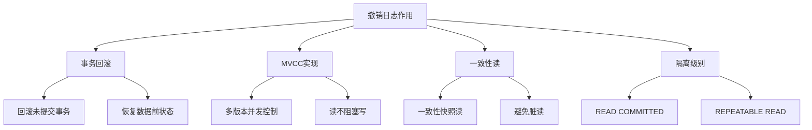
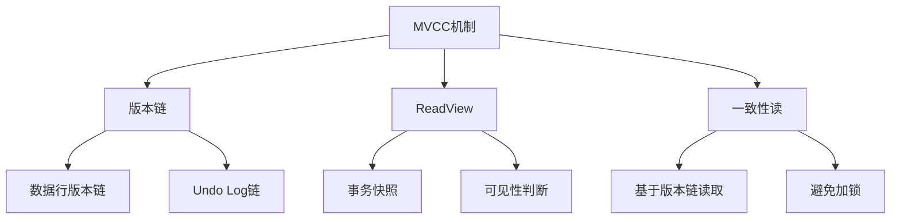

# MySQL 撤销日志（Undo Log）详解

## 概述

MySQL撤销日志（Undo Log）是InnoDB存储引擎用于实现事务回滚和MVCC（多版本并发控制）的日志文件。本章节将详细介绍Undo Log的作用、原理、配置、监控和优化方法。

## 1. 撤销日志基础

### 1.1 Undo Log作用



### 1.2 Undo Log特点

```sql
-- 撤销日志特点
/*
1. 记录数据变更前的状态
2. 支持事务回滚
3. 实现MVCC机制
4. 存储在系统表空间或独立表空间
5. 支持版本链管理
6. 自动清理过期版本
*/

-- 查看撤销日志配置
SHOW VARIABLES LIKE 'innodb_undo%';
SHOW ENGINE INNODB STATUS\G
```

### 1.3 Undo Log存储结构

```sql
-- Undo Log存储结构
/*
系统表空间模式：
- 存储在ibdata文件中
- 默认模式
- 所有撤销日志集中存储

独立表空间模式：
- 存储在独立的.ibu文件中
- 需要配置innodb_undo_tablespaces
- 支持并行清理
*/

-- 查看撤销日志表空间
SELECT 
    tablespace_name,
    file_name,
    file_size,
    file_type
FROM information_schema.files 
WHERE file_type = 'UNDO LOG';
```

## 2. 撤销日志原理

### 2.1 MVCC机制



### 2.2 版本链管理

```sql
-- 版本链示例
/*
原始数据：id=1, name='Alice', age=25
事务1：UPDATE users SET age=26 WHERE id=1
事务2：UPDATE users SET name='Bob' WHERE id=1

版本链：
当前版本：id=1, name='Bob', age=26, trx_id=102
  ↓ (指向Undo Log)
版本1：id=1, name='Alice', age=26, trx_id=101
  ↓ (指向Undo Log)
版本0：id=1, name='Alice', age=25, trx_id=100
*/

-- 查看版本链信息
SELECT 
    trx_id,
    trx_state,
    trx_started,
    trx_mysql_thread_id
FROM information_schema.innodb_trx;
```

### 2.3 事务回滚

```sql
-- 事务回滚过程
/*
1. 找到事务的Undo Log记录
2. 按照相反顺序执行撤销操作
3. 恢复数据到事务开始前的状态
4. 清理Undo Log记录
*/

-- 示例：事务回滚
START TRANSACTION;
UPDATE users SET age = 30 WHERE id = 1;
-- 此时Undo Log记录了age=25的原始值
ROLLBACK;
-- 回滚时恢复age=25的原始值
```

## 3. 撤销日志配置

### 3.1 基本配置

```sql
-- 1. 设置撤销日志表空间数量
SET GLOBAL innodb_undo_tablespaces = 2;

-- 2. 设置撤销日志段数量
SET GLOBAL innodb_undo_logs = 128;

-- 3. 设置撤销日志保留时间
SET GLOBAL innodb_undo_log_truncate = 'ON';

-- 4. 查看配置
SHOW VARIABLES LIKE 'innodb_undo_tablespaces';
SHOW VARIABLES LIKE 'innodb_undo_logs';
SHOW VARIABLES LIKE 'innodb_undo_log_truncate';
```

### 3.2 配置文件设置

```ini
# my.cnf 配置文件设置
[mysqld]
# 撤销日志配置
innodb_undo_tablespaces = 2
innodb_undo_logs = 128
innodb_undo_log_truncate = ON

# 撤销日志表空间文件
innodb_undo_directory = /var/lib/mysql/undo

# 撤销日志段大小
innodb_undo_log_segment_size = 1048576
```

### 3.3 高级配置

```sql
-- 1. 设置撤销日志目录
SET GLOBAL innodb_undo_directory = '/var/lib/mysql/undo';

-- 2. 设置撤销日志段大小
SET GLOBAL innodb_undo_log_segment_size = 1048576;  -- 1MB

-- 3. 设置撤销日志清理
SET GLOBAL innodb_undo_log_truncate = 'ON';

-- 4. 设置撤销日志加密
SET GLOBAL innodb_undo_log_encrypt = 'ON';
```

## 4. 撤销日志监控

### 4.1 状态监控

```sql
-- 1. 查看撤销日志状态
SHOW ENGINE INNODB STATUS\G

-- 2. 查看撤销日志统计
SELECT 
    variable_name,
    variable_value
FROM performance_schema.global_status 
WHERE variable_name LIKE 'Innodb_undo%';

-- 3. 查看撤销日志表空间
SELECT 
    tablespace_name,
    file_name,
    file_size,
    file_type
FROM information_schema.files 
WHERE file_type = 'UNDO LOG';
```

### 4.2 性能监控

```sql
-- 1. 监控撤销日志使用情况
SELECT 
    'Undo Log Usage' as metric,
    COUNT(*) as tablespace_count,
    SUM(file_size) / 1024 / 1024 as total_size_mb,
    AVG(file_size) / 1024 / 1024 as avg_size_mb
FROM information_schema.files 
WHERE file_type = 'UNDO LOG';

-- 2. 监控撤销日志清理
SELECT 
    variable_name,
    variable_value
FROM performance_schema.global_status 
WHERE variable_name IN (
    'Innodb_undo_log_truncate_count',
    'Innodb_undo_log_truncate_time'
);

-- 3. 监控事务状态
SELECT 
    COUNT(*) as active_transactions,
    COUNT(CASE WHEN trx_state = 'RUNNING' THEN 1 END) as running_transactions,
    COUNT(CASE WHEN trx_state = 'LOCK WAIT' THEN 1 END) as waiting_transactions
FROM information_schema.innodb_trx;
```

### 4.3 实时监控脚本

```python
#!/usr/bin/env python3
# undo_log_monitor.py

import mysql.connector
import time
import json
import logging

class UndoLogMonitor:
    def __init__(self, mysql_config):
        self.mysql_config = mysql_config
        self.conn = None
        
    def connect(self):
        try:
            self.conn = mysql.connector.connect(**self.mysql_config)
            return True
        except Exception as e:
            logging.error(f"连接失败: {e}")
            return False
    
    def get_undo_log_status(self):
        """获取撤销日志状态"""
        try:
            cursor = self.conn.cursor()
            
            # 获取撤销日志统计
            cursor.execute("""
                SELECT variable_name, variable_value 
                FROM performance_schema.global_status 
                WHERE variable_name LIKE 'Innodb_undo%'
            """)
            stats = dict(cursor.fetchall())
            
            # 获取撤销日志表空间信息
            cursor.execute("""
                SELECT 
                    tablespace_name,
                    file_name,
                    file_size,
                    file_type
                FROM information_schema.files 
                WHERE file_type = 'UNDO LOG'
            """)
            tablespaces = cursor.fetchall()
            
            # 获取事务信息
            cursor.execute("""
                SELECT 
                    COUNT(*) as total_transactions,
                    COUNT(CASE WHEN trx_state = 'RUNNING' THEN 1 END) as running_transactions,
                    COUNT(CASE WHEN trx_state = 'LOCK WAIT' THEN 1 END) as waiting_transactions
                FROM information_schema.innodb_trx
            """)
            transactions = cursor.fetchone()
            
            return {
                'stats': stats,
                'tablespaces': tablespaces,
                'transactions': {
                    'total': transactions[0],
                    'running': transactions[1],
                    'waiting': transactions[2]
                }
            }
            
        except Exception as e:
            logging.error(f"获取撤销日志状态失败: {e}")
        
        return {}
    
    def calculate_metrics(self, status):
        """计算性能指标"""
        metrics = {}
        
        try:
            # 计算表空间大小
            total_size = 0
            for tablespace in status.get('tablespaces', []):
                total_size += tablespace[2]  # file_size
            
            metrics['total_size_mb'] = total_size / 1024 / 1024
            metrics['tablespace_count'] = len(status.get('tablespaces', []))
            
            # 计算事务指标
            transactions = status.get('transactions', {})
            metrics['active_transactions'] = transactions.get('running', 0)
            metrics['waiting_transactions'] = transactions.get('waiting', 0)
            
        except Exception as e:
            logging.error(f"计算指标失败: {e}")
        
        return metrics
    
    def monitor(self, interval=60):
        """持续监控"""
        if not self.connect():
            return
        
        print("开始监控撤销日志...")
        
        while True:
            try:
                status = self.get_undo_log_status()
                if status:
                    metrics = self.calculate_metrics(status)
                    
                    print(f"\n=== {time.strftime('%Y-%m-%d %H:%M:%S')} ===")
                    print(f"撤销日志表空间数量: {metrics.get('tablespace_count', 0)}")
                    print(f"撤销日志总大小: {metrics.get('total_size_mb', 0):.2f} MB")
                    print(f"活跃事务数: {metrics.get('active_transactions', 0)}")
                    print(f"等待事务数: {metrics.get('waiting_transactions', 0)}")
                    
                    # 显示统计信息
                    stats = status.get('stats', {})
                    if 'Innodb_undo_log_truncate_count' in stats:
                        print(f"撤销日志清理次数: {stats['Innodb_undo_log_truncate_count']}")
                    if 'Innodb_undo_log_truncate_time' in stats:
                        print(f"撤销日志清理时间: {stats['Innodb_undo_log_truncate_time']} ms")
                
                time.sleep(interval)
                
            except Exception as e:
                logging.error(f"监控过程中出错: {e}")
                time.sleep(interval)

if __name__ == "__main__":
    mysql_config = {
        'host': 'localhost',
        'user': 'root',
        'password': 'password',
        'database': 'mysql'
    }
    
    monitor = UndoLogMonitor(mysql_config)
    monitor.monitor()
```

## 5. 撤销日志优化

### 5.1 性能优化

```sql
-- 1. 优化撤销日志表空间数量
-- 根据并发事务数调整
SET GLOBAL innodb_undo_tablespaces = 4;

-- 2. 优化撤销日志段数量
-- 增加并发处理能力
SET GLOBAL innodb_undo_logs = 256;

-- 3. 启用撤销日志清理
-- 自动清理过期版本
SET GLOBAL innodb_undo_log_truncate = 'ON';

-- 4. 优化撤销日志目录
-- 使用高性能存储
SET GLOBAL innodb_undo_directory = '/ssd/mysql/undo';
```

### 5.2 容量规划

```sql
-- 撤销日志容量规划
/*
1. 撤销日志大小 = 并发事务数 × 平均事务大小 × 保留时间
2. 表空间数量 = 并发事务数 / 每个表空间支持的事务数
3. 段数量 = 并发事务数 × 2（预留空间）
*/

-- 示例计算
-- 假设100个并发事务，每个事务平均1MB，保留1小时
-- 撤销日志大小 = 100 × 1MB × 1 = 100MB
-- 表空间数量 = 100 / 25 = 4
-- 段数量 = 100 × 2 = 200
```

### 5.3 故障处理

```sql
-- 1. 撤销日志空间不足
-- 增加撤销日志表空间
SET GLOBAL innodb_undo_tablespaces = 8;

-- 2. 撤销日志清理失败
-- 检查长事务
SELECT 
    trx_id,
    trx_state,
    trx_started,
    trx_mysql_thread_id,
    trx_query
FROM information_schema.innodb_trx
WHERE trx_state = 'RUNNING'
ORDER BY trx_started;

-- 3. 撤销日志性能问题
-- 优化存储I/O
-- 使用SSD存储撤销日志
-- 增加撤销日志段数量
```

## 6. 撤销日志分析

### 6.1 性能分析

```sql
-- 1. 分析撤销日志使用情况
SELECT 
    'Undo Log Analysis' as metric,
    COUNT(*) as tablespace_count,
    SUM(file_size) / 1024 / 1024 as total_size_mb,
    AVG(file_size) / 1024 / 1024 as avg_size_mb,
    MAX(file_size) / 1024 / 1024 as max_size_mb
FROM information_schema.files 
WHERE file_type = 'UNDO LOG';

-- 2. 分析事务模式
SELECT 
    trx_state,
    COUNT(*) as transaction_count,
    AVG(TIMESTAMPDIFF(SECOND, trx_started, NOW())) as avg_duration_seconds
FROM information_schema.innodb_trx
GROUP BY trx_state;

-- 3. 分析长事务
SELECT 
    trx_id,
    trx_state,
    trx_started,
    trx_mysql_thread_id,
    trx_query,
    TIMESTAMPDIFF(SECOND, trx_started, NOW()) as duration_seconds
FROM information_schema.innodb_trx
WHERE trx_state = 'RUNNING'
  AND TIMESTAMPDIFF(SECOND, trx_started, NOW()) > 60
ORDER BY duration_seconds DESC;
```

### 6.2 容量分析

```sql
-- 1. 分析撤销日志增长趋势
SELECT 
    DATE(NOW()) as date,
    HOUR(NOW()) as hour,
    COUNT(*) as active_transactions,
    SUM(file_size) / 1024 / 1024 as undo_log_size_mb
FROM information_schema.innodb_trx t
JOIN information_schema.files f ON f.file_type = 'UNDO LOG'
GROUP BY DATE(NOW()), HOUR(NOW());

-- 2. 分析撤销日志清理效果
SELECT 
    variable_name,
    variable_value
FROM performance_schema.global_status 
WHERE variable_name IN (
    'Innodb_undo_log_truncate_count',
    'Innodb_undo_log_truncate_time',
    'Innodb_undo_log_truncate_size'
);
```

### 6.3 优化建议

```sql
-- 1. 性能优化建议
/*
- 如果撤销日志大小增长过快，增加表空间数量
- 如果清理频繁，增加撤销日志段数量
- 如果长事务较多，优化应用逻辑
*/

-- 2. 容量优化建议
/*
- 根据并发事务数调整表空间数量
- 根据事务大小调整段大小
- 根据业务模式调整清理策略
*/

-- 3. 配置优化建议
/*
- 高并发场景：增加表空间和段数量
- 大事务场景：增加段大小
- 长事务场景：优化事务设计
*/
```

## 7. 实际应用示例

### 7.1 高并发场景配置

```sql
-- 高并发场景撤销日志配置
-- 1. 增加表空间数量支持更多并发
SET GLOBAL innodb_undo_tablespaces = 8;

-- 2. 增加段数量提高并发处理能力
SET GLOBAL innodb_undo_logs = 512;

-- 3. 启用自动清理避免空间增长
SET GLOBAL innodb_undo_log_truncate = 'ON';

-- 4. 使用高性能存储
SET GLOBAL innodb_undo_directory = '/ssd/mysql/undo';

-- 5. 优化段大小
SET GLOBAL innodb_undo_log_segment_size = 2097152;  -- 2MB
```

### 7.2 大事务场景配置

```sql
-- 大事务场景撤销日志配置
-- 1. 增加段大小处理大事务
SET GLOBAL innodb_undo_log_segment_size = 4194304;  -- 4MB

-- 2. 增加表空间数量
SET GLOBAL innodb_undo_tablespaces = 4;

-- 3. 增加段数量
SET GLOBAL innodb_undo_logs = 256;

-- 4. 优化清理策略
SET GLOBAL innodb_undo_log_truncate = 'ON';
```

### 7.3 开发环境配置

```sql
-- 开发环境撤销日志配置
-- 1. 较少表空间节省资源
SET GLOBAL innodb_undo_tablespaces = 2;

-- 2. 较少段数量
SET GLOBAL innodb_undo_logs = 128;

-- 3. 较小段大小
SET GLOBAL innodb_undo_log_segment_size = 1048576;  -- 1MB

-- 4. 启用清理
SET GLOBAL innodb_undo_log_truncate = 'ON';
```

## 总结

MySQL撤销日志是实现事务回滚和MVCC的核心组件，关键要点包括：

1. **MVCC机制**：撤销日志实现多版本并发控制
2. **事务回滚**：支持事务回滚和数据恢复
3. **性能优化**：合理配置表空间和段数量
4. **容量规划**：根据并发事务数规划容量
5. **监控管理**：建立监控体系，及时发现问题
6. **场景优化**：根据具体场景选择合适的配置

在实际应用中，需要根据具体的业务需求、并发量和性能要求来选择合适的配置策略。 

**[返回目录 README.md](./README?id=_7-mysql-日志)** 