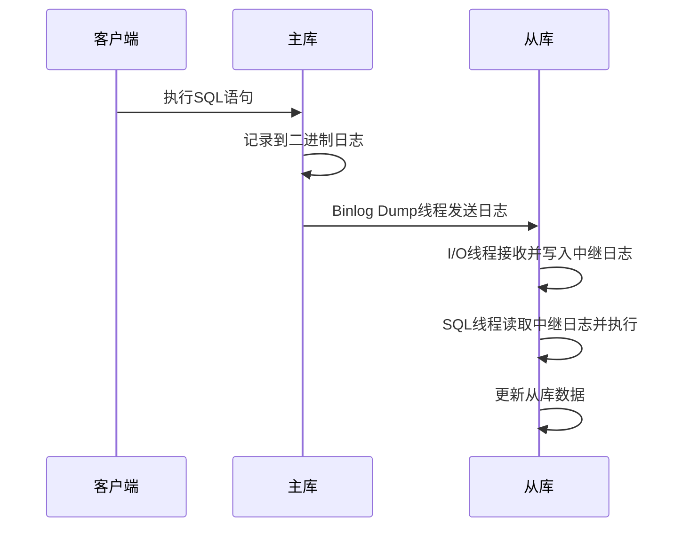

# MySQL 主从复制原理详解

## 概述

MySQL主从复制是MySQL高可用架构的基础，它允许将主数据库的数据变更同步到一个或多个从数据库。通过主从复制，可以实现读写分离、负载均衡、数据备份等功能。

## 复制架构图

```
┌─────────────────────────────────────────────────────────────┐
│                        主从复制架构                          │
├─────────────────────────────────────────────────────────────┤
│  ┌─────────────┐                    ┌─────────────┐        │
│  │   主库      │                    │   从库1     │        │
│  │  Master     │                    │  Slave1     │        │
│  │             │                    │             │        │
│  │ ┌─────────┐ │                    │ ┌─────────┐ │        │
│  │ │ Binlog  │ │                    │ │ Relay   │ │        │
│  │ │ Dump    │ │◄───────────────────┤ │ Log     │ │        │
│  │ │ Thread  │ │                    │ │         │ │        │
│  │ └─────────┘ │                    │ └─────────┘ │        │
│  │             │                    │             │        │
│  │ ┌─────────┐ │                    │ ┌─────────┐ │        │
│  │ │ Binary  │ │                    │ │ I/O     │ │        │
│  │ │ Log     │ │                    │ │ Thread  │ │        │
│  │ └─────────┘ │                    │ └─────────┘ │        │
│  └─────────────┘                    │             │        │
│                                     │ ┌─────────┐ │        │
│                                     │ │ SQL     │ │        │
│                                     │ │ Thread  │ │        │
│                                     │ └─────────┘ │        │
│                                     └─────────────┘        │
│                                                           │
│                                     ┌─────────────┐        │
│                                     │   从库2     │        │
│                                     │  Slave2     │        │
│                                     │             │        │
│                                     │ ┌─────────┐ │        │
│                                     │ │ Relay   │ │        │
│                                     │ │ Log     │ │        │
│                                     │ └─────────┘ │        │
│                                     │             │        │
│                                     │ ┌─────────┐ │        │
│                                     │ │ I/O     │ │        │
│                                     │ │ Thread  │ │        │
│                                     │ └─────────┘ │        │
│                                     │             │        │
│                                     │ ┌─────────┐ │        │
│                                     │ │ SQL     │ │        │
│                                     │ │ Thread  │ │        │
│                                     │ └─────────┘ │        │
│                                     └─────────────┘        │
└─────────────────────────────────────────────────────────────┘
```

## 1. 复制原理

### 1.1 复制流程



### 1.2 三个线程

#### 1.2.1 Binlog Dump Thread（主库）

- **作用**：读取主库的二进制日志，发送给从库
- **特点**：每个从库连接都会创建一个Binlog Dump线程
- **状态**：可以通过`SHOW PROCESSLIST`查看

```sql
-- 查看Binlog Dump线程
SHOW PROCESSLIST;
```

#### 1.2.2 I/O Thread（从库）

- **作用**：从主库读取二进制日志，写入从库的中继日志
- **特点**：每个从库只有一个I/O线程
- **状态**：可以通过`SHOW SLAVE STATUS`查看

```sql
-- 查看I/O线程状态
SHOW SLAVE STATUS\G
```

#### 1.2.3 SQL Thread（从库）

- **作用**：读取中继日志，在从库上重放SQL语句
- **特点**：每个从库只有一个SQL线程
- **状态**：可以通过`SHOW SLAVE STATUS`查看

```sql
-- 查看SQL线程状态
SHOW SLAVE STATUS\G
```

## 2. 二进制日志（Binary Log）

### 2.1 二进制日志格式

#### 2.1.1 STATEMENT格式

```sql
-- 记录SQL语句
SET SESSION binlog_format = 'STATEMENT';

-- 示例：记录INSERT语句
INSERT INTO users (name, email) VALUES ('John', 'john@example.com');
```

#### 2.1.2 ROW格式

```sql
-- 记录行数据变更
SET SESSION binlog_format = 'ROW';

-- 示例：记录行数据
-- 记录变更前后的完整行数据
```

#### 2.1.3 MIXED格式

```sql
-- 混合模式，自动选择
SET SESSION binlog_format = 'MIXED';

-- 大部分使用STATEMENT，特殊情况使用ROW
```

### 2.2 二进制日志配置

```ini
# my.cnf 配置
[mysqld]
# 启用二进制日志
log_bin = mysql-bin

# 二进制日志格式
binlog_format = ROW

# 二进制日志保留天数
expire_logs_days = 7

# 二进制日志文件大小
max_binlog_size = 100M
```

### 2.3 二进制日志管理

```sql
-- 查看二进制日志文件
SHOW BINARY LOGS;

-- 查看当前二进制日志文件
SHOW MASTER STATUS;

-- 清理二进制日志
PURGE BINARY LOGS TO 'mysql-bin.000010';
PURGE BINARY LOGS BEFORE '2024-01-15 10:00:00';
```

## 3. 中继日志（Relay Log）

### 3.1 中继日志结构

```
从库数据目录/
├── relay-bin.000001    # 中继日志文件
├── relay-bin.000002    # 中继日志文件
├── relay-bin.index     # 中继日志索引文件
└── relay-log.info      # 中继日志信息文件
```

### 3.2 中继日志配置

```ini
# my.cnf 配置
[mysqld]
# 中继日志文件前缀
relay_log = mysql-relay-bin

# 中继日志索引文件
relay_log_index = mysql-relay-bin.index

# 中继日志信息文件
relay_log_info_file = relay-log.info
```

### 3.3 中继日志管理

```sql
-- 查看中继日志文件
SHOW RELAYLOG EVENTS;

-- 清理中继日志
RESET SLAVE;
```

## 4. 复制模式

### 4.1 异步复制（Asynchronous Replication）

#### 4.1.1 特点

- **默认模式**：MySQL默认的复制模式
- **性能最好**：主库不等待从库确认
- **数据一致性**：可能存在数据延迟
- **故障处理**：从库故障不影响主库

#### 4.1.2 配置

```sql
-- 主库配置
SET GLOBAL binlog_format = 'ROW';

-- 从库配置
CHANGE MASTER TO
    MASTER_HOST = '192.168.1.100',
    MASTER_PORT = 3306,
    MASTER_USER = 'repl',
    MASTER_PASSWORD = 'password',
    MASTER_LOG_FILE = 'mysql-bin.000001',
    MASTER_LOG_POS = 154;
```

### 4.2 半同步复制（Semisynchronous Replication）

#### 4.2.1 特点

- **数据一致性**：主库等待至少一个从库接收
- **性能影响**：比异步复制稍慢
- **故障处理**：从库故障会影响主库性能

#### 4.2.2 配置

```sql
-- 主库配置
INSTALL PLUGIN rpl_semi_sync_master SONAME 'semisync_master.so';
SET GLOBAL rpl_semi_sync_master_enabled = 1;

-- 从库配置
INSTALL PLUGIN rpl_semi_sync_slave SONAME 'semisync_slave.so';
SET GLOBAL rpl_semi_sync_slave_enabled = 1;
```

### 4.3 组复制（Group Replication）

#### 4.3.1 特点

- **多主复制**：支持多主架构
- **强一致性**：保证数据一致性
- **自动故障转移**：自动处理节点故障
- **复杂配置**：配置相对复杂

#### 4.3.2 配置

```sql
-- 组复制配置
SET GLOBAL group_replication_group_name = 'aaaaaaaa-aaaa-aaaa-aaaa-aaaaaaaaaaaa';
SET GLOBAL group_replication_start_on_boot = ON;
SET GLOBAL group_replication_local_address = '192.168.1.100:33061';
SET GLOBAL group_replication_group_seeds = '192.168.1.100:33061,192.168.1.101:33061';
```

## 5. 复制配置

### 5.1 主库配置

```ini
# my.cnf 主库配置
[mysqld]
# 服务器ID（必须唯一）
server_id = 1

# 启用二进制日志
log_bin = mysql-bin

# 二进制日志格式
binlog_format = ROW

# 二进制日志保留天数
expire_logs_days = 7

# 同步数据库
binlog_do_db = mydb
binlog_ignore_db = mysql
```

### 5.2 从库配置

```ini
# my.cnf 从库配置
[mysqld]
# 服务器ID（必须唯一）
server_id = 2

# 启用中继日志
relay_log = mysql-relay-bin

# 中继日志信息文件
relay_log_info_file = relay-log.info

# 从库更新
relay_log_recovery = 1

# 跳过错误
slave_skip_errors = 1062,1032
```

### 5.3 复制用户创建

```sql
-- 在主库创建复制用户
CREATE USER 'repl'@'%' IDENTIFIED BY 'password';
GRANT REPLICATION SLAVE ON *.* TO 'repl'@'%';
FLUSH PRIVILEGES;
```

## 6. 复制监控

### 6.1 复制状态监控

```sql
-- 查看从库状态
SHOW SLAVE STATUS\G

-- 重要字段说明
-- Slave_IO_Running: I/O线程状态
-- Slave_SQL_Running: SQL线程状态
-- Seconds_Behind_Master: 复制延迟
-- Last_Error: 最后错误信息
```

### 6.2 复制延迟监控

```sql
-- 查看复制延迟
SELECT 
    MASTER_HOST,
    MASTER_PORT,
    SECONDS_BEHIND_MASTER,
    SLAVE_IO_RUNNING,
    SLAVE_SQL_RUNNING
FROM performance_schema.replication_connection_status;
```

### 6.3 复制性能监控

```sql
-- 查看复制相关统计
SHOW STATUS LIKE 'Slave_%';

-- 查看二进制日志统计
SHOW STATUS LIKE 'Binlog_%';
```

## 7. 故障处理

### 7.1 常见故障

#### 7.1.1 网络故障

```sql
-- 检查网络连接
SHOW SLAVE STATUS\G

-- 重启复制
STOP SLAVE;
START SLAVE;
```

#### 7.1.2 数据不一致

```sql
-- 检查数据一致性
pt-table-checksum --host=192.168.1.100 --user=root --password=password

-- 修复数据不一致
pt-table-sync --host=192.168.1.100 --user=root --password=password
```

#### 7.1.3 从库故障

```sql
-- 跳过错误
SET GLOBAL sql_slave_skip_counter = 1;
START SLAVE;

-- 重新同步
STOP SLAVE;
CHANGE MASTER TO MASTER_LOG_FILE = 'mysql-bin.000001', MASTER_LOG_POS = 154;
START SLAVE;
```

### 7.2 故障恢复

#### 7.2.1 主库故障恢复

```sql
-- 从库提升为主库
STOP SLAVE;
RESET SLAVE ALL;

-- 修改应用配置，指向新的主库
```

#### 7.2.2 从库故障恢复

```sql
-- 重新配置从库
STOP SLAVE;
CHANGE MASTER TO
    MASTER_HOST = '192.168.1.100',
    MASTER_PORT = 3306,
    MASTER_USER = 'repl',
    MASTER_PASSWORD = 'password',
    MASTER_LOG_FILE = 'mysql-bin.000001',
    MASTER_LOG_POS = 154;
START SLAVE;
```

## 8. 复制优化

### 8.1 性能优化

#### 8.1.1 并行复制

```sql
-- 启用并行复制
SET GLOBAL slave_parallel_type = 'LOGICAL_CLOCK';
SET GLOBAL slave_parallel_workers = 4;
```

#### 8.1.2 多线程复制

```sql
-- 设置工作线程数
SET GLOBAL slave_parallel_workers = 8;
```

### 8.2 配置优化

```ini
# 优化配置
[mysqld]
# 增加二进制日志缓存
binlog_cache_size = 1M

# 增加中继日志缓存
relay_log_cache_size = 1M

# 优化网络传输
slave_net_timeout = 60
```

## 9. 复制安全

### 9.1 网络安全

```sql
-- 限制复制用户访问
GRANT REPLICATION SLAVE ON *.* TO 'repl'@'192.168.1.%';

-- 使用SSL连接
CHANGE MASTER TO MASTER_SSL = 1;
```

### 9.2 数据安全

```sql
-- 启用从库只读
SET GLOBAL read_only = 1;
SET GLOBAL super_read_only = 1;
```

## 总结

MySQL主从复制是构建高可用数据库架构的基础：

1. **复制原理**：基于二进制日志的异步复制
2. **复制模式**：异步、半同步、组复制
3. **监控维护**：持续监控复制状态和性能
4. **故障处理**：及时处理复制故障
5. **安全考虑**：确保复制过程的安全性

通过合理配置和管理主从复制，可以实现高可用、高性能的数据库架构。 