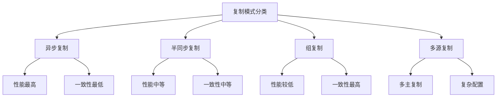
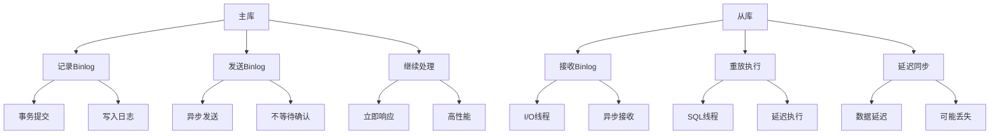
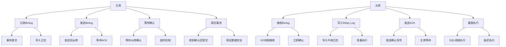
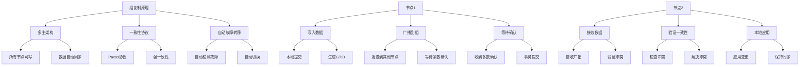
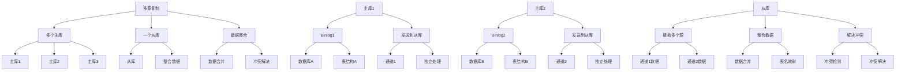

# MySQL 复制模式详解

## 概述

MySQL复制模式决定了主库和从库之间的数据同步方式，不同的复制模式在性能、一致性和可用性方面有不同的特点。本章节将详细介绍异步复制、半同步复制、组复制等复制模式。

## 1. 复制模式基础

### 1.1 复制模式分类



### 1.2 复制模式对比

```sql
-- 复制模式对比
/*
模式        性能    一致性    可用性    复杂度    适用场景
异步复制    最高    最低      高       低       读写分离
半同步复制  中等    中等      中等     中等     数据安全
组复制      较低    最高      高       高       高可用
多源复制    中等    中等      高       高       数据整合
*/
```

## 2. 异步复制

### 2.1 异步复制原理



### 2.2 异步复制配置

```sql
-- 主库配置
[mysqld]
# 基本配置
server_id = 1
log_bin = mysql-bin
binlog_format = ROW

# 异步复制（默认）
sync_binlog = 1
innodb_flush_log_at_trx_commit = 1

-- 从库配置
[mysqld]
# 基本配置
server_id = 2
relay_log = mysql-relay-bin
log_slave_updates = 1

# 复制配置
read_only = 1
super_read_only = 1
```

### 2.3 异步复制特点

```sql
-- 异步复制特点
/*
优点：
1. 性能最高，主库不受从库影响
2. 配置简单，易于维护
3. 网络故障不影响主库
4. 支持多个从库

缺点：
1. 数据一致性最差
2. 可能丢失数据
3. 从库延迟较大
4. 故障切换复杂
*/

-- 查看异步复制状态
SHOW SLAVE STATUS\G
-- 查看Seconds_Behind_Master字段
```

## 3. 半同步复制

### 3.1 半同步复制原理



### 3.2 半同步复制配置

```sql
-- 主库配置
[mysqld]
# 基本配置
server_id = 1
log_bin = mysql-bin
binlog_format = ROW

# 半同步复制配置
plugin_load = "rpl_semi_sync_master=semisync_master.so"
rpl_semi_sync_master_enabled = 1
rpl_semi_sync_master_timeout = 10000
rpl_semi_sync_master_wait_for_slave_count = 1

-- 从库配置
[mysqld]
# 基本配置
server_id = 2
relay_log = mysql-relay-bin
log_slave_updates = 1

# 半同步复制配置
plugin_load = "rpl_semi_sync_slave=semisync_slave.so"
rpl_semi_sync_slave_enabled = 1
```

### 3.3 半同步复制特点

```sql
-- 半同步复制特点
/*
优点：
1. 数据一致性较好
2. 主库等待从库确认
3. 减少数据丢失风险
4. 支持超时降级

缺点：
1. 性能有所下降
2. 网络延迟影响主库
3. 配置相对复杂
4. 需要插件支持
*/

-- 查看半同步复制状态
SHOW VARIABLES LIKE 'rpl_semi_sync%';
SHOW STATUS LIKE 'Rpl_semi_sync%';
```

## 4. 组复制

### 4.1 组复制原理



### 4.2 组复制配置

```sql
-- 节点1配置
[mysqld]
# 基本配置
server_id = 1
gtid_mode = ON
enforce_gtid_consistency = ON

# 组复制配置
plugin_load = "group_replication.so"
group_replication_group_name = "aaaaaaaa-aaaa-aaaa-aaaa-aaaaaaaaaaaa"
group_replication_start_on_boot = OFF
group_replication_local_address = "192.168.1.10:33061"
group_replication_group_seeds = "192.168.1.10:33061,192.168.1.11:33061,192.168.1.12:33061"
group_replication_bootstrap_group = OFF

-- 节点2配置
[mysqld]
# 基本配置
server_id = 2
gtid_mode = ON
enforce_gtid_consistency = ON

# 组复制配置
plugin_load = "group_replication.so"
group_replication_group_name = "aaaaaaaa-aaaa-aaaa-aaaa-aaaaaaaaaaaa"
group_replication_start_on_boot = OFF
group_replication_local_address = "192.168.1.11:33061"
group_replication_group_seeds = "192.168.1.10:33061,192.168.1.11:33061,192.168.1.12:33061"
group_replication_bootstrap_group = OFF
```

### 4.3 组复制特点

```sql
-- 组复制特点
/*
优点：
1. 强一致性保证
2. 自动故障转移
3. 多主架构
4. 高可用性

缺点：
1. 性能相对较低
2. 配置复杂
3. 网络要求高
4. 资源消耗大
*/

-- 查看组复制状态
SELECT * FROM performance_schema.replication_group_members;
SELECT * FROM performance_schema.replication_group_member_stats;
```

## 5. 多源复制

### 5.1 多源复制原理



### 5.2 多源复制配置

```sql
-- 从库配置多源复制
-- 配置通道1
CHANGE MASTER TO
    MASTER_HOST = 'master1_host',
    MASTER_USER = 'repl',
    MASTER_PASSWORD = 'password',
    MASTER_LOG_FILE = 'mysql-bin.000001',
    MASTER_LOG_POS = 4
FOR CHANNEL 'channel1';

-- 配置通道2
CHANGE MASTER TO
    MASTER_HOST = 'master2_host',
    MASTER_USER = 'repl',
    MASTER_PASSWORD = 'password',
    MASTER_LOG_FILE = 'mysql-bin.000001',
    MASTER_LOG_POS = 4
FOR CHANNEL 'channel2';

-- 启动复制
START SLAVE FOR CHANNEL 'channel1';
START SLAVE FOR CHANNEL 'channel2';
```

### 5.3 多源复制特点

```sql
-- 多源复制特点
/*
优点：
1. 数据整合
2. 多源数据合并
3. 独立通道管理
4. 灵活配置

缺点：
1. 配置复杂
2. 冲突处理困难
3. 性能影响
4. 维护成本高
*/

-- 查看多源复制状态
SHOW SLAVE STATUS FOR CHANNEL 'channel1'\G
SHOW SLAVE STATUS FOR CHANNEL 'channel2'\G
```

## 6. 复制模式选择

### 6.1 选择标准

```sql
-- 复制模式选择标准
/*
1. 性能要求
   - 高性能：异步复制
   - 中等性能：半同步复制
   - 低性能：组复制

2. 一致性要求
   - 低一致性：异步复制
   - 中等一致性：半同步复制
   - 高一致性：组复制

3. 可用性要求
   - 高可用：组复制
   - 中等可用：半同步复制
   - 基本可用：异步复制

4. 复杂度要求
   - 简单：异步复制
   - 中等：半同步复制
   - 复杂：组复制
*/
```

### 6.2 场景推荐

```sql
-- 场景推荐
/*
1. 读写分离场景
   - 推荐：异步复制
   - 原因：性能高，配置简单

2. 数据安全场景
   - 推荐：半同步复制
   - 原因：数据一致性好，性能适中

3. 高可用场景
   - 推荐：组复制
   - 原因：自动故障转移，强一致性

4. 数据整合场景
   - 推荐：多源复制
   - 原因：支持多源数据合并
*/
```

## 7. 复制模式监控

### 7.1 监控脚本

```python
#!/usr/bin/env python3
# replication_monitor.py

import mysql.connector
import time
import json
import logging

class ReplicationMonitor:
    def __init__(self, mysql_config):
        self.mysql_config = mysql_config
        self.conn = None
        
    def connect(self):
        try:
            self.conn = mysql.connector.connect(**self.mysql_config)
            return True
        except Exception as e:
            logging.error(f"连接失败: {e}")
            return False
    
    def get_replication_status(self):
        """获取复制状态"""
        try:
            cursor = self.conn.cursor()
            
            # 获取复制状态
            cursor.execute("SHOW SLAVE STATUS")
            slave_status = cursor.fetchone()
            
            if slave_status:
                # 解析复制状态
                status = {
                    'slave_io_running': slave_status[10],
                    'slave_sql_running': slave_status[11],
                    'seconds_behind_master': slave_status[32],
                    'last_error': slave_status[19],
                    'last_sql_error': slave_status[20]
                }
                
                # 获取半同步复制状态
                cursor.execute("SHOW VARIABLES LIKE 'rpl_semi_sync%'")
                semi_sync_vars = dict(cursor.fetchall())
                
                # 获取组复制状态
                cursor.execute("SELECT * FROM performance_schema.replication_group_members")
                group_members = cursor.fetchall()
                
                return {
                    'slave_status': status,
                    'semi_sync_vars': semi_sync_vars,
                    'group_members': group_members
                }
            
        except Exception as e:
            logging.error(f"获取复制状态失败: {e}")
        
        return {}
    
    def monitor(self, interval=60):
        """持续监控"""
        if not self.connect():
            return
        
        print("开始监控复制状态...")
        
        while True:
            try:
                status = self.get_replication_status()
                if status:
                    slave_status = status['slave_status']
                    
                    print(f"\n=== {time.strftime('%Y-%m-%d %H:%M:%S')} ===")
                    print(f"I/O线程状态: {slave_status.get('slave_io_running', 'Unknown')}")
                    print(f"SQL线程状态: {slave_status.get('slave_sql_running', 'Unknown')}")
                    print(f"延迟时间: {slave_status.get('seconds_behind_master', 'Unknown')} 秒")
                    
                    if slave_status.get('last_error'):
                        print(f"最后错误: {slave_status['last_error']}")
                    
                    # 显示半同步复制状态
                    semi_sync_vars = status.get('semi_sync_vars', {})
                    if semi_sync_vars:
                        print(f"半同步复制: {'启用' if 'ON' in str(semi_sync_vars.values()) else '禁用'}")
                    
                    # 显示组复制状态
                    group_members = status.get('group_members', [])
                    if group_members:
                        print(f"组复制成员数: {len(group_members)}")
                
                time.sleep(interval)
                
            except Exception as e:
                logging.error(f"监控过程中出错: {e}")
                time.sleep(interval)

if __name__ == "__main__":
    mysql_config = {
        'host': 'localhost',
        'user': 'root',
        'password': 'password',
        'database': 'mysql'
    }
    
    monitor = ReplicationMonitor(mysql_config)
    monitor.monitor()
```

### 7.2 性能分析

```sql
-- 1. 分析复制延迟
SELECT 
    'Replication Lag' as metric,
    Seconds_Behind_Master as lag_seconds,
    CASE 
        WHEN Seconds_Behind_Master = 0 THEN 'No Lag'
        WHEN Seconds_Behind_Master < 60 THEN 'Low Lag'
        WHEN Seconds_Behind_Master < 300 THEN 'Medium Lag'
        ELSE 'High Lag'
    END as lag_status
FROM performance_schema.replication_connection_status;

-- 2. 分析复制性能
SELECT 
    variable_name,
    variable_value
FROM performance_schema.global_status 
WHERE variable_name LIKE 'Rpl_semi_sync%';

-- 3. 分析组复制性能
SELECT 
    MEMBER_ID,
    MEMBER_HOST,
    MEMBER_PORT,
    MEMBER_STATE,
    MEMBER_ROLE
FROM performance_schema.replication_group_members;
```

## 8. 实际应用示例

### 8.1 异步复制配置

```sql
-- 主库配置
[mysqld]
server_id = 1
log_bin = mysql-bin
binlog_format = ROW
sync_binlog = 1
innodb_flush_log_at_trx_commit = 1

-- 从库配置
[mysqld]
server_id = 2
relay_log = mysql-relay-bin
log_slave_updates = 1
read_only = 1

-- 配置复制
CHANGE MASTER TO
    MASTER_HOST = 'master_host',
    MASTER_USER = 'repl',
    MASTER_PASSWORD = 'password',
    MASTER_LOG_FILE = 'mysql-bin.000001',
    MASTER_LOG_POS = 4;

START SLAVE;
```

### 8.2 半同步复制配置

```sql
-- 主库配置
[mysqld]
server_id = 1
log_bin = mysql-bin
binlog_format = ROW
plugin_load = "rpl_semi_sync_master=semisync_master.so"
rpl_semi_sync_master_enabled = 1
rpl_semi_sync_master_timeout = 10000

-- 从库配置
[mysqld]
server_id = 2
relay_log = mysql-relay-bin
plugin_load = "rpl_semi_sync_slave=semisync_slave.so"
rpl_semi_sync_slave_enabled = 1

-- 配置复制
CHANGE MASTER TO
    MASTER_HOST = 'master_host',
    MASTER_USER = 'repl',
    MASTER_PASSWORD = 'password',
    MASTER_LOG_FILE = 'mysql-bin.000001',
    MASTER_LOG_POS = 4;

START SLAVE;
```

### 8.3 组复制配置

```sql
-- 节点配置
[mysqld]
server_id = 1
gtid_mode = ON
enforce_gtid_consistency = ON
plugin_load = "group_replication.so"
group_replication_group_name = "aaaaaaaa-aaaa-aaaa-aaaa-aaaaaaaaaaaa"
group_replication_start_on_boot = OFF
group_replication_local_address = "192.168.1.10:33061"
group_replication_group_seeds = "192.168.1.10:33061,192.168.1.11:33061,192.168.1.12:33061"

-- 启动组复制
SET GLOBAL group_replication_bootstrap_group = ON;
START GROUP_REPLICATION;
SET GLOBAL group_replication_bootstrap_group = OFF;
```

## 总结

MySQL复制模式是数据库高可用和数据同步的核心技术，关键要点包括：

1. **异步复制**：性能最高，适合读写分离
2. **半同步复制**：平衡性能和一致性
3. **组复制**：强一致性，适合高可用场景
4. **多源复制**：支持数据整合
5. **监控管理**：建立监控体系，及时发现问题
6. **场景选择**：根据具体需求选择合适的复制模式

在实际应用中，需要根据具体的业务需求、性能要求和一致性要求来选择合适的复制模式。 

**[返回目录 README.md](./README.md)** 