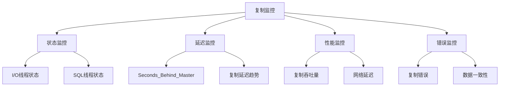

# 7.4 MySQL 复制监控

## 目录
- [1. 概述](#1-概述)
- [2. 复制状态监控](#2-复制状态监控)
- [3. 延迟监控](#3-延迟监控)
- [4. 性能监控](#4-性能监控)
- [5. 错误监控](#5-错误监控)
- [6. 监控工具](#6-监控工具)
- [7. 告警配置](#7-告警配置)
- [8. 实际应用示例](#8-实际应用示例)

## 1. 概述

MySQL复制监控是确保主从复制环境稳定运行的关键环节，包括复制状态、延迟、性能、错误等全方位的监控。

### 1.1 监控目标



### 1.2 监控指标

| 监控类别 | 关键指标 | 正常值 | 告警阈值 |
|----------|----------|--------|----------|
| 状态监控 | Slave_IO_Running | Yes | No |
| 状态监控 | Slave_SQL_Running | Yes | No |
| 延迟监控 | Seconds_Behind_Master | 0-60秒 | >300秒 |
| 性能监控 | 复制吞吐量 | 根据业务量 | <预期值 |
| 错误监控 | Last_Error | 空 | 非空 |

## 2. 复制状态监控

### 2.1 基本状态检查

```sql
-- 查看复制状态
SHOW SLAVE STATUS\G

-- 关键字段说明
-- Slave_IO_Running: I/O线程运行状态
-- Slave_SQL_Running: SQL线程运行状态
-- Seconds_Behind_Master: 复制延迟秒数
-- Last_Error: 最后一次错误信息
-- Last_IO_Error: I/O线程错误
-- Last_SQL_Error: SQL线程错误
```

### 2.2 状态监控脚本

```bash
#!/bin/bash
# 复制状态监控脚本

MASTER_HOST="192.168.1.100"
SLAVE_HOST="192.168.1.101"
MYSQL_USER="root"
MYSQL_PASSWORD="password"

# 检查从库状态
check_slave_status() {
    mysql -h $SLAVE_HOST -u $MYSQL_USER -p$MYSQL_PASSWORD -e "
    SELECT 
        'Slave_IO_Running' as Metric,
        Slave_IO_Running as Value
    FROM performance_schema.replication_connection_status
    UNION ALL
    SELECT 
        'Slave_SQL_Running' as Metric,
        Slave_SQL_Running as Value
    FROM performance_schema.replication_applier_status_by_worker
    WHERE Worker_Id = 1;
    "
}

# 检查复制延迟
check_replication_lag() {
    mysql -h $SLAVE_HOST -u $MYSQL_USER -p$MYSQL_PASSWORD -e "
    SELECT 
        MASTER_HOST,
        MASTER_PORT,
        SECONDS_BEHIND_MASTER,
        LAST_ERROR
    FROM performance_schema.replication_connection_status;
    "
}

# 主函数
main() {
    echo "=== MySQL复制状态监控 ==="
    echo "时间: $(date)"
    echo ""
    
    echo "1. 复制状态检查:"
    check_slave_status
    echo ""
    
    echo "2. 复制延迟检查:"
    check_replication_lag
    echo ""
}

main
```

### 2.3 实时状态监控

```sql
-- 实时监控复制状态
SELECT 
    MASTER_HOST,
    MASTER_PORT,
    SLAVE_IO_RUNNING,
    SLAVE_SQL_RUNNING,
    SECONDS_BEHIND_MASTER,
    LAST_ERROR,
    LAST_IO_ERROR,
    LAST_SQL_ERROR
FROM performance_schema.replication_connection_status
JOIN performance_schema.replication_applier_status_by_worker 
    ON 1=1 WHERE Worker_Id = 1;
```

## 3. 延迟监控

### 3.1 延迟指标

```sql
-- 查看复制延迟
SHOW SLAVE STATUS\G

-- 延迟监控查询
SELECT 
    MASTER_HOST,
    MASTER_PORT,
    SECONDS_BEHIND_MASTER,
    CASE 
        WHEN SECONDS_BEHIND_MASTER IS NULL THEN 'NULL'
        WHEN SECONDS_BEHIND_MASTER = 0 THEN '0'
        WHEN SECONDS_BEHIND_MASTER < 60 THEN 'LOW'
        WHEN SECONDS_BEHIND_MASTER < 300 THEN 'MEDIUM'
        ELSE 'HIGH'
    END as Lag_Level
FROM performance_schema.replication_connection_status;
```

### 3.2 延迟趋势监控

```sql
-- 创建延迟监控表
CREATE TABLE replication_lag_history (
    id INT AUTO_INCREMENT PRIMARY KEY,
    check_time TIMESTAMP DEFAULT CURRENT_TIMESTAMP,
    master_host VARCHAR(100),
    seconds_behind_master INT,
    lag_level ENUM('NULL', '0', 'LOW', 'MEDIUM', 'HIGH')
);

-- 插入延迟数据
INSERT INTO replication_lag_history (master_host, seconds_behind_master, lag_level)
SELECT 
    MASTER_HOST,
    SECONDS_BEHIND_MASTER,
    CASE 
        WHEN SECONDS_BEHIND_MASTER IS NULL THEN 'NULL'
        WHEN SECONDS_BEHIND_MASTER = 0 THEN '0'
        WHEN SECONDS_BEHIND_MASTER < 60 THEN 'LOW'
        WHEN SECONDS_BEHIND_MASTER < 300 THEN 'MEDIUM'
        ELSE 'HIGH'
    END
FROM performance_schema.replication_connection_status;

-- 查看延迟趋势
SELECT 
    DATE(check_time) as date,
    HOUR(check_time) as hour,
    AVG(seconds_behind_master) as avg_lag,
    MAX(seconds_behind_master) as max_lag,
    COUNT(*) as check_count
FROM replication_lag_history
WHERE check_time >= DATE_SUB(NOW(), INTERVAL 24 HOUR)
GROUP BY DATE(check_time), HOUR(check_time)
ORDER BY date DESC, hour DESC;
```

### 3.3 延迟告警脚本

```python
#!/usr/bin/env python3
# 复制延迟监控脚本

import mysql.connector
import time
import smtplib
from email.mime.text import MIMEText
from datetime import datetime

class ReplicationMonitor:
    def __init__(self, host, user, password):
        self.host = host
        self.user = user
        self.password = password
        self.connection = None
    
    def connect(self):
        """连接数据库"""
        try:
            self.connection = mysql.connector.connect(
                host=self.host,
                user=self.user,
                password=self.password,
                database='mysql'
            )
            return True
        except Exception as e:
            print(f"连接失败: {e}")
            return False
    
    def check_replication_lag(self):
        """检查复制延迟"""
        if not self.connection:
            return None
        
        cursor = self.connection.cursor()
        cursor.execute("""
            SELECT 
                MASTER_HOST,
                SECONDS_BEHIND_MASTER,
                SLAVE_IO_RUNNING,
                SLAVE_SQL_RUNNING
            FROM performance_schema.replication_connection_status
        """)
        
        result = cursor.fetchone()
        cursor.close()
        
        return result
    
    def send_alert(self, message):
        """发送告警邮件"""
        # 邮件配置
        smtp_server = "smtp.gmail.com"
        smtp_port = 587
        sender_email = "monitor@example.com"
        sender_password = "password"
        receiver_email = "admin@example.com"
        
        # 创建邮件
        msg = MIMEText(message)
        msg['Subject'] = f"MySQL复制告警 - {datetime.now()}"
        msg['From'] = sender_email
        msg['To'] = receiver_email
        
        # 发送邮件
        try:
            server = smtplib.SMTP(smtp_server, smtp_port)
            server.starttls()
            server.login(sender_email, sender_password)
            server.send_message(msg)
            server.quit()
            print("告警邮件发送成功")
        except Exception as e:
            print(f"邮件发送失败: {e}")
    
    def monitor(self):
        """主监控函数"""
        while True:
            try:
                result = self.check_replication_lag()
                
                if result:
                    master_host, lag, io_running, sql_running = result
                    
                    # 检查复制状态
                    if io_running != 'Yes' or sql_running != 'Yes':
                        alert_msg = f"""
                        复制状态异常:
                        - 主库: {master_host}
                        - I/O线程: {io_running}
                        - SQL线程: {sql_running}
                        - 时间: {datetime.now()}
                        """
                        self.send_alert(alert_msg)
                    
                    # 检查复制延迟
                    if lag is not None and lag > 300:
                        alert_msg = f"""
                        复制延迟过高:
                        - 主库: {master_host}
                        - 延迟: {lag}秒
                        - 时间: {datetime.now()}
                        """
                        self.send_alert(alert_msg)
                    
                    print(f"监控检查完成 - 延迟: {lag}秒")
                
                time.sleep(60)  # 每分钟检查一次
                
            except Exception as e:
                print(f"监控异常: {e}")
                time.sleep(60)

if __name__ == "__main__":
    monitor = ReplicationMonitor("192.168.1.101", "root", "password")
    if monitor.connect():
        monitor.monitor()
```

## 4. 性能监控

### 4.1 复制性能指标

```sql
-- 查看复制性能统计
SELECT 
    VARIABLE_NAME,
    VARIABLE_VALUE
FROM performance_schema.global_status
WHERE VARIABLE_NAME LIKE '%slave%' 
   OR VARIABLE_NAME LIKE '%replication%';

-- 复制相关状态变量
SHOW STATUS LIKE '%slave%';
SHOW STATUS LIKE '%replication%';
```

### 4.2 网络性能监控

```sql
-- 查看网络连接状态
SELECT 
    MASTER_HOST,
    MASTER_PORT,
    CONNECTION_NAME,
    CONNECTION_STATUS,
    LAST_ERROR_NUMBER,
    LAST_ERROR_MESSAGE
FROM performance_schema.replication_connection_status;

-- 网络延迟测试
SELECT 
    MASTER_HOST,
    MASTER_PORT,
    CONNECTION_NAME,
    CONNECTION_STATUS,
    LAST_ERROR_NUMBER
FROM performance_schema.replication_connection_status;
```

### 4.3 复制吞吐量监控

```sql
-- 创建性能监控表
CREATE TABLE replication_performance (
    id INT AUTO_INCREMENT PRIMARY KEY,
    check_time TIMESTAMP DEFAULT CURRENT_TIMESTAMP,
    master_host VARCHAR(100),
    events_per_second DECIMAL(10,2),
    bytes_per_second DECIMAL(10,2),
    lag_seconds INT
);

-- 性能监控查询
SELECT 
    MASTER_HOST,
    COUNT(*) as events_count,
    SUM(LENGTH(EVENT)) as total_bytes,
    AVG(SECONDS_BEHIND_MASTER) as avg_lag
FROM performance_schema.replication_connection_status
JOIN mysql.general_log ON 1=1
WHERE COMMAND_TYPE = 'Query'
  AND check_time >= DATE_SUB(NOW(), INTERVAL 1 HOUR)
GROUP BY MASTER_HOST;
```

## 5. 错误监控

### 5.1 错误检查

```sql
-- 检查复制错误
SELECT 
    MASTER_HOST,
    LAST_ERROR_NUMBER,
    LAST_ERROR_MESSAGE,
    LAST_IO_ERROR,
    LAST_SQL_ERROR
FROM performance_schema.replication_connection_status;

-- 查看错误日志
SELECT 
    VARIABLE_NAME,
    VARIABLE_VALUE
FROM performance_schema.global_status
WHERE VARIABLE_NAME LIKE '%error%';
```

### 5.2 错误处理

```sql
-- 跳过特定错误
SET GLOBAL slave_skip_errors = '1062,1032';

-- 查看当前跳过的错误
SHOW VARIABLES LIKE 'slave_skip_errors';

-- 重置复制错误
STOP SLAVE;
RESET SLAVE;
START SLAVE;
```

### 5.3 数据一致性检查

```sql
-- 使用pt-table-checksum检查数据一致性
-- 需要安装Percona Toolkit

-- 检查表一致性
pt-table-checksum --host=192.168.1.100 --user=root --password=password

-- 修复不一致数据
pt-table-sync --host=192.168.1.100 --user=root --password=password
```

## 6. 监控工具

### 6.1 MySQL Workbench

```sql
-- 在MySQL Workbench中查看复制状态
-- 1. 连接到从库
-- 2. 打开Server Status面板
-- 3. 查看Replication Status标签页
```

### 6.2 命令行工具

```bash
# 使用mysqladmin查看状态
mysqladmin -h 192.168.1.101 -u root -p status

# 使用mysqlshow查看数据库状态
mysqlshow -h 192.168.1.101 -u root -p

# 使用pt-heartbeat监控延迟
pt-heartbeat --host=192.168.1.100 --user=root --password=password --create-table
pt-heartbeat --host=192.168.1.101 --user=root --password=password --check
```

### 6.3 第三方监控工具

```yaml
# Prometheus配置示例
global:
  scrape_interval: 15s

scrape_configs:
  - job_name: 'mysql-replication'
    static_configs:
      - targets: ['192.168.1.100:9104', '192.168.1.101:9104']
    metrics_path: '/metrics'
    scrape_interval: 30s
```

## 7. 告警配置

### 7.1 告警规则

```yaml
# Grafana告警规则
groups:
  - name: mysql_replication
    rules:
      - alert: ReplicationStopped
        expr: mysql_slave_status_slave_io_running == 0 or mysql_slave_status_slave_sql_running == 0
        for: 1m
        labels:
          severity: critical
        annotations:
          summary: "MySQL复制已停止"
          description: "从库复制状态异常"

      - alert: HighReplicationLag
        expr: mysql_slave_status_seconds_behind_master > 300
        for: 5m
        labels:
          severity: warning
        annotations:
          summary: "复制延迟过高"
          description: "从库复制延迟超过5分钟"
```

### 7.2 告警通知

```python
# 告警通知脚本
import requests
import json

def send_webhook_alert(alert_data):
    """发送Webhook告警"""
    webhook_url = "https://hooks.slack.com/services/YOUR/WEBHOOK/URL"
    
    message = {
        "text": f"MySQL复制告警: {alert_data['message']}",
        "attachments": [
            {
                "color": "danger" if alert_data['severity'] == 'critical' else "warning",
                "fields": [
                    {
                        "title": "主库",
                        "value": alert_data['master_host'],
                        "short": True
                    },
                    {
                        "title": "延迟",
                        "value": f"{alert_data['lag']}秒",
                        "short": True
                    }
                ]
            }
        ]
    }
    
    response = requests.post(webhook_url, json=message)
    return response.status_code == 200
```

## 8. 实际应用示例

### 8.1 完整监控脚本

```python
#!/usr/bin/env python3
# 完整的MySQL复制监控脚本

import mysql.connector
import time
import logging
import json
from datetime import datetime

class MySQLReplicationMonitor:
    def __init__(self, config):
        self.config = config
        self.setup_logging()
        
    def setup_logging(self):
        """设置日志"""
        logging.basicConfig(
            level=logging.INFO,
            format='%(asctime)s - %(levelname)s - %(message)s',
            handlers=[
                logging.FileHandler('replication_monitor.log'),
                logging.StreamHandler()
            ]
        )
        self.logger = logging.getLogger(__name__)
    
    def get_slave_status(self):
        """获取从库状态"""
        try:
            connection = mysql.connector.connect(
                host=self.config['slave_host'],
                user=self.config['user'],
                password=self.config['password'],
                database='mysql'
            )
            
            cursor = connection.cursor(dictionary=True)
            cursor.execute("SHOW SLAVE STATUS")
            result = cursor.fetchone()
            
            cursor.close()
            connection.close()
            
            return result
        except Exception as e:
            self.logger.error(f"获取从库状态失败: {e}")
            return None
    
    def check_replication_health(self):
        """检查复制健康状态"""
        status = self.get_slave_status()
        
        if not status:
            return {
                'healthy': False,
                'error': '无法获取复制状态'
            }
        
        # 检查基本状态
        io_running = status.get('Slave_IO_Running') == 'Yes'
        sql_running = status.get('Slave_SQL_Running') == 'Yes'
        
        # 检查延迟
        lag = status.get('Seconds_Behind_Master')
        lag_ok = lag is not None and lag < self.config['max_lag']
        
        # 检查错误
        last_error = status.get('Last_Error', '')
        error_ok = not last_error
        
        health_status = {
            'healthy': io_running and sql_running and lag_ok and error_ok,
            'io_running': io_running,
            'sql_running': sql_running,
            'lag': lag,
            'lag_ok': lag_ok,
            'last_error': last_error,
            'error_ok': error_ok,
            'master_host': status.get('Master_Host'),
            'check_time': datetime.now().isoformat()
        }
        
        return health_status
    
    def send_alert(self, alert_data):
        """发送告警"""
        # 这里可以实现各种告警方式
        # 邮件、短信、Webhook等
        self.logger.warning(f"复制告警: {alert_data}")
    
    def run_monitor(self):
        """运行监控"""
        self.logger.info("开始MySQL复制监控")
        
        while True:
            try:
                health = self.check_replication_health()
                
                if not health['healthy']:
                    self.send_alert(health)
                
                # 记录监控数据
                self.log_monitoring_data(health)
                
                time.sleep(self.config['check_interval'])
                
            except KeyboardInterrupt:
                self.logger.info("监控停止")
                break
            except Exception as e:
                self.logger.error(f"监控异常: {e}")
                time.sleep(self.config['check_interval'])
    
    def log_monitoring_data(self, health_data):
        """记录监控数据"""
        # 可以将数据写入数据库或文件
        with open('monitoring_data.json', 'a') as f:
            f.write(json.dumps(health_data) + '\n')

# 配置示例
config = {
    'slave_host': '192.168.1.101',
    'user': 'root',
    'password': 'password',
    'max_lag': 300,  # 最大延迟5分钟
    'check_interval': 60  # 检查间隔60秒
}

if __name__ == "__main__":
    monitor = MySQLReplicationMonitor(config)
    monitor.run_monitor()
```

### 8.2 监控面板配置

```html
<!-- 简单的监控面板 -->
<!DOCTYPE html>
<html>
<head>
    <title>MySQL复制监控</title>
    <script src="https://cdn.jsdelivr.net/npm/chart.js"></script>
</head>
<body>
    <h1>MySQL复制监控面板</h1>
    
    <div id="status">
        <h2>复制状态</h2>
        <div id="io-status"></div>
        <div id="sql-status"></div>
        <div id="lag-status"></div>
    </div>
    
    <div id="chart">
        <h2>延迟趋势</h2>
        <canvas id="lagChart"></canvas>
    </div>
    
    <script>
        // 更新状态
        function updateStatus() {
            fetch('/api/replication-status')
                .then(response => response.json())
                .then(data => {
                    document.getElementById('io-status').innerHTML = 
                        `I/O线程: ${data.io_running ? '运行' : '停止'}`;
                    document.getElementById('sql-status').innerHTML = 
                        `SQL线程: ${data.sql_running ? '运行' : '停止'}`;
                    document.getElementById('lag-status').innerHTML = 
                        `延迟: ${data.lag}秒`;
                });
        }
        
        // 每30秒更新一次
        setInterval(updateStatus, 30000);
        updateStatus();
    </script>
</body>
</html>
```

## 总结

MySQL复制监控是确保高可用数据库环境的关键环节，需要：

1. **全面监控**：状态、延迟、性能、错误
2. **实时告警**：及时发现问题
3. **数据记录**：历史趋势分析
4. **自动化处理**：减少人工干预
5. **可视化展示**：直观的监控界面

通过完善的监控体系，可以确保MySQL复制环境的稳定运行。 

**[返回目录 README.md](./README.md)** 