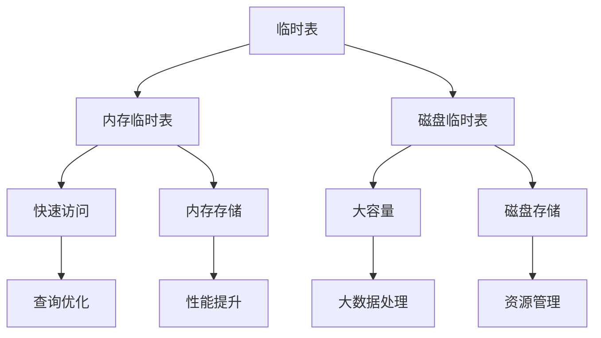

# 8.1 MySQL 临时表

## 目录
- [1. 概述](#1-概述)
- [2. 临时表类型](#2-临时表类型)
- [3. 内存临时表](#3-内存临时表)
- [4. 磁盘临时表](#4-磁盘临时表)
- [5. 临时表使用场景](#5-临时表使用场景)
- [6. 临时表优化](#6-临时表优化)
- [7. 临时表监控](#7-临时表监控)
- [8. 实际应用示例](#8-实际应用示例)

## 1. 概述

MySQL临时表是MySQL在执行查询过程中自动创建的临时存储结构，用于存储中间结果。临时表在会话结束时自动删除，不会持久化到磁盘。

### 1.1 临时表特点



### 1.2 临时表用途

| 用途 | 描述 | 示例 |
|------|------|------|
| 复杂查询 | 存储子查询结果 | UNION、GROUP BY |
| 排序操作 | 存储排序中间结果 | ORDER BY |
| 分组操作 | 存储分组结果 | GROUP BY |
| 去重操作 | 存储唯一值 | DISTINCT |
| 连接优化 | 存储连接中间结果 | JOIN |

## 2. 临时表类型

### 2.1 按存储位置分类

```sql
-- 查看临时表相关变量
SHOW VARIABLES LIKE '%tmp%';
SHOW VARIABLES LIKE '%temp%';

-- 临时表存储位置
SELECT @@tmpdir;
SELECT @@slave_load_tmpdir;
```

### 2.2 按创建方式分类

```sql
-- 1. 自动创建的临时表（隐式临时表）
SELECT * FROM large_table WHERE condition GROUP BY column;

-- 2. 手动创建的临时表（显式临时表）
CREATE TEMPORARY TABLE temp_table (
    id INT PRIMARY KEY,
    name VARCHAR(50)
);
```

### 2.3 临时表生命周期

```sql
-- 临时表生命周期示例
-- 1. 创建临时表
CREATE TEMPORARY TABLE temp_users (
    id INT AUTO_INCREMENT PRIMARY KEY,
    username VARCHAR(50),
    created_at TIMESTAMP DEFAULT CURRENT_TIMESTAMP
);

-- 2. 插入数据
INSERT INTO temp_users (username) VALUES ('user1'), ('user2');

-- 3. 查询临时表
SELECT * FROM temp_users;

-- 4. 会话结束，临时表自动删除
-- 或者手动删除
DROP TEMPORARY TABLE IF EXISTS temp_users;
```

## 3. 内存临时表

### 3.1 内存临时表特点

```sql
-- 内存临时表配置
SHOW VARIABLES LIKE 'tmp_table_size';
SHOW VARIABLES LIKE 'max_heap_table_size';

-- 默认配置
-- tmp_table_size: 16MB
-- max_heap_table_size: 16MB
```

### 3.2 内存临时表使用场景

```sql
-- 场景1: 小数据量排序
SELECT * FROM users ORDER BY username LIMIT 1000;

-- 场景2: 简单分组
SELECT department, COUNT(*) as count 
FROM employees 
GROUP BY department;

-- 场景3: 去重操作
SELECT DISTINCT category FROM products;
```

### 3.3 内存临时表优化

```sql
-- 1. 增加内存临时表大小
SET GLOBAL tmp_table_size = 67108864; -- 64MB
SET GLOBAL max_heap_table_size = 67108864; -- 64MB

-- 2. 优化查询避免大临时表
-- 使用索引优化ORDER BY
CREATE INDEX idx_username ON users(username);
SELECT * FROM users ORDER BY username;

-- 3. 使用LIMIT限制结果集
SELECT * FROM large_table ORDER BY column LIMIT 1000;
```

### 3.4 内存临时表监控

```sql
-- 查看内存临时表使用情况
SHOW STATUS LIKE 'Created_tmp_tables';
SHOW STATUS LIKE 'Created_tmp_disk_tables';

-- 监控脚本
SELECT 
    VARIABLE_NAME,
    VARIABLE_VALUE
FROM performance_schema.global_status
WHERE VARIABLE_NAME IN (
    'Created_tmp_tables',
    'Created_tmp_disk_tables'
);
```

## 4. 磁盘临时表

### 4.1 磁盘临时表特点

```sql
-- 磁盘临时表配置
SHOW VARIABLES LIKE 'tmpdir';
SHOW VARIABLES LIKE 'slave_load_tmpdir';

-- 查看临时文件
ls -la /tmp/mysql/
```

### 4.2 磁盘临时表触发条件

```sql
-- 条件1: 数据量超过tmp_table_size
-- 当临时表大小超过tmp_table_size时，MySQL会将临时表转换为磁盘临时表

-- 条件2: 包含BLOB或TEXT列
CREATE TEMPORARY TABLE temp_blob (
    id INT,
    content TEXT
);

-- 条件3: 包含变长字符串列且总长度超过512字节
CREATE TEMPORARY TABLE temp_varchar (
    id INT,
    long_text VARCHAR(1000)
);
```

### 4.3 磁盘临时表优化

```sql
-- 1. 优化磁盘I/O
-- 将临时目录放在SSD上
SET GLOBAL tmpdir = '/ssd/tmp';

-- 2. 增加磁盘空间
-- 确保tmpdir有足够空间

-- 3. 优化查询避免大临时表
-- 使用索引
-- 限制结果集大小
-- 优化JOIN顺序
```

### 4.4 磁盘临时表监控

```sql
-- 监控磁盘临时表使用
SELECT 
    'Created_tmp_disk_tables' as Metric,
    VARIABLE_VALUE as Value
FROM performance_schema.global_status
WHERE VARIABLE_NAME = 'Created_tmp_disk_tables'

UNION ALL

SELECT 
    'Created_tmp_tables' as Metric,
    VARIABLE_VALUE as Value
FROM performance_schema.global_status
WHERE VARIABLE_NAME = 'Created_tmp_tables';
```

## 5. 临时表使用场景

### 5.1 复杂查询优化

```sql
-- 场景1: 多表JOIN优化
-- 使用临时表存储中间结果
CREATE TEMPORARY TABLE temp_orders AS
SELECT order_id, customer_id, total_amount
FROM orders 
WHERE order_date >= '2023-01-01';

SELECT c.customer_name, t.total_amount
FROM customers c
JOIN temp_orders t ON c.customer_id = t.customer_id;

-- 场景2: 子查询优化
-- 将复杂子查询结果存储到临时表
CREATE TEMPORARY TABLE temp_products AS
SELECT product_id, category_id, price
FROM products 
WHERE price > 100;

SELECT p.product_name, c.category_name
FROM temp_products tp
JOIN product_details p ON tp.product_id = p.product_id
JOIN categories c ON tp.category_id = c.category_id;
```

### 5.2 数据分析和报表

```sql
-- 场景1: 数据汇总
CREATE TEMPORARY TABLE temp_sales_summary AS
SELECT 
    DATE(order_date) as sale_date,
    SUM(amount) as daily_total,
    COUNT(*) as order_count
FROM sales 
WHERE order_date >= DATE_SUB(CURDATE(), INTERVAL 30 DAY)
GROUP BY DATE(order_date);

-- 生成报表
SELECT 
    sale_date,
    daily_total,
    order_count,
    AVG(daily_total) OVER (ORDER BY sale_date ROWS 6 PRECEDING) as weekly_avg
FROM temp_sales_summary
ORDER BY sale_date;

-- 场景2: 数据清洗
CREATE TEMPORARY TABLE temp_clean_data AS
SELECT 
    user_id,
    TRIM(username) as clean_username,
    LOWER(email) as clean_email
FROM users 
WHERE email REGEXP '^[A-Za-z0-9._%+-]+@[A-Za-z0-9.-]+\.[A-Za-z]{2,}$';
```

### 5.3 批量数据处理

```sql
-- 场景1: 批量更新
-- 创建临时表存储要更新的数据
CREATE TEMPORARY TABLE temp_updates (
    user_id INT,
    new_status VARCHAR(20)
);

-- 插入更新数据
INSERT INTO temp_updates VALUES 
(1, 'active'),
(2, 'inactive'),
(3, 'pending');

-- 执行批量更新
UPDATE users u
JOIN temp_updates t ON u.user_id = t.user_id
SET u.status = t.new_status;

-- 场景2: 数据迁移
CREATE TEMPORARY TABLE temp_migration AS
SELECT 
    old_id,
    new_id,
    migration_status
FROM migration_mapping 
WHERE migration_status = 'pending';

-- 执行迁移
UPDATE target_table t
JOIN temp_migration m ON t.old_id = m.old_id
SET t.new_id = m.new_id;
```

## 6. 临时表优化

### 6.1 内存优化

```sql
-- 1. 调整内存临时表大小
SET GLOBAL tmp_table_size = 134217728; -- 128MB
SET GLOBAL max_heap_table_size = 134217728; -- 128MB

-- 2. 监控内存使用
SHOW STATUS LIKE 'Created_tmp_tables';
SHOW STATUS LIKE 'Created_tmp_disk_tables';

-- 3. 优化查询减少临时表使用
-- 使用索引
-- 优化JOIN顺序
-- 使用LIMIT
```

### 6.2 磁盘优化

```sql
-- 1. 优化临时目录
-- 将临时目录放在SSD上
SET GLOBAL tmpdir = '/ssd/tmp';

-- 2. 定期清理临时文件
-- 创建清理脚本
#!/bin/bash
find /tmp/mysql/ -name "*.tmp" -mtime +1 -delete

-- 3. 监控磁盘使用
SELECT 
    table_schema,
    table_name,
    data_length,
    index_length
FROM information_schema.tables 
WHERE table_schema = 'mysql' 
  AND table_name LIKE '%tmp%';
```

### 6.3 查询优化

```sql
-- 1. 避免不必要的临时表
-- 使用索引优化ORDER BY
CREATE INDEX idx_order_date ON orders(order_date);
SELECT * FROM orders ORDER BY order_date;

-- 2. 优化GROUP BY
-- 使用索引
CREATE INDEX idx_category_status ON products(category, status);
SELECT category, COUNT(*) FROM products GROUP BY category;

-- 3. 优化DISTINCT
-- 使用索引
CREATE INDEX idx_unique_field ON table_name(unique_field);
SELECT DISTINCT unique_field FROM table_name;
```

### 6.4 配置优化

```sql
-- 1. 优化临时表相关参数
SET GLOBAL tmp_table_size = 134217728; -- 128MB
SET GLOBAL max_heap_table_size = 134217728; -- 128MB
SET GLOBAL internal_tmp_mem_storage_engine = 'TempTable';

-- 2. 配置临时表存储引擎
-- MySQL 8.0支持TempTable存储引擎
SET GLOBAL internal_tmp_mem_storage_engine = 'TempTable';

-- 3. 优化临时表文件格式
-- 使用更高效的文件格式
```

## 7. 临时表监控

### 7.1 性能监控

```sql
-- 监控临时表创建情况
SELECT 
    'Created_tmp_tables' as Metric,
    VARIABLE_VALUE as Value
FROM performance_schema.global_status
WHERE VARIABLE_NAME = 'Created_tmp_tables'

UNION ALL

SELECT 
    'Created_tmp_disk_tables' as Metric,
    VARIABLE_VALUE as Value
FROM performance_schema.global_status
WHERE VARIABLE_NAME = 'Created_tmp_disk_tables'

UNION ALL

SELECT 
    'Disk_tmp_tables_ratio' as Metric,
    ROUND(
        VARIABLE_VALUE / (
            SELECT VARIABLE_VALUE 
            FROM performance_schema.global_status 
            WHERE VARIABLE_NAME = 'Created_tmp_tables'
        ) * 100, 2
    ) as Value
FROM performance_schema.global_status
WHERE VARIABLE_NAME = 'Created_tmp_disk_tables';
```

### 7.2 监控脚本

```python
#!/usr/bin/env python3
# MySQL临时表监控脚本

import mysql.connector
import time
import logging
from datetime import datetime

class TempTableMonitor:
    def __init__(self, config):
        self.config = config
        self.setup_logging()
        
    def setup_logging(self):
        """设置日志"""
        logging.basicConfig(
            level=logging.INFO,
            format='%(asctime)s - %(levelname)s - %(message)s',
            handlers=[
                logging.FileHandler('temp_table_monitor.log'),
                logging.StreamHandler()
            ]
        )
        self.logger = logging.getLogger(__name__)
    
    def get_temp_table_stats(self):
        """获取临时表统计信息"""
        try:
            connection = mysql.connector.connect(
                host=self.config['host'],
                user=self.config['user'],
                password=self.config['password']
            )
            
            cursor = connection.cursor(dictionary=True)
            
            # 获取临时表统计
            cursor.execute("""
                SELECT 
                    VARIABLE_NAME,
                    VARIABLE_VALUE
                FROM performance_schema.global_status
                WHERE VARIABLE_NAME IN (
                    'Created_tmp_tables',
                    'Created_tmp_disk_tables'
                )
            """)
            
            results = cursor.fetchall()
            cursor.close()
            connection.close()
            
            stats = {}
            for row in results:
                stats[row['VARIABLE_NAME']] = int(row['VARIABLE_VALUE'])
            
            return stats
        except Exception as e:
            self.logger.error(f"获取临时表统计失败: {e}")
            return None
    
    def calculate_disk_ratio(self, stats):
        """计算磁盘临时表比例"""
        if not stats or 'Created_tmp_tables' not in stats:
            return 0
        
        total_tables = stats['Created_tmp_tables']
        disk_tables = stats.get('Created_tmp_disk_tables', 0)
        
        if total_tables == 0:
            return 0
        
        return (disk_tables / total_tables) * 100
    
    def check_temp_table_health(self):
        """检查临时表健康状态"""
        stats = self.get_temp_table_stats()
        
        if not stats:
            return {'healthy': False, 'error': '无法获取统计信息'}
        
        disk_ratio = self.calculate_disk_ratio(stats)
        
        # 健康状态判断
        health_status = {
            'healthy': disk_ratio < 20,  # 磁盘临时表比例小于20%
            'total_tables': stats.get('Created_tmp_tables', 0),
            'disk_tables': stats.get('Created_tmp_disk_tables', 0),
            'disk_ratio': disk_ratio,
            'check_time': datetime.now().isoformat()
        }
        
        return health_status
    
    def send_alert(self, alert_data):
        """发送告警"""
        if not alert_data['healthy']:
            self.logger.warning(f"临时表健康状态异常: {alert_data}")
    
    def run_monitor(self):
        """运行监控"""
        self.logger.info("开始MySQL临时表监控")
        
        while True:
            try:
                health = self.check_temp_table_health()
                
                if not health['healthy']:
                    self.send_alert(health)
                
                # 记录监控数据
                self.log_monitoring_data(health)
                
                time.sleep(self.config['check_interval'])
                
            except KeyboardInterrupt:
                self.logger.info("监控停止")
                break
            except Exception as e:
                self.logger.error(f"监控异常: {e}")
                time.sleep(self.config['check_interval'])
    
    def log_monitoring_data(self, health_data):
        """记录监控数据"""
        self.logger.info(f"临时表统计: 总数={health_data['total_tables']}, "
                        f"磁盘表={health_data['disk_tables']}, "
                        f"磁盘比例={health_data['disk_ratio']:.2f}%")

# 配置示例
config = {
    'host': 'localhost',
    'user': 'root',
    'password': 'password',
    'check_interval': 300  # 检查间隔5分钟
}

if __name__ == "__main__":
    monitor = TempTableMonitor(config)
    monitor.run_monitor()
```

### 7.3 告警配置

```yaml
# Grafana告警规则
groups:
  - name: mysql_temp_tables
    rules:
      - alert: HighDiskTempTables
        expr: mysql_global_status_created_tmp_disk_tables / mysql_global_status_created_tmp_tables > 0.2
        for: 5m
        labels:
          severity: warning
        annotations:
          summary: "磁盘临时表比例过高"
          description: "磁盘临时表比例超过20%，可能影响性能"

      - alert: TooManyTempTables
        expr: mysql_global_status_created_tmp_tables > 1000
        for: 1m
        labels:
          severity: info
        annotations:
          summary: "临时表创建过多"
          description: "临时表创建数量过多，需要优化查询"
```

## 8. 实际应用示例

### 8.1 数据分析应用

```sql
-- 示例1: 用户行为分析
-- 创建临时表存储用户行为数据
CREATE TEMPORARY TABLE temp_user_behavior AS
SELECT 
    user_id,
    DATE(created_at) as action_date,
    COUNT(*) as action_count,
    SUM(CASE WHEN action_type = 'login' THEN 1 ELSE 0 END) as login_count,
    SUM(CASE WHEN action_type = 'purchase' THEN 1 ELSE 0 END) as purchase_count
FROM user_actions 
WHERE created_at >= DATE_SUB(CURDATE(), INTERVAL 30 DAY)
GROUP BY user_id, DATE(created_at);

-- 分析用户活跃度
SELECT 
    action_date,
    COUNT(DISTINCT user_id) as active_users,
    AVG(action_count) as avg_actions,
    SUM(purchase_count) as total_purchases
FROM temp_user_behavior
GROUP BY action_date
ORDER BY action_date;

-- 示例2: 销售报表生成
CREATE TEMPORARY TABLE temp_sales_report AS
SELECT 
    p.product_name,
    c.category_name,
    SUM(s.quantity) as total_quantity,
    SUM(s.quantity * s.unit_price) as total_revenue,
    COUNT(DISTINCT s.order_id) as order_count
FROM sales s
JOIN products p ON s.product_id = p.product_id
JOIN categories c ON p.category_id = c.category_id
WHERE s.sale_date >= DATE_SUB(CURDATE(), INTERVAL 30 DAY)
GROUP BY p.product_id, c.category_id;

-- 生成报表
SELECT 
    category_name,
    COUNT(*) as product_count,
    SUM(total_quantity) as total_quantity,
    SUM(total_revenue) as total_revenue,
    AVG(total_revenue) as avg_revenue
FROM temp_sales_report
GROUP BY category_name
ORDER BY total_revenue DESC;
```

### 8.2 数据清洗应用

```sql
-- 示例1: 数据标准化
CREATE TEMPORARY TABLE temp_clean_data AS
SELECT 
    id,
    TRIM(name) as clean_name,
    LOWER(email) as clean_email,
    CASE 
        WHEN phone REGEXP '^[0-9]{10}$' THEN phone
        WHEN phone REGEXP '^[0-9]{11}$' THEN phone
        ELSE NULL
    END as clean_phone,
    CASE 
        WHEN status IN ('active', 'inactive', 'pending') THEN status
        ELSE 'unknown'
    END as clean_status
FROM raw_users 
WHERE email REGEXP '^[A-Za-z0-9._%+-]+@[A-Za-z0-9.-]+\.[A-Za-z]{2,}$';

-- 更新原始数据
UPDATE users u
JOIN temp_clean_data t ON u.id = t.id
SET 
    u.name = t.clean_name,
    u.email = t.clean_email,
    u.phone = t.clean_phone,
    u.status = t.clean_status;

-- 示例2: 数据去重
CREATE TEMPORARY TABLE temp_unique_data AS
SELECT 
    MIN(id) as keep_id,
    email,
    COUNT(*) as duplicate_count
FROM users 
GROUP BY email
HAVING COUNT(*) > 1;

-- 删除重复数据
DELETE u FROM users u
JOIN temp_unique_data t ON u.email = t.email
WHERE u.id != t.keep_id;
```

### 8.3 性能优化应用

```sql
-- 示例1: 查询优化
-- 使用临时表优化复杂查询
CREATE TEMPORARY TABLE temp_filtered_orders AS
SELECT 
    order_id,
    customer_id,
    order_date,
    total_amount
FROM orders 
WHERE order_date >= '2023-01-01'
  AND status = 'completed'
  AND total_amount > 100;

-- 创建索引优化后续查询
CREATE INDEX idx_customer_date ON temp_filtered_orders(customer_id, order_date);

-- 执行复杂分析
SELECT 
    c.customer_name,
    COUNT(t.order_id) as order_count,
    SUM(t.total_amount) as total_spent,
    AVG(t.total_amount) as avg_order_value
FROM customers c
JOIN temp_filtered_orders t ON c.customer_id = t.customer_id
GROUP BY c.customer_id
HAVING total_spent > 1000
ORDER BY total_spent DESC;

-- 示例2: 批量操作优化
-- 使用临时表优化批量更新
CREATE TEMPORARY TABLE temp_batch_updates (
    user_id INT PRIMARY KEY,
    new_status VARCHAR(20),
    update_reason VARCHAR(100)
);

-- 插入批量更新数据
INSERT INTO temp_batch_updates VALUES 
(1, 'active', 'manual_review'),
(2, 'suspended', 'policy_violation'),
(3, 'active', 'appeal_approved');

-- 执行批量更新
UPDATE users u
JOIN temp_batch_updates t ON u.user_id = t.user_id
SET 
    u.status = t.new_status,
    u.updated_at = NOW(),
    u.update_reason = t.update_reason;
```

## 总结

MySQL临时表是查询优化的重要工具，需要：

1. **合理使用**：根据数据量和查询复杂度选择合适的临时表类型
2. **内存优化**：调整内存临时表大小，减少磁盘临时表使用
3. **监控管理**：定期监控临时表使用情况，及时发现问题
4. **查询优化**：通过索引和查询优化减少临时表使用
5. **配置调优**：根据业务需求调整相关参数

通过合理使用和优化临时表，可以显著提升MySQL查询性能。 

**[返回目录 README.md](./README?id=_9-mysql-高级特性)** 