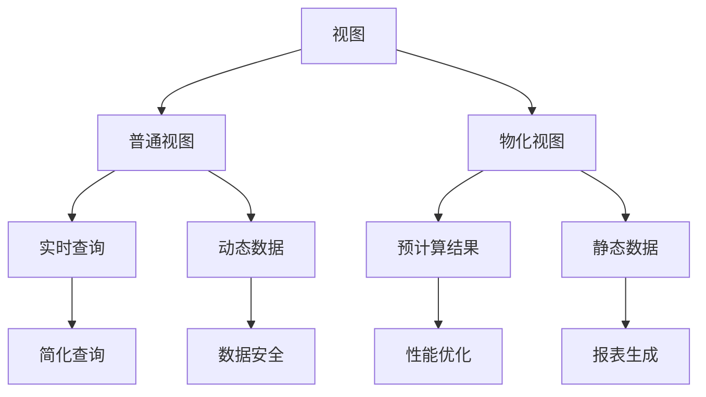

# 8.2 MySQL 视图

## 目录
- [1. 概述](#1-概述)
- [2. 视图类型](#2-视图类型)
- [3. 视图语法](#3-视图语法)
- [4. 视图使用场景](#4-视图使用场景)
- [5. 视图优化](#5-视图优化)
- [6. 视图管理](#6-视图管理)
- [7. 视图安全](#7-视图安全)
- [8. 实际应用示例](#8-实际应用示例)

## 1. 概述

MySQL视图是虚拟表，基于一个或多个表的查询结果。视图不存储实际数据，而是存储查询定义，每次访问视图时都会执行查询。

### 1.1 视图特点



### 1.2 视图优势

| 优势 | 描述 | 示例 |
|------|------|------|
| 简化查询 | 隐藏复杂查询逻辑 | 多表JOIN封装 |
| 数据安全 | 限制用户访问特定列 | 敏感数据保护 |
| 逻辑独立 | 视图与底层表解耦 | 表结构变更不影响应用 |
| 权限控制 | 基于视图的权限管理 | 不同用户看到不同数据 |
| 数据一致性 | 统一的数据访问接口 | 业务逻辑集中管理 |

## 2. 视图类型

### 2.1 普通视图

```sql
-- 创建普通视图
CREATE VIEW user_summary AS
SELECT 
    u.user_id,
    u.username,
    u.email,
    COUNT(o.order_id) as order_count,
    SUM(o.total_amount) as total_spent
FROM users u
LEFT JOIN orders o ON u.user_id = o.user_id
GROUP BY u.user_id;

-- 查询视图
SELECT * FROM user_summary WHERE total_spent > 1000;
```

### 2.2 物化视图（MySQL不支持）

```sql
-- MySQL不支持物化视图，但可以通过其他方式实现类似功能

-- 方式1: 使用临时表
CREATE TEMPORARY TABLE temp_user_summary AS
SELECT 
    user_id,
    COUNT(order_id) as order_count,
    SUM(total_amount) as total_spent
FROM orders
GROUP BY user_id;

-- 方式2: 使用存储过程定期更新
DELIMITER //
CREATE PROCEDURE update_user_summary()
BEGIN
    DROP TABLE IF EXISTS user_summary_cache;
    CREATE TABLE user_summary_cache AS
    SELECT 
        user_id,
        COUNT(order_id) as order_count,
        SUM(total_amount) as total_spent
    FROM orders
    GROUP BY user_id;
END //
DELIMITER ;
```

### 2.3 视图分类

```sql
-- 1. 简单视图（基于单个表）
CREATE VIEW active_users AS
SELECT user_id, username, email
FROM users
WHERE status = 'active';

-- 2. 复杂视图（基于多个表）
CREATE VIEW order_details AS
SELECT 
    o.order_id,
    u.username,
    p.product_name,
    o.quantity,
    o.unit_price,
    o.total_amount
FROM orders o
JOIN users u ON o.user_id = u.user_id
JOIN products p ON o.product_id = p.product_id;

-- 3. 聚合视图
CREATE VIEW sales_summary AS
SELECT 
    DATE(order_date) as sale_date,
    COUNT(*) as order_count,
    SUM(total_amount) as daily_revenue,
    AVG(total_amount) as avg_order_value
FROM orders
GROUP BY DATE(order_date);
```

## 3. 视图语法

### 3.1 创建视图

```sql
-- 基本语法
CREATE [OR REPLACE] VIEW view_name [(column_list)]
AS select_statement
[WITH [CASCADED | LOCAL] CHECK OPTION];

-- 示例1: 简单视图
CREATE VIEW user_basic_info AS
SELECT user_id, username, email, created_at
FROM users
WHERE status = 'active';

-- 示例2: 带列名的视图
CREATE VIEW user_stats (user_id, username, order_count, total_spent) AS
SELECT 
    u.user_id,
    u.username,
    COUNT(o.order_id),
    COALESCE(SUM(o.total_amount), 0)
FROM users u
LEFT JOIN orders o ON u.user_id = o.user_id
GROUP BY u.user_id;

-- 示例3: 带检查选项的视图
CREATE VIEW recent_orders AS
SELECT * FROM orders
WHERE order_date >= DATE_SUB(CURDATE(), INTERVAL 30 DAY)
WITH CHECK OPTION;
```

### 3.2 修改视图

```sql
-- 使用CREATE OR REPLACE
CREATE OR REPLACE VIEW user_summary AS
SELECT 
    u.user_id,
    u.username,
    u.email,
    COUNT(o.order_id) as order_count,
    SUM(o.total_amount) as total_spent,
    MAX(o.order_date) as last_order_date
FROM users u
LEFT JOIN orders o ON u.user_id = o.user_id
GROUP BY u.user_id;

-- 使用ALTER VIEW
ALTER VIEW user_summary AS
SELECT 
    u.user_id,
    u.username,
    u.email,
    COUNT(o.order_id) as order_count,
    SUM(o.total_amount) as total_spent
FROM users u
LEFT JOIN orders o ON u.user_id = o.user_id
WHERE u.status = 'active'
GROUP BY u.user_id;
```

### 3.3 删除视图

```sql
-- 删除视图
DROP VIEW IF EXISTS user_summary;

-- 删除多个视图
DROP VIEW IF EXISTS user_summary, order_details, sales_summary;
```

### 3.4 查看视图信息

```sql
-- 查看视图定义
SHOW CREATE VIEW user_summary;

-- 查看视图结构
DESCRIBE user_summary;
DESC user_summary;

-- 查看所有视图
SELECT 
    table_schema,
    table_name,
    table_type
FROM information_schema.tables 
WHERE table_type = 'VIEW';

-- 查看视图详细信息
SELECT 
    table_schema,
    table_name,
    view_definition,
    check_option,
    is_updatable
FROM information_schema.views
WHERE table_schema = 'your_database';
```

## 4. 视图使用场景

### 4.1 数据安全

```sql
-- 场景1: 隐藏敏感数据
CREATE VIEW public_user_info AS
SELECT 
    user_id,
    username,
    email,
    created_at
FROM users
WHERE status = 'active';

-- 场景2: 基于角色的数据访问
CREATE VIEW manager_view AS
SELECT 
    employee_id,
    name,
    department,
    salary
FROM employees
WHERE department IN (
    SELECT department_id 
    FROM department_managers 
    WHERE manager_id = USER()
);

-- 场景3: 数据脱敏
CREATE VIEW masked_customer_data AS
SELECT 
    customer_id,
    CONCAT(LEFT(name, 1), '***') as masked_name,
    CONCAT(LEFT(email, 3), '***@***') as masked_email,
    CONCAT('***-***-', RIGHT(phone, 4)) as masked_phone
FROM customers;
```

### 4.2 简化复杂查询

```sql
-- 场景1: 多表关联简化
CREATE VIEW order_complete_info AS
SELECT 
    o.order_id,
    o.order_date,
    u.username as customer_name,
    u.email as customer_email,
    p.product_name,
    c.category_name,
    o.quantity,
    o.unit_price,
    o.total_amount,
    s.status_name
FROM orders o
JOIN users u ON o.user_id = u.user_id
JOIN products p ON o.product_id = p.product_id
JOIN categories c ON p.category_id = c.category_id
JOIN order_status s ON o.status_id = s.status_id;

-- 使用简化后的查询
SELECT * FROM order_complete_info 
WHERE order_date >= '2023-01-01'
ORDER BY total_amount DESC;

-- 场景2: 聚合数据视图
CREATE VIEW daily_sales_summary AS
SELECT 
    DATE(order_date) as sale_date,
    COUNT(DISTINCT user_id) as unique_customers,
    COUNT(*) as total_orders,
    SUM(total_amount) as daily_revenue,
    AVG(total_amount) as avg_order_value,
    SUM(quantity) as total_items_sold
FROM orders
WHERE order_date >= DATE_SUB(CURDATE(), INTERVAL 30 DAY)
GROUP BY DATE(order_date)
ORDER BY sale_date;
```

### 4.3 业务逻辑封装

```sql
-- 场景1: 业务规则视图
CREATE VIEW vip_customers AS
SELECT 
    u.user_id,
    u.username,
    u.email,
    COUNT(o.order_id) as order_count,
    SUM(o.total_amount) as total_spent,
    MAX(o.order_date) as last_order_date,
    CASE 
        WHEN SUM(o.total_amount) >= 10000 THEN 'Platinum'
        WHEN SUM(o.total_amount) >= 5000 THEN 'Gold'
        WHEN SUM(o.total_amount) >= 1000 THEN 'Silver'
        ELSE 'Bronze'
    END as membership_level
FROM users u
LEFT JOIN orders o ON u.user_id = o.user_id
WHERE u.status = 'active'
GROUP BY u.user_id
HAVING total_spent >= 1000;

-- 场景2: 计算字段视图
CREATE VIEW product_performance AS
SELECT 
    p.product_id,
    p.product_name,
    p.category_id,
    c.category_name,
    COUNT(o.order_id) as order_count,
    SUM(o.quantity) as total_quantity,
    SUM(o.total_amount) as total_revenue,
    AVG(o.unit_price) as avg_price,
    (SUM(o.total_amount) / COUNT(o.order_id)) as revenue_per_order
FROM products p
LEFT JOIN categories c ON p.category_id = c.category_id
LEFT JOIN orders o ON p.product_id = o.product_id
GROUP BY p.product_id;
```

## 5. 视图优化

### 5.1 性能优化

```sql
-- 1. 使用索引优化视图查询
-- 为视图查询中使用的列创建索引
CREATE INDEX idx_user_status ON users(status);
CREATE INDEX idx_order_date ON orders(order_date);
CREATE INDEX idx_user_order ON orders(user_id, order_date);

-- 2. 避免在视图中使用SELECT *
CREATE VIEW optimized_user_view AS
SELECT 
    user_id,
    username,
    email,
    created_at
FROM users
WHERE status = 'active';

-- 3. 使用LIMIT限制结果集
CREATE VIEW recent_orders_view AS
SELECT * FROM orders
WHERE order_date >= DATE_SUB(CURDATE(), INTERVAL 7 DAY)
ORDER BY order_date DESC
LIMIT 1000;
```

### 5.2 查询优化

```sql
-- 1. 优化视图定义
-- 避免在视图中使用复杂的子查询
CREATE VIEW efficient_user_summary AS
SELECT 
    u.user_id,
    u.username,
    COALESCE(o.order_count, 0) as order_count,
    COALESCE(o.total_spent, 0) as total_spent
FROM users u
LEFT JOIN (
    SELECT 
        user_id,
        COUNT(*) as order_count,
        SUM(total_amount) as total_spent
    FROM orders
    GROUP BY user_id
) o ON u.user_id = o.user_id;

-- 2. 使用EXISTS代替IN
CREATE VIEW active_customers AS
SELECT u.*
FROM users u
WHERE EXISTS (
    SELECT 1 FROM orders o 
    WHERE o.user_id = u.user_id 
    AND o.order_date >= DATE_SUB(CURDATE(), INTERVAL 30 DAY)
);
```

### 5.3 缓存优化

```sql
-- 1. 使用查询缓存（MySQL 8.0已移除）
-- 在MySQL 5.7中可以使用查询缓存

-- 2. 使用应用层缓存
-- 在应用层缓存视图查询结果

-- 3. 使用临时表模拟物化视图
CREATE PROCEDURE refresh_user_summary_cache()
BEGIN
    DROP TABLE IF EXISTS user_summary_cache;
    CREATE TABLE user_summary_cache AS
    SELECT 
        u.user_id,
        u.username,
        COUNT(o.order_id) as order_count,
        SUM(o.total_amount) as total_spent
    FROM users u
    LEFT JOIN orders o ON u.user_id = o.user_id
    GROUP BY u.user_id;
    
    CREATE INDEX idx_cache_user_id ON user_summary_cache(user_id);
END;
```

## 6. 视图管理

### 6.1 视图维护

```sql
-- 1. 查看视图依赖关系
SELECT 
    table_schema,
    table_name,
    view_definition
FROM information_schema.views
WHERE view_definition LIKE '%table_name%';

-- 2. 检查视图有效性
SELECT 
    table_name,
    view_definition
FROM information_schema.views
WHERE table_schema = 'your_database';

-- 3. 重建视图
DELIMITER //
CREATE PROCEDURE rebuild_views()
BEGIN
    DECLARE done INT DEFAULT FALSE;
    DECLARE view_name VARCHAR(255);
    DECLARE view_def TEXT;
    DECLARE cur CURSOR FOR 
        SELECT table_name, view_definition 
        FROM information_schema.views 
        WHERE table_schema = 'your_database';
    DECLARE CONTINUE HANDLER FOR NOT FOUND SET done = TRUE;
    
    OPEN cur;
    
    read_loop: LOOP
        FETCH cur INTO view_name, view_def;
        IF done THEN
            LEAVE read_loop;
        END IF;
        
        SET @sql = CONCAT('DROP VIEW IF EXISTS ', view_name);
        PREPARE stmt FROM @sql;
        EXECUTE stmt;
        DEALLOCATE PREPARE stmt;
        
        SET @sql = CONCAT('CREATE VIEW ', view_name, ' AS ', view_def);
        PREPARE stmt FROM @sql;
        EXECUTE stmt;
        DEALLOCATE PREPARE stmt;
    END LOOP;
    
    CLOSE cur;
END //
DELIMITER ;
```

### 6.2 视图监控

```sql
-- 1. 监控视图使用情况
SELECT 
    table_schema,
    table_name,
    table_rows,
    data_length,
    index_length
FROM information_schema.tables
WHERE table_type = 'VIEW';

-- 2. 检查视图性能
EXPLAIN SELECT * FROM user_summary WHERE total_spent > 1000;

-- 3. 监控视图查询时间
SELECT 
    query,
    exec_count,
    avg_timer_wait/1000000000 as avg_time_sec
FROM performance_schema.events_statements_summary_by_digest
WHERE digest_text LIKE '%view_name%';
```

### 6.3 视图备份

```sql
-- 1. 导出视图定义
SELECT 
    CONCAT('CREATE VIEW ', table_name, ' AS ', view_definition, ';') as create_statement
FROM information_schema.views
WHERE table_schema = 'your_database';

-- 2. 备份视图脚本
mysqldump -u username -p --no-data --routines --triggers database_name > views_backup.sql

-- 3. 恢复视图
mysql -u username -p database_name < views_backup.sql
```

## 7. 视图安全

### 7.1 权限控制

```sql
-- 1. 创建视图用户
CREATE USER 'view_user'@'%' IDENTIFIED BY 'password';

-- 2. 授予视图权限
GRANT SELECT ON database_name.view_name TO 'view_user'@'%';

-- 3. 限制视图访问
CREATE VIEW restricted_user_view AS
SELECT 
    user_id,
    username,
    email
FROM users
WHERE status = 'active'
WITH CHECK OPTION;

-- 4. 基于角色的视图
CREATE VIEW manager_employee_view AS
SELECT 
    e.employee_id,
    e.name,
    e.department,
    e.salary
FROM employees e
WHERE e.department IN (
    SELECT department_id 
    FROM department_managers 
    WHERE manager_id = USER()
);
```

### 7.2 数据安全

```sql
-- 1. 数据脱敏视图
CREATE VIEW masked_customer_view AS
SELECT 
    customer_id,
    CONCAT(LEFT(name, 1), REPEAT('*', LENGTH(name)-1)) as masked_name,
    CONCAT(LEFT(email, 3), '***@', SUBSTRING_INDEX(email, '@', -1)) as masked_email,
    CONCAT('***-***-', RIGHT(phone, 4)) as masked_phone
FROM customers;

-- 2. 时间限制视图
CREATE VIEW recent_orders_view AS
SELECT * FROM orders
WHERE order_date >= DATE_SUB(CURDATE(), INTERVAL 30 DAY)
WITH CHECK OPTION;

-- 3. 状态过滤视图
CREATE VIEW active_products_view AS
SELECT * FROM products
WHERE status = 'active' AND stock_quantity > 0;
```

## 8. 实际应用示例

### 8.1 电商系统视图

```sql
-- 示例1: 客户分析视图
CREATE VIEW customer_analytics AS
SELECT 
    u.user_id,
    u.username,
    u.email,
    u.created_at as registration_date,
    COUNT(o.order_id) as total_orders,
    SUM(o.total_amount) as total_spent,
    AVG(o.total_amount) as avg_order_value,
    MAX(o.order_date) as last_order_date,
    DATEDIFF(CURDATE(), MAX(o.order_date)) as days_since_last_order,
    CASE 
        WHEN SUM(o.total_amount) >= 10000 THEN 'VIP'
        WHEN SUM(o.total_amount) >= 5000 THEN 'Premium'
        WHEN SUM(o.total_amount) >= 1000 THEN 'Regular'
        ELSE 'New'
    END as customer_tier
FROM users u
LEFT JOIN orders o ON u.user_id = o.user_id
WHERE u.status = 'active'
GROUP BY u.user_id;

-- 示例2: 产品性能视图
CREATE VIEW product_performance_analytics AS
SELECT 
    p.product_id,
    p.product_name,
    c.category_name,
    COUNT(o.order_id) as order_count,
    SUM(o.quantity) as total_quantity_sold,
    SUM(o.total_amount) as total_revenue,
    AVG(o.unit_price) as avg_unit_price,
    p.stock_quantity,
    (SUM(o.quantity) / p.stock_quantity * 100) as stock_turnover_rate
FROM products p
LEFT JOIN categories c ON p.category_id = c.category_id
LEFT JOIN orders o ON p.product_id = o.product_id
WHERE p.status = 'active'
GROUP BY p.product_id;
```

### 8.2 报表系统视图

```sql
-- 示例1: 销售报表视图
CREATE VIEW sales_report_daily AS
SELECT 
    DATE(o.order_date) as sale_date,
    COUNT(DISTINCT o.user_id) as unique_customers,
    COUNT(o.order_id) as total_orders,
    SUM(o.total_amount) as daily_revenue,
    AVG(o.total_amount) as avg_order_value,
    SUM(o.quantity) as total_items_sold,
    COUNT(DISTINCT o.product_id) as unique_products_sold
FROM orders o
WHERE o.order_date >= DATE_SUB(CURDATE(), INTERVAL 90 DAY)
GROUP BY DATE(o.order_date)
ORDER BY sale_date DESC;

-- 示例2: 库存报表视图
CREATE VIEW inventory_report AS
SELECT 
    p.product_id,
    p.product_name,
    c.category_name,
    p.stock_quantity,
    p.reorder_level,
    p.unit_cost,
    (p.stock_quantity * p.unit_cost) as inventory_value,
    CASE 
        WHEN p.stock_quantity = 0 THEN 'Out of Stock'
        WHEN p.stock_quantity <= p.reorder_level THEN 'Low Stock'
        ELSE 'In Stock'
    END as stock_status,
    DATEDIFF(CURDATE(), p.last_restock_date) as days_since_restock
FROM products p
LEFT JOIN categories c ON p.category_id = c.category_id
WHERE p.status = 'active';
```

### 8.3 管理仪表板视图

```sql
-- 示例1: 实时仪表板视图
CREATE VIEW dashboard_summary AS
SELECT 
    (SELECT COUNT(*) FROM users WHERE status = 'active') as total_active_users,
    (SELECT COUNT(*) FROM orders WHERE DATE(order_date) = CURDATE()) as today_orders,
    (SELECT SUM(total_amount) FROM orders WHERE DATE(order_date) = CURDATE()) as today_revenue,
    (SELECT COUNT(*) FROM products WHERE stock_quantity = 0) as out_of_stock_products,
    (SELECT COUNT(*) FROM orders WHERE status = 'pending') as pending_orders;

-- 示例2: 趋势分析视图
CREATE VIEW sales_trend_weekly AS
SELECT 
    YEARWEEK(order_date) as year_week,
    MIN(DATE(order_date)) as week_start,
    MAX(DATE(order_date)) as week_end,
    COUNT(DISTINCT user_id) as unique_customers,
    COUNT(*) as total_orders,
    SUM(total_amount) as weekly_revenue,
    AVG(total_amount) as avg_order_value,
    LAG(SUM(total_amount)) OVER (ORDER BY YEARWEEK(order_date)) as prev_week_revenue,
    ((SUM(total_amount) - LAG(SUM(total_amount)) OVER (ORDER BY YEARWEEK(order_date))) / 
     LAG(SUM(total_amount)) OVER (ORDER BY YEARWEEK(order_date)) * 100) as revenue_growth_percent
FROM orders
WHERE order_date >= DATE_SUB(CURDATE(), INTERVAL 12 WEEK)
GROUP BY YEARWEEK(order_date)
ORDER BY year_week DESC;
```

### 8.4 数据清理视图

```sql
-- 示例1: 数据质量检查视图
CREATE VIEW data_quality_check AS
SELECT 
    'users' as table_name,
    COUNT(*) as total_records,
    COUNT(CASE WHEN email IS NULL OR email = '' THEN 1 END) as missing_emails,
    COUNT(CASE WHEN username IS NULL OR username = '' THEN 1 END) as missing_usernames,
    COUNT(CASE WHEN created_at IS NULL THEN 1 END) as missing_dates
FROM users
UNION ALL
SELECT 
    'orders' as table_name,
    COUNT(*) as total_records,
    COUNT(CASE WHEN user_id IS NULL THEN 1 END) as missing_user_id,
    COUNT(CASE WHEN total_amount IS NULL OR total_amount <= 0 THEN 1 END) as invalid_amounts,
    COUNT(CASE WHEN order_date IS NULL THEN 1 END) as missing_dates
FROM orders;

-- 示例2: 重复数据检查视图
CREATE VIEW duplicate_check AS
SELECT 
    'users' as table_name,
    email,
    COUNT(*) as duplicate_count
FROM users
WHERE email IS NOT NULL
GROUP BY email
HAVING COUNT(*) > 1
UNION ALL
SELECT 
    'products' as table_name,
    product_name,
    COUNT(*) as duplicate_count
FROM products
WHERE product_name IS NOT NULL
GROUP BY product_name
HAVING COUNT(*) > 1;
```

## 总结

MySQL视图是强大的数据抽象工具，需要：

1. **合理设计**：根据业务需求设计合适的视图结构
2. **性能优化**：通过索引和查询优化提升视图性能
3. **安全管理**：通过权限控制和数据脱敏保护敏感数据
4. **维护管理**：定期检查和维护视图定义
5. **监控分析**：监控视图使用情况和性能指标

通过合理使用视图，可以简化应用开发、提高数据安全性、优化查询性能。 