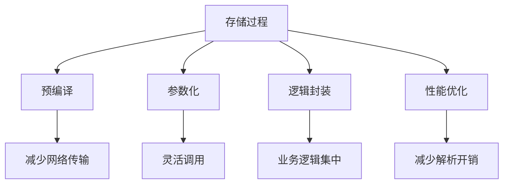

# 8.3 MySQL 存储过程

## 目录
- [1. 概述](#1-概述)
- [2. 存储过程语法](#2-存储过程语法)
- [3. 参数和变量](#3-参数和变量)
- [4. 控制结构](#4-控制结构)
- [5. 错误处理](#5-错误处理)
- [6. 存储过程优化](#6-存储过程优化)
- [7. 存储过程管理](#7-存储过程管理)
- [8. 实际应用示例](#8-实际应用示例)

## 1. 概述

MySQL存储过程是预编译的SQL语句集合，存储在数据库中，可以接受参数、执行逻辑操作并返回结果。

### 1.1 存储过程特点



### 1.2 存储过程优势

| 优势 | 描述 | 示例 |
|------|------|------|
| 性能提升 | 预编译减少解析开销 | 复杂查询优化 |
| 网络优化 | 减少客户端与服务器通信 | 批量操作 |
| 安全性 | 权限控制和数据验证 | 参数化查询 |
| 维护性 | 业务逻辑集中管理 | 统一数据处理 |
| 复用性 | 一次编写，多处调用 | 通用功能模块 |

## 2. 存储过程语法

### 2.1 基本语法

```sql
-- 创建存储过程基本语法
DELIMITER //
CREATE PROCEDURE procedure_name([parameters])
[characteristic ...]
BEGIN
    -- 存储过程体
    -- SQL语句
END //
DELIMITER ;

-- 示例1: 简单存储过程
DELIMITER //
CREATE PROCEDURE GetUserCount()
BEGIN
    SELECT COUNT(*) as user_count FROM users;
END //
DELIMITER ;

-- 调用存储过程
CALL GetUserCount();
```

### 2.2 参数类型

```sql
-- 1. IN参数（输入参数）
DELIMITER //
CREATE PROCEDURE GetUserById(IN user_id INT)
BEGIN
    SELECT * FROM users WHERE id = user_id;
END //
DELIMITER ;

-- 调用
CALL GetUserById(1);

-- 2. OUT参数（输出参数）
DELIMITER //
CREATE PROCEDURE GetUserCount(OUT total_count INT)
BEGIN
    SELECT COUNT(*) INTO total_count FROM users;
END //
DELIMITER ;

-- 调用
CALL GetUserCount(@count);
SELECT @count;

-- 3. INOUT参数（输入输出参数）
DELIMITER //
CREATE PROCEDURE UpdateUserStatus(
    INOUT user_id INT,
    IN new_status VARCHAR(20)
)
BEGIN
    UPDATE users SET status = new_status WHERE id = user_id;
    SELECT COUNT(*) INTO user_id FROM users WHERE status = new_status;
END //
DELIMITER ;

-- 调用
SET @user_id = 1;
CALL UpdateUserStatus(@user_id, 'active');
SELECT @user_id;
```

### 2.3 特性设置

```sql
-- 存储过程特性
DELIMITER //
CREATE PROCEDURE ComplexProcedure()
COMMENT '复杂业务逻辑处理'
LANGUAGE SQL
NOT DETERMINISTIC
CONTAINS SQL
SQL SECURITY DEFINER
BEGIN
    -- 存储过程体
END //
DELIMITER ;

-- 特性说明
-- COMMENT: 存储过程注释
-- LANGUAGE SQL: 使用SQL语言
-- NOT DETERMINISTIC: 非确定性（结果可能变化）
-- CONTAINS SQL: 包含SQL语句
-- SQL SECURITY DEFINER: 以定义者权限执行
```

## 3. 参数和变量

### 3.1 变量声明

```sql
-- 1. 用户变量（会话变量）
SET @user_count = 0;
SET @total_amount = 1000.50;

-- 2. 局部变量
DELIMITER //
CREATE PROCEDURE VariableExample()
BEGIN
    DECLARE local_count INT DEFAULT 0;
    DECLARE user_name VARCHAR(50);
    DECLARE order_date DATE;
    
    SET local_count = 10;
    SET user_name = 'John';
    SET order_date = CURDATE();
    
    SELECT local_count, user_name, order_date;
END //
DELIMITER ;
```

### 3.2 变量类型

```sql
-- 变量类型示例
DELIMITER //
CREATE PROCEDURE VariableTypes()
BEGIN
    -- 整数类型
    DECLARE int_var INT DEFAULT 0;
    DECLARE bigint_var BIGINT DEFAULT 0;
    
    -- 字符串类型
    DECLARE varchar_var VARCHAR(100) DEFAULT '';
    DECLARE char_var CHAR(10) DEFAULT '';
    DECLARE text_var TEXT;
    
    -- 数值类型
    DECLARE decimal_var DECIMAL(10,2) DEFAULT 0.00;
    DECLARE float_var FLOAT DEFAULT 0.0;
    DECLARE double_var DOUBLE DEFAULT 0.0;
    
    -- 日期时间类型
    DECLARE date_var DATE DEFAULT CURDATE();
    DECLARE datetime_var DATETIME DEFAULT NOW();
    DECLARE timestamp_var TIMESTAMP DEFAULT CURRENT_TIMESTAMP;
    
    -- 布尔类型
    DECLARE bool_var BOOLEAN DEFAULT FALSE;
    
    -- 设置变量值
    SET int_var = 100;
    SET varchar_var = 'Hello World';
    SET decimal_var = 123.45;
    SET date_var = '2023-01-01';
    SET bool_var = TRUE;
    
    -- 使用变量
    SELECT int_var, varchar_var, decimal_var, date_var, bool_var;
END //
DELIMITER ;
```

### 3.3 变量作用域

```sql
-- 变量作用域示例
DELIMITER //
CREATE PROCEDURE VariableScope()
BEGIN
    -- 外层变量
    DECLARE outer_var INT DEFAULT 10;
    
    -- 内层块
    BEGIN
        -- 内层变量
        DECLARE inner_var INT DEFAULT 20;
        
        -- 可以访问外层变量
        SET inner_var = outer_var + inner_var;
        
        SELECT 'Inner block', outer_var, inner_var;
    END;
    
    -- 外层无法访问内层变量
    -- SET outer_var = inner_var; -- 错误
    
    SELECT 'Outer block', outer_var;
END //
DELIMITER ;
```

## 4. 控制结构

### 4.1 条件语句

```sql
-- 1. IF语句
DELIMITER //
CREATE PROCEDURE IfExample(IN user_id INT)
BEGIN
    DECLARE user_status VARCHAR(20);
    
    SELECT status INTO user_status FROM users WHERE id = user_id;
    
    IF user_status = 'active' THEN
        SELECT 'User is active';
    ELSEIF user_status = 'inactive' THEN
        SELECT 'User is inactive';
    ELSE
        SELECT 'User status unknown';
    END IF;
END //
DELIMITER ;

-- 2. CASE语句
DELIMITER //
CREATE PROCEDURE CaseExample(IN order_amount DECIMAL(10,2))
BEGIN
    DECLARE discount_rate DECIMAL(3,2);
    
    CASE 
        WHEN order_amount >= 1000 THEN
            SET discount_rate = 0.20;
        WHEN order_amount >= 500 THEN
            SET discount_rate = 0.10;
        WHEN order_amount >= 100 THEN
            SET discount_rate = 0.05;
        ELSE
            SET discount_rate = 0.00;
    END CASE;
    
    SELECT 
        order_amount,
        discount_rate,
        order_amount * (1 - discount_rate) as final_amount;
END //
DELIMITER ;
```

### 4.2 循环语句

```sql
-- 1. WHILE循环
DELIMITER //
CREATE PROCEDURE WhileExample()
BEGIN
    DECLARE counter INT DEFAULT 1;
    DECLARE result VARCHAR(1000) DEFAULT '';
    
    WHILE counter <= 5 DO
        SET result = CONCAT(result, 'Counter: ', counter, '; ');
        SET counter = counter + 1;
    END WHILE;
    
    SELECT result;
END //
DELIMITER ;

-- 2. REPEAT循环
DELIMITER //
CREATE PROCEDURE RepeatExample()
BEGIN
    DECLARE counter INT DEFAULT 1;
    DECLARE result VARCHAR(1000) DEFAULT '';
    
    REPEAT
        SET result = CONCAT(result, 'Counter: ', counter, '; ');
        SET counter = counter + 1;
    UNTIL counter > 5 END REPEAT;
    
    SELECT result;
END //
DELIMITER ;

-- 3. LOOP循环
DELIMITER //
CREATE PROCEDURE LoopExample()
BEGIN
    DECLARE counter INT DEFAULT 1;
    DECLARE result VARCHAR(1000) DEFAULT '';
    
    my_loop: LOOP
        SET result = CONCAT(result, 'Counter: ', counter, '; ');
        SET counter = counter + 1;
        
        IF counter > 5 THEN
            LEAVE my_loop;
        END IF;
    END LOOP my_loop;
    
    SELECT result;
END //
DELIMITER ;
```

### 4.3 游标使用

```sql
-- 游标示例
DELIMITER //
CREATE PROCEDURE CursorExample()
BEGIN
    DECLARE done INT DEFAULT FALSE;
    DECLARE user_id INT;
    DECLARE username VARCHAR(50);
    DECLARE email VARCHAR(100);
    
    -- 声明游标
    DECLARE user_cursor CURSOR FOR 
        SELECT id, username, email FROM users WHERE status = 'active';
    
    -- 声明异常处理
    DECLARE CONTINUE HANDLER FOR NOT FOUND SET done = TRUE;
    
    -- 创建临时表存储结果
    CREATE TEMPORARY TABLE temp_user_list (
        user_id INT,
        username VARCHAR(50),
        email VARCHAR(100)
    );
    
    -- 打开游标
    OPEN user_cursor;
    
    -- 读取数据
    read_loop: LOOP
        FETCH user_cursor INTO user_id, username, email;
        
        IF done THEN
            LEAVE read_loop;
        END IF;
        
        -- 处理数据
        INSERT INTO temp_user_list VALUES (user_id, username, email);
    END LOOP;
    
    -- 关闭游标
    CLOSE user_cursor;
    
    -- 返回结果
    SELECT * FROM temp_user_list;
    
    -- 清理临时表
    DROP TEMPORARY TABLE IF EXISTS temp_user_list;
END //
DELIMITER ;
```

## 5. 错误处理

### 5.1 异常处理

```sql
-- 异常处理示例
DELIMITER //
CREATE PROCEDURE ErrorHandlingExample(IN user_id INT)
BEGIN
    DECLARE EXIT HANDLER FOR SQLEXCEPTION
    BEGIN
        SELECT 'Error occurred: ', SQLSTATE, SQLMESSAGE;
        ROLLBACK;
    END;
    
    DECLARE EXIT HANDLER FOR SQLWARNING
    BEGIN
        SELECT 'Warning occurred: ', SQLSTATE, SQLMESSAGE;
    END;
    
    DECLARE EXIT HANDLER FOR NOT FOUND
    BEGIN
        SELECT 'No data found for user_id: ', user_id;
    END;
    
    -- 开始事务
    START TRANSACTION;
    
    -- 执行操作
    UPDATE users SET last_login = NOW() WHERE id = user_id;
    
    -- 检查影响的行数
    IF ROW_COUNT() = 0 THEN
        SIGNAL SQLSTATE '45000' 
        SET MESSAGE_TEXT = 'User not found';
    END IF;
    
    -- 提交事务
    COMMIT;
    
    SELECT 'User updated successfully';
END //
DELIMITER ;
```

### 5.2 自定义异常

```sql
-- 自定义异常示例
DELIMITER //
CREATE PROCEDURE CustomErrorExample(IN amount DECIMAL(10,2))
BEGIN
    DECLARE EXIT HANDLER FOR SQLEXCEPTION
    BEGIN
        SELECT 'Error: ', SQLSTATE, SQLMESSAGE;
        ROLLBACK;
    END;
    
    -- 检查金额
    IF amount <= 0 THEN
        SIGNAL SQLSTATE '45000' 
        SET MESSAGE_TEXT = 'Amount must be greater than 0';
    END IF;
    
    IF amount > 10000 THEN
        SIGNAL SQLSTATE '45001' 
        SET MESSAGE_TEXT = 'Amount exceeds maximum limit';
    END IF;
    
    -- 正常处理
    SELECT 'Amount is valid: ', amount;
END //
DELIMITER ;
```

## 6. 存储过程优化

### 6.1 性能优化

```sql
-- 1. 使用索引优化查询
DELIMITER //
CREATE PROCEDURE OptimizedUserSearch(IN search_term VARCHAR(50))
BEGIN
    -- 确保有适当的索引
    -- CREATE INDEX idx_username ON users(username);
    -- CREATE INDEX idx_email ON users(email);
    
    SELECT * FROM users 
    WHERE username LIKE CONCAT('%', search_term, '%')
       OR email LIKE CONCAT('%', search_term, '%')
    LIMIT 100;
END //
DELIMITER ;

-- 2. 批量操作优化
DELIMITER //
CREATE PROCEDURE BatchInsertUsers(IN user_data JSON)
BEGIN
    DECLARE i INT DEFAULT 0;
    DECLARE user_count INT;
    DECLARE current_user JSON;
    
    SET user_count = JSON_LENGTH(user_data);
    
    WHILE i < user_count DO
        SET current_user = JSON_EXTRACT(user_data, CONCAT('$[', i, ']'));
        
        INSERT INTO users (username, email, created_at)
        VALUES (
            JSON_UNQUOTE(JSON_EXTRACT(current_user, '$.username')),
            JSON_UNQUOTE(JSON_EXTRACT(current_user, '$.email')),
            NOW()
        );
        
        SET i = i + 1;
    END WHILE;
    
    SELECT CONCAT('Inserted ', user_count, ' users') as result;
END //
DELIMITER ;
```

### 6.2 内存优化

```sql
-- 内存优化示例
DELIMITER //
CREATE PROCEDURE MemoryOptimizedProcedure()
BEGIN
    -- 使用LIMIT限制结果集
    DECLARE done INT DEFAULT FALSE;
    DECLARE batch_size INT DEFAULT 1000;
    DECLARE offset_val INT DEFAULT 0;
    
    -- 分批处理大数据集
    WHILE NOT done DO
        INSERT INTO processed_data
        SELECT * FROM large_table
        LIMIT batch_size OFFSET offset_val;
        
        SET offset_val = offset_val + batch_size;
        
        -- 检查是否还有数据
        IF ROW_COUNT() < batch_size THEN
            SET done = TRUE;
        END IF;
    END WHILE;
END //
DELIMITER ;
```

### 6.3 缓存优化

```sql
-- 缓存优化示例
DELIMITER //
CREATE PROCEDURE CachedUserSummary()
BEGIN
    -- 检查缓存是否存在
    IF EXISTS (SELECT 1 FROM user_summary_cache WHERE updated_at > DATE_SUB(NOW(), INTERVAL 1 HOUR)) THEN
        -- 使用缓存数据
        SELECT * FROM user_summary_cache;
    ELSE
        -- 重新计算并更新缓存
        DELETE FROM user_summary_cache;
        
        INSERT INTO user_summary_cache
        SELECT 
            COUNT(*) as total_users,
            COUNT(CASE WHEN status = 'active' THEN 1 END) as active_users,
            AVG(DATEDIFF(CURDATE(), created_at)) as avg_user_age,
            NOW() as updated_at
        FROM users;
        
        SELECT * FROM user_summary_cache;
    END IF;
END //
DELIMITER ;
```

## 7. 存储过程管理

### 7.1 存储过程维护

```sql
-- 1. 查看存储过程
SHOW PROCEDURE STATUS WHERE db = 'your_database';

-- 2. 查看存储过程定义
SHOW CREATE PROCEDURE procedure_name;

-- 3. 查看存储过程参数
SELECT 
    parameter_name,
    parameter_mode,
    data_type,
    parameter_default
FROM information_schema.parameters
WHERE specific_name = 'procedure_name';

-- 4. 修改存储过程
DELIMITER //
CREATE OR REPLACE PROCEDURE UpdatedProcedure()
BEGIN
    -- 新的存储过程体
END //
DELIMITER ;

-- 5. 删除存储过程
DROP PROCEDURE IF EXISTS procedure_name;
```

### 7.2 存储过程监控

```sql
-- 监控存储过程性能
SELECT 
    routine_name,
    routine_type,
    created,
    last_altered
FROM information_schema.routines
WHERE routine_schema = 'your_database'
  AND routine_type = 'PROCEDURE';

-- 监控存储过程执行
SELECT 
    event_name,
    count_star,
    sum_timer_wait/1000000000 as total_time_sec,
    avg_timer_wait/1000000000 as avg_time_sec
FROM performance_schema.events_statements_summary_by_digest
WHERE digest_text LIKE '%CALL%';
```

### 7.3 存储过程备份

```sql
-- 导出存储过程
mysqldump -u username -p --no-data --routines --triggers database_name > procedures_backup.sql

-- 导入存储过程
mysql -u username -p database_name < procedures_backup.sql

-- 导出特定存储过程
SELECT 
    CONCAT('DELIMITER //\n',
           'CREATE PROCEDURE ', routine_name, '()\n',
           routine_definition, '\n',
           '//\nDELIMITER ;') as create_statement
FROM information_schema.routines
WHERE routine_schema = 'your_database'
  AND routine_type = 'PROCEDURE';
```

## 8. 实际应用示例

### 8.1 用户管理存储过程

```sql
-- 示例1: 用户注册存储过程
DELIMITER //
CREATE PROCEDURE RegisterUser(
    IN p_username VARCHAR(50),
    IN p_email VARCHAR(100),
    IN p_password VARCHAR(255),
    OUT p_user_id INT,
    OUT p_status VARCHAR(20)
)
BEGIN
    DECLARE EXIT HANDLER FOR SQLEXCEPTION
    BEGIN
        SET p_status = 'ERROR';
        ROLLBACK;
    END;
    
    DECLARE EXIT HANDLER FOR SQLWARNING
    BEGIN
        SET p_status = 'WARNING';
    END;
    
    -- 检查用户名是否已存在
    IF EXISTS (SELECT 1 FROM users WHERE username = p_username) THEN
        SET p_status = 'USERNAME_EXISTS';
        SET p_user_id = 0;
        SIGNAL SQLSTATE '45000' 
        SET MESSAGE_TEXT = 'Username already exists';
    END IF;
    
    -- 检查邮箱是否已存在
    IF EXISTS (SELECT 1 FROM users WHERE email = p_email) THEN
        SET p_status = 'EMAIL_EXISTS';
        SET p_user_id = 0;
        SIGNAL SQLSTATE '45000' 
        SET MESSAGE_TEXT = 'Email already exists';
    END IF;
    
    -- 开始事务
    START TRANSACTION;
    
    -- 插入新用户
    INSERT INTO users (username, email, password_hash, created_at, status)
    VALUES (p_username, p_email, SHA2(p_password, 256), NOW(), 'active');
    
    SET p_user_id = LAST_INSERT_ID();
    SET p_status = 'SUCCESS';
    
    -- 提交事务
    COMMIT;
    
    SELECT 'User registered successfully' as message;
END //
DELIMITER ;

-- 示例2: 用户登录存储过程
DELIMITER //
CREATE PROCEDURE UserLogin(
    IN p_username VARCHAR(50),
    IN p_password VARCHAR(255),
    OUT p_user_id INT,
    OUT p_status VARCHAR(20)
)
BEGIN
    DECLARE stored_password VARCHAR(255);
    DECLARE user_status VARCHAR(20);
    
    -- 获取用户信息
    SELECT id, password_hash, status 
    INTO p_user_id, stored_password, user_status
    FROM users 
    WHERE username = p_username OR email = p_username;
    
    -- 检查用户是否存在
    IF p_user_id IS NULL THEN
        SET p_status = 'USER_NOT_FOUND';
        SET p_user_id = 0;
        SIGNAL SQLSTATE '45000' 
        SET MESSAGE_TEXT = 'User not found';
    END IF;
    
    -- 检查用户状态
    IF user_status != 'active' THEN
        SET p_status = 'ACCOUNT_INACTIVE';
        SET p_user_id = 0;
        SIGNAL SQLSTATE '45000' 
        SET MESSAGE_TEXT = 'Account is not active';
    END IF;
    
    -- 验证密码
    IF stored_password != SHA2(p_password, 256) THEN
        SET p_status = 'INVALID_PASSWORD';
        SET p_user_id = 0;
        SIGNAL SQLSTATE '45000' 
        SET MESSAGE_TEXT = 'Invalid password';
    END IF;
    
    -- 更新最后登录时间
    UPDATE users SET last_login = NOW() WHERE id = p_user_id;
    SET p_status = 'SUCCESS';
    
    SELECT 'Login successful' as message;
END //
DELIMITER ;
```

### 8.2 订单处理存储过程

```sql
-- 示例1: 创建订单存储过程
DELIMITER //
CREATE PROCEDURE CreateOrder(
    IN p_user_id INT,
    IN p_items JSON,
    OUT p_order_id INT,
    OUT p_status VARCHAR(20)
)
BEGIN
    DECLARE EXIT HANDLER FOR SQLEXCEPTION
    BEGIN
        SET p_status = 'ERROR';
        ROLLBACK;
    END;
    
    DECLARE i INT DEFAULT 0;
    DECLARE item_count INT;
    DECLARE current_item JSON;
    DECLARE product_id INT;
    DECLARE quantity INT;
    DECLARE unit_price DECIMAL(10,2);
    DECLARE total_amount DECIMAL(10,2) DEFAULT 0;
    
    -- 开始事务
    START TRANSACTION;
    
    -- 检查用户是否存在
    IF NOT EXISTS (SELECT 1 FROM users WHERE id = p_user_id AND status = 'active') THEN
        SET p_status = 'INVALID_USER';
        SIGNAL SQLSTATE '45000' 
        SET MESSAGE_TEXT = 'Invalid user';
    END IF;
    
    -- 创建订单
    INSERT INTO orders (user_id, order_date, status, total_amount)
    VALUES (p_user_id, NOW(), 'pending', 0);
    
    SET p_order_id = LAST_INSERT_ID();
    SET item_count = JSON_LENGTH(p_items);
    
    -- 处理订单项
    WHILE i < item_count DO
        SET current_item = JSON_EXTRACT(p_items, CONCAT('$[', i, ']'));
        SET product_id = JSON_EXTRACT(current_item, '$.product_id');
        SET quantity = JSON_EXTRACT(current_item, '$.quantity');
        
        -- 获取产品信息
        SELECT price INTO unit_price FROM products WHERE id = product_id;
        
        -- 检查库存
        IF (SELECT stock_quantity FROM products WHERE id = product_id) < quantity THEN
            SET p_status = 'INSUFFICIENT_STOCK';
            SIGNAL SQLSTATE '45000' 
            SET MESSAGE_TEXT = 'Insufficient stock';
        END IF;
        
        -- 添加订单项
        INSERT INTO order_items (order_id, product_id, quantity, unit_price)
        VALUES (p_order_id, product_id, quantity, unit_price);
        
        -- 更新库存
        UPDATE products 
        SET stock_quantity = stock_quantity - quantity 
        WHERE id = product_id;
        
        SET total_amount = total_amount + (quantity * unit_price);
        SET i = i + 1;
    END WHILE;
    
    -- 更新订单总金额
    UPDATE orders SET total_amount = total_amount WHERE id = p_order_id;
    
    SET p_status = 'SUCCESS';
    
    -- 提交事务
    COMMIT;
    
    SELECT 'Order created successfully' as message;
END //
DELIMITER ;

-- 示例2: 订单状态更新存储过程
DELIMITER //
CREATE PROCEDURE UpdateOrderStatus(
    IN p_order_id INT,
    IN p_new_status VARCHAR(20),
    OUT p_status VARCHAR(20)
)
BEGIN
    DECLARE current_status VARCHAR(20);
    DECLARE order_user_id INT;
    
    -- 获取当前订单状态
    SELECT status, user_id INTO current_status, order_user_id
    FROM orders WHERE id = p_order_id;
    
    IF current_status IS NULL THEN
        SET p_status = 'ORDER_NOT_FOUND';
        SIGNAL SQLSTATE '45000' 
        SET MESSAGE_TEXT = 'Order not found';
    END IF;
    
    -- 状态转换验证
    CASE current_status
        WHEN 'pending' THEN
            IF p_new_status NOT IN ('confirmed', 'cancelled') THEN
                SET p_status = 'INVALID_STATUS_TRANSITION';
                SIGNAL SQLSTATE '45000' 
                SET MESSAGE_TEXT = 'Invalid status transition';
            END IF;
        WHEN 'confirmed' THEN
            IF p_new_status NOT IN ('shipped', 'cancelled') THEN
                SET p_status = 'INVALID_STATUS_TRANSITION';
                SIGNAL SQLSTATE '45000' 
                SET MESSAGE_TEXT = 'Invalid status transition';
            END IF;
        WHEN 'shipped' THEN
            IF p_new_status != 'delivered' THEN
                SET p_status = 'INVALID_STATUS_TRANSITION';
                SIGNAL SQLSTATE '45000' 
                SET MESSAGE_TEXT = 'Invalid status transition';
            END IF;
        ELSE
            SET p_status = 'INVALID_STATUS_TRANSITION';
            SIGNAL SQLSTATE '45000' 
            SET MESSAGE_TEXT = 'Invalid status transition';
    END CASE;
    
    -- 更新订单状态
    UPDATE orders SET status = p_new_status WHERE id = p_order_id;
    
    -- 记录状态变更
    INSERT INTO order_status_history (order_id, old_status, new_status, changed_at)
    VALUES (p_order_id, current_status, p_new_status, NOW());
    
    SET p_status = 'SUCCESS';
    
    SELECT 'Order status updated successfully' as message;
END //
DELIMITER ;
```

### 8.3 数据统计存储过程

```sql
-- 示例1: 销售统计存储过程
DELIMITER //
CREATE PROCEDURE GenerateSalesReport(
    IN p_start_date DATE,
    IN p_end_date DATE,
    IN p_group_by VARCHAR(20)
)
BEGIN
    DECLARE sql_query TEXT;
    
    -- 根据分组方式构建查询
    CASE p_group_by
        WHEN 'daily' THEN
            SET sql_query = CONCAT(
                'SELECT DATE(order_date) as report_date,',
                'COUNT(*) as order_count,',
                'SUM(total_amount) as total_revenue,',
                'AVG(total_amount) as avg_order_value,',
                'COUNT(DISTINCT user_id) as unique_customers',
                'FROM orders',
                'WHERE DATE(order_date) BETWEEN ''', p_start_date, ''' AND ''', p_end_date, '''',
                'GROUP BY DATE(order_date)',
                'ORDER BY report_date'
            );
        WHEN 'weekly' THEN
            SET sql_query = CONCAT(
                'SELECT YEARWEEK(order_date) as year_week,',
                'MIN(DATE(order_date)) as week_start,',
                'MAX(DATE(order_date)) as week_end,',
                'COUNT(*) as order_count,',
                'SUM(total_amount) as total_revenue,',
                'AVG(total_amount) as avg_order_value,',
                'COUNT(DISTINCT user_id) as unique_customers',
                'FROM orders',
                'WHERE DATE(order_date) BETWEEN ''', p_start_date, ''' AND ''', p_end_date, '''',
                'GROUP BY YEARWEEK(order_date)',
                'ORDER BY year_week'
            );
        WHEN 'monthly' THEN
            SET sql_query = CONCAT(
                'SELECT DATE_FORMAT(order_date, ''%Y-%m'') as year_month,',
                'COUNT(*) as order_count,',
                'SUM(total_amount) as total_revenue,',
                'AVG(total_amount) as avg_order_value,',
                'COUNT(DISTINCT user_id) as unique_customers',
                'FROM orders',
                'WHERE DATE(order_date) BETWEEN ''', p_start_date, ''' AND ''', p_end_date, '''',
                'GROUP BY DATE_FORMAT(order_date, ''%Y-%m'')',
                'ORDER BY year_month'
            );
        ELSE
            SIGNAL SQLSTATE '45000' 
            SET MESSAGE_TEXT = 'Invalid group_by parameter';
    END CASE;
    
    -- 执行动态查询
    SET @sql = sql_query;
    PREPARE stmt FROM @sql;
    EXECUTE stmt;
    DEALLOCATE PREPARE stmt;
END //
DELIMITER ;

-- 示例2: 用户行为分析存储过程
DELIMITER //
CREATE PROCEDURE AnalyzeUserBehavior(
    IN p_user_id INT,
    IN p_days_back INT
)
BEGIN
    DECLARE user_exists INT DEFAULT 0;
    
    -- 检查用户是否存在
    SELECT COUNT(*) INTO user_exists FROM users WHERE id = p_user_id;
    
    IF user_exists = 0 THEN
        SIGNAL SQLSTATE '45000' 
        SET MESSAGE_TEXT = 'User not found';
    END IF;
    
    -- 用户基本信息
    SELECT 
        u.username,
        u.email,
        u.created_at as registration_date,
        DATEDIFF(CURDATE(), u.created_at) as days_since_registration
    FROM users u
    WHERE u.id = p_user_id;
    
    -- 订单统计
    SELECT 
        COUNT(*) as total_orders,
        SUM(total_amount) as total_spent,
        AVG(total_amount) as avg_order_value,
        MIN(order_date) as first_order_date,
        MAX(order_date) as last_order_date,
        DATEDIFF(MAX(order_date), MIN(order_date)) as order_span_days
    FROM orders
    WHERE user_id = p_user_id
      AND order_date >= DATE_SUB(CURDATE(), INTERVAL p_days_back DAY);
    
    -- 产品偏好
    SELECT 
        p.product_name,
        c.category_name,
        COUNT(*) as purchase_count,
        SUM(oi.quantity) as total_quantity,
        SUM(oi.quantity * oi.unit_price) as total_spent
    FROM orders o
    JOIN order_items oi ON o.id = oi.order_id
    JOIN products p ON oi.product_id = p.id
    JOIN categories c ON p.category_id = c.id
    WHERE o.user_id = p_user_id
      AND o.order_date >= DATE_SUB(CURDATE(), INTERVAL p_days_back DAY)
    GROUP BY p.id
    ORDER BY total_spent DESC
    LIMIT 10;
    
    -- 购买趋势
    SELECT 
        DATE(order_date) as purchase_date,
        COUNT(*) as orders_count,
        SUM(total_amount) as daily_spent
    FROM orders
    WHERE user_id = p_user_id
      AND order_date >= DATE_SUB(CURDATE(), INTERVAL p_days_back DAY)
    GROUP BY DATE(order_date)
    ORDER BY purchase_date DESC;
END //
DELIMITER ;
```

## 总结

MySQL存储过程是强大的数据库编程工具，需要：

1. **合理设计**：根据业务需求设计合适的存储过程结构
2. **性能优化**：通过索引、批量操作、缓存等方式优化性能
3. **错误处理**：完善的异常处理和事务管理
4. **维护管理**：定期检查和维护存储过程
5. **安全控制**：通过参数验证和权限控制保证安全性

通过合理使用存储过程，可以提升应用性能、简化业务逻辑、增强数据安全性。 

**[返回目录 README.md](./README.md)** 