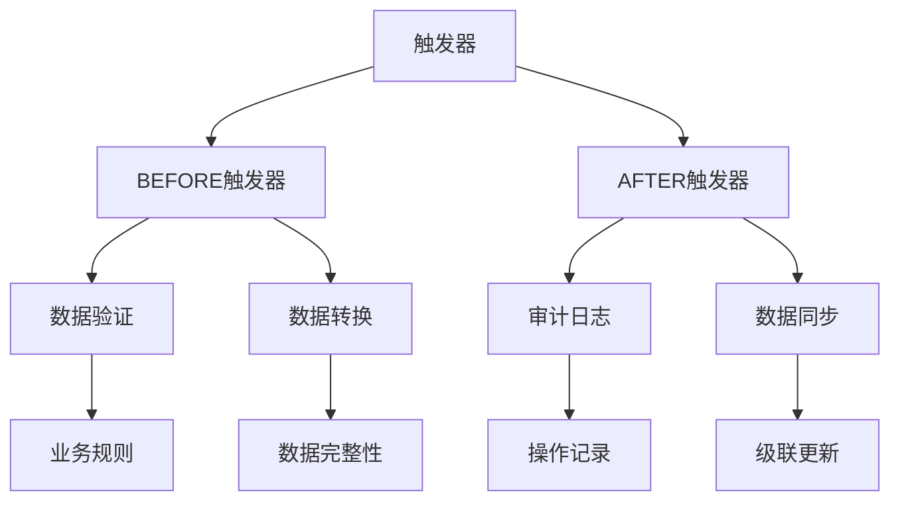

# 8.4 MySQL 触发器

## 目录
- [1. 概述](#1-概述)
- [2. 触发器类型](#2-触发器类型)
- [3. 触发器语法](#3-触发器语法)
- [4. 触发器使用场景](#4-触发器使用场景)
- [5. 触发器优化](#5-触发器优化)
- [6. 触发器管理](#6-触发器管理)
- [7. 触发器调试](#7-触发器调试)
- [8. 实际应用示例](#8-实际应用示例)

## 1. 概述

MySQL触发器是数据库对象，在表发生INSERT、UPDATE、DELETE事件时自动执行的一段代码。触发器可以用于数据验证、审计日志、数据同步等。

### 1.1 触发器特点



### 1.2 触发器优势

| 优势 | 描述 | 示例 |
|------|------|------|
| 自动化 | 自动执行，无需手动调用 | 数据变更时自动记录日志 |
| 数据完整性 | 确保数据符合业务规则 | 数据验证和约束检查 |
| 审计追踪 | 记录所有数据变更 | 操作日志和变更历史 |
| 业务逻辑 | 实现复杂的业务规则 | 自动计算和状态更新 |
| 数据同步 | 保持相关表数据一致 | 级联更新和同步 |

## 2. 触发器类型

### 2.1 按触发时机分类

```sql
-- 1. BEFORE触发器（在操作前执行）
DELIMITER //
CREATE TRIGGER before_user_insert
BEFORE INSERT ON users
FOR EACH ROW
BEGIN
    -- 在插入前执行的逻辑
    SET NEW.created_at = NOW();
    SET NEW.status = 'active';
END //
DELIMITER ;

-- 2. AFTER触发器（在操作后执行）
DELIMITER //
CREATE TRIGGER after_user_insert
AFTER INSERT ON users
FOR EACH ROW
BEGIN
    -- 在插入后执行的逻辑
    INSERT INTO user_audit_log (user_id, action, action_time)
    VALUES (NEW.id, 'INSERT', NOW());
END //
DELIMITER ;
```

### 2.2 按操作类型分类

```sql
-- 1. INSERT触发器
DELIMITER //
CREATE TRIGGER on_user_insert
AFTER INSERT ON users
FOR EACH ROW
BEGIN
    -- 插入用户后的处理逻辑
    INSERT INTO user_statistics (user_id, registration_date)
    VALUES (NEW.id, NEW.created_at);
END //
DELIMITER ;

-- 2. UPDATE触发器
DELIMITER //
CREATE TRIGGER on_user_update
AFTER UPDATE ON users
FOR EACH ROW
BEGIN
    -- 更新用户后的处理逻辑
    INSERT INTO user_audit_log (user_id, action, old_value, new_value, action_time)
    VALUES (NEW.id, 'UPDATE', OLD.status, NEW.status, NOW());
END //
DELIMITER ;

-- 3. DELETE触发器
DELIMITER //
CREATE TRIGGER on_user_delete
BEFORE DELETE ON users
FOR EACH ROW
BEGIN
    -- 删除用户前的处理逻辑
    INSERT INTO user_audit_log (user_id, action, action_time)
    VALUES (OLD.id, 'DELETE', NOW());
    
    -- 软删除：更新状态而不是真正删除
    UPDATE user_statistics SET deleted_at = NOW() WHERE user_id = OLD.id;
END //
DELIMITER ;
```

### 2.3 触发器执行顺序

```sql
-- 触发器执行顺序示例
DELIMITER //
CREATE TRIGGER before_order_insert
BEFORE INSERT ON orders
FOR EACH ROW
BEGIN
    -- 1. 数据验证
    IF NEW.total_amount <= 0 THEN
        SIGNAL SQLSTATE '45000' 
        SET MESSAGE_TEXT = 'Order amount must be greater than 0';
    END IF;
    
    -- 2. 数据转换
    SET NEW.order_date = NOW();
    SET NEW.status = 'pending';
END //
DELIMITER ;

DELIMITER //
CREATE TRIGGER after_order_insert
AFTER INSERT ON orders
FOR EACH ROW
BEGIN
    -- 3. 审计日志
    INSERT INTO order_audit_log (order_id, action, action_time)
    VALUES (NEW.id, 'INSERT', NOW());
    
    -- 4. 数据同步
    UPDATE user_statistics 
    SET total_orders = total_orders + 1,
        total_spent = total_spent + NEW.total_amount
    WHERE user_id = NEW.user_id;
END //
DELIMITER ;
```

## 3. 触发器语法

### 3.1 创建触发器

```sql
-- 基本语法
DELIMITER //
CREATE TRIGGER trigger_name
{BEFORE | AFTER} {INSERT | UPDATE | DELETE}
ON table_name
FOR EACH ROW
BEGIN
    -- 触发器逻辑
END //
DELIMITER ;

-- 示例1: 简单的BEFORE INSERT触发器
DELIMITER //
CREATE TRIGGER set_user_defaults
BEFORE INSERT ON users
FOR EACH ROW
BEGIN
    SET NEW.created_at = NOW();
    SET NEW.status = 'active';
    SET NEW.last_login = NULL;
END //
DELIMITER ;

-- 示例2: 复杂的AFTER UPDATE触发器
DELIMITER //
CREATE TRIGGER log_user_changes
AFTER UPDATE ON users
FOR EACH ROW
BEGIN
    -- 记录用户名变更
    IF OLD.username != NEW.username THEN
        INSERT INTO user_change_log (user_id, field_name, old_value, new_value, changed_at)
        VALUES (NEW.id, 'username', OLD.username, NEW.username, NOW());
    END IF;
    
    -- 记录邮箱变更
    IF OLD.email != NEW.email THEN
        INSERT INTO user_change_log (user_id, field_name, old_value, new_value, changed_at)
        VALUES (NEW.id, 'email', OLD.email, NEW.email, NOW());
    END IF;
    
    -- 记录状态变更
    IF OLD.status != NEW.status THEN
        INSERT INTO user_change_log (user_id, field_name, old_value, new_value, changed_at)
        VALUES (NEW.id, 'status', OLD.status, NEW.status, NOW());
    END IF;
END //
DELIMITER ;
```

### 3.2 修改触发器

```sql
-- 删除并重新创建触发器
DROP TRIGGER IF EXISTS trigger_name;

DELIMITER //
CREATE TRIGGER trigger_name
BEFORE INSERT ON table_name
FOR EACH ROW
BEGIN
    -- 新的触发器逻辑
END //
DELIMITER ;
```

### 3.3 删除触发器

```sql
-- 删除触发器
DROP TRIGGER IF EXISTS trigger_name;

-- 删除多个触发器
DROP TRIGGER IF EXISTS before_user_insert;
DROP TRIGGER IF EXISTS after_user_insert;
DROP TRIGGER IF EXISTS before_user_update;
```

### 3.4 查看触发器

```sql
-- 查看所有触发器
SHOW TRIGGERS;

-- 查看特定表的触发器
SHOW TRIGGERS WHERE `Table` = 'users';

-- 查看触发器详细信息
SELECT 
    trigger_name,
    event_manipulation,
    event_object_table,
    action_timing,
    action_statement
FROM information_schema.triggers
WHERE trigger_schema = 'your_database';
```

## 4. 触发器使用场景

### 4.1 数据验证

```sql
-- 场景1: 数据完整性验证
DELIMITER //
CREATE TRIGGER validate_order_data
BEFORE INSERT ON orders
FOR EACH ROW
BEGIN
    -- 验证用户是否存在
    IF NOT EXISTS (SELECT 1 FROM users WHERE id = NEW.user_id AND status = 'active') THEN
        SIGNAL SQLSTATE '45000' 
        SET MESSAGE_TEXT = 'Invalid user or user is not active';
    END IF;
    
    -- 验证订单金额
    IF NEW.total_amount <= 0 THEN
        SIGNAL SQLSTATE '45000' 
        SET MESSAGE_TEXT = 'Order amount must be greater than 0';
    END IF;
    
    -- 验证订单日期
    IF NEW.order_date > NOW() THEN
        SIGNAL SQLSTATE '45000' 
        SET MESSAGE_TEXT = 'Order date cannot be in the future';
    END IF;
END //
DELIMITER ;

-- 场景2: 业务规则验证
DELIMITER //
CREATE TRIGGER validate_product_stock
BEFORE INSERT ON order_items
FOR EACH ROW
BEGIN
    DECLARE available_stock INT;
    
    -- 检查库存
    SELECT stock_quantity INTO available_stock
    FROM products WHERE id = NEW.product_id;
    
    IF available_stock < NEW.quantity THEN
        SIGNAL SQLSTATE '45000' 
        SET MESSAGE_TEXT = 'Insufficient stock for product';
    END IF;
END //
DELIMITER ;
```

### 4.2 审计日志

```sql
-- 场景1: 用户操作审计
DELIMITER //
CREATE TRIGGER audit_user_changes
AFTER UPDATE ON users
FOR EACH ROW
BEGIN
    -- 记录所有字段变更
    IF OLD.username != NEW.username THEN
        INSERT INTO audit_log (table_name, record_id, field_name, old_value, new_value, action_type, action_time, action_user)
        VALUES ('users', NEW.id, 'username', OLD.username, NEW.username, 'UPDATE', NOW(), USER());
    END IF;
    
    IF OLD.email != NEW.email THEN
        INSERT INTO audit_log (table_name, record_id, field_name, old_value, new_value, action_type, action_time, action_user)
        VALUES ('users', NEW.id, 'email', OLD.email, NEW.email, 'UPDATE', NOW(), USER());
    END IF;
    
    IF OLD.status != NEW.status THEN
        INSERT INTO audit_log (table_name, record_id, field_name, old_value, new_value, action_type, action_time, action_user)
        VALUES ('users', NEW.id, 'status', OLD.status, NEW.status, 'UPDATE', NOW(), USER());
    END IF;
END //
DELIMITER ;

-- 场景2: 订单状态变更审计
DELIMITER //
CREATE TRIGGER audit_order_status
AFTER UPDATE ON orders
FOR EACH ROW
BEGIN
    IF OLD.status != NEW.status THEN
        INSERT INTO order_status_history (order_id, old_status, new_status, changed_at, changed_by)
        VALUES (NEW.id, OLD.status, NEW.status, NOW(), USER());
    END IF;
END //
DELIMITER ;
```

### 4.3 数据同步

```sql
-- 场景1: 用户统计同步
DELIMITER //
CREATE TRIGGER sync_user_statistics
AFTER INSERT ON orders
FOR EACH ROW
BEGIN
    -- 更新用户订单统计
    INSERT INTO user_statistics (user_id, total_orders, total_spent, last_order_date)
    VALUES (NEW.user_id, 1, NEW.total_amount, NEW.order_date)
    ON DUPLICATE KEY UPDATE
        total_orders = total_orders + 1,
        total_spent = total_spent + NEW.total_amount,
        last_order_date = NEW.order_date;
END //
DELIMITER ;

-- 场景2: 库存同步
DELIMITER //
CREATE TRIGGER sync_product_stock
AFTER INSERT ON order_items
FOR EACH ROW
BEGIN
    -- 更新产品库存
    UPDATE products 
    SET stock_quantity = stock_quantity - NEW.quantity,
        last_updated = NOW()
    WHERE id = NEW.product_id;
END //
DELIMITER ;
```

### 4.4 自动计算

```sql
-- 场景1: 订单总金额计算
DELIMITER //
CREATE TRIGGER calculate_order_total
AFTER INSERT ON order_items
FOR EACH ROW
BEGIN
    -- 重新计算订单总金额
    UPDATE orders 
    SET total_amount = (
        SELECT SUM(quantity * unit_price) 
        FROM order_items 
        WHERE order_id = NEW.order_id
    )
    WHERE id = NEW.order_id;
END //
DELIMITER ;

-- 场景2: 用户等级计算
DELIMITER //
CREATE TRIGGER calculate_user_level
AFTER UPDATE ON user_statistics
FOR EACH ROW
BEGIN
    DECLARE user_level VARCHAR(20);
    
    -- 根据消费金额计算用户等级
    IF NEW.total_spent >= 10000 THEN
        SET user_level = 'VIP';
    ELSEIF NEW.total_spent >= 5000 THEN
        SET user_level = 'Gold';
    ELSEIF NEW.total_spent >= 1000 THEN
        SET user_level = 'Silver';
    ELSE
        SET user_level = 'Bronze';
    END IF;
    
    -- 更新用户等级
    UPDATE users SET level = user_level WHERE id = NEW.user_id;
END //
DELIMITER ;
```

## 5. 触发器优化

### 5.1 性能优化

```sql
-- 1. 避免在触发器中执行复杂查询
DELIMITER //
CREATE TRIGGER optimized_user_audit
AFTER UPDATE ON users
FOR EACH ROW
BEGIN
    -- 只记录实际变更的字段
    IF OLD.username != NEW.username THEN
        INSERT INTO user_audit_log (user_id, field_name, old_value, new_value)
        VALUES (NEW.id, 'username', OLD.username, NEW.username);
    END IF;
    
    IF OLD.email != NEW.email THEN
        INSERT INTO user_audit_log (user_id, field_name, old_value, new_value)
        VALUES (NEW.id, 'email', OLD.email, NEW.email);
    END IF;
END //
DELIMITER ;

-- 2. 使用批量操作
DELIMITER //
CREATE TRIGGER batch_update_statistics
AFTER INSERT ON orders
FOR EACH ROW
BEGIN
    -- 使用INSERT ... ON DUPLICATE KEY UPDATE进行批量更新
    INSERT INTO daily_statistics (date, order_count, total_revenue)
    VALUES (DATE(NEW.order_date), 1, NEW.total_amount)
    ON DUPLICATE KEY UPDATE
        order_count = order_count + 1,
        total_revenue = total_revenue + NEW.total_amount;
END //
DELIMITER ;
```

### 5.2 错误处理

```sql
-- 1. 完善的错误处理
DELIMITER //
CREATE TRIGGER safe_user_update
BEFORE UPDATE ON users
FOR EACH ROW
BEGIN
    DECLARE EXIT HANDLER FOR SQLEXCEPTION
    BEGIN
        -- 记录错误日志
        INSERT INTO trigger_error_log (trigger_name, error_message, error_time)
        VALUES ('safe_user_update', 'Error occurred during user update', NOW());
        
        -- 回滚操作
        SIGNAL SQLSTATE '45000' 
        SET MESSAGE_TEXT = 'Error occurred during user update';
    END;
    
    -- 数据验证
    IF NEW.email NOT REGEXP '^[A-Za-z0-9._%+-]+@[A-Za-z0-9.-]+\.[A-Za-z]{2,}$' THEN
        SIGNAL SQLSTATE '45000' 
        SET MESSAGE_TEXT = 'Invalid email format';
    END IF;
    
    IF NEW.username IS NULL OR LENGTH(NEW.username) < 3 THEN
        SIGNAL SQLSTATE '45000' 
        SET MESSAGE_TEXT = 'Username must be at least 3 characters long';
    END IF;
END //
DELIMITER ;

-- 2. 条件执行
DELIMITER //
CREATE TRIGGER conditional_audit
AFTER UPDATE ON users
FOR EACH ROW
BEGIN
    -- 只在特定条件下执行审计
    IF NEW.status = 'suspended' AND OLD.status != 'suspended' THEN
        INSERT INTO user_audit_log (user_id, action, action_time, details)
        VALUES (NEW.id, 'SUSPEND', NOW(), 'User account suspended');
    END IF;
    
    IF NEW.status = 'active' AND OLD.status = 'suspended' THEN
        INSERT INTO user_audit_log (user_id, action, action_time, details)
        VALUES (NEW.id, 'REACTIVATE', NOW(), 'User account reactivated');
    END IF;
END //
DELIMITER ;
```

### 5.3 内存优化

```sql
-- 1. 避免在触发器中创建临时表
DELIMITER //
CREATE TRIGGER memory_efficient_audit
AFTER UPDATE ON users
FOR EACH ROW
BEGIN
    -- 直接插入，避免临时表
    INSERT INTO user_audit_log (user_id, field_name, old_value, new_value, action_time)
    SELECT 
        NEW.id,
        'status',
        OLD.status,
        NEW.status,
        NOW()
    WHERE OLD.status != NEW.status;
END //
DELIMITER ;

-- 2. 使用简单的变量操作
DELIMITER //
CREATE TRIGGER simple_calculation
BEFORE INSERT ON orders
FOR EACH ROW
BEGIN
    -- 简单的计算，避免复杂查询
    SET NEW.order_date = NOW();
    SET NEW.status = 'pending';
    
    -- 验证数据
    IF NEW.total_amount IS NULL OR NEW.total_amount <= 0 THEN
        SIGNAL SQLSTATE '45000' 
        SET MESSAGE_TEXT = 'Invalid order amount';
    END IF;
END //
DELIMITER ;
```

## 6. 触发器管理

### 6.1 触发器监控

```sql
-- 1. 查看触发器执行情况
SELECT 
    trigger_name,
    event_manipulation,
    event_object_table,
    action_timing,
    action_statement
FROM information_schema.triggers
WHERE trigger_schema = 'your_database';

-- 2. 监控触发器性能
SELECT 
    event_name,
    count_star,
    sum_timer_wait/1000000000 as total_time_sec,
    avg_timer_wait/1000000000 as avg_time_sec
FROM performance_schema.events_statements_summary_by_digest
WHERE digest_text LIKE '%trigger%';

-- 3. 检查触发器依赖
SELECT 
    table_name,
    trigger_name,
    event_manipulation,
    action_timing
FROM information_schema.triggers
WHERE trigger_schema = 'your_database'
ORDER BY table_name, trigger_name;
```

### 6.2 触发器维护

```sql
-- 1. 备份触发器定义
SELECT 
    CONCAT('DELIMITER //\n',
           'CREATE TRIGGER ', trigger_name, '\n',
           action_timing, ' ', event_manipulation, '\n',
           'ON ', event_object_table, '\n',
           'FOR EACH ROW\n',
           action_statement, '\n',
           '//\nDELIMITER ;') as create_statement
FROM information_schema.triggers
WHERE trigger_schema = 'your_database';

-- 2. 重建触发器
DELIMITER //
CREATE PROCEDURE rebuild_triggers()
BEGIN
    DECLARE done INT DEFAULT FALSE;
    DECLARE trigger_name VARCHAR(255);
    DECLARE trigger_def TEXT;
    DECLARE cur CURSOR FOR 
        SELECT trigger_name, action_statement 
        FROM information_schema.triggers 
        WHERE trigger_schema = 'your_database';
    DECLARE CONTINUE HANDLER FOR NOT FOUND SET done = TRUE;
    
    OPEN cur;
    
    read_loop: LOOP
        FETCH cur INTO trigger_name, trigger_def;
        IF done THEN
            LEAVE read_loop;
        END IF;
        
        SET @sql = CONCAT('DROP TRIGGER IF EXISTS ', trigger_name);
        PREPARE stmt FROM @sql;
        EXECUTE stmt;
        DEALLOCATE PREPARE stmt;
        
        -- 重建触发器（需要完整的定义）
    END LOOP;
    
    CLOSE cur;
END //
DELIMITER ;
```

### 6.3 触发器调试

```sql
-- 1. 创建调试日志表
CREATE TABLE trigger_debug_log (
    id INT AUTO_INCREMENT PRIMARY KEY,
    trigger_name VARCHAR(100),
    table_name VARCHAR(100),
    action_type VARCHAR(20),
    record_id INT,
    debug_message TEXT,
    created_at TIMESTAMP DEFAULT CURRENT_TIMESTAMP
);

-- 2. 在触发器中添加调试信息
DELIMITER //
CREATE TRIGGER debug_user_update
AFTER UPDATE ON users
FOR EACH ROW
BEGIN
    -- 记录调试信息
    INSERT INTO trigger_debug_log (trigger_name, table_name, action_type, record_id, debug_message)
    VALUES (
        'debug_user_update',
        'users',
        'UPDATE',
        NEW.id,
        CONCAT('Old status: ', OLD.status, ', New status: ', NEW.status)
    );
    
    -- 正常触发器逻辑
    IF OLD.status != NEW.status THEN
        INSERT INTO user_audit_log (user_id, field_name, old_value, new_value, action_time)
        VALUES (NEW.id, 'status', OLD.status, NEW.status, NOW());
    END IF;
END //
DELIMITER ;
```

## 7. 触发器调试

### 7.1 调试技巧

```sql
-- 1. 使用SIGNAL进行调试
DELIMITER //
CREATE TRIGGER debug_trigger
BEFORE INSERT ON orders
FOR EACH ROW
BEGIN
    -- 输出调试信息
    SELECT 
        'Debug Info' as debug_type,
        NEW.user_id as user_id,
        NEW.total_amount as amount,
        NOW() as trigger_time;
    
    -- 验证数据
    IF NEW.total_amount <= 0 THEN
        SIGNAL SQLSTATE '45000' 
        SET MESSAGE_TEXT = 'Invalid amount in trigger';
    END IF;
END //
DELIMITER ;

-- 2. 使用日志表记录执行过程
DELIMITER //
CREATE TRIGGER log_trigger_execution
AFTER INSERT ON orders
FOR EACH ROW
BEGIN
    INSERT INTO trigger_execution_log (
        trigger_name, 
        table_name, 
        action_type, 
        record_id, 
        execution_time,
        status
    ) VALUES (
        'log_trigger_execution',
        'orders',
        'INSERT',
        NEW.id,
        NOW(),
        'SUCCESS'
    );
END //
DELIMITER ;
```

### 7.2 性能分析

```sql
-- 1. 分析触发器执行时间
SELECT 
    event_name,
    count_star,
    sum_timer_wait/1000000000 as total_time_sec,
    avg_timer_wait/1000000000 as avg_time_sec,
    min_timer_wait/1000000000 as min_time_sec,
    max_timer_wait/1000000000 as max_time_sec
FROM performance_schema.events_statements_summary_by_digest
WHERE digest_text LIKE '%trigger%'
ORDER BY sum_timer_wait DESC;

-- 2. 监控触发器调用频率
SELECT 
    DATE(created_at) as date,
    COUNT(*) as trigger_calls,
    COUNT(DISTINCT trigger_name) as unique_triggers
FROM trigger_execution_log
WHERE created_at >= DATE_SUB(CURDATE(), INTERVAL 7 DAY)
GROUP BY DATE(created_at)
ORDER BY date DESC;
```

## 8. 实际应用示例

### 8.1 电商系统触发器

```sql
-- 示例1: 订单状态变更触发器
DELIMITER //
CREATE TRIGGER order_status_change
AFTER UPDATE ON orders
FOR EACH ROW
BEGIN
    -- 记录状态变更
    IF OLD.status != NEW.status THEN
        INSERT INTO order_status_history (
            order_id, 
            old_status, 
            new_status, 
            changed_at, 
            changed_by
        ) VALUES (
            NEW.id, 
            OLD.status, 
            NEW.status, 
            NOW(), 
            USER()
        );
        
        -- 发送通知（模拟）
        INSERT INTO notifications (
            user_id, 
            type, 
            message, 
            created_at
        ) VALUES (
            NEW.user_id, 
            'ORDER_STATUS', 
            CONCAT('Your order #', NEW.id, ' status changed to ', NEW.status), 
            NOW()
        );
    END IF;
END //
DELIMITER ;

-- 示例2: 库存管理触发器
DELIMITER //
CREATE TRIGGER manage_inventory
AFTER INSERT ON order_items
FOR EACH ROW
BEGIN
    DECLARE current_stock INT;
    DECLARE reorder_level INT;
    
    -- 获取当前库存和重订水平
    SELECT stock_quantity, reorder_level 
    INTO current_stock, reorder_level
    FROM products 
    WHERE id = NEW.product_id;
    
    -- 更新库存
    UPDATE products 
    SET stock_quantity = stock_quantity - NEW.quantity,
        last_updated = NOW()
    WHERE id = NEW.product_id;
    
    -- 检查是否需要补货
    IF (current_stock - NEW.quantity) <= reorder_level THEN
        INSERT INTO reorder_alerts (
            product_id, 
            current_stock, 
            reorder_level, 
            alert_date
        ) VALUES (
            NEW.product_id, 
            current_stock - NEW.quantity, 
            reorder_level, 
            NOW()
        );
    END IF;
END //
DELIMITER ;
```

### 8.2 用户管理系统触发器

```sql
-- 示例1: 用户注册触发器
DELIMITER //
CREATE TRIGGER user_registration
AFTER INSERT ON users
FOR EACH ROW
BEGIN
    -- 创建用户统计记录
    INSERT INTO user_statistics (
        user_id, 
        registration_date, 
        total_orders, 
        total_spent, 
        last_order_date
    ) VALUES (
        NEW.id, 
        NEW.created_at, 
        0, 
        0.00, 
        NULL
    );
    
    -- 发送欢迎邮件（模拟）
    INSERT INTO email_queue (
        user_id, 
        email_type, 
        subject, 
        body, 
        created_at
    ) VALUES (
        NEW.id, 
        'WELCOME', 
        'Welcome to our platform!', 
        CONCAT('Hi ', NEW.username, ', welcome to our platform!'), 
        NOW()
    );
    
    -- 记录注册事件
    INSERT INTO user_events (
        user_id, 
        event_type, 
        event_data, 
        created_at
    ) VALUES (
        NEW.id, 
        'REGISTRATION', 
        JSON_OBJECT('username', NEW.username, 'email', NEW.email), 
        NOW()
    );
END //
DELIMITER ;

-- 示例2: 用户等级更新触发器
DELIMITER //
CREATE TRIGGER update_user_level
AFTER UPDATE ON user_statistics
FOR EACH ROW
BEGIN
    DECLARE new_level VARCHAR(20);
    DECLARE old_level VARCHAR(20);
    
    -- 获取当前等级
    SELECT level INTO old_level FROM users WHERE id = NEW.user_id;
    
    -- 计算新等级
    IF NEW.total_spent >= 10000 THEN
        SET new_level = 'VIP';
    ELSEIF NEW.total_spent >= 5000 THEN
        SET new_level = 'Gold';
    ELSEIF NEW.total_spent >= 1000 THEN
        SET new_level = 'Silver';
    ELSE
        SET new_level = 'Bronze';
    END IF;
    
    -- 更新用户等级
    IF old_level != new_level THEN
        UPDATE users SET level = new_level WHERE id = NEW.user_id;
        
        -- 记录等级变更
        INSERT INTO user_level_history (
            user_id, 
            old_level, 
            new_level, 
            changed_at
        ) VALUES (
            NEW.user_id, 
            old_level, 
            new_level, 
            NOW()
        );
        
        -- 发送等级变更通知
        INSERT INTO notifications (
            user_id, 
            type, 
            message, 
            created_at
        ) VALUES (
            NEW.user_id, 
            'LEVEL_UP', 
            CONCAT('Congratulations! You are now a ', new_level, ' member!'), 
            NOW()
        );
    END IF;
END //
DELIMITER ;
```

### 8.3 数据审计触发器

```sql
-- 示例1: 全面审计触发器
DELIMITER //
CREATE TRIGGER comprehensive_audit
AFTER UPDATE ON users
FOR EACH ROW
BEGIN
    -- 记录所有字段变更
    IF OLD.username != NEW.username THEN
        INSERT INTO audit_log (
            table_name, 
            record_id, 
            field_name, 
            old_value, 
            new_value, 
            action_type, 
            action_time, 
            action_user
        ) VALUES (
            'users', 
            NEW.id, 
            'username', 
            OLD.username, 
            NEW.username, 
            'UPDATE', 
            NOW(), 
            USER()
        );
    END IF;
    
    IF OLD.email != NEW.email THEN
        INSERT INTO audit_log (
            table_name, 
            record_id, 
            field_name, 
            old_value, 
            new_value, 
            action_type, 
            action_time, 
            action_user
        ) VALUES (
            'users', 
            NEW.id, 
            'email', 
            OLD.email, 
            NEW.email, 
            'UPDATE', 
            NOW(), 
            USER()
        );
    END IF;
    
    IF OLD.status != NEW.status THEN
        INSERT INTO audit_log (
            table_name, 
            record_id, 
            field_name, 
            old_value, 
            new_value, 
            action_type, 
            action_time, 
            action_user
        ) VALUES (
            'users', 
            NEW.id, 
            'status', 
            OLD.status, 
            NEW.status, 
            'UPDATE', 
            NOW(), 
            USER()
        );
    END IF;
END //
DELIMITER ;

-- 示例2: 敏感操作审计触发器
DELIMITER //
CREATE TRIGGER sensitive_operation_audit
AFTER UPDATE ON users
FOR EACH ROW
BEGIN
    -- 监控敏感操作
    IF NEW.status = 'suspended' AND OLD.status != 'suspended' THEN
        INSERT INTO security_audit_log (
            user_id, 
            action_type, 
            action_details, 
            ip_address, 
            user_agent, 
            created_at
        ) VALUES (
            NEW.id, 
            'ACCOUNT_SUSPENSION', 
            CONCAT('Account suspended by ', USER()), 
            @session_ip, 
            @session_user_agent, 
            NOW()
        );
    END IF;
    
    IF NEW.status = 'deleted' AND OLD.status != 'deleted' THEN
        INSERT INTO security_audit_log (
            user_id, 
            action_type, 
            action_details, 
            ip_address, 
            user_agent, 
            created_at
        ) VALUES (
            NEW.id, 
            'ACCOUNT_DELETION', 
            CONCAT('Account deleted by ', USER()), 
            @session_ip, 
            @session_user_agent, 
            NOW()
        );
    END IF;
END //
DELIMITER ;
```

## 总结

MySQL触发器是强大的自动化工具，需要：

1. **合理设计**：根据业务需求设计合适的触发器逻辑
2. **性能优化**：避免在触发器中执行复杂查询和操作
3. **错误处理**：完善的异常处理和调试机制
4. **维护管理**：定期检查和维护触发器定义
5. **监控分析**：监控触发器执行情况和性能影响

通过合理使用触发器，可以实现数据自动化处理、业务规则执行、审计追踪等功能。 

**[返回目录 README.md](./README?id=_9-mysql-高级特性)** 