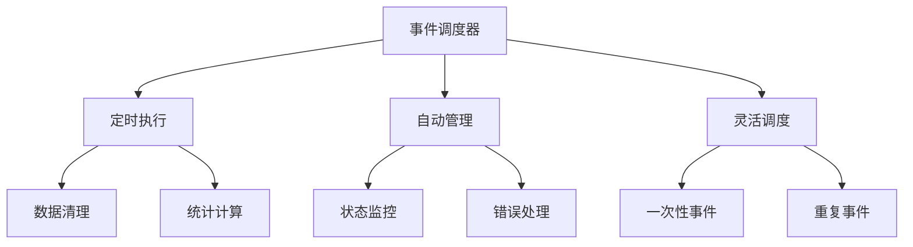

# 8.5 MySQL 事件调度器

## 目录
- [1. 概述](#1-概述)
- [2. 事件调度器配置](#2-事件调度器配置)
- [3. 事件语法](#3-事件语法)
- [4. 调度表达式](#4-调度表达式)
- [5. 事件管理](#5-事件管理)
- [6. 事件监控](#6-事件监控)
- [7. 事件优化](#7-事件优化)
- [8. 实际应用示例](#8-实际应用示例)

## 1. 概述

MySQL事件调度器是MySQL内置的定时任务系统，可以在指定的时间自动执行SQL语句或存储过程。事件调度器类似于操作系统的cron任务。

### 1.1 事件调度器特点



### 1.2 事件调度器优势

| 优势 | 描述 | 示例 |
|------|------|------|
| 自动化 | 无需人工干预，自动执行 | 定期清理过期数据 |
| 精确调度 | 支持复杂的调度表达式 | 每天凌晨2点执行 |
| 状态管理 | 自动监控事件执行状态 | 失败重试和告警 |
| 资源优化 | 在低峰期执行耗时操作 | 夜间数据统计 |
| 业务支持 | 支持各种业务场景 | 报表生成、数据同步 |

## 2. 事件调度器配置

### 2.1 启用事件调度器

```sql
-- 1. 检查事件调度器状态
SHOW VARIABLES LIKE 'event_scheduler';

-- 2. 启用事件调度器
SET GLOBAL event_scheduler = ON;

-- 3. 在配置文件中永久启用
-- 在my.cnf中添加：
-- [mysqld]
-- event_scheduler = ON

-- 4. 检查事件调度器线程
SHOW PROCESSLIST;
```

### 2.2 事件调度器权限

```sql
-- 1. 创建事件调度器用户
CREATE USER 'event_user'@'localhost' IDENTIFIED BY 'password';

-- 2. 授予事件权限
GRANT EVENT ON *.* TO 'event_user'@'localhost';

-- 3. 授予特定数据库的事件权限
GRANT EVENT ON database_name.* TO 'event_user'@'localhost';

-- 4. 检查用户权限
SHOW GRANTS FOR 'event_user'@'localhost';
```

### 2.3 事件调度器配置参数

```sql
-- 查看事件调度器相关参数
SHOW VARIABLES LIKE '%event%';

-- 重要参数说明
-- event_scheduler: 事件调度器开关
-- event_scheduler_timeout: 事件超时时间（秒）

-- 设置事件超时时间
SET GLOBAL event_scheduler_timeout = 60;
```

## 3. 事件语法

### 3.1 创建事件

```sql
-- 基本语法
CREATE EVENT event_name
ON SCHEDULE schedule
[ON COMPLETION [NOT] PRESERVE]
[ENABLE | DISABLE]
[COMMENT 'comment']
DO event_body;

-- 示例1: 简单的一次性事件
CREATE EVENT cleanup_old_logs
ON SCHEDULE AT '2023-12-31 23:59:59'
DO
    DELETE FROM log_table WHERE created_at < DATE_SUB(NOW(), INTERVAL 30 DAY);

-- 示例2: 重复事件
CREATE EVENT daily_cleanup
ON SCHEDULE EVERY 1 DAY
STARTS '2023-01-01 02:00:00'
DO
    DELETE FROM temp_table WHERE created_at < DATE_SUB(NOW(), INTERVAL 7 DAY);

-- 示例3: 调用存储过程的事件
CREATE EVENT update_statistics
ON SCHEDULE EVERY 1 HOUR
DO
    CALL UpdateUserStatistics();
```

### 3.2 事件属性

```sql
-- 1. 事件名称
CREATE EVENT my_event_name
ON SCHEDULE EVERY 1 DAY
DO SELECT 'Hello World';

-- 2. 事件注释
CREATE EVENT commented_event
ON SCHEDULE EVERY 1 DAY
COMMENT 'This event runs daily to clean up data'
DO
    DELETE FROM old_data WHERE created_at < DATE_SUB(NOW(), INTERVAL 90 DAY);

-- 3. 事件状态
CREATE EVENT enabled_event
ON SCHEDULE EVERY 1 DAY
ENABLE
DO SELECT 'Enabled event';

CREATE EVENT disabled_event
ON SCHEDULE EVERY 1 DAY
DISABLE
DO SELECT 'Disabled event';
```

### 3.3 事件完成选项

```sql
-- 1. 完成后删除事件（默认）
CREATE EVENT one_time_event
ON SCHEDULE AT '2023-12-31 23:59:59'
ON COMPLETION NOT PRESERVE
DO SELECT 'One time event';

-- 2. 完成后保留事件
CREATE EVENT recurring_event
ON SCHEDULE EVERY 1 DAY
ON COMPLETION PRESERVE
DO SELECT 'Recurring event';
```

## 4. 调度表达式

### 4.1 时间调度

```sql
-- 1. 一次性事件
CREATE EVENT one_time_cleanup
ON SCHEDULE AT '2023-12-31 23:59:59'
DO DELETE FROM old_data;

-- 2. 重复事件
CREATE EVENT daily_backup
ON SCHEDULE EVERY 1 DAY
STARTS '2023-01-01 02:00:00'
DO CALL BackupDatabase();

-- 3. 指定结束时间
CREATE EVENT limited_cleanup
ON SCHEDULE EVERY 1 WEEK
STARTS '2023-01-01 03:00:00'
ENDS '2023-12-31 23:59:59'
DO DELETE FROM temp_data;
```

### 4.2 间隔调度

```sql
-- 1. 按秒调度
CREATE EVENT second_event
ON SCHEDULE EVERY 30 SECOND
DO SELECT NOW();

-- 2. 按分钟调度
CREATE EVENT minute_event
ON SCHEDULE EVERY 5 MINUTE
DO UPDATE statistics SET last_updated = NOW();

-- 3. 按小时调度
CREATE EVENT hour_event
ON SCHEDULE EVERY 2 HOUR
DO CALL HourlyMaintenance();

-- 4. 按天调度
CREATE EVENT day_event
ON SCHEDULE EVERY 1 DAY
STARTS '2023-01-01 02:00:00'
DO CALL DailyReport();

-- 5. 按周调度
CREATE EVENT week_event
ON SCHEDULE EVERY 1 WEEK
STARTS '2023-01-01 03:00:00'
DO CALL WeeklyMaintenance();

-- 6. 按月调度
CREATE EVENT month_event
ON SCHEDULE EVERY 1 MONTH
STARTS '2023-01-01 04:00:00'
DO CALL MonthlyReport();
```

### 4.3 复杂调度

```sql
-- 1. 工作日调度
CREATE EVENT workday_cleanup
ON SCHEDULE EVERY 1 DAY
STARTS '2023-01-01 06:00:00'
DO
BEGIN
    IF WEEKDAY(NOW()) BETWEEN 0 AND 4 THEN
        DELETE FROM temp_data WHERE created_at < DATE_SUB(NOW(), INTERVAL 1 DAY);
    END IF;
END;

-- 2. 特定时间调度
CREATE EVENT business_hours_event
ON SCHEDULE EVERY 1 HOUR
STARTS '2023-01-01 09:00:00'
DO
BEGIN
    DECLARE current_hour INT;
    SET current_hour = HOUR(NOW());
    
    IF current_hour BETWEEN 9 AND 17 THEN
        UPDATE business_metrics SET last_updated = NOW();
    END IF;
END;

-- 3. 条件调度
CREATE EVENT conditional_event
ON SCHEDULE EVERY 1 DAY
STARTS '2023-01-01 00:00:00'
DO
BEGIN
    DECLARE record_count INT;
    
    SELECT COUNT(*) INTO record_count FROM data_table;
    
    IF record_count > 10000 THEN
        CALL CleanupOldRecords();
    END IF;
END;
```

## 5. 事件管理

### 5.1 查看事件

```sql
-- 1. 查看所有事件
SHOW EVENTS;

-- 2. 查看特定数据库的事件
SHOW EVENTS FROM database_name;

-- 3. 查看事件详细信息
SELECT 
    event_name,
    event_definition,
    interval_value,
    interval_field,
    created,
    last_executed,
    starts,
    ends,
    status,
    originator,
    character_set_client,
    collation_connection,
    database_collation
FROM information_schema.events
WHERE event_schema = 'your_database';

-- 4. 查看事件状态
SELECT 
    event_name,
    status,
    last_executed,
    created
FROM information_schema.events
WHERE event_schema = 'your_database';
```

### 5.2 修改事件

```sql
-- 1. 修改事件调度
ALTER EVENT event_name
ON SCHEDULE EVERY 2 DAY
STARTS '2023-01-01 03:00:00';

-- 2. 修改事件体
ALTER EVENT event_name
DO
    CALL NewProcedure();

-- 3. 启用/禁用事件
ALTER EVENT event_name ENABLE;
ALTER EVENT event_name DISABLE;

-- 4. 修改事件注释
ALTER EVENT event_name
COMMENT 'Updated event description';
```

### 5.3 删除事件

```sql
-- 删除事件
DROP EVENT IF EXISTS event_name;

-- 删除多个事件
DROP EVENT IF EXISTS event1, event2, event3;

-- 删除所有事件（谨慎使用）
SELECT CONCAT('DROP EVENT IF EXISTS ', event_name, ';') as drop_statement
FROM information_schema.events
WHERE event_schema = 'your_database';
```

### 5.4 事件备份

```sql
-- 1. 导出事件定义
SELECT 
    CONCAT('CREATE EVENT ', event_name, '\n',
           'ON SCHEDULE ', 
           CASE 
               WHEN interval_value IS NOT NULL THEN 
                   CONCAT('EVERY ', interval_value, ' ', interval_field)
               ELSE 
                   CONCAT('AT ''', starts, '''')
           END,
           CASE WHEN ends IS NOT NULL THEN CONCAT(' ENDS ''', ends, '''') ELSE '' END,
           '\nDO\n',
           event_definition, ';') as create_statement
FROM information_schema.events
WHERE event_schema = 'your_database';

-- 2. 备份事件到文件
mysqldump -u username -p --no-data --routines --triggers --events database_name > events_backup.sql

-- 3. 恢复事件
mysql -u username -p database_name < events_backup.sql
```

## 6. 事件监控

### 6.1 事件执行监控

```sql
-- 1. 查看事件执行状态
SELECT 
    event_name,
    status,
    last_executed,
    created,
    interval_value,
    interval_field
FROM information_schema.events
WHERE event_schema = 'your_database';

-- 2. 监控事件调度器状态
SHOW VARIABLES LIKE 'event_scheduler';
SHOW PROCESSLIST LIKE 'event_scheduler';

-- 3. 查看事件执行日志
SELECT 
    event_name,
    execution_time,
    status,
    error_message
FROM event_execution_log
WHERE execution_time >= DATE_SUB(NOW(), INTERVAL 24 HOUR)
ORDER BY execution_time DESC;
```

### 6.2 事件性能监控

```sql
-- 1. 监控事件执行时间
SELECT 
    event_name,
    COUNT(*) as execution_count,
    AVG(execution_duration) as avg_duration,
    MAX(execution_duration) as max_duration,
    MIN(execution_duration) as min_duration
FROM event_performance_log
WHERE execution_time >= DATE_SUB(NOW(), INTERVAL 7 DAY)
GROUP BY event_name;

-- 2. 监控事件错误
SELECT 
    event_name,
    error_message,
    COUNT(*) as error_count,
    MAX(execution_time) as last_error_time
FROM event_execution_log
WHERE status = 'ERROR'
  AND execution_time >= DATE_SUB(NOW(), INTERVAL 7 DAY)
GROUP BY event_name, error_message;
```

### 6.3 事件监控脚本

```sql
-- 创建事件监控表
CREATE TABLE event_monitoring (
    id INT AUTO_INCREMENT PRIMARY KEY,
    event_name VARCHAR(100),
    execution_time TIMESTAMP DEFAULT CURRENT_TIMESTAMP,
    status ENUM('SUCCESS', 'ERROR', 'TIMEOUT'),
    duration_ms INT,
    error_message TEXT,
    affected_rows INT
);

-- 创建事件执行日志触发器
DELIMITER //
CREATE TRIGGER log_event_execution
AFTER INSERT ON event_execution_log
FOR EACH ROW
BEGIN
    -- 记录事件执行情况
    INSERT INTO event_monitoring (
        event_name, 
        execution_time, 
        status, 
        duration_ms, 
        error_message
    ) VALUES (
        NEW.event_name,
        NEW.execution_time,
        NEW.status,
        NEW.duration_ms,
        NEW.error_message
    );
    
    -- 检查事件执行状态
    IF NEW.status = 'ERROR' THEN
        -- 发送告警（模拟）
        INSERT INTO alert_log (
            alert_type,
            message,
            created_at
        ) VALUES (
            'EVENT_ERROR',
            CONCAT('Event ', NEW.event_name, ' failed: ', NEW.error_message),
            NOW()
        );
    END IF;
END //
DELIMITER ;
```

## 7. 事件优化

### 7.1 性能优化

```sql
-- 1. 优化事件执行时间
CREATE EVENT optimized_cleanup
ON SCHEDULE EVERY 1 DAY
STARTS '2023-01-01 02:00:00'
DO
BEGIN
    -- 使用索引优化查询
    DELETE FROM old_data 
    WHERE created_at < DATE_SUB(NOW(), INTERVAL 30 DAY)
    LIMIT 1000; -- 分批删除，避免长时间锁表
    
    -- 使用存储过程优化复杂操作
    CALL OptimizedDataCleanup();
END;

-- 2. 避免在高峰期执行
CREATE EVENT off_peak_maintenance
ON SCHEDULE EVERY 1 DAY
STARTS '2023-01-01 03:00:00'
DO
BEGIN
    DECLARE current_hour INT;
    SET current_hour = HOUR(NOW());
    
    -- 只在低峰期执行
    IF current_hour BETWEEN 2 AND 5 THEN
        CALL HeavyMaintenance();
    END IF;
END;
```

### 7.2 错误处理

```sql
-- 1. 事件错误处理
CREATE EVENT robust_event
ON SCHEDULE EVERY 1 HOUR
DO
BEGIN
    DECLARE EXIT HANDLER FOR SQLEXCEPTION
    BEGIN
        -- 记录错误
        INSERT INTO event_error_log (
            event_name,
            error_message,
            error_time
        ) VALUES (
            'robust_event',
            'Error occurred during event execution',
            NOW()
        );
        
        -- 发送告警
        INSERT INTO alert_log (
            alert_type,
            message
        ) VALUES (
            'EVENT_ERROR',
            'robust_event failed'
        );
    END;
    
    -- 正常事件逻辑
    CALL SafeProcedure();
END;

-- 2. 事件重试机制
CREATE EVENT retry_event
ON SCHEDULE EVERY 30 MINUTE
DO
BEGIN
    DECLARE retry_count INT DEFAULT 0;
    DECLARE max_retries INT DEFAULT 3;
    
    retry_loop: LOOP
        BEGIN
            DECLARE EXIT HANDLER FOR SQLEXCEPTION
            BEGIN
                SET retry_count = retry_count + 1;
                
                IF retry_count >= max_retries THEN
                    -- 记录最终失败
                    INSERT INTO event_error_log (
                        event_name,
                        error_message,
                        retry_count
                    ) VALUES (
                        'retry_event',
                        'Max retries exceeded',
                        retry_count
                    );
                    LEAVE retry_loop;
                END IF;
                
                -- 等待后重试
                DO SLEEP(60);
                ITERATE retry_loop;
            END;
            
            -- 执行操作
            CALL CriticalProcedure();
            LEAVE retry_loop;
        END;
    END LOOP;
END;
```

### 7.3 资源优化

```sql
-- 1. 限制事件执行时间
CREATE EVENT time_limited_event
ON SCHEDULE EVERY 1 HOUR
DO
BEGIN
    DECLARE start_time TIMESTAMP;
    DECLARE max_duration INT DEFAULT 300; -- 5分钟
    
    SET start_time = NOW();
    
    -- 检查执行时间
    WHILE TIMESTAMPDIFF(SECOND, start_time, NOW()) < max_duration DO
        -- 执行操作
        CALL TimeConsumingProcedure();
        
        -- 检查是否超时
        IF TIMESTAMPDIFF(SECOND, start_time, NOW()) >= max_duration THEN
            LEAVE;
        END IF;
    END WHILE;
END;

-- 2. 分批处理大数据
CREATE EVENT batch_processing_event
ON SCHEDULE EVERY 1 DAY
STARTS '2023-01-01 02:00:00'
DO
BEGIN
    DECLARE batch_size INT DEFAULT 1000;
    DECLARE processed_count INT DEFAULT 0;
    DECLARE total_count INT;
    
    -- 获取总记录数
    SELECT COUNT(*) INTO total_count FROM large_table WHERE status = 'pending';
    
    -- 分批处理
    WHILE processed_count < total_count DO
        UPDATE large_table 
        SET status = 'processed', 
            processed_at = NOW()
        WHERE status = 'pending'
        LIMIT batch_size;
        
        SET processed_count = processed_count + ROW_COUNT();
        
        -- 避免长时间锁表
        DO SLEEP(1);
    END WHILE;
END;
```

## 8. 实际应用示例

### 8.1 数据维护事件

```sql
-- 示例1: 数据清理事件
CREATE EVENT daily_data_cleanup
ON SCHEDULE EVERY 1 DAY
STARTS '2023-01-01 02:00:00'
DO
BEGIN
    -- 清理过期日志
    DELETE FROM log_table 
    WHERE created_at < DATE_SUB(NOW(), INTERVAL 30 DAY);
    
    -- 清理临时数据
    DELETE FROM temp_table 
    WHERE created_at < DATE_SUB(NOW(), INTERVAL 7 DAY);
    
    -- 清理会话数据
    DELETE FROM session_table 
    WHERE last_activity < DATE_SUB(NOW(), INTERVAL 1 DAY);
    
    -- 优化表
    OPTIMIZE TABLE log_table, temp_table, session_table;
    
    -- 记录清理结果
    INSERT INTO maintenance_log (
        operation_type,
        affected_rows,
        execution_time
    ) VALUES (
        'daily_cleanup',
        ROW_COUNT(),
        NOW()
    );
END;

-- 示例2: 数据备份事件
CREATE EVENT weekly_backup
ON SCHEDULE EVERY 1 WEEK
STARTS '2023-01-01 03:00:00'
DO
BEGIN
    DECLARE backup_path VARCHAR(255);
    DECLARE backup_filename VARCHAR(255);
    
    SET backup_path = '/backup/mysql/';
    SET backup_filename = CONCAT('backup_', DATE_FORMAT(NOW(), '%Y%m%d_%H%i%s'), '.sql');
    
    -- 执行备份（需要外部脚本支持）
    -- 这里只是记录备份事件
    INSERT INTO backup_log (
        backup_type,
        backup_path,
        backup_filename,
        started_at
    ) VALUES (
        'weekly_backup',
        backup_path,
        backup_filename,
        NOW()
    );
    
    -- 清理旧备份文件
    DELETE FROM backup_log 
    WHERE created_at < DATE_SUB(NOW(), INTERVAL 90 DAY);
END;
```

### 8.2 业务统计事件

```sql
-- 示例1: 用户统计事件
CREATE EVENT hourly_user_statistics
ON SCHEDULE EVERY 1 HOUR
STARTS '2023-01-01 00:00:00'
DO
BEGIN
    -- 更新用户统计
    INSERT INTO user_statistics_hourly (
        stat_hour,
        total_users,
        active_users,
        new_users,
        created_at
    )
    SELECT 
        DATE_FORMAT(NOW(), '%Y-%m-%d %H:00:00') as stat_hour,
        COUNT(*) as total_users,
        COUNT(CASE WHEN last_login >= DATE_SUB(NOW(), INTERVAL 24 HOUR) THEN 1 END) as active_users,
        COUNT(CASE WHEN created_at >= DATE_SUB(NOW(), INTERVAL 1 HOUR) THEN 1 END) as new_users,
        NOW() as created_at
    FROM users
    ON DUPLICATE KEY UPDATE
        total_users = VALUES(total_users),
        active_users = VALUES(active_users),
        new_users = VALUES(new_users),
        updated_at = NOW();
    
    -- 清理过期统计数据
    DELETE FROM user_statistics_hourly 
    WHERE stat_hour < DATE_SUB(NOW(), INTERVAL 30 DAY);
END;

-- 示例2: 销售统计事件
CREATE EVENT daily_sales_report
ON SCHEDULE EVERY 1 DAY
STARTS '2023-01-01 06:00:00'
DO
BEGIN
    -- 生成每日销售报表
    INSERT INTO daily_sales_report (
        report_date,
        total_orders,
        total_revenue,
        avg_order_value,
        unique_customers,
        top_products
    )
    SELECT 
        DATE(order_date) as report_date,
        COUNT(*) as total_orders,
        SUM(total_amount) as total_revenue,
        AVG(total_amount) as avg_order_value,
        COUNT(DISTINCT user_id) as unique_customers,
        JSON_ARRAYAGG(
            JSON_OBJECT(
                'product_id', p.product_id,
                'product_name', p.product_name,
                'quantity', p.quantity,
                'revenue', p.revenue
            )
        ) as top_products
    FROM (
        SELECT 
            oi.product_id,
            p.product_name,
            SUM(oi.quantity) as quantity,
            SUM(oi.quantity * oi.unit_price) as revenue
        FROM orders o
        JOIN order_items oi ON o.id = oi.order_id
        JOIN products p ON oi.product_id = p.id
        WHERE DATE(o.order_date) = DATE_SUB(CURDATE(), INTERVAL 1 DAY)
        GROUP BY oi.product_id
        ORDER BY revenue DESC
        LIMIT 10
    ) p;
END;
```

### 8.3 系统监控事件

```sql
-- 示例1: 系统健康检查事件
CREATE EVENT system_health_check
ON SCHEDULE EVERY 5 MINUTE
DO
BEGIN
    DECLARE table_count INT;
    DECLARE process_count INT;
    DECLARE connection_count INT;
    
    -- 检查表状态
    SELECT COUNT(*) INTO table_count
    FROM information_schema.tables
    WHERE table_schema = 'your_database';
    
    -- 检查进程数
    SELECT COUNT(*) INTO process_count
    FROM information_schema.processlist;
    
    -- 检查连接数
    SELECT COUNT(*) INTO connection_count
    FROM information_schema.processlist
    WHERE command != 'Sleep';
    
    -- 记录系统状态
    INSERT INTO system_health_log (
        check_time,
        table_count,
        process_count,
        connection_count,
        memory_usage,
        disk_usage
    ) VALUES (
        NOW(),
        table_count,
        process_count,
        connection_count,
        (SELECT VARIABLE_VALUE FROM performance_schema.global_status WHERE VARIABLE_NAME = 'Threads_connected'),
        (SELECT VARIABLE_VALUE FROM performance_schema.global_status WHERE VARIABLE_NAME = 'Bytes_received')
    );
    
    -- 检查异常情况
    IF connection_count > 100 THEN
        INSERT INTO alert_log (
            alert_type,
            message,
            severity
        ) VALUES (
            'HIGH_CONNECTIONS',
            CONCAT('High connection count: ', connection_count),
            'WARNING'
        );
    END IF;
END;

-- 示例2: 性能监控事件
CREATE EVENT performance_monitoring
ON SCHEDULE EVERY 10 MINUTE
DO
BEGIN
    -- 监控慢查询
    INSERT INTO slow_query_log (
        check_time,
        slow_query_count,
        avg_query_time,
        max_query_time
    )
    SELECT 
        NOW(),
        COUNT(*) as slow_query_count,
        AVG(query_time) as avg_query_time,
        MAX(query_time) as max_query_time
    FROM mysql.slow_log
    WHERE start_time >= DATE_SUB(NOW(), INTERVAL 10 MINUTE);
    
    -- 监控锁等待
    INSERT INTO lock_monitoring (
        check_time,
        lock_wait_count,
        avg_lock_wait_time
    )
    SELECT 
        NOW(),
        COUNT(*) as lock_wait_count,
        AVG(lock_wait_time) as avg_lock_wait_time
    FROM performance_schema.events_waits_current
    WHERE event_name LIKE '%lock%';
    
    -- 清理旧数据
    DELETE FROM slow_query_log 
    WHERE check_time < DATE_SUB(NOW(), INTERVAL 7 DAY);
    
    DELETE FROM lock_monitoring 
    WHERE check_time < DATE_SUB(NOW(), INTERVAL 7 DAY);
END;
```

### 8.4 业务自动化事件

```sql
-- 示例1: 自动邮件发送事件
CREATE EVENT email_sender
ON SCHEDULE EVERY 1 MINUTE
DO
BEGIN
    DECLARE done INT DEFAULT FALSE;
    DECLARE email_id INT;
    DECLARE recipient_email VARCHAR(255);
    DECLARE email_subject VARCHAR(255);
    DECLARE email_body TEXT;
    
    DECLARE email_cursor CURSOR FOR
        SELECT id, recipient_email, subject, body
        FROM email_queue
        WHERE status = 'pending'
          AND scheduled_time <= NOW()
        LIMIT 10;
    
    DECLARE CONTINUE HANDLER FOR NOT FOUND SET done = TRUE;
    
    OPEN email_cursor;
    
    email_loop: LOOP
        FETCH email_cursor INTO email_id, recipient_email, email_subject, email_body;
        
        IF done THEN
            LEAVE email_loop;
        END IF;
        
        -- 发送邮件（模拟）
        UPDATE email_queue 
        SET status = 'sent',
            sent_time = NOW()
        WHERE id = email_id;
        
        -- 记录发送日志
        INSERT INTO email_log (
            email_id,
            recipient_email,
            subject,
            sent_time
        ) VALUES (
            email_id,
            recipient_email,
            email_subject,
            NOW()
        );
    END LOOP;
    
    CLOSE email_cursor;
END;

-- 示例2: 订单状态自动更新事件
CREATE EVENT order_status_updater
ON SCHEDULE EVERY 1 HOUR
DO
BEGIN
    -- 自动取消超时订单
    UPDATE orders 
    SET status = 'cancelled',
        cancelled_at = NOW(),
        cancel_reason = 'Auto cancelled due to timeout'
    WHERE status = 'pending'
      AND created_at < DATE_SUB(NOW(), INTERVAL 24 HOUR);
    
    -- 自动完成已发货订单
    UPDATE orders 
    SET status = 'completed',
        completed_at = NOW()
    WHERE status = 'shipped'
      AND shipped_at < DATE_SUB(NOW(), INTERVAL 7 DAY);
    
    -- 自动提醒即将到期的订单
    INSERT INTO notifications (
        user_id,
        type,
        message,
        created_at
    )
    SELECT 
        o.user_id,
        'ORDER_EXPIRY',
        CONCAT('Your order #', o.id, ' will expire soon'),
        NOW()
    FROM orders o
    WHERE o.status = 'pending'
      AND o.created_at < DATE_SUB(NOW(), INTERVAL 23 HOUR)
      AND o.created_at >= DATE_SUB(NOW(), INTERVAL 24 HOUR)
      AND NOT EXISTS (
          SELECT 1 FROM notifications n 
          WHERE n.user_id = o.user_id 
            AND n.type = 'ORDER_EXPIRY'
            AND n.created_at >= DATE_SUB(NOW(), INTERVAL 1 HOUR)
      );
END;
```

## 总结

MySQL事件调度器是强大的自动化工具，需要：

1. **合理设计**：根据业务需求设计合适的事件调度
2. **性能优化**：避免在高峰期执行耗时操作
3. **错误处理**：完善的异常处理和监控机制
4. **资源管理**：合理控制事件执行时间和资源消耗
5. **监控维护**：定期检查和维护事件定义

通过合理使用事件调度器，可以实现数据自动化处理、系统监控、业务自动化等功能。 

**[返回目录 README.md](./README.md)** 